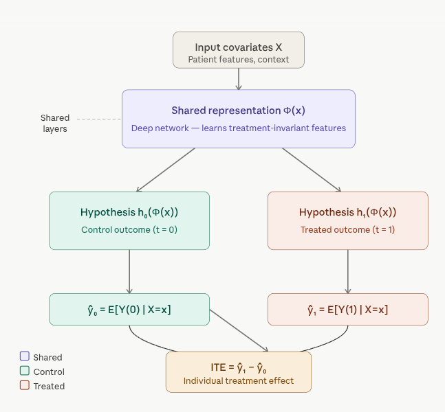

# TARNet (Treatment-Agnostic Representation Network) {.unnumbered}

This notebook demonstrates how to fit a Representation Learning Network — **TARNet** (Treatment-Agnostic Representation Network) — using the R package `{RCausalML}`.Full TARNet uses **torch** (recommended). If torch is not available, `{RCausalML}` falls back to a simpler placeholder model; the workflow remains the same, but you will not be training the deep shared-representation architecture.

## Overview

TARNet is a neural network architecture designed for **causal inference** — specifically for estimating **individualized treatment effects (ITE)** from observational data.

It was introduced by Shalit, Johansson, and Sontag in their 2017 paper *"Estimating individual treatment effects: generalization bounds and algorithms."*


### Architecture and How TARNet Works 


In observational data, we can never observe both outcomes for the same individual (the **fundamental problem of causal inference**). If a patient receives drug A, we don't know what would have happened with drug B. Additionally, observational data suffers from **selection bias** — sicker patients may be more likely to receive treatment, confounding the estimates.


{width="484"}


**1. Shared Representation Network (Φ)**

The input covariates **X** (patient demographics, lab results, etc.) are fed into a deep neural network that produces a learned representation Φ(x). This is the core innovation — this shared network learns features that are useful for predicting outcomes *regardless* of which treatment was applied. It acts as a feature extractor that aims to remove selection bias by mapping similar patients to similar representations.

**2. Treatment-Specific Heads (h₀ and h₁)**

After the shared representation, the network *splits* into two separate sub-networks — one for each treatment arm: - **h₀(Φ(x))** — predicts the potential outcome under *no treatment* (control) - **h₁(Φ(x))** — predicts the potential outcome under *treatment*

Each head is trained only on the samples that actually received that treatment, but they share the same learned representation Φ(x).

**3. ITE Estimation**

For any individual, you pass their features X through the shared network once, then through *both* heads:

> **ITE(x) = ŷ₁ − ŷ₀ = h₁(Φ(x)) − h₀(Φ(x))**

This gives an individual-level causal estimate of the treatment effect — how much better (or worse) *this specific patient* would do with treatment vs. without.


### Why "Treatment-Agnostic"?

The shared representation Φ is trained to be **agnostic** to treatment assignment — it shouldn't encode which treatment group a patient belonged to, only their underlying features. This discourages the network from learning spurious correlations driven by selection bias.

The full CFRNet variant (from the same paper) adds an **IPM regularizer** (Integral Probability Metric) that explicitly penalizes distributional differences between the treated and control group representations, further reducing bias.


### TARNet vs. Other Approaches

| Approach | Key idea | Limitation |
|------------------------|------------------------|------------------------|
| **S-Learner** | One model, treatment as a feature | Treatment effect can get "smoothed away" |
| **T-Learner** | Separate models per treatment | No shared learning; high variance |
| **TARNet** | Shared representation + separate heads | Best of both — shared features, separate predictions |
| **CFRNet** | TARNet + IPM regularizer | Reduces covariate shift more aggressively |

TARNet is a foundational architecture in the **Causal ML** toolkit and is widely used as a baseline in treatment effect estimation benchmarks like the IHDP and Jobs datasets. Click any node in the diagram above to explore specific components further!

## Implemention in R

`TARNet` is implemented in `{RCausalML}` as `tarnet()`. With **torch** installed, this trains a deep neural network with the architecture and loss described above. If **torch** is not available, it falls back to a simpler model that mimics the two-head idea but without learned representation (\Phi).

### Load and Check Required Libraries

```{r}
#| label: packages-list
#| warning: false
packages <- c(
  'tidyverse',
  'plyr',
  'RCausalML',
  'causaldata',
  'mlbench',
  'xgboost',
  'future'
)
```

### Install Missing Packages

```{r}
#| label: install-missing-packages
#| warning: false
#| error: false
# Install missing packages
#new_packages <- packages[!(packages %in% installed.packages()[,"Package"])]
#if(length(new_packages)) install.packages(new_packages)
```

### Verify Installation

```{r}
#| label: verify-installation
#| warning: false
# Verify installation
cat("Installed packages:\n")
print(sapply(packages, requireNamespace, quietly = TRUE))
```

### Load Required Libraries

```{r}
#| label: load-required-libraries
#| warning: false
# When rendering from package root, use local RCausalML (so causal_tree fixes are used)
if (file.exists("DESCRIPTION") && requireNamespace("devtools", quietly = TRUE)) {
  try(devtools::load_all(".", quiet = TRUE), silent = TRUE)
}
invisible(lapply(packages, function(pkg) {
  suppressPackageStartupMessages(library(pkg, character.only = TRUE))
}))
```

## Install torch (recommended)

Full TARNet uses **torch**. Install once if needed:

```{r install-torch, eval=FALSE}
# install.packages("torch")
# library(torch)
# torch::install_torch()
```

## Load data and prepare ((X, t, y))

We use **NSW (`nsw_mixtape`)** from **causaldata**: treatment `treat`, outcome `re78`, covariates `age`, `educ`, `black`, `hisp`, `marr`, `nodegree`, `re74`, `re75`. After dropping incomplete rows, we split into train and validation; covariates are standardized using the **training** mean and SD only.

```{r}
#| label: load-data
if (!requireNamespace("causaldata", quietly = TRUE)) install.packages("causaldata")
data(nsw_mixtape, package = "causaldata")
df <- as.data.frame(nsw_mixtape)
df$treat <- as.integer(df$treat)
y_col <- "re78"
t_col <- "treat"
x_cols <- c("age", "educ", "black", "hisp", "marr", "nodegree", "re74", "re75")
df <- df[complete.cases(df[, c(y_col, t_col, x_cols)]), ]

p_train <- 0.8
n <- nrow(df)
idx <- sample.int(n, size = round(p_train * n))
df_train <- df[idx, ]
df_val <- df[-idx, ]

X_train_raw <- as.matrix(df_train[, x_cols])
X_val_raw <- as.matrix(df_val[, x_cols])
cm <- colMeans(X_train_raw)
cs <- apply(X_train_raw, 2, stats::sd)
cs[cs == 0] <- 1
X_train <- scale(X_train_raw, center = cm, scale = cs)
X_val <- scale(X_val_raw, center = cm, scale = cs)

t_train <- as.integer(df_train[[t_col]])
y_train <- as.numeric(df_train[[y_col]])
t_val <- as.integer(df_val[[t_col]])
y_val <- as.numeric(df_val[[y_col]])

cat(
  "Train n =", nrow(X_train), "| Val n =", nrow(X_val),
  "| p =", ncol(X_train), "| TARNet source: R/causalDeepNet.R\n"
)
```

## Fit TARNet

`tarnet()` trains with mini-batches on a random subset of each call’s data (`val_split` holds out a fraction for internal indexing). Hyperparameters `hidden`, `batch_size`, `epochs`, and learning rate (`lr`, here (10\^{-3})) match the defaults documented in `causalDeepNet.R`.

```{r}
#| label: fit-tarnet
#| warning: false
if (requireNamespace("torch", quietly = TRUE)) {
  library(torch)
  torch_manual_seed(42)
}

fit_tarnet <- tarnet(
  X_train, t_train, y_train,
  hidden = c(200L, 200L, 100L),
  batch_size = 64L,
  val_split = 0.2,
  epochs = 100L,
  lr = 0.001,
  verbose = TRUE
)

cat("Fitted backend — TARNet:", fit_tarnet$type, "\n")
```

## Predict ITE and ATE on validation data

For each unit, (\hat{\tau}(x) = \hat{Y}(1 \mid x) - \hat{Y}(0 \mid x)); (\widehat{\mathrm{ATE}} = \frac{1}{n}\sum\_i \hat{\tau}(x_i)).

```{r}
#| label: predict-ite-ate
ite_tarnet <- as.vector(predict(fit_tarnet, X_val))
ate_tarnet <- mean(ite_tarnet)
naive_ate <- mean(y_val[t_val == 1]) - mean(y_val[t_val == 0])

cat("TARNet ATE (val):", round(ate_tarnet, 2), "\n")
cat("Naive diff-in-means (val, biased under confounding):", round(naive_ate, 2), "\n")
```

## Permutation-based feature importance (TARNet) {#sec-tarnet-perm-cate}

We measure how much **predicted CATE** (\hat{\tau}(X)) on the **validation** fold depends on each covariate using **permutation importance**: for feature (j), permute column (j) within the validation matrix, recompute (\hat{\tau}), and take the mean absolute change (\|\hat{\tau}(X) - \hat{\tau}(X\^{\text{perm}}\_j)\|), averaged over several random permutations. This summarizes the **fitted CATE surface**; it is not a causal attribution of heterogeneity.

```{r}
#| label: fig-tarnet-perm-importance
#| fig-cap: "Permutation importance for predicted CATE on the validation set (mean |Δ τ̂| after permuting one feature, averaged over repetitions)."
#| warning: false
#| fig-width: 12
#| fig-height: 5

pred_ite_repr <- function(fit, Xm) {
  r <- predict(fit, as.matrix(Xm))
  if (is.list(r)) {
    if (!is.null(r$ite)) return(as.numeric(r$ite))
    if (!is.null(r$predictions)) return(as.numeric(r$predictions))
    num_el <- r[sapply(r, is.numeric)]
    if (length(num_el)) {
      v <- as.numeric(unlist(num_el))
      nr <- nrow(as.matrix(Xm))
      if (length(v) >= nr) return(v[seq_len(nr)])
    }
    stop("Cannot extract ITE vector from predict() for this fit.")
  }
  as.numeric(r)
}

imp_tarnet <- NULL
if (nrow(X_val) >= 10L) {
  p <- ncol(X_val)
  feat_names <- colnames(X_val)
  if (is.null(feat_names)) feat_names <- x_cols

  n_rep <- 8L
  set.seed(4343L)

  ite_base <- pred_ite_repr(fit_tarnet, X_val)
  imp_mat <- matrix(NA_real_, nrow = n_rep, ncol = p)
  for (r in seq_len(n_rep)) {
    for (j in seq_len(p)) {
      Xp <- X_val
      Xp[, j] <- sample(Xp[, j])
      imp_mat[r, j] <- mean(abs(ite_base - pred_ite_repr(fit_tarnet, Xp)), na.rm = TRUE)
    }
  }
  imp_mean <- colMeans(imp_mat, na.rm = TRUE)
  imp_tarnet <- data.frame(
    feature = feat_names,
    importance = imp_mean,
    stringsAsFactors = FALSE
  )

  print(
    ggplot2::ggplot(
      imp_tarnet,
      ggplot2::aes(
        x = stats::reorder(factor(feature), importance),
        y = importance
      )
    ) +
      ggplot2::geom_col(fill = "#8F4CB3", width = 0.72) +
      ggplot2::coord_flip() +
      ggplot2::labs(
        title = "TARNet: permutation importance for predicted CATE (validation)",
        subtitle = paste0("Mean |\u03c4\u0302(X) \u2212 \u03c4\u0302(X_perm)|; ", n_rep, " rounds per feature"),
        x = NULL,
        y = "Mean |\u0394 predicted ITE|"
      ) +
      ggplot2::theme_bw()
  )
}
```

## Summary and Conclusion

TARNet is a powerful architecture for estimating individualized treatment effects from observational data. By learning a shared representation of covariates and then fitting separate heads for each treatment, it can capture complex relationships while mitigating selection bias. In this notebook, we demonstrated how to fit TARNet using the `{RCausalML}` package in R, and how to interpret its predictions through permutation-based feature importance. While TARNet is a strong baseline, it can be further improved with regularization techniques (like in  CFRNet) or by incorporating domain knowledge into the architecture or training process.
## Resources

-   [TARNet](https://github.com/arnaudscott/TARNet) — Treatment-Agnostic Representation Network

## Scientific terminology for beginners

| Term | Simple explanation | Beginner example |
|---|---|---|
| Shared representation | Common hidden features learned from covariates for all samples. | A neural layer encodes age, income, and history into 32 latent features. |
| Treatment-specific head | Separate prediction branch for each treatment level. | One head predicts `Y(0)`, another predicts `Y(1)`. |
| ITE | Individual treatment effect per person. | For one user, model predicts `Y(1)=0.8` and `Y(0)=0.5`, so ITE=`0.3`. |
| CATE | Average treatment effect within a subgroup or feature profile. | Average effect among users older than 60. |
| Overlap | Presence of both treated and control examples across covariate space. | In each risk band, some patients are treated and some are not. |
| Permutation importance | Feature relevance measured by prediction change after shuffling a feature. | Shuffling `age` causes large ITE prediction drop, so age is important. |
