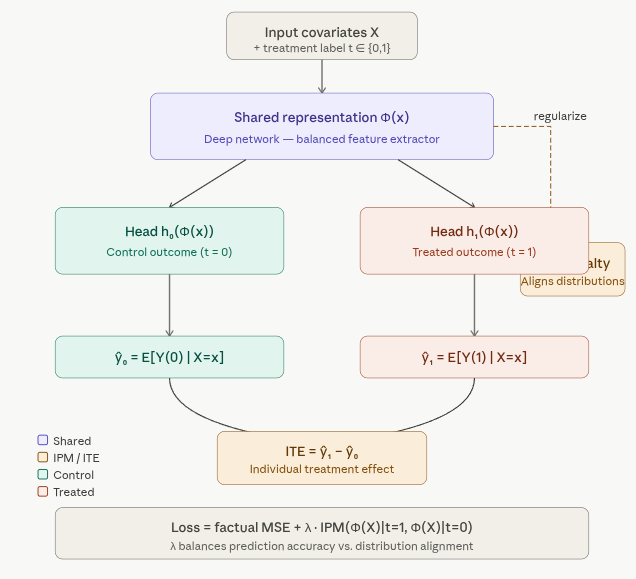
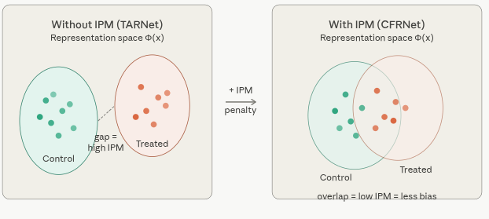

# CFRNet (Counterfactual Regression Network) {.unnumbered}

CFRNet is a direct extension of TARNet, introduced in the same 2017 paper by **Shalit, Johansson & Sontag** — *"Estimating individual treatment effects: generalization bounds and algorithms."* It solves TARNet's biggest weakness: **selection bias in the representation space**.

## Overview

CFRNet retains the same shared representation network and separate heads for treated/control as TARNet, but adds a crucial **IPM regularizer** that forces the learned representations of treated and control patients to overlap in distribution space. This encourages the model to learn features that are predictive of outcomes but not predictive of treatment assignment, which is key for reliable counterfactual estimation.

### Diagram 1 — The CFRNet Architecture

CFRNet is TARNet plus one crucial extra component: an **IPM regularizer** that forces the learned representations of treated and control patients to overlap in distribution space. Here is the full architecture:

{width="4
27"}

### The Core Innovation: What is the IPM?

The **Integral Probability Metric (IPM)** is a statistical distance measure between two probability distributions. In CFRNet, it measures how different the representation distributions of the treated group and the control group are in the learned feature space Φ.

The two most common IPM choices used with CFRNet are:

-   **Wasserstein-1 distance** — measures the "earth mover's" cost to morph one distribution into the other. Geometrically meaningful and smooth to optimize.
-   **Maximum Mean Discrepancy (MMD)** — compares distributions by their mean embeddings in a reproducing kernel Hilbert space. Computationally simpler.

The training loss becomes:

> **L = L_factual + λ · IPM( Φ(X)\|t=1, Φ(X)\|t=0 )**

where `L_factual` is the standard prediction loss (MSE on observed outcomes), and `λ` is a hyperparameter controlling how aggressively to enforce distributional balance.

### Diagram 2 — Why Balancing Matters (the Selection Bias Problem)

This is the intuition behind *why* the IPM penalty is needed. Without it, the representation space can encode treatment assignment, making counterfactual estimation unreliable.

{width="528"}

### How CFRNet Works 

**Step 1 — Forward pass through Φ.** All patients (both treated and control) are passed through the shared representation network to produce Φ(x). This produces two clouds of points in representation space — one for each treatment group.

**Step 2 — Outcome prediction.** Each patient's representation Φ(x) is passed through their respective head (h₀ or h₁, depending on which treatment they actually received) to produce a factual outcome prediction. The factual MSE loss is computed here.

**Step 3 — IPM computation.** The IPM distance between the *distribution* of { Φ(x) : t=0 } and { Φ(x) : t=1 } is computed. A large IPM means the treated and control patients live in different regions of representation space — that's selection bias baked into Φ.

**Step 4 — Combined loss + backprop.** The total loss `L_factual + λ · IPM` is backpropagated. The IPM term forces the shared network to "push" the two distributions toward each other, so that factual and counterfactual predictions extrapolate to the same region of feature space.

**Step 5 — ITE at inference.** For any new patient x, pass through Φ once, then both heads, and subtract: `ITE(x) = h₁(Φ(x)) − h₀(Φ(x))`.

### CFRNet vs TARNet — The Key Difference

|                                | TARNet    | CFRNet                  |
|--------------------------------|-----------|-------------------------|
| Shared representation          | Yes       | Yes                     |
| Separate treatment heads       | Yes       | Yes                     |
| IPM distribution alignment     | No        | Yes                     |
| Handles selection bias         | Partially | More robustly           |
| Theoretical bound on ITE error | Weaker    | Tighter (Shalit et al.) |
| Extra hyperparameter           | —         | λ (balance strength)    |

The paper by Shalit et al. proves a formal **generalization bound** showing that the ITE estimation error decomposes into a factual prediction error term plus an IPM term — which is precisely why minimizing the IPM during training provably reduces counterfactual error. This theoretical guarantee is what distinguishes CFRNet from simpler heuristics.

### Choosing λ

The hyperparameter λ controls the bias-variance tradeoff:

-   **λ = 0** → CFRNet collapses to TARNet (no balancing)
-   **λ → ∞** → Perfectly balanced representations, but factual prediction may suffer (the network is penalized for learning any features correlated with treatment)
-   **Optimal λ** is found via cross-validation on a held-out set, typically using the PEHE (Precision in Estimation of Heterogeneous Effects) metric

In practice, λ values between 0.1 and 10 are most common depending on the degree of confounding in the dataset.

## Implemention in R

`CFRNet` and `TARNet` are implemented in `{RCausalML}` as `cfrnet()` and `tarnet()`. With **torch** installed, these functions train deep neural networks with the architectures and losses described above. If **torch** is not available, they fall back to simpler models that mimic the two-head structure but without deep representation learning or explicit balancing.

### Load and Check Required Libraries

```{r}
#| label: packages-list
#| warning: false
packages <- c(
  'tidyverse',
  'plyr',
  'RCausalML',
  'causaldata',
  'mlbench',
  'xgboost',
  'future'
)
```

### Install Missing Packages

```{r}
#| label: install-missing-packages
#| warning: false
#| error: false
# Install missing packages
#new_packages <- packages[!(packages %in% installed.packages()[,"Package"])]
#if(length(new_packages)) install.packages(new_packages)
```

### Verify Installation

```{r}
#| label: verify-installation
#| warning: false
# Verify installation
cat("Installed packages:\n")
print(sapply(packages, requireNamespace, quietly = TRUE))
```

### Load Required Libraries

```{r}
#| label: load-required-libraries
#| warning: false
# When rendering from package root, use local RCausalML (so causal_tree fixes are used)
if (file.exists("DESCRIPTION") && requireNamespace("devtools", quietly = TRUE)) {
  try(devtools::load_all(".", quiet = TRUE), silent = TRUE)
}
invisible(lapply(packages, function(pkg) {
  suppressPackageStartupMessages(library(pkg, character.only = TRUE))
}))
```

## Install torch (recommended)

Full CFRNet uses **torch**. Install once if needed:

```{r install-torch, eval=FALSE}
# install.packages("torch")
# library(torch)
# torch::install_torch()
```

## Load data and prepare ((X, t, y))

We use **NSW (`nsw_mixtape`)** from **causaldata**: treatment `treat`, outcome `re78`, covariates `age`, `educ`, `black`, `hisp`, `marr`, `nodegree`, `re74`, `re75`. After dropping incomplete rows, we split into train and validation; covariates are standardized using the **training** mean and SD only.

```{r}
#| label: load-data
if (!requireNamespace("causaldata", quietly = TRUE)) install.packages("causaldata")
data(nsw_mixtape, package = "causaldata")
df <- as.data.frame(nsw_mixtape)
df$treat <- as.integer(df$treat)
y_col <- "re78"
t_col <- "treat"
x_cols <- c("age", "educ", "black", "hisp", "marr", "nodegree", "re74", "re75")
df <- df[complete.cases(df[, c(y_col, t_col, x_cols)]), ]

p_train <- 0.8
n <- nrow(df)
idx <- sample.int(n, size = round(p_train * n))
df_train <- df[idx, ]
df_val <- df[-idx, ]

X_train_raw <- as.matrix(df_train[, x_cols])
X_val_raw <- as.matrix(df_val[, x_cols])
cm <- colMeans(X_train_raw)
cs <- apply(X_train_raw, 2, stats::sd)
cs[cs == 0] <- 1
X_train <- scale(X_train_raw, center = cm, scale = cs)
X_val <- scale(X_val_raw, center = cm, scale = cs)

t_train <- as.integer(df_train[[t_col]])
y_train <- as.numeric(df_train[[y_col]])
t_val <- as.integer(df_val[[t_col]])
y_val <- as.numeric(df_val[[y_col]])

cat(
  "Train n =", nrow(X_train), "| Val n =", nrow(X_val),
  "| p =", ncol(X_train), "| TARNet/CFRNet source: R/causalDeepNet.R\n"
)
```

## Fit TARNet and CFRNet

We fit **TARNet** as a baseline and **CFRNet** with MMD balancing. Hyperparameters `hidden`, `batch_size`, `epochs`, learning rate (`lr`, here (10\^{-3})), and (for CFRNet) `mmd_weight` and `sigma_mmd` match the defaults documented in `causalDeepNet.R`.

```{r}
#| label: fit-models
#| warning: false
if (requireNamespace("torch", quietly = TRUE)) {
  library(torch)
  torch_manual_seed(42)
}

fit_tarnet <- tarnet(
  X_train, t_train, y_train,
  hidden = c(200L, 200L, 100L),
  batch_size = 64L,
  val_split = 0.2,
  epochs = 100L,
  lr = 0.001,
  verbose = TRUE
)

fit_cfrnet <- cfrnet(
  X_train, t_train, y_train,
  hidden = c(200L, 200L, 100L),
  mmd_weight = 0.1,
  sigma_mmd = 1,
  batch_size = 64L,
  val_split = 0.2,
  epochs = 100L,
  lr = 0.001,
  verbose = TRUE
)

cat("Fitted backends — TARNet:", fit_tarnet$type, "| CFRNet:", fit_cfrnet$type, "\n")
```

## Visualizing the balancing effect

We project the learned representation (\Phi(X)) onto the first two principal components and scatter **treated vs. control** in that space. **More overlap** between arms in (\Phi)-space is consistent with better balancing (CFRNet encourages this via MMD on (\Phi)); **separated clouds** suggest the representation still encodes treatment-assignment structure, which can hurt counterfactual extrapolation.

We use the **validation** covariates `X_val` and treatment `t_val`. The plot requires the **torch** backends; with fallbacks there is no shared (\Phi) layer to visualize in the same way.

```{r}
#| label: plot-representation-balance
#| fig-cap: "PCA of the learned representation $\\Phi(X)$ on the validation set: tighter overlap between treated and control suggests a more balanced embedding (CFRNet)."
#| fig-width: 10
#| fig-height: 4
#| warning: false

#' PCA scatter of Phi(X) for treated vs control (torch models only).
plot_representation_balance <- function(fit_tarnet, fit_cfrnet, X, T_vec,
                                        title = "Representation space: treated vs. control") {
  torch_ok <- function(fit) {
    identical(fit$type, "tarnet_torch") || identical(fit$type, "cfrnet_torch")
  }
  if (!torch_ok(fit_tarnet) || !torch_ok(fit_cfrnet)) {
    return(
      ggplot2::ggplot() +
        ggplot2::annotate(
          "text",
          x = 0.5,
          y = 0.5,
          label = "Representation plot needs torch backends.\nInstall torch, re-fit, and re-render.",
          size = 4
        ) +
        ggplot2::lims(x = c(0, 1), y = c(0, 1)) +
        ggplot2::theme_void() +
        ggplot2::labs(title = "PCA of Phi(X) — not available")
    )
  }

  phi_matrix <- function(fit, X_mat) {
    fit$model$eval()
    torch::with_no_grad({
      x_t <- torch::torch_tensor(X_mat, dtype = torch::torch_float32())
      out <- fit$model(x_t)
      as.matrix(as_array(out$phi))
    })
  }

  pca_coords <- function(phi, label) {
    pc <- stats::prcomp(phi, center = TRUE, scale. = FALSE)
    data.frame(
      PC1 = pc$x[, 1L],
      PC2 = pc$x[, 2L],
      treatment = factor(
        T_vec,
        levels = c(0L, 1L),
        labels = c("Control (T=0)", "Treated (T=1)")
      ),
      panel = label
    )
  }

  phi_t <- phi_matrix(fit_tarnet, X)
  phi_c <- phi_matrix(fit_cfrnet, X)

  plot_df <- rbind(
    pca_coords(phi_t, "TARNet (no balancing)"),
    pca_coords(phi_c, "CFRNet (MMD balancing)")
  )

  ggplot2::ggplot(plot_df, ggplot2::aes(PC1, PC2, color = treatment)) +
    ggplot2::geom_point(alpha = 0.4, size = 1.8) +
    ggplot2::facet_wrap(~panel, nrow = 1L, scales = "free") +
    ggplot2::scale_color_manual(
      values = c("Control (T=0)" = "steelblue", "Treated (T=1)" = "darkorange")
    ) +
    ggplot2::labs(
      title = title,
      x = "PC 1",
      y = "PC 2",
      color = NULL
    ) +
    ggplot2::theme_bw() +
    ggplot2::theme(
      legend.position = "bottom",
      strip.background = ggplot2::element_rect(fill = "grey92")
    )
}

plot_representation_balance(
  fit_tarnet,
  fit_cfrnet,
  X_val,
  t_val,
  title = "Representation space: treated vs. control (PCA of Φ(X))"
)
```

## Predict ITE and ATE on validation data

For each unit, (\hat{\tau}(x) = \hat{Y}(1 \mid x) - \hat{Y}(0 \mid x)); (\widehat{\mathrm{ATE}} = \frac{1}{n}\sum\_i \hat{\tau}(x_i)).

```{r}
#| label: predict-ite-ate
ite_tarnet <- as.vector(predict(fit_tarnet, X_val))
ite_cfrnet <- as.vector(predict(fit_cfrnet, X_val))

ate_tarnet <- mean(ite_tarnet)
ate_cfrnet <- mean(ite_cfrnet)
naive_ate <- mean(y_val[t_val == 1]) - mean(y_val[t_val == 0])

cat("TARNet ATE (val):", round(ate_tarnet, 2), "\n")
cat("CFRNet ATE (val):", round(ate_cfrnet, 2), "\n")
cat("Naive diff-in-means (val, biased under confounding):", round(naive_ate, 2), "\n")
```

## Permutation-based feature importance (TARNet / CFRNet) {#sec-repr-perm-cate}

We measure how much **predicted CATE** (\hat{\tau}(X)) on the **validation** fold depends on each covariate using **permutation importance**: for feature (j), permute column (j) within the validation matrix, recompute (\hat{\tau}), and take the mean absolute change (\|\hat{\tau}(X) - \hat{\tau}(X\^{\text{perm}}\_j)\|), averaged over several random permutations. This summarizes the **fitted CATE surfaces**; it is not a causal attribution of heterogeneity.

```{r}
#| label: fig-repr-perm-importance
#| fig-cap: "Permutation importance for predicted CATE on the validation set: TARNet and CFRNet (mean |Δ τ̂| after permuting one feature, averaged over repetitions)."
#| warning: false
#| fig-width: 12
#| fig-height: 5

pred_ite_repr <- function(fit, Xm) {
  r <- predict(fit, as.matrix(Xm))
  if (is.list(r)) {
    if (!is.null(r$ite)) return(as.numeric(r$ite))
    if (!is.null(r$predictions)) return(as.numeric(r$predictions))
    num_el <- r[sapply(r, is.numeric)]
    if (length(num_el)) {
      v <- as.numeric(unlist(num_el))
      nr <- nrow(as.matrix(Xm))
      if (length(v) >= nr) return(v[seq_len(nr)])
    }
    stop("Cannot extract ITE vector from predict() for this fit.")
  }
  as.numeric(r)
}

repr_for_perm <- list(
  TARNet = fit_tarnet,
  CFRNet = fit_cfrnet
)

imp_repr <- NULL
if (nrow(X_val) >= 10L) {
  p <- ncol(X_val)
  feat_names <- colnames(X_val)
  if (is.null(feat_names)) feat_names <- x_cols

  n_rep <- 8L
  set.seed(4343L)

  imp_chunks <- vector("list", length(repr_for_perm))
  names(imp_chunks) <- names(repr_for_perm)

  for (lab in names(repr_for_perm)) {
    fit_i <- repr_for_perm[[lab]]
    ite_base <- pred_ite_repr(fit_i, X_val)
    imp_mat <- matrix(NA_real_, nrow = n_rep, ncol = p)
    for (r in seq_len(n_rep)) {
      for (j in seq_len(p)) {
        Xp <- X_val
        Xp[, j] <- sample(Xp[, j])
        imp_mat[r, j] <- mean(abs(ite_base - pred_ite_repr(fit_i, Xp)), na.rm = TRUE)
      }
    }
    imp_mean <- colMeans(imp_mat, na.rm = TRUE)
    imp_chunks[[lab]] <- data.frame(
      feature = feat_names,
      importance = imp_mean,
      model = lab,
      stringsAsFactors = FALSE
    )
  }
  imp_repr <- dplyr::bind_rows(imp_chunks)

  n_facets <- length(repr_for_perm)
  print(
    ggplot2::ggplot(
      imp_repr,
      ggplot2::aes(
        x = stats::reorder(factor(feature), importance),
        y = importance
      )
    ) +
      ggplot2::geom_col(fill = "#8F4CB3", width = 0.72) +
      ggplot2::facet_wrap(~model, scales = "free_y", ncol = min(3L, n_facets)) +
      ggplot2::coord_flip() +
      ggplot2::labs(
        title = "TARNet / CFRNet: permutation importance for predicted CATE (validation)",
        subtitle = paste0("Mean |\u03c4\u0302(X) \u2212 \u03c4\u0302(X_perm)|; ", n_rep, " rounds per feature"),
        x = NULL,
        y = "Mean |\u0394 predicted ITE|"
      ) +
      ggplot2::theme_bw() +
      ggplot2::theme(strip.text = ggplot2::element_text(face = "bold"))
  )
}
```

## Summary and Conclusion

This section introduced **CFRNet**, a powerful extension of TARNet that incorporates an IPM regularizer to encourage balanced representations between treated and control groups. By minimizing the distributional distance in representation space, CFRNet aims to reduce selection bias and improve counterfactual estimation. We implemented CFRNet in R using `{RCausalML}` and visualized the balancing effect on the learned representations. Finally, we predicted ITEs and ATEs on the validation set and computed permutation importance for the predicted CATE surfaces. 

## Resources

-   [cfrnet](https://github.com/clinicalml/cfrnet) — Counterfactual regression with balanced representations

## Scientific terminology for beginners

| Term | Simple explanation | Beginner example |
|---|---|---|
| IPM (Integral Probability Metric) | Distance between treated and control representation distributions. | MMD is an IPM used to make hidden features look similar across groups. |
| MMD | Kernel-based measure of distribution mismatch. | If treated and control embeddings differ, MMD is high and gets penalized. |
| Balancing representation | Hidden space where treatment groups are statistically closer. | After training, treated and control points overlap more in latent space. |
| Factual loss | Error on observed outcomes only. | Compare predicted `Y` with actual `Y` for each sample's observed treatment. |
| Counterfactual generalization | Ability to predict missing potential outcomes well. | Model estimates untreated outcome for treated units with low error. |
| Regularization | Additional penalty to improve robustness/generalization. | CFRNet adds MMD penalty on top of prediction loss. |
