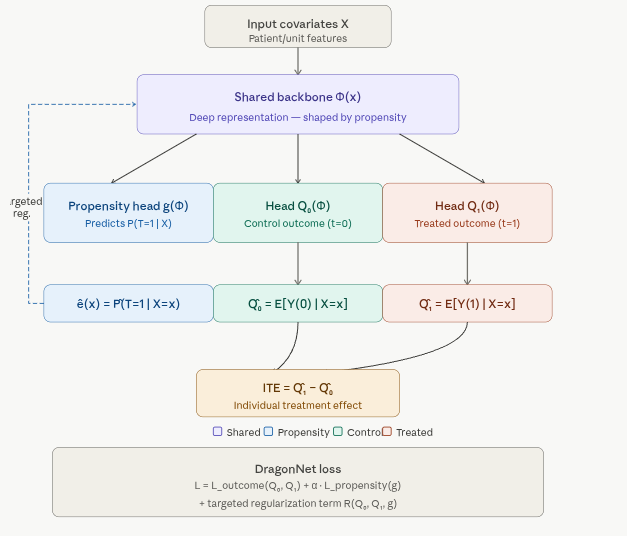
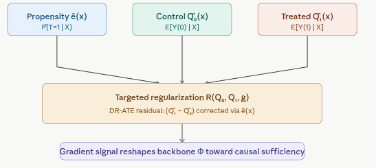

# DragonNet — Propensity-Adjusted Networks for Causal Inference {.unnumbered}

DragonNet was introduced by **Shi, Blei & Veitch (2019)** in *"Adapting Neural Networks for the Estimation of Treatment Effects."* It addresses a fundamental weakness in both TARNet and CFRNet: **neither uses propensity score information to guide the representation learning.**

## Overview

DragonNet is a deep learning architecture that explicitly incorporates propensity score estimation into the training process. It consists of a shared representation layer followed by three separate heads: one for predicting the propensity score and two for predicting potential outcomes under treatment and control. The key innovation is a **targeted regularization** term derived from the theory of targeted maximum likelihood estimation (TMLE), which encourages the model to learn representations that are sufficient for causal estimation. The result is a model that can achieve **doubly-robust ATE estimation** — meaning that even if either the outcome model or the propensity model is misspecified, the ATE estimate remains consistent.

### The DragonNet Architecture

The shared representation Φ(x) feeds into three heads:

{width="541"}

### The Core Insight: Why Propensity Matters

The **propensity score** e(x) = P(T=1 \| X=x) is the probability that a unit receives treatment, given its covariates. It is the fundamental tool in classical causal inference for de-confounding observational data.

The key theoretical result behind DragonNet comes from the **sufficient representation theorem** (Shi et al., 2019):

> If a representation Φ(x) is sufficient for predicting the propensity score, it is also sufficient for estimating any causal quantity.

In plain terms: *you don't need to capture all of X — you only need to capture the parts of X that are relevant to treatment assignment.* Any other variation in X is irrelevant noise for causal estimation and can be discarded. This is a much more targeted form of dimension reduction than TARNet or CFRNet apply.


### How DragonNet Works 

**Step 1 — Shared backbone.** All patients are passed through the shared deep network Φ(x), producing a learned representation. This is structurally identical to TARNet's shared layer, but the training signal it receives is fundamentally different.

**Step 2 — Three-headed output.** The representation feeds three separate heads simultaneously: - `g(Φ(x))` — the propensity head, which outputs a sigmoid probability ê(x) = P̂(T=1 \| x). This is a binary classifier trained on treatment assignment. - `Q₀(Φ(x))` — the control outcome head - `Q₁(Φ(x))` — the treated outcome head

**Step 3 — Targeted regularization.** This is DragonNet's unique contribution. Rather than just adding a propensity prediction loss on top, DragonNet applies a **targeted regularization** term derived from the theory of targeted maximum likelihood estimation (TMLE). The regularizer nudges the outcome predictions Q₀ and Q₁ toward being doubly robust — meaning that even if either the outcome model or the propensity model is slightly wrong, the final ATE estimate remains consistent.

**Step 4 — Joint backpropagation.** The combined loss flows back through all three heads and through the shared backbone simultaneously. Because the propensity head and the outcome heads share Φ, the backbone is forced to learn features that are predictive of *both* treatment assignment and outcomes — and the targeted regularizer ensures these features align with what is causally necessary.

**Step 5 — ITE at inference.** `ITE(x) = Q̂₁(Φ(x)) − Q̂₀(Φ(x))`. The propensity head is discarded — it was only needed during training to shape the representation.


### The Targeted Regularization Term

The targeted regularization is the most mathematically novel part. Here is what it computes:



The targeted regularization term is derived from the **doubly-robust (DR) ATE estimator**:

 **DR-ATE = E\[ Q̂₁ − Q̂₀ + T(Y − Q̂₁)/ê(x) − (1−T)(Y − Q̂₀)/(1−ê(x)) \]**

The two correction terms — the IPW-weighted residuals — penalize the network when its outcome predictions are inconsistent with the propensity score. When these residuals are zero, the model has achieved double robustness. The targeted regularization adds this quantity to the training loss with a small weight, gently steering the backbone toward representations where this consistency holds.


### DragonNet vs TARNet vs CFRNet

|   | TARNet | CFRNet | DragonNet |
|------------------|------------------|------------------|------------------|
| Shared representation | Yes | Yes | Yes |
| Separate outcome heads | Yes | Yes | Yes |
| Distribution alignment (IPM) | No | Yes | No |
| Propensity score head | No | No | Yes |
| Targeted regularization | No | No | Yes |
| Doubly-robust ATE | No | No | Yes |
| Extra hyperparameters | — | λ | α (propensity weight) |
| Theoretical basis | Generalization bounds | IPM bounds | Sufficient representation + TMLE |

The key practical advantage DragonNet has over CFRNet is that **it doesn't need to flatten the entire representation distribution** — it only forces the representation to capture propensity-relevant information, which is a much more surgical and theoretically justified constraint. On benchmarks like IHDP and Jobs, DragonNet consistently matches or outperforms CFRNet, especially in low-data regimes where over-regularization from the IPM can hurt.

## Implementation in R

We fit **DragonNet** with **`RCausalML::dragonnet()`** (`R/causalDeepNet.R`), which uses **torch** when available (Adam then SGD, shared trunk, three heads, targeted regularization). We use the same **real-world dataset** as in the TARNet/CFRNet tutorial (NSW/Lalonde from `causaldata`) for consistency.

### Setup

### Load and Check Required Libraries

```{r}
#| label: packages-list
#| warning: false
packages <- c(
  'tidyverse',
  'plyr',
  'RCausalML',
  'causaldata',
  'torch',
  'ForCausality',
  'mlbench',
  'xgboost',
  'future'
)
```

### Install Missing Packages

```{r}
#| label: install-missing-packages
#| warning: false
#| error: false
# Install missing packages
#new_packages <- packages[!(packages %in% installed.packages()[,"Package"])]
#if(length(new_packages)) install.packages(new_packages)
```

### Verify Installation

```{r}
#| label: verify-installation
#| warning: false
# Verify installation
cat("Installed packages:\n")
print(sapply(packages, requireNamespace, quietly = TRUE))
```

### Load Required Libraries

```{r}
#| label: load-required-libraries
#| warning: false
# When rendering from package root, use local RCausalML (so causal_tree fixes are used)
if (file.exists("DESCRIPTION") && requireNamespace("devtools", quietly = TRUE)) {
  try(devtools::load_all(".", quiet = TRUE), silent = TRUE)
}
invisible(lapply(packages, function(pkg) {
  suppressPackageStartupMessages(library(pkg, character.only = TRUE))
}))
```

```{r}
#| label: setup
#| include: true
set.seed(42)
torch_manual_seed(42)
```

### Load real-world data and prepare (X, t, y)

We use **NSW (nsw_mixtape)**: treatment `treat`, outcome `re78`, and covariates (age, education, race, marriage, degree, earnings 1974/1975). Covariates are standardized.

```{r}
#| label: load-data
data(nsw_mixtape, package = "causaldata")
df <- as.data.frame(nsw_mixtape)
df$treat <- as.integer(df$treat)

y_col <- "re78"
t_col <- "treat"
x_cols <- c("age", "educ", "black", "hisp", "marr", "nodegree", "re74", "re75")

df <- df[complete.cases(df[, c(y_col, t_col, x_cols)]), ]

X <- as.matrix(df[, x_cols])
X <- scale(X)                    # standardize covariates (already in your code)

t_vec <- as.integer(df[[t_col]])
y_vec <- as.numeric(df[[y_col]])

# === NEW: Scale the outcome (critical for DragonNet stability) ===
y_mean <- mean(y_vec)
y_sd   <- sd(y_vec)
y_scaled <- (y_vec - y_mean) / y_sd

n <- nrow(X)
input_dim <- ncol(X)
cat("Sample size:", n, "| Covariates:", input_dim, 
    "| Treated:", sum(t_vec), "| Control:", sum(1L - t_vec), "\n")
cat("Outcome (re78) mean:", round(y_mean, 1), " sd:", round(y_sd, 1), "\n")
```

### Train/validation split

We hold out a validation fold for reporting ATE and MSE. **`dragonnet()`** (in `causalDeepNet.R`) performs its own random train/validation partition of the rows you pass in (`val_split`, default `0.2`); those held-out rows are not used in the training loop. To train on almost all of `X_train`, pass a small `val_split` (the implementation reserves at least one row).

```{r}
#| label: split-dataset
p_train <- 0.8
set.seed(4343)                     # for reproducibility
idx <- sample.int(n, size = round(p_train * n))

X_train <- X[idx, , drop = FALSE]
t_train <- t_vec[idx]
y_train <- y_scaled[idx]           # use scaled y

X_val <- X[-idx, , drop = FALSE]
t_val <- t_vec[-idx]
y_val <- y_vec[-idx]               # keep original scale for reporting
y_val_scaled <- y_scaled[-idx]
```

### Fit DragonNet with `RCausalML::dragonnet()`

The exported function builds the same **shared representation + three heads** (propensity $\hat{e}(X)$, $\hat{Y}(0)$, $\hat{Y}(1)$) and **learnable** $\varepsilon$ for targeted regularization, then runs **Adam** followed by **SGD with momentum**. See `?dragonnet` for all arguments.

```{r}
#| label: train-dragonnet
#| warn: false
fit_dn <- dragonnet(
  X_train,
  treatment = t_train,
  y = y_train,                     # scaled outcome
  neurons = 200L,
  reg_l2 = 0.05,                   # increased a bit for stability
  targeted_reg = TRUE,
  ratio_tar = 1,
  batch_size = 64L,
  val_split = 0.05,                # small but enough for monitoring
  adam_epochs = 50L,               # more epochs with Adam
  adam_lr = 5e-4,                  # lower learning rate
  sgd_epochs = 30L,                # fewer SGD epochs (was causing NaN)
  sgd_lr = 1e-6,                   # much smaller
  sgd_momentum = 0.9,
  verbose = TRUE
)

stopifnot(identical(fit_dn$type, "dragonnet_torch"))
cat("Final epsilon (targeted reg):", round(as.numeric(fit_dn$model$epsilon), 5), "\n")
```

### Predict ITE, ATE, and propensity

For any unit, $\widehat{\text{ITE}}(x) = \hat{Y}(1) - \hat{Y}(0)$; ATE is the mean of ITE. Use **`predict()`** with `propensity = TRUE` to obtain propensity scores (torch models only).

```{r}
#| label: predict-ite-ate
dragon_res <- predict(fit_dn, X_val, propensity = TRUE)
ite_val <- dragon_res$ite
ate_val <- mean(ite_val)
cat("DragonNet ATE (val):", round(ate_val, 2), "\n")
cat("Naive diff-in-means (val):", round(mean(y_val[t_val == 1]) - mean(y_val[t_val == 0]), 2), "\n")
cat("Epsilon (targeted reg):", round(as.numeric(fit_dn$model$epsilon), 4), "\n")
```

### Compare with TARNet (optional baseline)

If you have trained a TARNet on the same data (e.g. from the [TARNet/CFRNet tutorial](02-08-04-05-01-deep-causal-learning-TARNet-CFRNet-r.qmd)), you can compare ATE and factual MSE. Here we report DragonNet factual MSE on the validation set.

```{r}
#| label: compare-mse
# Factual MSE on original scale
fit_dn$model$eval()
torch::with_no_grad({
  x_v <- torch::torch_tensor(X_val, dtype = torch::torch_float32())
  t_v <- torch::torch_tensor(t_val, dtype = torch::torch_float32())
  y_v <- torch::torch_tensor(y_val, dtype = torch::torch_float32())  # original y
  
  out <- fit_dn$model(x_v)
  y_hat <- (1 - t_v) * out$y0 + t_v * out$y1
  
  # Unscale predictions if model was trained on scaled y
  y_hat_unscaled <- y_hat * y_sd + y_mean
  
  mse_dragon <- as.numeric(torch::nnf_mse_loss(
    y_hat_unscaled$unsqueeze(2), y_v$unsqueeze(2)
  ))
})

cat("DragonNet factual MSE (val):", round(mse_dragon, 2), "\n")

# Propensity calibration
dragon_res <- predict(fit_dn, X_val, propensity = TRUE)
cat("Mean predicted propensity | T=0:", 
    round(mean(dragon_res$propensity[t_val == 0]), 3),
    "| T=1:", round(mean(dragon_res$propensity[t_val == 1]), 3), "\n")
```

### Permutation-based feature importance

We assess how much **predicted CATE** $\hat{\tau}(X) = \hat{Y}(1|X) - \hat{Y}(0|X)$ on the **validation** fold depends on each covariate using **permutation importance**: for feature $j$, replace column $j$ by a random permutation of its values (breaking the link between that feature and the rest), recompute $\hat{\tau}$, and record the mean absolute change $|\hat{\tau}(X) - \hat{\tau}(X^{\text{perm}}_j)|$. Larger values indicate the model’s CATE surface is more sensitive to that feature. This is **descriptive of the fitted model**, not a causal attribution of treatment effect heterogeneity.

```{r}
#| label: perm-importance-ite
#| fig-cap: "Permutation importance for DragonNet predicted CATE on the validation set (mean absolute change in τ̂ after permuting one feature, averaged over repeated permutations)."
#| warning: false
#| fig-width: 8
#| fig-height: 5

# Helper function to safely extract predicted ITE / CATE
pred_ite_mat <- function(Xm) {
  r <- predict(fit_dn, Xm)
  
  if (is.list(r)) {
    # Common names returned by DragonNet / causal ML packages
    if (!is.null(r$ite)) {
      return(as.numeric(r$ite))
    } else if (!is.null(r$predictions)) {
      return(as.numeric(r$predictions))
    } else if (!is.null(r$pred) || !is.null(r$cate)) {
      return(as.numeric(r$pred %||% r$cate))
    } else {
      # fallback: take first numeric element
      return(as.numeric(unlist(r[sapply(r, is.numeric)]))[1:length(nrow(Xm))])
    }
  } else {
    return(as.numeric(r))
  }
}

# Main permutation importance
ite_base <- pred_ite_mat(X_val)

p <- ncol(X_val)
n_rep <- 8L
set.seed(4343L)

imp_mat <- matrix(NA_real_, nrow = n_rep, ncol = p)

for (r in seq_len(n_rep)) {
  for (j in seq_len(p)) {
    Xp <- X_val
    Xp[, j] <- sample(Xp[, j])          # random permutation of column j
    imp_mat[r, j] <- mean(abs(ite_base - pred_ite_mat(Xp)), na.rm = TRUE)
  }
}

imp_mean <- colMeans(imp_mat, na.rm = TRUE)

# Feature names
feat_names <- colnames(X_val)
if (is.null(feat_names)) {
  feat_names <- paste0("X", seq_len(p))   # better fallback than relying on x_cols
}

impdf <- data.frame(
  feature   = feat_names,
  importance = imp_mean,
  stringsAsFactors = FALSE
)
head(impdf)
```

```{r}
#| label: plot-importance
#| fig.width: 6
#| fig.height: 5
# Plot
library(ggplot2)

ggplot(impdf, aes(x = reorder(feature, importance), y = importance)) +
  geom_col(fill = "#1B998B", width = 0.72) +
  coord_flip() +
  labs(
    title    = "DragonNet: Permutation Importance for Predicted CATE (Validation)",
    subtitle = paste0(
      "Mean |τ̂(X) − τ̂(X_perm)| per feature; ",
      n_rep, " permutation rounds — descriptive of model surface"
    ),
    x = NULL,
    y = "Mean |Δ predicted ITE|"
  ) +
  theme_bw() +
  theme(
    plot.title = element_text(face = "bold"),
    axis.text.y = element_text(size = 10)
  )
```

## Practical tips

-   **Hyperparameters**: Tune `neurons` (e.g. 200), `reg_l2`, `ratio_tar`, `adam_lr`, `sgd_lr`, `batch_size`, and epoch counts in `dragonnet()`. Defaults match the usual CausalML schedule (30 Adam + 100 SGD).
-   **Targeted regularization**: Pass `targeted_reg = FALSE` or `ratio_tar = 0` to turn off the TMLE-style term; otherwise keep `targeted_reg = TRUE` and `ratio_tar` (e.g. 1).
-   **Benchmarks**: For PEHE/ATE on semi-synthetic data (e.g. IHDP), see [CausalML DragonNet example](https://causalml.readthedocs.io/en/latest/examples/dragonnet_example.html). Real-world data (e.g. NSW) has no ground-truth ITE; compare ATE and factual MSE across methods.
-   **Stability**: Clip propensity in the loss (e.g. to $[10^{-5},\, 1 - 10^{-5}]$) to avoid division by zero.

## Summary and Conclusions

This note shows how to fit **DragonNet** with **RCausalML** (`dragonnet()` in `R/causalDeepNet.R`), which mirrors CausalML’s architecture and training (torch, Adam then SGD, targeted regularization). We evaluate ATE and factual MSE on a held-out validation fold.

| Step | Description |
|----------------------|--------------------------------------------------|
| 1 | Install/load `torch`, `causaldata`, `RCausalML`; set seeds |
| 2 | Load NSW data; define X, t, y; standardize; train/val split |
| 3 | Call **`dragonnet(X_train, treatment, y)`** with desired hyperparameters |
| 4 | **`predict(fit, newdata, propensity = TRUE)`** for ITE and $\hat{e}(X)$ on validation covariates |
| 5 | Report ATE, factual MSE, and propensity calibration |
| 6 | **Permutation importance** on validation predicted $\hat{\tau}(X)$ (mean $|\Delta\hat{\tau}|$ per covariate) |

## Resources

-   [Shi, Blei, Veitch (2019)](https://arxiv.org/pdf/1906.02120.pdf) — Adapting Neural Networks for the Estimation of Treatment Effects

-   [claudiashi57/dragonnet](https://github.com/claudiashi57/dragonnet) — Original DragonNet implementation

-   [Uber CausalML — dragonnet.py](https://github.com/uber/causalml/blob/master/causalml/inference/tf/dragonnet.py) — TensorFlow/Keras implementation

-   [CausalML DragonNet example (IHDP)](https://causalml.readthedocs.io/en/latest/examples/dragonnet_example.html) — Benchmark with meta-learners

## Scientific terminology for beginners

| Term | Simple explanation | Beginner example |
|---|---|---|
| Propensity model | A model for treatment assignment probability `P(T=1|X)`. | DragonNet has a dedicated head predicting treatment probability. |
| Targeted regularization | Loss term encouraging outcome predictions consistent with causal targets. | Training includes an extra term linked to treatment propensity estimates. |
| Sufficiency assumption | Idea that a compact representation can retain all causal information. | Hidden layer captures confounders needed for both treatment and outcome. |
| Calibration | Agreement between predicted probabilities and observed frequencies. | Among samples with predicted 0.7 treatment probability, around 70% are treated. |
| Doubly robust intuition | Combining outcome and propensity modeling to reduce bias risk. | Even if one model is imperfect, the combined approach can still perform well. |
| Uplift | Predicted improvement from treatment for a unit. | Marketing model predicts a customer's purchase chance rises by 5% if targeted. |