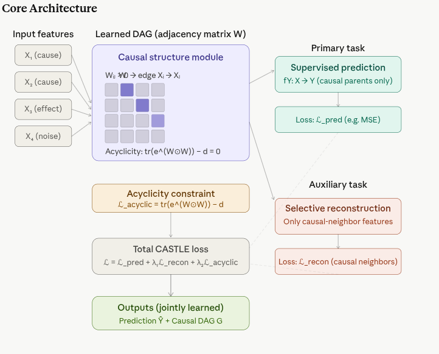

# CASTLE — CAusal STructure LEarning Regularization {.unnumbered}

**CASTLE** is a deep learning method published at **NeurIPS 2020** by Trent Kyono, Yao Zhang, and Mihaela van der Schaar (van der Schaar Lab, Cambridge). Its core idea is deceptively elegant:

> Instead of treating causal structure learning and supervised prediction as separate problems, CASTLE solves **both simultaneously** — using causal graph discovery as a *regularizer* for the supervised model.

## Overview

Standard regularizers like L1, L2, and dropout all share the same blindspot: they are agnostic of the causal relationships between variables, limiting their potential to identify optimal predictors based on graphical topology, such as the causal parents of the target variable.

There is also a deeper theoretical motivation: prior works have shown that prediction in the causal direction (effect from cause) results in lower testing error than the anti-causal direction. CASTLE exploits this directly.

Similarly, reconstruction-based regularizers like Supervised AutoEncoders (SAE) are wasteful: supervised auto-encoders suboptimally reconstruct all features, including those without causal neighbors — naively reconstructing these variables does not improve regularization, and in some cases may be harmful, e.g., reconstructing a random noise variable.

### Core architecture

CASTLE’s architecture is a **multi-objective neural network** that learns a **weighted adjacency matrix** representing the causal graph, while simultaneously optimizing for supervised prediction and selective reconstruction. The key components are:

-   **Learnable adjacency matrix**: A weight matrix `A` embedded in the input layer encodes the causal graph structure
-   **Acyclicity constraint**: A differentiable penalty ensures that the learned graph is a DAG
-   **Selective reconstruction**: A decoder reconstructs only features with causal neighbors, preventing noise variables from polluting the learning signal


{width="633"}


## How CASTLE Works 

### Step 1: Embed the DAG as an Adjacency Matrix

CASTLE learns the causal directed acyclical graph as an adjacency matrix embedded in the neural network's input layers, thereby facilitating the discovery of optimal predictors.

Concretely, a learnable weight matrix **W** ($d \times d$, where $d$ is the number of features) is placed at the input layer. Entry $W_{ij} > 0$ means "variable $X_i$ causes $X_j$." The network simultaneously learns both the prediction weights and these causal edge weights end-to-end via backpropagation.

### Step 2: Enforce Acyclicity via Continuous Constraint

CASTLE borrows the NOTEARS acyclicity constraint:

$$
h(W) = \operatorname{tr}\left(e^{W \odot W}\right) - d = 0
$$

This is a differentiable algebraic condition that equals zero if and only if W represents a DAG. It prevents cycles from forming during training without any combinatorial search — gradient descent handles it naturally.

### Step 3: Dual Objective — Predict + Reconstruct Selectively

CASTLE defines a multi-objective learning target: on one hand, a neural network that performs well on a supervised main-task (e.g., predicting housing prices); on the other hand, the network discovers the graphical structure of the underlying data-generating process, where the function learnt by the neural network is guided by the structure of the graphical model.

The total loss has three components:


$$
\mathcal{L}_{\text{CASTLE}}
= \mathcal{L}_{\text{prediction}}
  + \lambda_1 \cdot \mathcal{L}_{\text{reconstruction}}
  + \lambda_2 \cdot \mathcal{L}_{\text{acyclicity}}
$$


The key innovation is the **selective reconstruction**: CASTLE efficiently reconstructs only the features in the causal DAG that have a causal neighbor, whereas reconstruction-based regularizers suboptimally reconstruct all input features. This means noise variables — those with no causal neighbors — are simply ignored in the reconstruction loss, preventing them from polluting the learning signal.

### Step 4: Identify Optimal Predictors

Once the DAG is learned, CASTLE automatically identifies the **causal parents of Y** — the minimal set of variables that d-separate Y from everything else. These are the theoretically optimal predictors, not just correlated ones. This is a form of principled, causally-justified feature selection baked directly into the training loop.


### What CASTLE Gives You — Two Outputs in One Pass

| Output | What It Is | Use |
|---|---|---|
| **Prediction model fY** | Neural network trained with causal regularization | Out-of-sample prediction, more robust than standard DNN |
| **Causal DAG G** | Adjacency matrix W thresholded after training | Causal graph for downstream analysis, interpretability |


### CASTLE vs. Other Regularizers

Compared to existing methods, CASTLE provides four capabilities together: feature selection, structure learning, causal prediction, and target selection — while capacity-based regularizers only do feature selection, and supervised autoencoders only do structure learning.

| Regularizer | Feature selection | Learns causal structure | Causal prediction | Selective reconstruction |
|---|:---:|:---:|:---:|:---:|
| L1 / L2 / Dropout | ✓ | ✗ | ✗ | ✗ |
| SAE (Supervised Autoencoder) | ✗ | ✓ | ✗ | ✗ |
| **CASTLE** | **✓** | **✓** | **✓** | **✓** |


### MIRACLE — The Natural Successor

MIRACLE, published at NeurIPS 2021 from the same lab, extends CASTLE's idea to the missing data setting: it imputes data in such a way that the completed dataset remains consistent with the underlying causal structure, using a regularization scheme that encourages any baseline imputation method to respect causal relationships.


## Implementation in R

We use {RCuasalML}s `CASTLE` implementation (torch-based when available, else a placeholder) to fit the model on the IHDP semi-synthetic dataset. 

### Load and Check Required Libraries

```{r}
#| label: packages-list
#| warning: false
packages <- c(
  'tidyverse',
  'RCausalML',
  'causaldata',
  'torch',
  'dagitty',
  'ggdag',
  'igraph')
```

### Install Missing Packages

```{r}
#| label: install-missing-packages
#| warning: false
#| error: false
# Install missing packages
#new_packages <- packages[!(packages %in% installed.packages()[,"Package"])]
#if(length(new_packages)) install.packages(new_packages)
```

### Verify Installation

```{r}
#| label: verify-installation
#| warning: false
# Verify installation
cat("Installed packages:\n")
print(sapply(packages, requireNamespace, quietly = TRUE))
```

### Load Required Libraries

```{r}
#| label: load-required-libraries
#| warning: false
# When rendering from package root, use local RCausalML (so causal_tree fixes are used)
if (file.exists("DESCRIPTION") && requireNamespace("devtools", quietly = TRUE)) {
  try(devtools::load_all(".", quiet = TRUE), silent = TRUE)
}
invisible(lapply(packages, function(pkg) {
  suppressPackageStartupMessages(library(pkg, character.only = TRUE))
}))
```

```{r}
#| label: setup
#| include: true
run_fast <- TRUE
device_use <- NULL
if (requireNamespace("torch", quietly = TRUE)) {
  device_use <- if (torch::cuda_is_available()) "cuda" else "cpu"
}
SEED <- 42L
set.seed(SEED)
if (requireNamespace("torch", quietly = TRUE)) {
  torch::torch_manual_seed(SEED)
}
```


### Data loading and preprocessing

IHDP is small per replication (\~6.7k rows after merging the nine NPCI CSVs). Setting `replications=100` stacks 100 copies for Monte Carlo–style benchmarks but needs **large RAM** and can stress the machine; this tutorial defaults to `replications=1`.

The next cell defines **`Z_train`**, **`Z_test`** (needed for **`Z_test_t`** in training), **`Z_test_eval`** (float64 copy for metrics), and **`cols`**.


```{r}
build_causal_matrix <- function(x, t, y, subsample = 5000L, seed = SEED) {
  set.seed(seed)
  Z <- cbind(x, t, y)
  idx <- sample.int(nrow(Z), size = min(as.integer(subsample), nrow(Z)), replace = FALSE)
  Z[idx, , drop = FALSE]
}

VAR_NAMES <- c(sprintf("x%d", 1:25), "T", "Y")
Y_IDX <- length(VAR_NAMES)

data_loading_ihdp <- function(train_rate = 0.8, replications = 1L) {
  base_url <- "https://raw.githubusercontent.com/uber/causalml/master/docs/examples/data/ihdp_npci_"
  dfs <- lapply(1:9, function(i) read.csv(sprintf("%s%d.csv", base_url, i), header = FALSE))
  df <- bind_rows(dfs)
  colnames(df) <- c(
    "treatment", "y_factual", "y_cfactual", "mu0", "mu1",
    sprintf("x%d", 1:25)
  )
  if (replications > 1L) {
    df <- bind_rows(replicate(replications, df, simplify = FALSE))
  }

  x <- as.matrix(df[, sprintf("x%d", 1:25)])
  t <- as.numeric(df$treatment)
  y <- as.numeric(df$y_factual)
  potential_y <- as.matrix(df[, c("mu0", "mu1")])

  n <- nrow(x)
  idx <- sample.int(n)
  train_n <- floor(train_rate * n)
  train_idx <- idx[seq_len(train_n)]
  test_idx <- idx[(train_n + 1):n]

  list(
    train_x = x[train_idx, , drop = FALSE],
    train_t = t[train_idx],
    train_y = y[train_idx],
    train_potential_y = potential_y[train_idx, , drop = FALSE],
    test_x = x[test_idx, , drop = FALSE],
    test_potential_y = potential_y[test_idx, , drop = FALSE],
    df = df
  )
}

preprocess_features <- function(train_x, test_x) {
  a <- train_x
  b <- test_x
  m <- colMeans(train_x[, 1:6, drop = FALSE])
  s <- apply(train_x[, 1:6, drop = FALSE], 2, sd)
  s[s == 0] <- 1
  a[, 1:6] <- scale(train_x[, 1:6, drop = FALSE], center = m, scale = s)
  b[, 1:6] <- scale(test_x[, 1:6, drop = FALSE], center = m, scale = s)
  list(train_x = a, test_x = b, scaler = list(center = m, scale = s))
}

cat("Loading IHDP data ...\n")
data_result <- data_loading_ihdp(train_rate = 0.8, replications = 1L)

train_x <- data_result$train_x
train_t <- data_result$train_t
train_y <- data_result$train_y
train_potential_y <- data_result$train_potential_y
test_x <- data_result$test_x
test_potential_y <- data_result$test_potential_y
df <- data_result$df

pp <- preprocess_features(train_x, test_x)
train_x <- pp$train_x
test_x <- pp$test_x

cat(sprintf("Train size : %s\n", format(nrow(train_x), big.mark = ",")))
cat(sprintf("Test size  : %s\n", format(nrow(test_x), big.mark = ",")))
cat(sprintf("Covariates : %d\n", ncol(train_x)))
cat(sprintf("Treatment prevalence: %.3f\n", mean(train_t)))

Z_train <- build_causal_matrix(train_x, train_t, train_y, subsample = 5000L)
Z_test <- build_causal_matrix(
  test_x,
  test_potential_y[, 2] - test_potential_y[, 1],
  rep(0, nrow(test_x)),
  subsample = 2000L
)

Z_test_eval <- Z_test
colnames(Z_train) <- VAR_NAMES
colnames(Z_test) <- VAR_NAMES

cat(sprintf(
  "Causal matrix shapes -> Train: (%d, %d) | Test: (%d, %d)\n",
  nrow(Z_train), ncol(Z_train), nrow(Z_test), ncol(Z_test)
))
cat("Column layout:", paste(VAR_NAMES, collapse = ", "), "\n")
```

### Fit CASTLE model in R

We use the torch-backed `castle()` implementation from  {RCausalML} (with a CPU fallback if torch is unavailable). The model learns a **joint graph + outcome head**: the adjacency matrix `A` is $d \times d$ over all variables including `Y`, and the predictor head learns to predict `Y` from all variables. 

#  Training loop

```{r}
if (!exists("Z_test")) {
  stop("Run Step 1 (data loading) first - Z_test is required.")
}

d <- ncol(Z_train)
castle_fit <- castle(
  X = Z_train[, 1:(d - 1), drop = FALSE],
  y = Z_train[, d],
  hidden_dim = 64,
  num_layers = 3,
  lambda_reg = 1.0,
  beta_sparsity = 0.015,
  acyc_weight = 0.1,
  recon_weight = 0.5,
  y_index = d,
  epochs = 300,
  batch_size = 256,
  learning_rate = 1e-3,
  weight_decay = 1e-5,
  verbose = TRUE,
  device = device,
  threshold = 0.05
)

loss_df <- castle_fit$history
cat("Training finished. Last epoch losses:\n")
print(tail(loss_df, 1))

ggplot(loss_df, aes(x = epoch)) +
  geom_line(aes(y = total, color = "Train Loss"), linewidth = 0.8) +
  geom_line(aes(y = mse, color = "MSE Component"), linewidth = 0.8) +
  scale_color_manual(values = c("Train Loss" = "#1b9e77", "MSE Component" = "#d95f02")) +
  labs(
    title = "CASTLE Training Loss and MSE Component",
    x = "Epoch",
    y = "Loss",
    color = NULL
  ) +
  theme_minimal()

A_est <- castle_fit$adjacency
diag(A_est) <- 0
absA <- abs(A_est)
off <- absA
diag(off) <- 0
amax <- max(off)
amean <- mean(off)
cat(sprintf("|A| (off-diag): max=%.5f, mean=%.6f\n", amax, amean))

A_EDGE_TAU <- if (amax > 0) max(1e-4, 0.2 * amax) else 0
A_thresholded <- ifelse(absA > A_EDGE_TAU, A_est, 0)
diag(A_thresholded) <- 0
n_edge <- sum(abs(A_thresholded) > 1e-8)
cat(sprintf("Adaptive edge threshold tau=%.5f -> %d directed entries\n", A_EDGE_TAU, n_edge))
cat("Learned (thresholded) adjacency matrix shape:", paste(dim(A_thresholded), collapse = " x "), "\n")
```

### Interpretation and visualization

Edges are kept with an **adaptive threshold** `tau = max(1e-4, 0.2 * max|A|)` on off-diagonal entries (a fixed 0.3 is usually too large for this implementation). If nothing survives `tau`, the plot falls back to the **top 45 edges by \|A\|** so you still see a summary of the strongest learned directions (exploratory only).

**Feature importance** combines (i) total incoming plus outgoing mass in `|A|` per variable and (ii) the L2 norm of the first linear layer’s weights on each input dimension. The five **largest covariates** among `x1`–`x25` under this combined score are drawn **larger and gold** on the graph; the bar panel highlights the same top five.

```{r}
node_labels <- VAR_NAMES

A <- A_est
diag(A) <- 0
absA <- abs(A)
in_mass <- colSums(absA)
out_mass <- rowSums(absA)
A_inout <- in_mass + out_mass

get_first_linear_weight <- function(fit) {
  w <- tryCatch(
    as.matrix(fit$model$predictor[[1]]$weight$to(device = "cpu")),
    error = function(e) NULL
  )
  if (is.null(w)) {
    warning("Could not extract first linear layer weights; using zeros.")
    w <- matrix(0, nrow = 1, ncol = nrow(A))
  }
  w
}

W1 <- get_first_linear_weight(castle_fit)
W1_norm <- apply(W1, 2, function(v) sqrt(sum(v^2)))

minmax <- function(x) {
  if (max(x) > min(x)) (x - min(x)) / (max(x) - min(x)) else rep(0, length(x))
}

A_score <- minmax(A_inout)
W_score <- minmax(W1_norm)
score <- 0.5 * A_score + 0.5 * W_score

xvars <- which(grepl("^x", node_labels))
top5_idxs <- xvars[order(score[xvars], decreasing = TRUE)][1:5]
highlight_vars <- node_labels[top5_idxs]

importance_df <- data.frame(
  variable = node_labels,
  score = score,
  A_inout = A_inout,
  W1_norm = W1_norm,
  stringsAsFactors = FALSE
) |>
  arrange(desc(score)) |>
  mutate(rank = row_number())

cat("Feature importance: combined = 0.5 * min-max(|A| in+out) + 0.5 * min-max(||W[,j]||_2)\n")
print(importance_df)

ggplot(importance_df, aes(x = score, y = reorder(variable, score))) +
  geom_col(aes(fill = variable %in% highlight_vars)) +
  scale_fill_manual(values = c("TRUE" = "gold", "FALSE" = "#377eb8"), guide = "none") +
  labs(
    title = "Feature importance - CASTLE-style (IHDP)",
    x = "Combined score (0.5 * min-max(|A| in+out) + 0.5 * min-max(||W[,j]||_2))",
    y = NULL
  ) +
  theme_minimal()

edge_df <- as.data.frame(as.table(A_thresholded), stringsAsFactors = FALSE)
colnames(edge_df) <- c("from", "to", "weight")
edge_df$weight <- as.numeric(edge_df$weight)
edge_df <- subset(edge_df, from != to & abs(weight) > 1e-8)

tau_msg <- if (exists("A_EDGE_TAU")) A_EDGE_TAU else max(1e-6, 0.2 * max(abs(A_est)))

if (nrow(edge_df) == 0) {
  all_edges <- as.data.frame(as.table(A_est), stringsAsFactors = FALSE)
  colnames(all_edges) <- c("from", "to", "weight")
  all_edges$weight <- abs(as.numeric(all_edges$weight))
  all_edges <- subset(all_edges, from != to)
  edge_df <- head(all_edges[order(-all_edges$weight), ], 45)
  edge_df <- subset(edge_df, weight > 1e-10)
  cat(sprintf(
    "No edges above tau=%.4g; showing top %d |A| edges (exploratory, not a hard claim).\n",
    tau_msg, nrow(edge_df)
  ))
} else {
  cat(sprintf("Graph from adaptive threshold tau=%.4g\n", tau_msg))
}

cat(sprintf("Edges in plot: %d\n", nrow(edge_df)))
if (nrow(edge_df) > 0) print(head(edge_df[, c("from", "to")], 40))

if (nrow(edge_df) == 0) {
  cat("|A| is effectively zero; lower beta_sparsity / acyc_weight or train longer.\n")
} else {
  dagitty_text <- paste0(
    "dag {
",
    paste(sprintf("  %s -> %s", edge_df$from, edge_df$to), collapse = "
"),
    "
}"
  )
  g_dag <- dagitty(dagitty_text)

  ggdag(g_dag, use_labels = "name", layout = "stress") +
    geom_dag_node(aes(fill = name %in% highlight_vars), color = "black", shape = 21, size = 10) +
    geom_dag_text(repel = TRUE, size = 3) +
    scale_fill_manual(values = c("TRUE" = "gold", "FALSE" = "lightblue"), guide = "none") +
    labs(title = "CASTLE-style graph on IHDP (adaptive tau or top-|A| fallback)") +
    theme_dag()
}

pred_test <- predict(castle_fit, newdata = Z_test[, 1:(ncol(Z_test) - 1), drop = FALSE])
cat("Test predictions shape:", paste(length(pred_test), collapse = " x "), "\n")
```

### Validation (DAGMA-style diagnostics)

On the **learned** adjacency, we mirror the companion notebook `DAGMA_and_DAG_NoCurl_Causal_Discovery.ipynb`: **graph statistics** (prefer the same `networkx` object `G` as in Step 4 when you ran that cell), **linear SEM-style reconstruction** scores using $Z\hat{W}$ on `Z_test_eval`, **local neighborhoods** of `T` and `Y`, and an **IHDP-style linear adjustment ATE** using sparse parents of `Y` from **`A_thresholded`** (falling back to a small non-zero slice of `A_est` if the thresholded matrix is all zeros). **Run Steps 1–4 first** so `model`, `A_est`, `A_thresholded`, `train_*`, `test_*`, and `Z_test_eval` exist.

```{r}
required <- c(
  "castle_fit",
  "A_est",
  "A_thresholded",
  "VAR_NAMES",
  "train_x",
  "train_t",
  "train_y",
  "test_x",
  "test_potential_y",
  "Z_test_eval"
)
missing <- required[!vapply(required, exists, logical(1))]
if (length(missing) > 0) {
  stop(sprintf("Run Steps 1-4 first; missing: %s", paste(missing, collapse = ", ")))
}

adjacency_to_igraph <- function(W, names, threshold = 0) {
  W2 <- W
  diag(W2) <- 0
  W2[abs(W2) <= threshold] <- 0
  g <- graph_from_adjacency_matrix(W2, mode = "directed", weighted = TRUE, diag = FALSE)
  V(g)$name <- names
  g
}

graph_stats <- function(G, name = "") {
  d <- gorder(G)
  e <- gsize(G)
  density <- if (d > 1) e / (d * (d - 1)) else 0
  data.frame(
    model = name,
    nodes = d,
    edges = e,
    density = round(density, 4),
    isDAG = is_dag(G),
    max_in_degree = if (d > 0) max(degree(G, mode = "in")) else 0,
    max_out_degree = if (d > 0) max(degree(G, mode = "out")) else 0
  )
}

sem_reconstruction_metrics <- function(W, Zt, model_name = "") {
  X_hat <- Zt %*% W
  mse_pv <- colMeans((Zt - X_hat)^2)
  ss_res <- sum((Zt - X_hat)^2)
  ss_tot <- sum((Zt - matrix(colMeans(Zt), nrow(Zt), ncol(Zt), byrow = TRUE))^2)
  r2 <- if (ss_tot > 0) 1 - ss_res / ss_tot else NaN
  data.frame(
    model = model_name,
    mean_MSE = round(mean(mse_pv), 4),
    global_R2 = round(r2, 4),
    mse_T = round(mse_pv[26], 4),
    mse_Y = round(mse_pv[27], 4)
  )
}

causal_neighbors <- function(G, node) {
  if (!(node %in% V(G)$name)) return(list(parents = character(0), children = character(0)))
  list(
    parents = sort(neighbors(G, node, mode = "in")$name),
    children = sort(neighbors(G, node, mode = "out")$name)
  )
}

estimate_ate_adjustment <- function(W, names, trx, trt, try_, tex, tpy, model_name = "", edge_thr = 1e-8) {
  G <- adjacency_to_igraph(W, names, threshold = edge_thr)
  y_parents <- if ("Y" %in% V(G)$name) neighbors(G, "Y", mode = "in")$name else character(0)
  par <- which(names %in% setdiff(y_parents, c("T", "Y")))
  par <- par[par <= ncol(trx)]
  if (length(par) == 0) par <- seq_len(ncol(trx))

  idx_t <- which(trt == 1)
  idx_c <- which(trt == 0)

  fit1 <- lm(try_[idx_t] ~ ., data = as.data.frame(trx[idx_t, par, drop = FALSE]))
  fit0 <- lm(try_[idx_c] ~ ., data = as.data.frame(trx[idx_c, par, drop = FALSE]))
  m1 <- predict(fit1, newdata = as.data.frame(tex[, par, drop = FALSE]))
  m0 <- predict(fit0, newdata = as.data.frame(tex[, par, drop = FALSE]))

  ah <- mean(m1 - m0)
  oa <- mean(tpy[, 2] - tpy[, 1])
  ite <- tpy[, 2] - tpy[, 1]
  pehe <- sqrt(mean(((m1 - m0) - ite)^2))

  data.frame(
    model = model_name,
    n_adj_vars = length(par),
    ATE_estimated = round(ah, 4),
    ATE_oracle = round(oa, 4),
    ATE_error = round(abs(ah - oa), 4),
    sqrt_PEHE = round(pehe, 4)
  )
}

G_castle <- adjacency_to_igraph(A_thresholded, VAR_NAMES, threshold = 1e-8)
if (gsize(G_castle) == 0) {
  all_edges <- as.data.frame(as.table(A_est), stringsAsFactors = FALSE)
  colnames(all_edges) <- c("from", "to", "weight")
  all_edges$weight <- abs(as.numeric(all_edges$weight))
  all_edges <- subset(all_edges, from != to)
  all_edges <- all_edges[order(-all_edges$weight), ]
  all_edges <- head(subset(all_edges, weight > 1e-10), 45)
  W_fallback <- matrix(0, nrow = nrow(A_est), ncol = ncol(A_est), dimnames = dimnames(A_est))
  if (nrow(all_edges) > 0) {
    for (k in seq_len(nrow(all_edges))) {
      W_fallback[all_edges$from[k], all_edges$to[k]] <- all_edges$weight[k]
    }
  }
  G_castle <- adjacency_to_igraph(W_fallback, VAR_NAMES, threshold = 1e-8)
}

stats_df <- graph_stats(G_castle, "CASTLE")
rownames(stats_df) <- stats_df$model
cat("\nGraph statistics (CASTLE)\n")
print(stats_df)

W_sem <- A_est
diag(W_sem) <- 0
recon_df <- sem_reconstruction_metrics(W_sem, Z_test_eval, "CASTLE")
rownames(recon_df) <- recon_df$model
cat("\nSEM reconstruction (linear Z %*% W, exploratory)\n")
print(recon_df)

for (node in c("T", "Y")) {
  nb <- causal_neighbors(G_castle, node)
  if (length(nb$parents) == 0 && length(nb$children) == 0) {
    cat(sprintf("CASTLE %s is not present in the learned graph.\n", node))
  } else {
    cat(sprintf(
      "CASTLE %s parents=%s children=%s\n",
      node,
      paste(nb$parents, collapse = ", "),
      paste(nb$children, collapse = ", ")
    ))
  }
}

W_ate <- A_thresholded
diag(W_ate) <- 0
if (sum(abs(W_ate)) < 1e-12) {
  cut <- 1e-6 * max(max(abs(A_est)), 1)
  W_ate <- ifelse(abs(A_est) > cut, A_est, 0)
  diag(W_ate) <- 0
}

ate_df <- estimate_ate_adjustment(
  W_ate,
  VAR_NAMES,
  train_x,
  train_t,
  train_y,
  test_x,
  test_potential_y,
  "CASTLE"
)
rownames(ate_df) <- ate_df$model
cat("\nATE (linear adjustment on parents of Y in learned graph, IHDP-style)\n")
print(ate_df)

dashboard <- data.frame(
  metric = c("Edges", "Density", "SEM R2", "|ATE error|"),
  value = c(stats_df$edges[1], stats_df$density[1], recon_df$global_R2[1], ate_df$ATE_error[1])
)

ggplot(dashboard, aes(x = metric, y = value, fill = metric)) +
  geom_col(show.legend = FALSE) +
  scale_fill_manual(values = c("#3498db", "#3498db", "#2ecc71", "#e74c3c")) +
  labs(title = "CASTLE validation dashboard (IHDP)", x = NULL, y = NULL) +
  theme_minimal()
```

### Notes and extensions

-   This is a **pedagogical** baseline: a full CASTLE system can use richer decoders, alternating DAG penalties (augmented Lagrangian), or hard sparsity on `A`.
-   IHDP is primarily an **individual treatment effect** benchmark; the learned `A` should be interpreted cautiously (finite sample, smooth penalties, confounding).
-   **Step 5** reuses the same style of diagnostics as `DAGMA_and_DAG_NoCurl_Causal_Discovery.ipynb` (graph stats, SEM reconstruction, ATE); numbers are **exploratory**, not a claim of recovering the IHDP simulator’s DAG.
-   Possible next steps: add a deeper decoder, Gumbel–Softmax edges, or plug the learned parents of `Y` into a TARNet / Dragonnet head for ITE.

See **Summary and Conclusions** next, then **Resources** at the end of the notebook for papers, code, and related methods.

## Summary and Conclusions

-   **CASTLE (NeurIPS 2020)** ties **supervised prediction** to a **learnable weighted adjacency** `A`, **selective reconstruction** (decoder weighted by soft “has causal neighbor” scores), and a **NOTEARS-style** acyclicity penalty $h(A) = \operatorname{tr}(e^{A \odot A}) - d$. This notebook implements that idea in **PyTorch** on IHDP-style matrices with columns **$[x_1, \ldots, x_{25}, T, Y]$** so the outcome is the **last** column.

-   **Stability:** evaluating $h(A)$ on **CPU in float64** avoids a class of **CUDA `matrix_exp` / driver crashes** in small-$d$ notebooks. **Adaptive thresholding** of `A` (and an optional **top-\|A\|** edge fallback) avoids an empty graph when L1 and acyclicity dominate at tutorial hyperparameters.

-   **What you can read off the run:** **Step 4** gives **feature importance** (graph mass + first `nn.Linear` input norms) and a **spring-layout** graph; **Step 5** adds **DAGMA-style** graph statistics, **linear SEM reconstruction** on `Z_test_eval`, **T/Y neighborhoods**, and a simple **linear adjustment ATE**—all **exploratory** on a benchmark built for **ITE**, not for verifying a unique ground-truth DAG.

-   **Natural extensions:** richer decoders, augmented-Lagrangian DAG optimization, or treatment heads (**TARNet**, **Dragonnet**) that consume the parents of `Y` implied by `A`.

-   **Further reading:** see **Resources** in the following cell for the official paper, reference code, NOTEARS (acyclicity), and related lab publications.

## Resources (CASTLE and related)

### CASTLE -  primary references

-   **Paper (NeurIPS 2020):** [CASTLE: Regularization via Auxiliary Causal Graph Discovery](https://proceedings.neurips.cc/paper_files/paper/2020/hash/1068bceb19323fe72b2b344ccf85c254-Abstract.html) — proceedings page with PDF and metadata.
-   **Preprint:** [arXiv:2009.13180](https://arxiv.org/abs/2009.13180) — same work, convenient for citations and updates.
-   **Authors’ reference implementation (TensorFlow 1.x):** [github.com/trentkyono/CASTLE](https://github.com/trentkyono/CASTLE). This notebook is a **PyTorch teaching re-implementation** of the core ideas, not a port of that repo.

### Acyclicity and continuous structure learning (used inside CASTLE)

-   **NOTEARS:** [DAGs with NO TEARS: Continuous Optimization for Structure Learning](https://arxiv.org/abs/1803.01422) — the $h(W)=\mathrm{tr}(e^{W\odot W})-d$ acyclicity characterization used in many neural causal discovery models, including the penalty evaluated here on `A`.

### Same research line (van der Schaar Lab)

-   **MIRACLE (NeurIPS 2021):** missing-data imputation regularized by causal structure — natural follow-up to CASTLE; see the lab’s [causal deep learning](https://www.vanderschaar-lab.com/causal-deep-learning-research-pillar/) overview for context and links to individual papers.

### Companion material in this repository

-   **IHDP + graph benchmarks:** `DAGMA_and_DAG_NoCurl_Causal_Discovery.ipynb` — same IHDP loading pattern and **Step 5**-style diagnostics used here for comparison-style reading.

### Software stack (this tutorial)

-   **PyTorch:** <https://pytorch.org/get-started/locally/>
-   **SciPy stack used in the notebook:** NumPy, pandas, scikit-learn, NetworkX, Matplotlib — install as in **Step 0**.

## Scientific terminology for beginners

| Term | Simple explanation | Beginner example |
|---|---|---|
| CASTLE | Method that combines prediction with auxiliary causal graph regularization. | Neural outcome model is trained while graph penalty guides structure. |
| Auxiliary task | Secondary objective used to improve primary learning goal. | Predicting causal parents helps improve treatment-effect prediction. |
| Causal regularization | Penalty encouraging parameters to align with causal assumptions. | Loss discourages dependence paths that violate learned DAG constraints. |
| Parent set | Direct causes of a node in the graph. | For outcome `Y`, parent set may include treatment `T` and confounders. |
| Structural prior | Prior belief about plausible graph structure. | Assume sparse graph and encode this preference in regularization. |
| Generalization | Performance on unseen data rather than just training set. | Model keeps good ATE estimates on validation cohort. |
