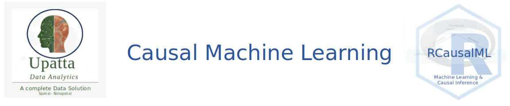

# A complete A–Z reference for causal inference and machine learning

> **How to use this glossary:** Each entry gives a plain-language explanation followed by a concrete example. Technical acronyms are shown in parentheses. Terms are organized alphabetically for quick look-up.

------------------------------------------------------------------------

## A

### Abduction

The first step in counterfactual reasoning: infer the hidden (latent) noise variables that are consistent with what was actually observed for a specific individual.

*Example:* Estimate the hidden biological factors that explain one patient's observed lab results before asking "what would happen if we changed their treatment?"

------------------------------------------------------------------------

### Acyclicity

A constraint on causal graphs that prevents any variable from being its own cause (directly or indirectly — no feedback loops allowed).

*Example:* A model would reject the structure A → B → C → A because following the arrows brings you back to where you started.

------------------------------------------------------------------------

### Adjacency Matrix

A grid (matrix) where each cell encodes whether — and how strongly — one variable causally influences another.

*Example:* If cell \[i, j\] is non-zero, variable i is a direct cause of variable j. Many zeros = a sparse, interpretable graph.

------------------------------------------------------------------------

### Adversarial Balancing

Training a model so that the learned representation of covariates makes it impossible to tell whether a unit was treated or not, removing selection bias.

*Example:* Learning a study-habit representation that reveals nothing about whether a student actually studied.

------------------------------------------------------------------------

### Adversarial Training

A training strategy where two networks compete: a *generator* tries to produce realistic outputs, while a *discriminator* tries to detect fakes. Both improve through competition.

*Example:* The generator improves by fooling the discriminator over many training rounds.

------------------------------------------------------------------------

### AIPW (Augmented Inverse Probability Weighting)

A doubly robust estimator that combines an outcome regression model and a propensity weighting model. It gives valid causal estimates if *either* model is correctly specified.

*Example:* Even if the propensity model is imperfect, a good outcome model can still yield valid effect estimates — and vice versa.

------------------------------------------------------------------------

### ANM (Additive Noise Model)

An assumption that each variable equals some function of its causes plus an independent noise term. This helps recover causal directions from data.

*Example:* `X₃ = f(X₁, X₂) + ε₃`, where ε₃ is random noise independent of X₁ and X₂.

------------------------------------------------------------------------

### ATE (Average Treatment Effect)

The average difference in outcomes between receiving treatment and not receiving treatment, calculated across the entire population.

*Example:* Across all patients in a trial, a drug improves recovery by +1.2 days on average. That +1.2 is the ATE.

------------------------------------------------------------------------

### ATTE (Average Treatment Effect on the Treated)

Like the ATE, but calculated only for the people who actually received the treatment.

*Example:* Among patients who took the drug, the average improvement was +1.8 days — larger than the population ATE of +1.2.

------------------------------------------------------------------------

### Attention Mechanism

A learned weighting inside a neural network that tells the model which parts of the input to focus on most when making a prediction.

*Example:* Like highlighting important sentences in a textbook — the model learns which sentences matter most.

------------------------------------------------------------------------

### AUUC (Area Under the Uplift Curve)

A summary metric for uplift models: it measures how well a model ranks individuals by their true incremental benefit from treatment. Higher = better targeting.

*Example:* A higher AUUC means that when you target the top-ranked people, you capture more of the total treatment benefit.

------------------------------------------------------------------------

### Auxiliary Variable

An extra observed variable added to a model to help identify latent (hidden) factors that would otherwise be impossible to disentangle.

*Example:* Including a "domain" or "environment" label as an extra input so the model can separate true hidden causes from noise.

------------------------------------------------------------------------

## B

### Baseline Arm

The reference treatment category used for all comparisons in a multi-arm study.

*Example:* In a drug trial with placebo, Drug A, and Drug B, the placebo is the baseline arm. Effects of A and B are measured relative to it.

------------------------------------------------------------------------

### Bias-Variance Tradeoff

The tension between two types of model error: *bias* (systematic mistakes from oversimplifying) and *variance* (sensitivity to noise in training data). Reducing one often increases the other.

*Example:* A very simple model underfits (high bias); a very complex model overfits (high variance). Good models balance both.

------------------------------------------------------------------------

### Boosting

An ensemble method that builds many simple models (weak learners) sequentially, where each new model focuses on correcting the errors of the previous ones.

*Example:* Tree 1 makes some mistakes; Tree 2 focuses on those mistakes; Tree 3 focuses on what Tree 2 still gets wrong — and so on.

------------------------------------------------------------------------

## C

### Calibration

Agreement between a model's predicted probabilities and what actually happens in the data.

*Example:* Among all patients for whom the model predicts a 70% treatment probability, roughly 70% should actually have been treated.

------------------------------------------------------------------------

### CART (Classification and Regression Trees)

A classic algorithm that splits data into groups using a sequence of yes/no questions (decision rules) to predict an outcome.

*Example:* "Is age \> 40? → Yes → Is income \> \$50k? → ..." Each branch narrows the prediction.

------------------------------------------------------------------------

### Causal Discovery

The process of learning *which variables cause which* directly from observational data, without running an experiment.

*Example:* Given data on income, education, and health, a causal discovery algorithm tries to figure out whether education → income or income → education.

------------------------------------------------------------------------

### Causal Effect

The change in an outcome that is *caused by* a treatment — not merely associated with it.

*Example:* A tutoring program causes test scores to increase by 5 points. That's the causal effect, not just a correlation.

------------------------------------------------------------------------

### Causal Graph (DAG)

A diagram with arrows showing which variables directly cause which others. Directed Acyclic Graph means arrows only go one way and there are no loops.

*Example:* `X → T → Y` means X influences treatment T, which influences outcome Y.

------------------------------------------------------------------------

### Causal Masking

Restricting a model so that each time step can only see *past* information, never future data, ensuring predictions are causally valid.

*Example:* Predicting tomorrow's stock price using only today's and earlier data — never using future prices.

------------------------------------------------------------------------

### Causal Regularization

Adding a penalty to a model's loss function that encourages its learned parameters to be consistent with causal assumptions.

*Example:* Penalizing any learned relationships that would imply a cycle in the causal graph.

------------------------------------------------------------------------

### CASTLE (Causal Structure Learning via Regularization)

A method that trains a neural prediction model while simultaneously learning the causal graph structure through a regularization penalty.

*Example:* An outcome model is trained while a graph penalty gently guides it to respect causal structure.

------------------------------------------------------------------------

### CATE (Conditional Average Treatment Effect)

The average treatment effect for a specific subgroup of people who share similar characteristics (covariates).

*Example:* Among 60-year-old patients with high blood pressure, the average treatment benefit is +3.2 points — their CATE. It may differ from the overall ATE.

------------------------------------------------------------------------

### Causal Masking / Causal Matrix

A matrix (or mask) that specifies which variables are allowed to influence which others, used to encode causal assumptions in a model.

*Example:* Row = target variable, Column = source. A zero in cell \[i, j\] means "variable j cannot influence variable i."

------------------------------------------------------------------------

### CEVAE (Causal Effect Variational Autoencoder)

A deep generative model that infers hidden confounders from observed data and uses them to estimate causal effects.

*Example:* If true socioeconomic status isn't measured, CEVAE learns a latent proxy for it from available variables, then adjusts for it when estimating treatment effects.

------------------------------------------------------------------------

### CFRNet (Counterfactual Regression Network)

A neural network designed to estimate potential outcomes under both treatment and control, trained with a penalty that makes the learned representation balanced across treatment groups.

*Example:* The network learns patient features in a way that treated and untreated patients look similar in the hidden layer, reducing bias from selection.

------------------------------------------------------------------------

### Cluster-Robust Standard Errors

Uncertainty estimates that account for the fact that observations within the same cluster (e.g., students in the same school) are not independent.

*Example:* If you ignore clustering, confidence intervals are too narrow — you underestimate how uncertain you are.

------------------------------------------------------------------------

### cLSTM / cMLP

Neural network architectures (LSTM or MLP) with one separate network per target variable, where input connections are sparsified to encode Granger-causal structure.

*Example:* Eight separate MLPs for eight sector ETFs, each reading other sectors' lagged values — but sparse connections reflect only the causally relevant links.

------------------------------------------------------------------------

### Common Support (Overlap)

The requirement that both treated and untreated units exist across the full range of covariate values. Without overlap, causal comparisons are unreliable.

*Example:* If all high-income states receive a policy and no high-income states serve as controls, we can't estimate the policy's causal effect for high-income states.

------------------------------------------------------------------------

### Compliers

People whose treatment behavior changes *because of* an instrument. They take treatment when encouraged and don't when not encouraged.

*Example:* People who attend a job training program only if they receive a voucher are compliers.

------------------------------------------------------------------------

### Confounding / Confounder

A variable that affects both whether someone receives treatment *and* the outcome — creating a misleading association between treatment and outcome.

*Example:* Sicker patients are more likely to get intensive treatment *and* more likely to have worse outcomes. Ignoring this makes treatment look harmful even if it helps.

------------------------------------------------------------------------

### Consistency

The assumption that the potential outcome under the treatment a person actually received equals their observed outcome.

*Example:* If a student studied the extra hour and we define Y(1) as "score with extra study," then their actual observed score equals Y(1).

------------------------------------------------------------------------

### Constraint-Based Method (Causal Discovery)

A causal discovery approach that uses statistical independence tests to decide which edges to include or remove from a causal graph.

*Example:* The PC algorithm removes an edge between X and Y if they become independent after conditioning on some set of other variables.

------------------------------------------------------------------------

### Contrast (Treatment Contrast)

The difference in predicted outcomes between two treatment arms.

*Example:* `τ(x) = μ_A(x) - μ_control(x)` is the contrast between Drug A and the control for a patient with features x.

------------------------------------------------------------------------

### Cosine Annealing

A learning rate schedule where the learning rate decreases gradually following a cosine curve, slowing training as the model converges.

*Example:* Like gradually applying the brakes as you approach a stop sign — don't stop suddenly, slow down smoothly.

------------------------------------------------------------------------

### Counterfactual

The outcome that *would have happened* for a unit under the treatment they did *not* receive — it is never actually observed.

*Example:* A patient received Drug A and recovered in 5 days. What would have happened if they had received the placebo instead? That unobserved outcome is the counterfactual.

------------------------------------------------------------------------

### Covariate

A background variable (feature) that describes a unit and may influence treatment assignment and/or the outcome.

*Example:* Age, income, and prior health status are covariates in a medical study.

------------------------------------------------------------------------

### Covariate Balance

When the distribution of background characteristics looks similar across treated and control groups (after weighting or matching).

*Example:* Age and income look comparable between treated and untreated groups after applying inverse probability weights.

------------------------------------------------------------------------

### Covariate Profile

The full set of observed characteristics for one individual.

*Example:* "Female, age 45, high baseline risk score" is a covariate profile.

------------------------------------------------------------------------

### Cross-Fitting

A sample-splitting strategy: one portion of the data trains the nuisance models (like propensity scores), and a *different* portion is used to estimate the treatment effect. This prevents overfitting.

*Example:* In 5-fold cross-fitting, each fold takes a turn being the "estimation" set while the other four train the nuisance models.

------------------------------------------------------------------------

## D

### DAGMA

A method for learning directed acyclic graphs (DAGs) that uses a log-determinant function to enforce the no-cycles constraint during continuous optimization.

*Example:* Like NOTEARS, but with a different mathematical trick for detecting and penalizing cycles.

------------------------------------------------------------------------

### Dilated Convolution

A convolution operation that skips inputs by a fixed factor (dilation rate), allowing the model to "see" longer time horizons without increasing model size proportionally.

*Example:* Reading every 2nd word, then every 4th word, to understand context across longer sequences efficiently.

------------------------------------------------------------------------

### Disentanglement / Disentangled Latent Space

Learning hidden (latent) variables where each dimension captures a distinct, interpretable factor — making the representation more interpretable and causally meaningful.

*Example:* One latent dimension captures disease severity; another captures lifestyle factors; they don't mix.

------------------------------------------------------------------------

### DML (Double Machine Learning)

A framework for causal inference that uses machine learning to control for confounders (nuisance terms) while producing valid statistical inference for the target causal parameter.

*Example:* Use a random forest to predict Y from X and another to predict T from X. Then regress the residuals of Y on the residuals of T to get an unconfounded estimate.

------------------------------------------------------------------------

### Donor Pool

The set of control units available to construct a synthetic control counterfactual for a treated unit.

*Example:* All untreated classmates whose historical data can be combined to estimate what a treated student's score would have been without the intervention.

------------------------------------------------------------------------

### Dose-Response Curve

The relationship between the *level* of a continuous treatment and the expected outcome — a generalization of ATE to non-binary treatments.

*Example:* How does average blood pressure change as drug dose increases from 0 to 10 mg?

------------------------------------------------------------------------

### Doubly Robust Estimation

An estimator that is valid (consistent) if *either* the outcome model *or* the propensity model is correctly specified — not both need to be perfect.

*Example:* Even if your propensity model is slightly wrong, a good outcome model saves you — and vice versa.

------------------------------------------------------------------------

### DragonNet

A neural network architecture that jointly predicts outcomes and propensity scores, using the propensity head to improve outcome estimation via targeted regularization.

*Example:* One network head predicts Y(0) and Y(1); another predicts P(T=1\|X). The propensity head guides the outcome heads to be more causally accurate.

------------------------------------------------------------------------

### Dynamic Treatment Effect

A treatment effect that changes over time, rather than being constant.

*Example:* A job training program has small effects at 3 months but larger effects at 12 months as skills compound.

------------------------------------------------------------------------

## E

### Edge Pruning

Removing weak or near-zero edges from a learned causal graph to produce a cleaner, more interpretable structure.

*Example:* After training a NOTEARS model, delete all edges where the learned weight is below 0.3.

------------------------------------------------------------------------

### ELBO (Evidence Lower Bound)

The training objective for variational autoencoders (VAEs). It balances two goals: (1) reconstruct the data well, and (2) keep the latent distribution close to a simple prior.

*Example:* ELBO = reconstruction quality − KL penalty. Maximizing it trains the VAE without computing the intractable exact likelihood.

------------------------------------------------------------------------

### Encoder

A neural network that maps observed inputs into a compact latent (hidden) representation.

*Example:* A VAE encoder transforms a patient's lab measurements into a 32-dimensional latent vector z.

------------------------------------------------------------------------

### Endogeneity

When the treatment variable is correlated with unobserved factors that also affect the outcome, making naive regression estimates biased.

*Example:* More motivated people are both more likely to choose treatment and more likely to succeed — motivation is an unobserved confounder.

------------------------------------------------------------------------

### Ensemble Learner

A model that combines predictions from multiple different models to produce more robust and accurate estimates.

*Example:* Average the predictions of a random forest and a gradient boosting model for a more stable estimate.

------------------------------------------------------------------------

### Exclusion Restriction

The assumption required for instrumental variables: the instrument affects the outcome *only* through its effect on treatment — not through any other pathway.

*Example:* A job-training voucher affects wages only by changing training participation — not by directly signaling ability to employers.

------------------------------------------------------------------------

### Exogeneity

The assumption that an instrument is independent of any unmeasured factors that affect the outcome.

*Example:* If vouchers are randomly assigned, they are exogenous — receiving a voucher is unrelated to unmeasured motivation or ability.

------------------------------------------------------------------------

## F

### Factual Outcome

The outcome actually observed in the real world — as opposed to the counterfactual outcome under the other treatment.

*Example:* A patient received treatment and recovered in 5 days. That 5-day recovery is the factual outcome.

------------------------------------------------------------------------

### G

### G-Computation

A sequential procedure for estimating what the distribution of outcomes would be under a hypothetical treatment strategy, by fitting outcome models and "plugging in" the intervention.

*Example:* Simulate future exam scores under a hypothetical "everyone studies every night" policy using a fitted model of how studying affects scores.

------------------------------------------------------------------------

### GAN (Generative Adversarial Network)

A generative modeling framework consisting of two neural networks — a *generator* that creates synthetic data and a *discriminator* that distinguishes real from fake — trained in competition.

*Example:* GANITE uses this framework to generate plausible counterfactual outcomes for each individual.

------------------------------------------------------------------------

### GANITE

A causal inference method that uses generative adversarial networks to impute missing counterfactual outcomes and estimate individual treatment effects.

*Example:* For a treated unit, GANITE generates what their control outcome would have looked like, enabling ITE estimation.

------------------------------------------------------------------------

### Granger Causality

A time-series concept: variable X "Granger-causes" variable Y if knowing X's past history helps predict Y's future beyond what Y's own past tells us.

*Example:* If past Energy ETF returns help predict future Financials ETF returns (even after accounting for Financials' own history), Energy Granger-causes Financials.

------------------------------------------------------------------------

### GRN (Gated Residual Network)

A neural network building block with a sigmoid gate and a skip connection, allowing the network to learn how much transformation to apply at each step.

*Example:* A shortcut that decides "apply 80% of this transformation, skip 20%" — stabilizing training and gradient flow.

------------------------------------------------------------------------

## H

### Hard Intervention

Setting a variable to a specific fixed value regardless of what its normal causes say — the `do()` operator in causal calculus.

*Example:* `do(T=1)` forces everyone to receive treatment, even those who would normally not qualify.

------------------------------------------------------------------------

### Heterogeneous Treatment Effect (HTE)

When the treatment effect is not the same for everyone — it varies across individuals or subgroups.

*Example:* A drug reduces blood pressure by 10 points in older patients but only 3 points in younger patients.

------------------------------------------------------------------------

### Hidden Confounding

Bias caused by an unobserved variable that affects both treatment assignment and the outcome.

*Example:* A patient's underlying motivation, not recorded in clinical notes, influences both whether they seek therapy and whether they recover.

------------------------------------------------------------------------

### Honest Estimation

A technique that uses *different* subsets of data for (1) learning the tree structure (splits) and (2) estimating the treatment effects in each leaf. This prevents overfitting of effect estimates.

*Example:* Train the tree structure on 50% of data, then estimate leaf-level treatment effects on the other 50%.

------------------------------------------------------------------------

### Hyperparameter Tuning

Searching for the model settings (like tree depth, learning rate) that produce the best out-of-sample performance, typically via cross-validation.

*Example:* Try learning rates of 0.01, 0.05, and 0.1 and pick whichever gives the lowest validation error.

------------------------------------------------------------------------

## I

### Identifiability

Whether the true causal quantities (e.g., CATE) can be uniquely recovered from data given the modeling assumptions. A model that is not identifiable has multiple solutions that fit the data equally well.

*Example:* Standard VAEs are not identifiable; iVAEs (with auxiliary variables) are.

------------------------------------------------------------------------

### Ignorability

Given the observed covariates, treatment assignment is essentially random — all confounding has been measured and controlled for.

*Example:* After adjusting for age and health status, the decision of who gets treatment is unrelated to any remaining outcome-relevant factors.

------------------------------------------------------------------------

### Imputation

Filling in missing values — in the causal context, filling in unobserved counterfactual outcomes.

*Example:* For treated units, GANITE imputes their unobserved control outcomes to enable individual treatment effect estimation.

------------------------------------------------------------------------

### Instrument / Instrumental Variable (IV)

A variable that (1) affects treatment assignment, (2) has no direct effect on the outcome (exclusion restriction), and (3) is independent of unmeasured confounders (exogeneity).

*Example:* Distance to a college affects years of education but doesn't directly affect wages — making it a valid instrument for studying the return to education.

------------------------------------------------------------------------

### Intra-Cluster Correlation (ICC)

A measure of how similar observations within the same cluster are to each other. High ICC means clustering matters a lot for standard errors.

*Example:* Students in the same school tend to have similar outcomes — high ICC — so treating them as independent would underestimate uncertainty.

------------------------------------------------------------------------

### Inverse Probability Weighting (IPW)

Reweighting observations by the inverse of their probability of receiving the treatment they actually received, to make the weighted sample look like a randomized experiment.

*Example:* If a unit had only a 20% chance of being treated but was treated, it receives weight 1/0.2 = 5, making it represent the units like it that weren't treated.

------------------------------------------------------------------------

### IPCW (Inverse Probability of Censoring Weighting)

A method for survival analysis that reweights observations to correct for the bias introduced by censoring (people leaving the study before the event occurs).

*Example:* Individuals who are likely to drop out early receive larger weights so they still represent the overall population.

------------------------------------------------------------------------

### ITE (Individual Treatment Effect)

The causal effect of treatment for one specific person: their potential outcome under treatment minus their potential outcome under control.

*Example:* For patient A, `ITE = Y(1) - Y(0) = 8 - 5 = +3 days` of faster recovery.

------------------------------------------------------------------------

### iVAE (Identifiable Variational Autoencoder)

A VAE variant that uses auxiliary observed variables (like domain labels) to make the learned latent factors uniquely identifiable — solving a fundamental limitation of standard VAEs.

*Example:* Adding a time-period label as an auxiliary variable helps the model separate true causal latent factors from arbitrary rotations.

------------------------------------------------------------------------

## J

### Joint Estimation

Estimating multiple related outcomes or treatment effects simultaneously, allowing models to share information and improve precision for each individual estimate.

*Example:* A model estimates the effects on both blood pressure and heart rate together, rather than fitting two separate models.

------------------------------------------------------------------------

## K

### KL Divergence (Kullback-Leibler Divergence)

A measure of how different one probability distribution is from another. Used in VAEs as a regularization penalty to keep the learned latent distribution close to a simple prior.

*Example:* High KL divergence means the encoder's learned distribution is very different from a standard normal — the penalty discourages this.

------------------------------------------------------------------------

## L

### Lag / Window

The number of past time steps used as inputs to a model.

*Example:* A model with lag 5 uses the last 5 days of data to predict today's outcome.

------------------------------------------------------------------------

### Latent Confounder

A hidden variable (not directly observed) that influences both treatment assignment and the outcome.

*Example:* A genetic predisposition that simultaneously affects medication choice and health outcome risk.

------------------------------------------------------------------------

### Latent Variable

A hidden factor that is not directly measured but is inferred from observable data.

*Example:* A latent health-risk score inferred from dozens of lab measurements and vital signs.

------------------------------------------------------------------------

### LATE (Local Average Treatment Effect)

The average treatment effect for *compliers* — people whose treatment status changes because of the instrument.

*Example:* The average wage gain from job training, estimated only among people who attend training *because* they received a voucher.

------------------------------------------------------------------------

## M

### Masked Loss

A loss function that computes error only on the actually-observed treatment outcome for each unit — not on the counterfactual (unobserved) outcome.

*Example:* For a treated unit, only the treated-outcome prediction head is updated; the control head is not penalized on that unit.

------------------------------------------------------------------------

### Message Passing

In graph neural networks, each node gathers information from its neighboring nodes, aggregates it, and updates its own representation. This propagates information through the graph.

*Example:* In a causal network, each variable collects signals from its parent variables and updates its internal state.

------------------------------------------------------------------------

### MMD (Maximum Mean Discrepancy)

A kernel-based measure of distance between two probability distributions. Zero means the distributions are identical; larger values mean they are more different.

*Example:* If treated and control patients have very different distributions in the learned representation space, MMD is high — penalizing this encourages balanced representations.

------------------------------------------------------------------------

### Multi-Arm Treatment

A study design with more than two treatment options.

*Example:* A clinical trial with placebo, low-dose drug, and high-dose drug is a three-arm trial.

------------------------------------------------------------------------

### Multi-Outcome Modeling

Estimating the effects on more than one outcome variable at the same time.

*Example:* Simultaneously estimating treatment effects on blood pressure and heart rate, sharing information across both outcomes.

------------------------------------------------------------------------

## N

### NoCurl Penalty

A soft regularizer for DAG learning that penalizes local circular patterns in the learned graph (inspired by the mathematical concept of curl in vector fields).

*Example:* Penalize patterns like A → B → A, which imply a cycle even if no single edge closes the loop.

------------------------------------------------------------------------

### NOTEARS

A method for learning DAGs that converts the combinatorial graph search problem into a continuous optimization problem using a differentiable acyclicity function.

*Example:* Optimize a weighted adjacency matrix by gradient descent while a penalty term enforces the no-cycles constraint.

------------------------------------------------------------------------

### Nuisance Functions / Nuisance Models

Auxiliary models fitted to estimate quantities like E\[Y\|X\] or P(T\|X) that are needed before estimating the final causal parameter of interest.

*Example:* In double machine learning, nuisance models predict the outcome and the treatment from covariates. Their residuals are then used for causal estimation.

------------------------------------------------------------------------

## O

### Out-of-Fold Prediction

A prediction for each observation made by a model that was *not* trained on that observation — a cross-validation practice that prevents overfitting in stacked models.

*Example:* In 5-fold CV, row 1's prediction comes from the fold that held row 1 out during training.

------------------------------------------------------------------------

### Outcome

The measured result (response variable) that we want to understand or improve through treatment.

*Example:* Test score, disease recovery time, or gonorrhea rate are all outcomes in different studies.

------------------------------------------------------------------------

### Overfitting

When a model learns the noise in training data and fails to generalize to new data.

*Example:* A very deep decision tree with tiny leaves fits the training data almost perfectly but gives wildly unstable predictions on new patients.

------------------------------------------------------------------------

### Overlap (Positivity)

The requirement that every unit has a non-zero probability of receiving *either* treatment or control, across all covariate values.

*Example:* If some patient profiles always get Drug A and never the control, we can't estimate the causal effect for those profiles.

------------------------------------------------------------------------

## P

### Panel Data

Repeated observations of the same units (people, firms, states) measured at multiple time points.

*Example:* Monthly income records for the same 500 households over 3 years.

------------------------------------------------------------------------

### Parent Set

The set of variables that *directly cause* a given variable in the causal graph.

*Example:* The parent set of outcome Y might include treatment T and two measured confounders.

------------------------------------------------------------------------

### PEHE (Precision in Estimation of Heterogeneous Effects)

The root mean squared error of individual treatment effect estimates compared to their true values. Lower = better ITE accuracy.

*Example:* If the model predicts ITE = +3 but the true ITE was +5, that's a PEHE contribution of 2.

------------------------------------------------------------------------

### Permutation Test

A nonparametric significance test that shuffles treatment labels many times to build a null distribution, then compares the observed statistic to that distribution.

*Example:* If the true CATE variance is much larger than what we see across thousands of label-shuffled datasets, the heterogeneity is probably real.

------------------------------------------------------------------------

### Positional Encoding

A vector added to each time step's representation in a transformer model to encode its position in the sequence (since attention has no inherent notion of order).

*Example:* Adding a "timestamp fingerprint" to each data point so the model knows temporal order.

------------------------------------------------------------------------

### Posterior

The updated probability distribution over hidden variables *after* observing data — combining prior belief with evidence.

*Example:* `q(z|x, t, y)` is the estimated distribution over likely latent confounders for one specific patient record.

------------------------------------------------------------------------

### Posterior Collapse

A failure mode of VAEs where the encoder ignores the input and the latent code carries no information, because the KL term overwhelms the reconstruction signal.

*Example:* The model learns to use the same latent code for all inputs — iVAE's conditional prior helps prevent this.

------------------------------------------------------------------------

### Potential Outcomes

The two hypothetical outcomes for each individual — what would happen to them *under treatment* and *under control* — only one of which is ever observed.

*Example:* A patient has a potential recovery time of 5 days with Drug A and 8 days without it. We only observe one of these in reality.

------------------------------------------------------------------------

### Propensity Score

The probability of receiving treatment given a unit's observed covariates: `P(T=1 | X)`.

*Example:* Two patients with similar age, health history, and baseline risk should have similar propensity scores. A score of 0.7 means a 70% predicted chance of treatment.

------------------------------------------------------------------------

### Proxy Confounder

An observed variable that imperfectly reflects an unobserved confounder, used as a stand-in when the true confounder isn't measured.

*Example:* A noisy survey score used as a proxy for true socioeconomic status, which wasn't directly measured.

------------------------------------------------------------------------

### Pruning (Tree)

Removing weak branches from a decision tree after training to simplify it and improve generalization to new data.

*Example:* After cross-validation, branches that do not meaningfully reduce prediction error are removed.

------------------------------------------------------------------------

## R

### Regime

A latent (unobserved) system state that governs the data-generating process at a given time.

*Example:* Financial markets have "bull" (rising) and "bear" (falling) regimes, each with different rules for how variables influence each other.

------------------------------------------------------------------------

### Representation Learning

Learning a compact, useful internal representation (embedding) of raw inputs — often a shared hidden layer used for multiple downstream tasks.

*Example:* TARNet learns a shared hidden representation of patient features before splitting into treatment-specific output heads.

------------------------------------------------------------------------

### Residualization

Subtracting the part of a variable that is predictable from covariates, leaving only the residual variation unexplained by controls.

*Example:* In double ML, compute `Ỹ = Y - E[Y|X]` and `T̃ = T - E[T|X]`, then regress `Ỹ` on `T̃` to estimate the causal effect.

------------------------------------------------------------------------

### Right-Censoring

In survival analysis, when the event of interest has not yet occurred for a unit by the end of the study period — we know they survived *at least* that long, but not what happened after.

*Example:* A patient leaves the clinical trial before experiencing the disease event. Their observation is censored at their last follow-up date.

------------------------------------------------------------------------

### RMST (Restricted Mean Survival Time)

The average time until an event (or time remaining event-free) up to a fixed time horizon. Used as a summary of survival that avoids the proportional hazards assumption.

*Example:* The average number of event-free months in the first 24 months after treatment.

------------------------------------------------------------------------

## S

### Sample Weight

A number assigned to each observation reflecting how much it should count in the analysis — used to make a non-representative sample representative.

*Example:* Underrepresented groups receive larger weights so they contribute appropriately to population-level estimates.

------------------------------------------------------------------------

### SCM (Structural Causal Model)

A system of equations — one per variable — that describes exactly how each variable is generated from its causes plus random noise. Enables intervention and counterfactual reasoning.

*Example:* `Y = f(T, X, U_Y)` where U_Y is unobserved noise. Changing T while holding U_Y fixed gives the causal effect.

------------------------------------------------------------------------

### Score-Based Method (Causal Discovery)

A causal discovery approach that selects the graph that maximizes some goodness-of-fit score (like log-likelihood) subject to the acyclicity constraint.

*Example:* NOTEARS optimizes reconstruction loss plus an acyclicity penalty to find the best-fitting DAG.

------------------------------------------------------------------------

### Selection Bias

Systematic differences between treated and control groups that are not due to the treatment itself, leading to biased causal estimates.

*Example:* Sicker patients are more likely to receive treatment, biasing naive before-after comparisons.

------------------------------------------------------------------------

### Sequential Ignorability

In a longitudinal setting, the assumption that at each time point, treatment assignment is essentially random after conditioning on all past covariates and outcomes.

*Example:* Given all past health records and treatments, today's treatment assignment is unconfounded by unmeasured factors.

------------------------------------------------------------------------

### SHAP Values

A method for explaining model predictions by attributing each feature's contribution to the prediction. Based on game-theoretic (Shapley) values.

*Example:* For a predicted treatment contrast of +0.8, SHAP says: age contributes +0.4, income +0.3, baseline risk +0.1.

------------------------------------------------------------------------

### Soft Intervention

An intervention that *changes* the parameters or mechanism of a structural equation rather than forcing a fixed value — a weaker form of intervention than `do()`.

*Example:* Increasing someone's probability of seeking treatment rather than forcing them to receive it.

------------------------------------------------------------------------

### Sparsity Penalty

A regularization term that shrinks small edge weights toward zero, encouraging a simpler model with fewer active connections.

*Example:* L1 regularization on an adjacency matrix causes many edge weights to become exactly zero, yielding a sparse, interpretable causal graph.

------------------------------------------------------------------------

### Stacking (Metalearner)

A meta-learning method that learns the *optimal combination weights* for a set of base learners, rather than treating them all equally.

*Example:* A linear regression is trained on the predictions of random forest, XGBoost, and Lasso — learning that XGBoost deserves 60% weight, RF 30%, Lasso 10%.

------------------------------------------------------------------------

### State Dependence

When a unit's current outcome depends on its own past outcomes, not just covariates and treatment.

*Example:* Whether someone is unemployed this quarter depends partly on whether they were unemployed last quarter, even after controlling for all other factors.

------------------------------------------------------------------------

### Structural Equation

A mathematical equation defining how one variable is generated from its parent causes and exogenous noise.

*Example:* `Y = f(T, X, ε_Y)` where ε_Y is random noise — changing T while holding ε_Y fixed gives the causal effect of T on Y.

------------------------------------------------------------------------

### Structural Learning

Estimating the edges and directions of causal relationships from data.

*Example:* Discovering from observational data whether income causes education, or education causes income.

------------------------------------------------------------------------

### Survival Outcome

An outcome measured as the *time until* a specific event occurs (death, relapse, purchase, etc.).

*Example:* Time from the start of treatment to cancer relapse.

------------------------------------------------------------------------

### Synthetic Control

A counterfactual for a treated unit constructed as a weighted average of control units that best matched the treated unit before the intervention.

*Example:* Using a weighted combination of untreated states to estimate what California's crime rate would have been without a particular policy.

------------------------------------------------------------------------

## T

### TARNet (Treatment-Agnostic Representation Network)

A neural network that learns a shared representation of covariates for all patients, then branches into separate output heads for each treatment arm.

*Example:* Shared layers learn "patient features"; then one head predicts Y(0) and another predicts Y(1) for each patient.

------------------------------------------------------------------------

### Time-Varying Confounder

A confounder whose value changes over time and influences both treatment and outcome at multiple time points.

*Example:* A patient's health status changes each year, affecting both which treatment they receive and their outcomes.

------------------------------------------------------------------------

### TMLE (Targeted Maximum Likelihood Estimation)

A doubly robust estimation procedure that first fits an initial model and then "targets" it with a small update to reduce bias for the specific causal parameter of interest.

*Example:* Fit an initial outcome model, then apply a one-step correction that uses the propensity score to reduce bias in the ATE estimate.

------------------------------------------------------------------------

### Treatment

The intervention, policy, or exposure whose causal effect we want to estimate.

*Example:* In a study of a new drug, "treatment" means receiving the drug; "control" means receiving a placebo.

------------------------------------------------------------------------

### Treatment Arm

One specific treatment option in a multi-arm study.

*Example:* In a three-arm trial with placebo, Drug A, and Drug B, each of these is one treatment arm.

------------------------------------------------------------------------

### Treatment Effect

The difference in outcome between receiving treatment and not receiving it for a unit or group.

*Example:* If expected blood pressure decreases by 8 points with treatment and 3 points without it, the treatment effect is 5 points.

------------------------------------------------------------------------

### Treatment History

The full sequence of treatment assignments a unit has received up to a given time point.

*Example:* A patient's treatment history might be: "Day 1: no drug, Day 2: low dose, Day 3: high dose."

------------------------------------------------------------------------

## U

### Uplift

The predicted *improvement* in outcome caused by treatment for a specific individual — used in marketing and personalization.

*Example:* A model predicts a customer's purchase probability rises by 5 percentage points if they receive a promotional email. That +5pp is their uplift.

------------------------------------------------------------------------

## V

### VAE (Variational Autoencoder)

A deep generative model that learns a probabilistic latent representation of data, trained using the ELBO objective. It can generate new samples and infer hidden structure.

*Example:* A VAE trained on patient records learns a compact latent representation that captures the key dimensions of patient health.

------------------------------------------------------------------------

### VAR (Vector Autoregression)

A time-series model where each variable is predicted from the past values of *all* variables in the system — useful for studying dynamic causal relationships.

*Example:* GDP, inflation, and interest rates are modeled together, with each depending on lagged values of all three.

------------------------------------------------------------------------

### Variable Importance

A ranking of which features most strongly influence the estimated treatment effect variation across individuals.

*Example:* Income and age may appear as the top two drivers of CATE differences — meaning the treatment works much better for some income/age groups than others.

------------------------------------------------------------------------

### Variational Inference

An approximate Bayesian method that replaces intractable posterior computation with optimization over a tractable family of distributions.

*Example:* CEVAE uses variational inference to approximate the posterior distribution over latent confounders given observed data.

------------------------------------------------------------------------

### VSN (Variable Selection Network)

A learned soft gate in the Temporal Fusion Transformer that scores how important each input variable is at each time step.

*Example:* Automatically highlighting which financial indicators (interest rates, momentum, volume) are most relevant for a given forecast.

------------------------------------------------------------------------

## W

### Weak Instrument

An instrument that has only a weak correlation with the treatment variable, leading to imprecise and potentially biased IV estimates.

*Example:* If college proximity barely affects years of education (small first-stage F-statistic), it is a weak instrument for studying returns to education.
