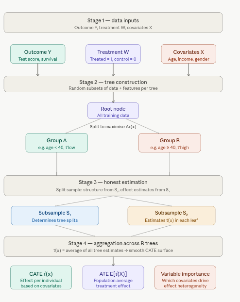

# 1.2 Causal Forest (CF) for Heterogeneous Treatment Effect Estimation {.unnumbered}

This tutorial provides an overview of **Causal Forests** (CF) within the Generalized Random Forests (GRF) framework, focusing on estimating heterogeneous treatment effects in observational or experimental data. It includes a step-by-step guide to implementing Causal Forests using the `{grf}` package in R, with practical examples and explanations tailored to the **abortion** dataset from the `{causaldata}` package.

## Overview

A **Causal Forest** is a machine learning method within the Generalized Random Forests (GRF) framework, designed to estimate **Heterogeneous Treatment Effects (HTE)** — specifically the **Conditional Average Treatment Effect (CATE)** — across individuals in observational or experimental studies.

It adapts the classic random forest algorithm for causal inference, asking not *"what will happen?"* but *"what is the effect of treatment for this type of person?"*

### Key Concepts

**Treatment Effect** measures the difference in outcomes between a treated and untreated individual:

$$\tau(x) = E[Y(1) - Y(0) \mid X = x]$$

where $Y(1)$ is the outcome if treated, $Y(0)$ if untreated, $X$ represents covariates (age, sex, income, etc.), and $\tau(x)$ is the CATE — the expected treatment effect for an individual with covariates $X = x$.

**Heterogeneity** is the core motivation: treatment effects aren't uniform. A drug may work better for older patients; an intervention may help high-income households more than low-income ones. Causal forests find *where* and *how much* these effects vary.

**Random Forest Foundation:** Like standard random forests, causal forests use an ensemble of decision trees — but trees are grown to maximize heterogeneity in treatment effects, not prediction accuracy.

### How It Works: Five Steps

**1. Data Requirements** — You need three things: an outcome $Y$ (e.g. survival time, test score), a treatment indicator $W$ (binary or continuous: treated vs. control), and covariates $X$ (features like age, income).

**2. Tree Construction** — Each tree is grown on a random data/feature subset. Splits are chosen to maximally separate groups with *different* treatment effects — not to minimize prediction error. The criterion targets variance in $\tau(x)$ across branches.

**3. Honest Estimation** — To avoid overfitting, one subsample determines the *tree structure* (splits), and a held-out subsample *estimates treatment effects* within each leaf. This ensures unbiased $\tau(x)$ estimates.

**4. Aggregation** — All trees are averaged into a smooth, non-parametric estimate of $\tau(x)$ across the covariate space.

**5. Outputs** — The forest produces: CATE estimates $\tau(x)$ per individual, an Average Treatment Effect (ATE) $= E[\tau(X)]$, and variable importance scores showing which covariates drive treatment effect heterogeneity.

{width="529"}

The diagram walks through all five stages end-to-end:

-   **Inputs** (teal/purple/coral) flow into tree construction, where the key innovation is the split criterion — rather than minimizing prediction error, each split maximizes the *difference in treatment effects* $\Delta\tau(x)$ between branches.
-   **Honest estimation** (blue/amber) prevents overfitting by separating the data used to grow the tree structure from the data used to estimate effects in the leaves.
-   **Aggregation** smooths across all $B$ trees, producing a robust, non-parametric CATE surface.
-   **Outputs** give you per-individual CATE estimates, a population-level ATE, and variable importance — telling you *which* patient characteristics matter most for treatment response.

## Causal Forest (CF) in R

This tutorial uses the `{RCausalML}` integrated with `{grf}` package for robust implementation of Causal Forests. The `grf` package allows users to estimate Conditional Average Treatment Effects (CATE) and visualize treatment effect heterogeneity effectively.

We'll cover:

-   Getting started Causal Forest with simulated data
-   Use case with the `abortion` dataset from `{causaldata}`

## Set Up

### Check and Install Required R Packages

Following R packages are required to run this notebook. If any of these packages are not installed, you can install them using the code below:

`tidyverse`, `plyr`, `RCausalML`, `causaldata`, `mlbench`, `gridExtra`, `kernelshap`, `shapviz`


::: {.cell}

```{.r .cell-code  lst-cap="Required R package names used throughout the notebook."}
packages <- c(
  "tidyverse",
  "plyr",
  "RCausalML",
  "causaldata",
  "mlbench",
  "gridExtra",
  "kernelshap",
  "shapviz"
)
```
:::


### Install Missing Packages


::: {.cell}

```{.r .cell-code  lst-cap="Optional commands to install missing CRAN/GitHub dependencies (commented by default)."}
# Install missing packages
# new_packages <- packages[!(packages %in% installed.packages()[, "Package"])]
# if (length(new_packages)) install.packages(new_packages)
```
:::


### Verify Installation


::: {.cell}

```{.r .cell-code  lst-cap="Check that each required package namespace is available."}
# Verify installation
cat("Installed packages:\n")
```

::: {.cell-output .cell-output-stdout}

```
Installed packages:
```


:::

```{.r .cell-code  lst-cap="Check that each required package namespace is available."}
print(sapply(packages, requireNamespace, quietly = TRUE))
```

::: {.cell-output .cell-output-stdout}

```
 tidyverse       plyr  RCausalML causaldata    mlbench  gridExtra kernelshap 
      TRUE       TRUE       TRUE       TRUE       TRUE       TRUE       TRUE 
   shapviz 
      TRUE 
```


:::
:::


### Load R Packages


::: {.cell}

```{.r .cell-code}
# Load packages with suppressed messages
invisible(lapply(packages, function(pkg) {
  suppressPackageStartupMessages(library(pkg, character.only = TRUE))
}))
```
:::


### Check Loaded Packages


::: {.cell}

```{.r .cell-code  lst-cap="Confirm which package environments are attached on the search path."}
# Check loaded packages
cat("Successfully loaded packages:\n")
```

::: {.cell-output .cell-output-stdout}

```
Successfully loaded packages:
```


:::

```{.r .cell-code  lst-cap="Confirm which package environments are attached on the search path."}
print(search()[grepl("package:", search())])
```

::: {.cell-output .cell-output-stdout}

```
 [1] "package:shapviz"    "package:kernelshap" "package:gridExtra" 
 [4] "package:mlbench"    "package:causaldata" "package:RCausalML" 
 [7] "package:plyr"       "package:lubridate"  "package:forcats"   
[10] "package:stringr"    "package:dplyr"      "package:purrr"     
[13] "package:readr"      "package:tidyr"      "package:tibble"    
[16] "package:ggplot2"    "package:tidyverse"  "package:stats"     
[19] "package:graphics"   "package:grDevices"  "package:utils"     
[22] "package:datasets"   "package:methods"    "package:base"      
```


:::
:::


## Causal Forest with Simulated Data

Before applying Causal Forests to real data, it’s often helpful to understand the method using simulated data where the true treatment effects are known. This allows us to verify that the causal forest can recover the underlying heterogeneity in treatment effects.

### Data Generation and Processing

We use **simulated data** from `synthetic_data()` (see `R/synthetic_data.R`) to illustrate fitting a causal forest. The data has a known heterogeneous treatment effect structure, so we can compare estimated CATEs to the true effects.


::: {.cell}

```{.r .cell-code}
set.seed(42)
dat_sim <- synthetic_data(mode = 2, n = 3000, p = 20, sigma = 5.5)

# Extract components
y_sim   <- dat_sim$y
X_sim   <- dat_sim$X
w_sim   <- dat_sim$w
tau_sim <- dat_sim$tau   # true CATE (for evaluation)

# Train/test split (80% / 20%)
n_sim   <- nrow(X_sim)
idx_tr  <- sample(n_sim, size = round(0.8 * n_sim))
X_tr    <- X_sim[idx_tr, , drop = FALSE]
Y_tr    <- y_sim[idx_tr]
W_tr    <- w_sim[idx_tr]
X_te    <- X_sim[-idx_tr, , drop = FALSE]
tau_te  <- tau_sim[-idx_tr]   # hold-out true CATE for evaluation

cat("Training: n =", length(Y_tr), "| Test: n =", length(tau_te), "\n")
```

::: {.cell-output .cell-output-stdout}

```
Training: n = 2400 | Test: n = 600 
```


:::

```{.r .cell-code}
cat("True CATE (test) — mean:", round(mean(tau_te), 3), ", sd:", round(sd(tau_te), 3), "\n")
```

::: {.cell-output .cell-output-stdout}

```
True CATE (test) — mean: 0.813 , sd: 1.105 
```


:::
:::


### Fitting Causal Forest on Simulated Data

Fit a causal forest on the simulated training data. We use honest splitting and a moderate number of trees for speed; you can increase `num.trees` for production use.


::: {.cell}

```{.r .cell-code}
library(future)

# Detect cores and set parallel threads
n_cores <- max(1L, parallel::detectCores() - 1L)

# Fit causal forest with tuning 
if (nrow(X_tr) > 5000L) {
  # Large data — reduce trees slightly, rely on parallelism
  n_trees          <- 500L
  samp_fraction    <- 0.4
  min_node         <- 10L

} else {
  # Small/medium data — more trees for stability, finer nodes
  n_trees          <- 200L
  samp_fraction    <- 0.5
  min_node         <- 5L
}

cf_sim <- causal_forest(
  X                = X_tr,
  Y                = Y_tr,
  W                = W_tr,
  num.trees        = n_trees,
  sample.fraction  = samp_fraction,
  min.node.size    = min_node,
  honesty          = TRUE,
  honesty.fraction = 0.5,
  tune.parameters  = "all",   # auto-tunes key hyperparameters
  num.threads      = n_cores, # built-in OpenMP parallelism
  seed             = 123
)

#  Summarize 
summary(cf_sim)
```

::: {.cell-output .cell-output-stdout}

```
=== Causal Forest Summary ===

Causal Forest
-------------
  Trees         : 200
  Observations  : 2400
  Covariates    : 20
  Honesty       : TRUE (fraction = 0.50)
  min.node.size : 5
  mtry          : 20
  alpha         : 0.050
  OOB preds     : 2400 / 2400 obs covered
  ATE (OOB est) : 1.3629

OOB Prediction Distribution:
   Min. 1st Qu.  Median    Mean 3rd Qu.    Max. 
-8.4217  0.4464  1.3462  1.3629  2.2946 10.4409 
```


:::
:::


### ATE estimation on training data

. The ATE is the average treatment effect across the training population, with a 95% confidence interval.


::: {.cell}

```{.r .cell-code}
# ATE on training data
ate_sim <- average_treatment_effect(cf_sim)
cat("Training ATE:", round(ate_sim$estimate, 4), "±", round(1.96 * ate_sim$std.err, 4), "(95% CI)\n")
```

::: {.cell-output .cell-output-stdout}

```
Training ATE: 2.2874 ± 1.201 (95% CI)
```


:::
:::


### Predicting CATE on Simulated Test Data

Because we know the true CATE on the test set, we can evaluate how well the forest recovers heterogeneity (e.g., correlation between predicted and true CATE).


::: {.cell}

```{.r .cell-code}
cate_sim_pred <- predict(cf_sim, X_te)$predictions

# Correlation between estimated and true CATE
cor_te <- cor(cate_sim_pred, tau_te)
cat("Correlation(estimated CATE, true CATE) on test set:", round(cor_te, 3), "\n")
```

::: {.cell-output .cell-output-stdout}

```
Correlation(estimated CATE, true CATE) on test set: 0.138 
```


:::

```{.r .cell-code}
# Visualize: predicted vs true CATE
plot(tau_te, cate_sim_pred, pch = 19, col = rgb(0.2, 0.4, 0.8, 0.4),
     xlab = "True CATE", ylab = "Estimated CATE",
     main = "Causal Forest: Estimated vs True CATE (Simulated Data)")
abline(0, 1, lty = 2, col = "red", lwd = 2)
legend("topleft", legend = paste0("Correlation = ", round(cor_te, 3)), bty = "n")
```

::: {.cell-output-display}
{width=672}
:::
:::


### Variable Importance

Variable importance shows which covariates the forest used most when splitting to capture heterogeneity in treatment effects.


::: {.cell}

```{.r .cell-code}
# Extract importance and feature names from the model itself 
var_imp_sim  <- as.numeric(variable_importance(cf_sim))
features_sim <- colnames(cf_sim$X.orig)   # source of truth — not X_tr

# Fallback if column names are still missing 
if (is.null(features_sim)) {
  features_sim <- paste0("X", seq_along(var_imp_sim))
}

# Plot or warn 
if (length(var_imp_sim) == length(features_sim) && length(var_imp_sim) > 0) {

  importance_df_sim <- data.frame(
    Feature    = features_sim,
    Importance = var_imp_sim
  ) |>
    dplyr::arrange(Importance)   # stable order for coord_flip

  ggplot(importance_df_sim, aes(x = reorder(Feature, Importance), y = Importance)) +
    geom_bar(stat = "identity", fill = "steelblue") +
    coord_flip() +
    labs(
      title = "Variable Importance (Causal Forest — Simulated Data)",
      x     = "Feature",
      y     = "Importance"
    ) +
    theme_minimal()

} else {
  message(
    "Length mismatch — var_imp: ", length(var_imp_sim),
    " | features: ",               length(features_sim),
    "\nRun the diagnostic block above to inspect."
  )
}
```

::: {.cell-output-display}
{width=576}
:::
:::


## Use Case

This section of tutorial demonstrates how to fit a Causal Forest using the **abortion** dataset: state-year observations on gonorrhea rates among 15–19 year olds, with treatment defined by early repeal of abortion prohibition.

### Data

R package `{causaldata}` provides a collection of datasets for causal inference. We integrate {causaldata} with {RCausalML} to easily load datasets. In this tutorial, we use the **abortion** dataset, which contains state-year observations on gonorrhea rates among 15–19 year olds, with a binary indicator for early repeal of abortion prohibition. This dataset is commonly used to study the effects of abortion legalization on risky sexual behavior among teenagers, proxied by gonorrhea rates.

This dataset is commonly used to study the **causal effects of abortion legalization policies** (specifically, early repeal of abortion prohibitions in certain U.S. states) on **risky sexual behavior** among teenagers. Risky behavior is proxied by the **incidence of gonorrhea** (a sexually transmitted infection) among 15–19 year olds. The idea is that access to abortion might influence sexual decision-making or risk-taking behavior in this age group.

Here are the most important columns (based on the package documentation):

-   **fip** — State FIPS code (numeric identifier for each U.S. state)
-   **age** — Age in years (focused on 15–19 year olds)
-   **race** — Race: 1 = white, 2 = black (or similar coding)
-   **year** — Calendar year
-   **t** — A rescaled time variable (often centered around policy change for DiD)
-   **sex** — Sex: 1 = male, 2 = female
-   **totpop** — Total population (state-level)
-   **ir** — Incarcerated males per 100,000 (proxy for criminal justice environment)
-   **crack** — Crack cocaine index (proxy for drug epidemic intensity)
-   **alcohol** — Alcohol consumption per capita
-   **income** — Real income per capita
-   **ur** — State unemployment rate
-   **poverty** — Poverty rate
-   **repeal** — Treatment indicator: 1 = state had an **early repeal** of abortion prohibition (treatment group), 0 = otherwise (control group). This is the main policy/treatment variable.
-   **pi** — Parental involvement law in effect (another policy control)
-   **bf15** — Indicator: Is a black female in the 15–19 age group (useful for subgroup analysis)


::: {.cell}

```{.r .cell-code}
# causaldata integration
list_causaldata_datasets()
```

::: {.cell-output .cell-output-stdout}

```
               name                                         description
1       nsw_mixtape NSW job training experiment (Lalonde); experimental
2       cps_mixtape                CPS comparison to NSW; observational
3          abortion     Abortion repeal and gonorrhea (state-year); DiD
4     close_college              College proximity and wages (Card); IV
5     social_insure   Social networks and insurance take-up; experiment
6 black_politicians                  Black politicians and turnout; RDD
7      thornton_hiv                    HIV testing incentive experiment
8    nhefs_complete             NHEFS smoking and weight; observational
              type treatment       outcome
1 binary_treatment     treat          re78
2 binary_treatment     treat          re78
3 binary_treatment    repeal           lnr
4               iv      educ         lwage
5 binary_treatment   default takeup_survey
6 binary_treatment treat_out     responded
7 binary_treatment       any           got
8 binary_treatment      qsmk       wt82_71
                                                      covariates   textbook
1             age, educ, black, hisp, marr, nodegree, re74, re75    Mixtape
2             age, educ, black, hisp, marr, nodegree, re74, re75    Mixtape
3      age, race, year, income, ur, poverty, crack, alcohol, ...    Mixtape
4                             exper, black, south, married, smsa    Mixtape
5 age, agpop, ricearea_2010, disaster_prob, male, intensive, ... The Effect
6          totalpop, medianhhincom, blackpercent, leg_black, ...    Mixtape
7                                    age, distvct, villnum, tinc The Effect
8          sex, age, race, school, smokeintensity, smokeyrs, ...    What If
```


:::
:::


### Load Data

The **outcome variable** is typically **lnr** (logged gonorrhea rate per 100,000 population among 15–19 year olds), which measures the logged incidence of gonorrhea as a proxy for risky sexual behavior.


::: {.cell}

```{.r .cell-code}
# Load abortion dataset (use $data for the raw dataframe; load_causaldata returns list with X, w, y, data, citation)
abortion <- load_causaldata("abortion")$data
# Quick look
head(abortion)
```

::: {.cell-output .cell-output-stdout}

```
# A tibble: 6 × 22
    fip   age  race  year   sex totpop    ir crack alcohol income    ur poverty
  <dbl> <dbl> <dbl> <dbl> <dbl>  <dbl> <dbl> <dbl>   <dbl>  <dbl> <dbl>   <dbl>
1     1    15     2  1985     2 106187  101. 0.217    1.90  11566  8.62    20.6
2     1    15     2  1986     2 106831  112. 0.277    1.90  12164  9.08    23.8
3     1    15     2  1987     2 106496  123. 0.211    1.89  12826  7.65    21.3
4     1    15     2  1988     2 105238  134. 0.560    1.89  13698  6.92    19.3
5     1    15     2  1989     2 102956  146. 0.722    1.87  14865  6.62    18.9
6     1    15     2  1990     2 100568  157. 0.509    1.92  15723  6.33    19.2
# ℹ 10 more variables: repeal <dbl>, acc <dbl>, wht <dbl>, male <dbl>,
#   lnr <dbl>, t <dbl>, younger <dbl>, fa <dbl>, pi <dbl>, bf15 <dbl>
```


:::

```{.r .cell-code}
str(abortion)
```

::: {.cell-output .cell-output-stdout}

```
tibble [737 × 22] (S3: tbl_df/tbl/data.frame)
 $ fip    : num [1:737] 1 1 1 1 1 1 1 1 1 1 ...
  ..- attr(*, "label")= chr "FIPSCODE"
  ..- attr(*, "format.stata")= chr "%8.0g"
 $ age    : num [1:737] 15 15 15 15 15 15 15 15 15 15 ...
  ..- attr(*, "label")= chr "AGE"
  ..- attr(*, "format.stata")= chr "%9.0g"
 $ race   : num [1:737] 2 2 2 2 2 2 2 2 2 2 ...
  ..- attr(*, "label")= chr "w-1, b-2"
  ..- attr(*, "format.stata")= chr "%9.0g"
 $ year   : num [1:737] 1985 1986 1987 1988 1989 ...
  ..- attr(*, "label")= chr "YEAR"
  ..- attr(*, "format.stata")= chr "%8.0g"
 $ sex    : num [1:737] 2 2 2 2 2 2 2 2 2 2 ...
  ..- attr(*, "label")= chr "m-1, f-2"
  ..- attr(*, "format.stata")= chr "%9.0g"
 $ totpop : num [1:737] 106187 106831 106496 105238 102956 ...
  ..- attr(*, "label")= chr "TOTPOP"
  ..- attr(*, "format.stata")= chr "%12.0g"
 $ ir     : num [1:737] 101 112 123 134 146 ...
  ..- attr(*, "label")= chr "Incarcerated Males per 100,000"
  ..- attr(*, "format.stata")= chr "%9.0g"
 $ crack  : num [1:737] 0.217 0.277 0.211 0.56 0.722 ...
  ..- attr(*, "label")= chr "Crack index"
  ..- attr(*, "format.stata")= chr "%9.0g"
 $ alcohol: num [1:737] 1.9 1.9 1.89 1.89 1.87 ...
  ..- attr(*, "label")= chr "Alcohol consumption per capita"
  ..- attr(*, "format.stata")= chr "%9.0g"
 $ income : num [1:737] 11566 12164 12826 13698 14865 ...
  ..- attr(*, "label")= chr "Real income per capita"
  ..- attr(*, "format.stata")= chr "%9.0g"
 $ ur     : num [1:737] 8.62 9.08 7.65 6.92 6.62 ...
  ..- attr(*, "label")= chr "State unemployment rate"
  ..- attr(*, "format.stata")= chr "%9.0g"
 $ poverty: num [1:737] 20.6 23.8 21.3 19.3 18.9 ...
  ..- attr(*, "label")= chr "Poverty rate"
  ..- attr(*, "format.stata")= chr "%9.0g"
 $ repeal : num [1:737] 0 0 0 0 0 0 0 0 0 0 ...
  ..- attr(*, "format.stata")= chr "%9.0g"
 $ acc    : num [1:737] 0.68 1.53 3.5 6.26 9.42 ...
  ..- attr(*, "label")= chr "AIDS mortality per 100,000 cumulative in t, t-1, t-2, t-3"
  ..- attr(*, "format.stata")= chr "%9.0g"
 $ wht    : num [1:737] 0 0 0 0 0 0 0 0 0 0 ...
  ..- attr(*, "label")= chr "White Indicator"
  ..- attr(*, "format.stata")= chr "%9.0g"
 $ male   : num [1:737] 0 0 0 0 0 0 0 0 0 0 ...
  ..- attr(*, "label")= chr "Male Indicator"
  ..- attr(*, "format.stata")= chr "%9.0g"
 $ lnr    : num [1:737] 8.78 8.76 8.66 8.72 8.69 ...
  ..- attr(*, "format.stata")= chr "%9.0g"
 $ t      : num [1:737] 1 2 3 4 5 6 7 8 9 10 ...
  ..- attr(*, "format.stata")= chr "%9.0g"
 $ younger: num [1:737] 1 1 1 1 1 1 1 1 1 1 ...
  ..- attr(*, "format.stata")= chr "%9.0g"
 $ fa     : num [1:737] 1 1 1 1 1 1 1 1 1 1 ...
  ..- attr(*, "format.stata")= chr "%9.0g"
 $ pi     : num [1:737] 0 0 1 1 1 1 1 1 1 1 ...
  ..- attr(*, "format.stata")= chr "%9.0g"
 $ bf15   : num [1:737] 1 1 1 1 1 1 1 1 1 1 ...
  ..- attr(*, "format.stata")= chr "%9.0g"
```


:::

```{.r .cell-code}
summary(abortion$repeal)      # Treatment balance
```

::: {.cell-output .cell-output-stdout}

```
   Min. 1st Qu.  Median    Mean 3rd Qu.    Max. 
 0.0000  0.0000  0.0000  0.1085  0.0000  1.0000 
```


:::

```{.r .cell-code}
table(abortion$repeal, abortion$race)  # Example crosstab
```

::: {.cell-output .cell-output-stdout}

```
   
      2
  0 657
  1  80
```


:::
:::


### Data Visualization


::: {.cell}

```{.r .cell-code}
# Visualize treatment assignment, outcome, and covariate distributions in a panel layout

library(gridExtra)
library(ggplot2)

# Treatment assignment barplot (as ggplot)
df_tab <- data.frame(group = factor(c("Control", "Treated"), levels = c("Control", "Treated")),
                     n = as.numeric(table(abortion$repeal)))
plt_treat <- ggplot(df_tab, aes(x = group, y = n, fill = group)) +
  geom_bar(stat = "identity", width = 0.7) +
  scale_fill_manual(values = c("skyblue", "tomato")) +
  labs(title = "Treatment Group Sizes", x = "", y = "Number of Observations") +
  theme_minimal() +
  theme(legend.position = "none")

# Outcome by treatment boxplot (as ggplot)
plt_outcome <- ggplot(abortion, aes(x = factor(repeal, labels = c("Control", "Treated")), y = lnr, fill = factor(repeal))) +
  geom_boxplot(alpha = 0.8) +
  scale_fill_manual(values = c("skyblue", "tomato")) +
  labs(title = "Logged Gonorrhea Rate by Treatment Group", x = "", y = "lnr (log gonorrhea rate)") +
  theme_minimal() +
  theme(legend.position = "none")

# Covariate boxplots
abortion$group <- factor(abortion$repeal, levels = c(0, 1), labels = c("Control", "Treated"))
feature_vars <- c("totpop", "income", "alcohol", "ir", "crack", "poverty")
covar_plots <- lapply(feature_vars, function(var) {
  ggplot(abortion, aes_string(x = "group", y = var, fill = "group")) +
    geom_boxplot(alpha = 0.8) +
    theme_minimal() +
    xlab("") +
    ggtitle(paste("Distribution of", var, "by Treatment Group")) +
    scale_fill_manual(values = c("skyblue", "tomato")) +
    theme(legend.position = "none")
})

# Arrange plots in panels. We'll create a two-row panel: first row = assignment + outcome, next rows = covariates.
grid.arrange(
  plt_treat, plt_outcome,
  covar_plots[[1]], covar_plots[[2]], covar_plots[[3]],
  covar_plots[[4]], covar_plots[[5]], covar_plots[[6]],
  ncol = 2,
  top = "Treatment, Outcome and Covariate Distributions by Group"
)
```

::: {.cell-output-display}
{width=1152}
:::
:::


### Data Processing


::: {.cell}

```{.r .cell-code}
# Select relevant subset (focus on 15-19 year olds, complete cases)
abortion_clean <- abortion %>%
  dplyr::filter(age >= 15 & age <= 19) %>%
  na.omit()

# Define covariates (X), outcome (Y), treatment (W)
X <- abortion_clean[, c("age", "race", "sex", "totpop", "ir", "crack", 
                        "alcohol", "income", "ur", "poverty")]

Y <- abortion_clean$lnr          # Logged gonorrhea rate per 100,000 (continuous)
W <- abortion_clean$repeal       # 1 = early repeal (treatment), 0 = otherwise

# Convert X to numeric matrix
X <- as.matrix(X)
colnames(X) <- c("age", "race", "sex", "totpop", "ir", "crack", 
                 "alcohol", "income", "ur", "poverty")

# Remove near-zero variance columns (if any)
X <- X[, apply(X, 2, stats::var) > 1e-10, drop = FALSE]
cat("Covariates used:", colnames(X), "\n")
```

::: {.cell-output .cell-output-stdout}

```
Covariates used: totpop ir crack alcohol income ur poverty 
```


:::
:::


### Split Data into Training and Test Sets

We’ll split the data into 80% training and 20% test sets using random sampling.


::: {.cell}

```{.r .cell-code}
# Split data into training (80%) and test (20%) sets
train_prop <- 0.8
n <- nrow(abortion_clean)
train_idx <- sample(1:n, size = round(train_prop * n))
X_train <- X[train_idx, , drop = FALSE]
Y_train <- Y[train_idx]
W_train <- W[train_idx]
X_test <- X[-train_idx, , drop = FALSE]
Y_test <- Y[-train_idx]
W_test <- W[-train_idx]
cat("Training set size:", nrow(X_train), "\n")
```

::: {.cell-output .cell-output-stdout}

```
Training set size: 590 
```


:::

```{.r .cell-code}
cat("Test set size:", nrow(X_test), "\n")
```

::: {.cell-output .cell-output-stdout}

```
Test set size: 147 
```


:::

```{.r .cell-code}
cat("Column names of X_train:", colnames(X_train), "\n")
```

::: {.cell-output .cell-output-stdout}

```
Column names of X_train: totpop ir crack alcohol income ur poverty 
```


:::
:::


### Train Causal Forest on Training Data

The `causal_forest()` function in the `grf` package in R is used to estimate heterogeneous treatment effects (Conditional Average Treatment Effects, CATE) using a causal forest, a specialized random forest for causal inference. Below is a concise overview of the most important arguments for the `causal_forest()` function, based on the `grf` package documentation (version 2.3.2, available at https://grf-labs.github.io/grf/). These arguments control the model’s behavior, estimation process, and performance tuning.

Below are the important arguments of `causal_forest()` function:

-   `X` (Required): Matrix of covariates (features) used to estimate heterogeneity in treatment effects. Each row is an observation, and each column is a covariate (e.g., age, sex).

-   `Y` (Required): Vector of observed outcomes (e.g., survival time, test score).

-   `W` (Required): Vector of treatment assignments (e.g., 1 = treated, 0 = control for binary treatment).

-   `num.trees` (Default: 2000): Number of trees in the forest.

-   `sample.fraction` (Default: 0.5): Fraction of data used to build each tree (subsampling rate).

-   `mtry` : Number of covariates considered for splitting at each node. If `NULL`, defaults to $\min(\lceil \sqrt{p} \rceil, \lceil p/3 \rceil)$, where $p$ is the number of covariates.

-   `min.node.size` (Default: 5): Minimum number of observations in each leaf node.

-   `honesty` (Default: TRUE): Whether to use honest splitting (separate data for tree structure and effect estimation).

-   `honesty.fraction` (Default: 0.5): Fraction of data used for honest estimation (when `honesty = TRUE`). The remaining fraction is used for tree structure.

-   `ci.group.size` (Default: 2): Number of trees grouped to compute variance estimates for confidence intervals.

-   `alpha` (Default: 0.05): Maximum imbalance allowed in treatment/control splits, controlling propensity score overlap.

-   `imbalance.penalty` (Default: 0): Penalty for imbalanced splits in treatment/control groups.

-   `stabilize.splits` (Default: TRUE): Whether to stabilize splits by enforcing balance in treatment/control groups.

-   `tune.parameters` (Default: "none"): Specifies whether to tune hyperparameters (e.g., `mtry`,`min.node.size`) via cross-validation. For more details, refer to the`grf` documentation (https://grf-labs.github.io/grf/) or ask for specific clarifications!


::: {.cell}

```{.r .cell-code}
# Detect available cores
n_cores <- max(1L, parallel::detectCores() - 1L)

# Adapt hyperparameters to data size
n_obs  <- nrow(X_train)
n_feat <- ncol(X_train)

if (n_obs > 10000L) {
  # Large data — fewer trees, coarser nodes, smaller fraction
  n_trees       <- 500L
  samp_frac     <- 0.35
  min_node      <- 20L
  ci_group      <- 4L

} else if (n_obs > 2000L) {
  # Medium data
  n_trees       <- 300L
  samp_frac     <- 0.45
  min_node      <- 10L
  ci_group      <- 2L

} else {
  # Small data — more trees for stability, fine nodes
  n_trees       <- 200L
  samp_frac     <- 0.5
  min_node      <- 5L
  ci_group      <- 2L
}

# Safe mtry calculation 
mtry_val <- if (n_feat >= 3L) {
  min(ceiling(sqrt(n_feat)), floor(n_feat / 3))
} else {
  # Too few features for /3 rule — use all
  n_feat
}

# causal forest
cf_model <- causal_forest(
  X                  = X_train,
  Y                  = Y_train,
  W                  = W_train,
  num.trees          = n_trees,
  sample.fraction    = samp_frac,
  mtry               = mtry_val,
  min.node.size      = min_node,
  honesty            = TRUE,
  honesty.fraction   = 0.5,
  ci.group.size      = ci_group,
  alpha              = 0.05,
  imbalance.penalty  = 0,
  stabilize.splits   = TRUE,
  tune.parameters    = "all",   # auto-tunes on top of your starting values
  num.threads        = n_cores, # OpenMP parallelism — biggest single speedup
  seed               = 123
)

# Summarize 
summary(cf_model)
```

::: {.cell-output .cell-output-stdout}

```
=== Causal Forest Summary ===

Causal Forest
-------------
  Trees         : 200
  Observations  : 590
  Covariates    : 7
  Honesty       : TRUE (fraction = 0.50)
  min.node.size : 5
  mtry          : 2
  alpha         : 0.050
  OOB preds     : 590 / 590 obs covered
  ATE (OOB est) : 0.2479

OOB Prediction Distribution:
   Min. 1st Qu.  Median    Mean 3rd Qu.    Max. 
-7.4053 -2.3855 -1.3352  0.2479 -0.7766 55.8607 
```


:::
:::


::: {.cell}

```{.r .cell-code}
# Estimate ATE on training data
ate_train <- average_treatment_effect(cf_model)
cat("Training ATE:", ate_train$estimate, "±", 1.96 * ate_train$std.err, "(95% CI)\n")
```

::: {.cell-output .cell-output-stdout}

```
Training ATE: 1.00811 ± 1.16104 (95% CI)
```


:::
:::


The **ATE** is the average treatment effect on the logged gonorrhea rate (lnr) across the training population—i.e., how much early repeal of abortion prohibition is associated with a change in lnr—with a 95% confidence interval.

### Predict CATE on Test Data


::: {.cell}

```{.r .cell-code}
# Predict CATE on test set
cate_test_pred <- predict(cf_model, X_test)$predictions
hist(cate_test_pred, main = "CATE Distribution (Test Set)", xlab = "Estimated Treatment Effect (lnr)", col = "lightblue")
```

::: {.cell-output-display}
{width=672}
:::
:::


### Rank-Weighted Average Treatment Effect (RATE)

The **Rank-Weighted Average Treatment Effect (RATE)** and **Area Under the Prioritization Curve (AUTOC)** are metrics for treatment effect heterogeneity. The `rank_average_treatment_effect()` function in the **{grf}** package computes AUTOC and a 95% CI. RCausalML’s causal forest does not implement RATE; use the **{grf}** package if you need this. Below we show a simple summary of CATE heterogeneity on the test set.


::: {.cell}

```{.r .cell-code}
# Summarize CATE heterogeneity on test set (RATE/AUTOC available in {grf})
cat("CATE on test set: mean =", round(mean(cate_test_pred), 3),
    ", sd =", round(sd(cate_test_pred), 3), "\n")
```

::: {.cell-output .cell-output-stdout}

```
CATE on test set: mean = 0.436 , sd = 8.847 
```


:::

```{.r .cell-code}
cat("Range:", round(min(cate_test_pred), 3), "to", round(max(cate_test_pred), 3), "\n")
```

::: {.cell-output .cell-output-stdout}

```
Range: -7.387 to 49.014 
```


:::
:::


### Variable Importance


::: {.cell}

```{.r .cell-code}
# Variable importance
var_importance <- variable_importance(cf_model)
features <- colnames(X_train)

# Create a data frame for plotting
importance_df <- data.frame(
  Feature = features,
  Importance = var_importance
)

# Create bar plot with ggplot2
ggplot(importance_df, aes(x = reorder(Feature, Importance), y = Importance)) +
  geom_bar(stat = "identity", fill = "steelblue") +
  coord_flip() +  # Flip coordinates for better readability
  labs(title = "Variable Importance in Causal Forest",
       x = "Feature",
       y = "Importance") +
  theme_minimal()
```

::: {.cell-output-display}
{width=576}
:::
:::


### SHAP analysis

We use the {shapviz} package for SHAP analysis. This package is integrated with {RCausalML} via `explain_cate()`: you compute SHAP values with {kernelshap} (or {permshap}), then pass the result to `shapviz()` for importance, dependence, waterfall, and force plots.

#### SHAP estimation

SHAP values are computed for the causal forest’s CATE predictions using `explain_cate()`, then visualized with {shapviz}. A subsample of the training data is used for speed.


::: {.cell}

```{.r .cell-code}
library(future)
#  Parallel backend 
plan(multisession, workers = max(1L, parallel::detectCores() - 1L))
# Separate explain vs background sets 
# Using the same set for both leaks info — split them.
set.seed(42)
  n_explain <- min(80L, nrow(X_train))
  n_bg      <- min(50L, nrow(X_train))
  if (nrow(X_train) > n_explain + n_bg) {
    # Enough rows — keep explain and background non-overlapping
    idx_explain <- sample(nrow(X_train), n_explain)
    idx_bg      <- sample(setdiff(seq_len(nrow(X_train)), idx_explain), n_bg)
  } else {
    # Small dataset — allow overlap rather than crash
    idx_explain <- sample(nrow(X_train), n_explain)
    idx_bg      <- sample(nrow(X_train), n_bg)
  }
  X_explain <- as.data.frame(X_train[idx_explain, , drop = FALSE])
  bg_X      <- as.data.frame(X_train[idx_bg,      , drop = FALSE])
```
:::


::: {.cell}

```{.r .cell-code}
# Compute SHAP
ks <- explain_cate(
    cf_model,
    X            = X_explain,
    bg_X         = bg_X,
    use_permshap = TRUE,
    verbose      = FALSE
  )
# Reset workers
plan(sequential)
```
:::


### Visualize SHAP values


::: {.cell}

```{.r .cell-code}
shp <- shapviz::shapviz(ks)
shapviz::sv_importance(shp, kind = "beeswarm")
```

::: {.cell-output-display}
{width=576}
:::
:::


#### Importance plot (bar / beeswarm)


::: {.cell}

```{.r .cell-code}
if (exists("shp")) {
  shapviz::sv_importance(shp, show_numbers = TRUE)
}
```

::: {.cell-output-display}
{width=576}
:::
:::


#### SHAP dependence

Dependence of SHAP values on each covariate (patchwork object).


::: {.cell}

```{.r .cell-code}
if (exists("shp") && exists("xvars")) {
  shapviz::sv_dependence(shp, v = xvars, share_y = TRUE)
}
```
:::


#### Decompose single predictions

Waterfall and force plots show how each feature contributes to the predicted CATE for one observation.


::: {.cell}

```{.r .cell-code}
if (exists("shp")) {
  shapviz::sv_waterfall(shp, row_id = 1) +
    theme(axis.text = element_text(size = 11))

  shapviz::sv_force(shp, row_id = 1)
}
```

::: {.cell-output-display}
{width=576}
:::
:::


#### Averaged SHAP values (importance by subgroup)

You can show waterfall plots for a subset of observations (e.g., by covariate). Here we show one observation where `sex == 2` (female) as an example; the bar importance plot above summarizes average \|SHAP\| across all explained rows.


::: {.cell}

```{.r .cell-code}
if (exists("shp") && "sex" %in% names(shp$X)) {
  idx_female <- which(shp$X$sex == 2)
  row_show   <- if (length(idx_female) > 0) idx_female[1] else 1
  shapviz::sv_waterfall(shp, row_id = row_show) +
    theme(axis.text = element_text(size = 11))
} else if (exists("shp")) {
  shapviz::sv_waterfall(shp, row_id = 2) +
    theme(axis.text = element_text(size = 11))
}
```

::: {.cell-output-display}
{width=576}
:::
:::


## Summary and Conclusion

Causal Forests are a powerful tool for estimating heterogeneous treatment effects in observational or experimental data. They extend the random forest framework to focus on causal inference, allowing researchers to understand how treatment effects vary across individuals based on their characteristics. This tutorial used **{RCausalML}** integrated with **{grf}** to fit causal forests and estimate Conditional Average Treatment Effects (CATE). It covered (1) **simulated data** from `synthetic_data()` to validate CATE recovery and variable importance, and (2) a **real-data use case** with the **abortion** dataset from `{causaldata}`. For the abortion example, we demonstrated data preprocessing, training and prediction, variable importance, SHAP-based interpretation via `explain_cate()`, and estimation of the Average Treatment Effect (ATE) and heterogeneity in the effect of early repeal of abortion prohibition on logged gonorrhea rates (lnr).

## Resources

1.  Athey, Susan, Julie Tibshirani, and Stefan Wager. "Generalized Random Forests". Annals of Statistics, 47(2), 2019.

2.  Wager, Stefan, and Susan Athey. "Estimation and Inference of Heterogeneous Treatment Effects using Random Forests". Journal of the American Statistical Association, 113(523), 2018.

3.  Nie, Xinkun, and Stefan Wager. "Quasi-Oracle Estimation of Heterogeneous Treatment Effects". Biometrika, 108(2), 2021.

4.  [grf Causal Forest documentation](https://grf-labs.github.io/grf/reference/causal_forest.html#references)

