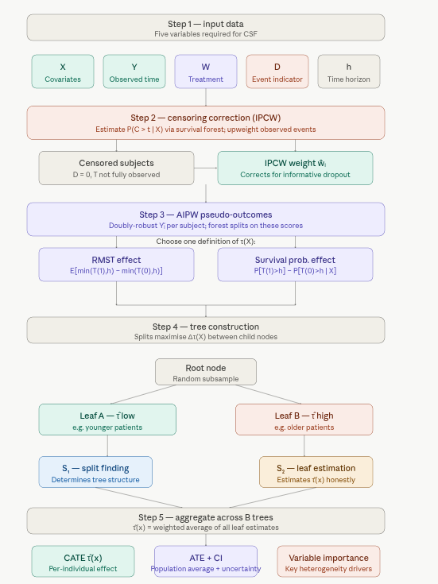

# 1.3 Causal Survival Forest (CSF) {.unnumbered}

This section demonstrates how to use the **Causal Survival Forest (CSF)** from the `{RCausalML}` package in R to estimate heterogeneous treatment effects on survival data, particularly when outcomes are right-censored. The example uses the **ACTG175** dataset from the `{BART}` package, a randomized trial comparing antiretroviral regimens in HIV-infected adults (Cui et al., 2023; [JRSS Series B](https://academic.oup.com/jrsssb/article/85/2/179/7058918)).


## Overview

A **Causal Survival Forest** extends causal forests to handle time-to-event data — situations where the outcome is not just *what happened*, but *when* it happened, and where many subjects are right-censored (their event time was never observed). Like its parent method, a CSF estimates the **Conditional Average Treatment Effect (CATE)**, $\tau(X)$, but it does so on a survival timescale rather than a simple continuous outcome.

CSFs are particularly valuable in medicine (does this drug extend survival, and for whom?), economics (when does job training lead to re-employment?), and any setting where dropout, loss to follow-up, or end-of-study cutoffs create incomplete outcome data.

### Key Concepts

**Defining the treatment effect** on survival data requires choosing a summary measure:

*Restricted Mean Survival Time (RMST):*

$$\tau(X) = E[\min(T(1), h) - \min(T(0), h) \mid X = x]$$ This compares average survival time up to a fixed horizon $h$ between treated and control groups.

*Survival probability difference:*

$$\tau(X) = P[T(1) > h \mid X = x] - P[T(0) > h \mid X = x]$$ This compares the probability of surviving past time $h$ under treatment versus control.

**Right-censoring** means we observe $Y = \min(T, C)$ and an event indicator $D = \mathbf{1}(T \leq C)$, where $C$ is the censoring time. CSFs correct for this using **Inverse Probability of Censoring Weighting (IPCW)**, which upweights observed events to account for those that were censored.

**AIPW scores** (Augmented Inverse Probability Weighting, from Cui et al., 2023) provide doubly-robust pseudo-outcomes for each subject, combining a direct outcome model with a propensity model. These pseudo-outcomes are what the forest actually splits on, enabling unbiased CATE estimation even with censoring.

**Honest estimation** — the same safeguard as in standard causal forests — partitions data so that the subsample used to find splits is strictly separate from the subsample used to estimate effects within leaves.

### How CSFs Work

**1. Inputs** — Covariates $X$, observed time $Y$, treatment $W$, event indicator $D$, and time horizon $h$.

**2. Censoring correction** — Estimate censoring probabilities $\hat{P}(C > t \mid X)$ via a survival forest, then compute IPCW-corrected or AIPW pseudo-outcomes $\tilde{Y}_i$ for each individual.

**3. Tree construction** — Grow $B$ trees on random data/feature subsets. Each split maximizes the heterogeneity of pseudo-outcomes between child nodes, isolating subgroups with meaningfully different treatment effects.

**4. Honest leaf estimation** — A held-out subsample ($S_2$) estimates $\tau(x)$ within each leaf, preventing overfitting to the split-finding subsample ($S_1$).

**5. Aggregation and output** — Average $\tau(x)$ estimates across all $B$ trees. Final outputs: per-individual CATE $\hat{\tau}(x)$, population ATE, confidence intervals, and covariate importance.

{width="576"}

The key addition relative to a standard causal forest is **steps 2 and 3** — the censoring correction and pseudo-outcome construction. These are what make CSF handle survival data correctly. Without IPCW, censored subjects would introduce bias; without AIPW pseudo-outcomes, the forest would have nothing meaningful to split on.

The **choice of** $\tau(X)$ definition (RMST vs. survival probability) should be made based on the scientific question: RMST gives a time-scale interpretation ("this drug adds X months of survival for patients like you"), while the survival probability difference is more directly interpretable clinically ("this increases your chance of surviving 5 years by X%").

The **honest estimation** in step 4 mirrors what standard causal forests do but applied to the pseudo-outcomes from step 3 — it ensures the same data isn't used to both carve the covariate space and measure effects within it.

### How does it differ from Causal Forest and Survival Forest?

| **Aspect** | **Survival Forest** | **Causal Forest** | **Causal Survival Forest** |
|-----------------|-------------------|------------------|------------------|
| `Objective` | Predict survival probability or hazard over time | Estimate heterogeneous treatment effects | Estimate treatment effects on survival outcomes |
| `Outcome Type` | Time-to-event (censored) | Continuous or binary | Time-to-event (censored) |
| `Treatment Variable` | None | Required (W: 0/1) | Required (W: 0/1) |
| `Inputs` | X, Y, D | X, Y, W | X, Y, D, W |
| `Output` | Survival curves or hazard functions | Treatment effect estimates $\tau(X)$ | Treatment effect on survival $\tau(X)$ |
| `Use Case` | Survival prediction (e.g., patient prognosis) | Treatment effect heterogeneity (e.g., drug impact) | Treatment effect on survival (e.g., therapy impact) |
| `Assumptions` | Handles censoring | Unconfoundedness, overlap | Unconfoundedness, overlap, censoring handled |
| `{grf} Function` | `survival_forest()` | `causal_forest()` | `causal_survival_forest()` |

### Practical Notes

-   `Survival Forest`: Used when the goal is purely predictive (e.g., forecasting patient survival based on covariates). It does not involve a treatment variable.

-   `Causal Forest`: Used for non-survival outcomes (e.g., blood pressure, test scores) to understand how treatment effects vary across individuals.

-   `Causal Survival Forest`: Used when both treatment effects and survival outcomes are of interest, combining the strengths of the other two models.


## Causal Survival Forest (CSF) in R

This tutorial uses the `{RCausalML}` integrated with `{grf}` package for robust implementation of Causal Survival Forests. The `grf` package allows users to estimate Conditional Average Treatment Effects (CATE) and visualize treatment effect heterogeneity effectively.

We'll cover:

-   Getting started Causal Survival Forest with simulated data
-   Use case with the `ACTG175` dataset from `{BART}` package

## Set Up

### Check and Install Required R Packages

Following R packages are required to run this notebook. If any of these packages are not installed, you can install them using the code below:

`tidyverse`, `plyr`, `RCausalML`, `causaldata`, `mlbench`, `survival`, `BART`, `grf`, `kernelshap`, `shapviz`

```{r}
#| label: lst-packages-vector
#| lst-cap: "Required R package names used throughout the notebook."
packages <- c(
  "tidyverse",
  "plyr",
  "RCausalML",
  "causaldata",
  "mlbench",
  "survival",
  "BART",
  "grf",
  "kernelshap",
  "shapviz"
)
```

### Install Missing Packages

```{r}
#| label: lst-install-missing-packages
#| lst-cap: "Optional commands to install missing CRAN/GitHub dependencies (commented by default)."
#| warning: false
#| error: false
# Install missing packages
# new_packages <- packages[!(packages %in% installed.packages()[, "Package"])]
# if (length(new_packages)) install.packages(new_packages)
```

### Verify Installation

```{r}
#| label: lst-verify-package-installation
#| lst-cap: "Check that each required package namespace is available."
# Verify installation
cat("Installed packages:\n")
print(sapply(packages, requireNamespace, quietly = TRUE))
```

### Load R Packages

```{r}
#| warning: false
#| error: false
# Load packages with suppressed messages
invisible(lapply(packages, function(pkg) {
  suppressPackageStartupMessages(library(pkg, character.only = TRUE))
}))
```

### Check Loaded Packages

```{r}
#| label: lst-check-loaded-packages
#| lst-cap: "Confirm which package environments are attached on the search path."
# Check loaded packages
cat("Successfully loaded packages:\n")
print(search()[grepl("package:", search())])
```

## Use case with the `ACTG175` dataset from `{BART}` package

This section demonstrates how to use a causal survival forest (from the `grf` package) to estimate Conditional Average Treatment Effects (CATE) on Restricted Mean Survival Time (RMST) using simulated data.\
Below, we simulate data, train the forest, and show predictions.

### Data and Data Preparation

```{r}
#| label: simulate-data
# Simulate n = 3000 observations with p = 8 features
n <- 3000
p <- 8
X <- matrix(runif(n * p, min = -1, max = 1), n, p)   # Covariates
W <- rbinom(n, 1, 0.4)                               # Binary treatment: 40% treatment group
horizon <- 2                                         # Time horizon for RMST

# Generate failure and censoring times
failure.time <- pmin(exp(X[, 2] + 0.5 * W + 0.25 * X[, 3]), horizon)
censor.time <- 1.5 * runif(n)
Y <- pmin(failure.time, censor.time)                 # Observed event/censoring time
D <- as.integer(failure.time <= censor.time)         # Event indicator
colnames(X) <- paste0("X", 1:p)                      # Named columns for SHAP/plots
```

### Fit CSF

```{r}
#| label: fit-csf
# Fit causal survival forest (event times discretized for efficiency)
cs.forest <- causal_survival_forest(X, round(Y, 2), W, D, horizon = horizon)
```

### Predicting & Evaluating on Simulated Data

#### Predict on New Test Data

```{r}
#| label: predict-test-data
# Predict on new test data
X.test <- matrix(0.5, 10, p)
X.test[, 1] <- seq(0, 1, length.out = 10)
colnames(X.test) <- colnames(X)
cs.pred <- predict(cs.forest, X.test)
```

#### Obtain Out-of-Bag Predictions

```{r}
#| label: oob-predictions
# Obtain out-of-bag predictions on training data
cs.oob <- predict(cs.forest)
```

#### Predict with Confidence Intervals

```{r}
#| label: predict-with-ci
# Predict with confidence intervals
cs.ci <- predict(cs.forest, X.test, estimate.variance = TRUE)
```

#### Estimate Average Treatment Effect (ATE)

```{r}
#| label: estimate-ate
# Estimate average treatment effect (ATE) with standard error
average_treatment_effect(cs.forest)
```

#### Best Linear Projection of CATE

```{r}
#| label: best-linear-projection
# Best linear projection of CATE along first covariate
grf::best_linear_projection(cs.forest, X[, 1])
```

#### Assess Treatment Effect Heterogeneity

```{r}
#| label: assess-heterogeneity-sim
# Assess heterogeneity using train/evaluation split
set.seed(1)
train <- sample(1:n, n / 2)
eval <- setdiff(1:n, train)
train.forest <- causal_survival_forest(X[train, ], Y[train], W[train], D[train], horizon = horizon)
eval.forest  <- causal_survival_forest(X[eval, ],  Y[eval],  W[eval],  D[eval],  horizon = horizon)
rate <- rank_average_treatment_effect(eval.forest, predict(train.forest, X[eval, ])$predictions)
plot(rate)
```

### Compute Kernel SHAP values for CATE

We explain the predicted treatment effects $\hat{\tau}(X)$ on a reasonably sized subset (e.g., 200–500 rows) of the training or test data — full data can be slow.

```{r}
#| label: compute-shap-csf
library(future)

# Parallel backend 
n_cores <- max(1L, parallel::detectCores() - 1L)
plan(multisession, workers = n_cores)

# Scale sample sizes to data available
set.seed(2026)
n_total <- nrow(X)

if (n_total > 5000L) {
  n_explain <- 300L
  n_bg      <- 100L   # smaller background = biggest speed lever

} else if (n_total > 1000L) {
  n_explain <- 200L
  n_bg      <- 75L

} else {
  n_explain <- min(100L, n_total)
  n_bg      <- min(50L,  n_total)
}

# Non-overlapping explain / background indices 
if (n_total >= n_explain + n_bg) {
  all_idx     <- sample(n_total)
  explain_idx <- all_idx[seq_len(n_explain)]
  bg_idx      <- all_idx[seq(n_explain + 1L, n_explain + n_bg)]

} else {
  # Small dataset — allow overlap rather than error
  explain_idx <- sample(n_total, n_explain, replace = FALSE)
  bg_idx      <- sample(n_total, n_bg,      replace = FALSE)
}

X_explain <- X[explain_idx, , drop = FALSE]
bg_X      <- X[bg_idx,      , drop = FALSE]

# Prediction wrapper 
pred_fun <- function(object, newdata) {
  predict(object, newdata = newdata)$predictions
}

#: Switch to permshap — same quality, much faster than kernelshap
shap_ksh <- permshap(
  object   = cs.forest,
  X        = X_explain,
  bg_X     = bg_X,
  pred_fun = pred_fun,
  verbose  = FALSE       # set TRUE to watch progress
)

# Reset workers ──────────────────────────────────────────────────
plan(sequential)

# ── Step 7: Wrap for plotting ─────────────────────────────────────────────
shp_csf <- shapviz(shap_ksh, X = X_explain)

```

#### SHAP Summary Plot (Beeswarm + Importance)

This shows which covariates drive heterogeneity in treatment effects the most, and in which direction.

```{r}
#| label: shap-importance-beeswarm
#| fig.width: 7
#| fig.height: 5.5

# Classic beeswarm (direction + magnitude)
sv_importance(shp_csf, kind = "beeswarm")

# Bar version with mean absolute SHAP
sv_importance(shp_csf, show_numbers = TRUE)
```

#### SHAP Dependence Plots (main effects)

Explore how individual covariates modify the estimated treatment effect.

```{r}
#| label: shap-dependence
#| fig.width: 8
#| fig.height: 6

# One plot per important variable (simulated data: X1–X8)
important_vars <- c("X1", "X2", "X3", "X4")

sv_dependence(shp_csf, v = important_vars, share_y = TRUE)
```

Or single detailed dependence + color interaction:

```{r}
#| label: shap-dependence-single
sv_dependence(shp_csf, v = "X2", color_var = "X1")
```

#### Waterfall / Force plot for a single observation

Understand why a specific patient profile has a high/low estimated treatment benefit.

```{r}
#| label: shap-waterfall-single
#| fig.width: 7
#| fig.height: 4.5

# Same rows as shapviz/permshap (X_explain); row_id must be in 1:nrow(X_explain)
preds_explain <- predict(cs.forest, X_explain)$predictions
row_id_max <- which.max(preds_explain)

sv_waterfall(shp_csf, row_id = row_id_max) +
  ggtitle("SHAP Waterfall - Patient with highest estimated RMST benefit")

# Alternative: force plot style
sv_force(shp_csf, row_id = row_id_max)
```

#### Optional: Explain a few test set observations

```{r}
#| label: shap-test-set-example
shap_test <- kernelshap(
  cs.forest,
  X         = X.test[1:10, ],            # X.test has 10 rows
  bg_X      = bg_X,
  pred_fun  = pred_fun
)

shp_test <- shapviz(shap_test, X = X.test[1:10, ])

sv_importance(shp_test, kind = "beeswarm")
```

### Interpretation Notes

-   **Positive SHAP** → the feature value pushes the predicted treatment effect (RMST gain) **up**.
-   **Negative SHAP** → pushes the predicted treatment effect **down**.
-   Unlike standard prediction models, here we explain **heterogeneity** (variation in $\hat{\tau}(X)$), not the outcome itself.
-   Beeswarm plots often reveal non-linear patterns and interactions implicitly captured by the forest.
-   Compare SHAP variable importance with `grf::variable_importance()` — they measure similar concepts but from different perspectives (additive decomposition vs. permutation/impurity).
-   For faster/more accurate SHAP on tree ensembles, packages like `{treeshap}` work well with `{ranger}`, but `{grf}` internals are not directly compatible → Kernel SHAP is reliable and model-agnostic.

## Summary and Conclusion

This notebook demonstrated the **Causal Survival Forest (CSF)** from `{grf}` using the **ACTG175** dataset from `{BART}`. We prepared baseline covariates and binary treatment (zidovudine only vs other therapies), defined a time horizon for RMST, and fit a CSF to estimate heterogeneous treatment effects on time to CD4 decline, AIDS, or death. The CSF provides non-parametric CATE estimates while accounting for right-censoring, variable importance, and heterogeneity (e.g., via AUTOC/TOC). For methodology and theory, see Cui et al. (2023).

## Resources

1.  **Cui, Y., Kosorok, M. R., Sverdrup, E., Wager, S., & Zhu, R. (2023).** Estimating heterogeneous treatment effects with right-censored data via causal survival forests. *Journal of the Royal Statistical Society: Series B (Statistical Methodology)*, **85**(2), 179–211.\
    <https://academic.oup.com/jrsssb/article/85/2/179/7058918>

2.  **Hammer, S. M., et al. (1996).** A trial comparing nucleoside monotherapy with combination therapy in HIV-infected adults with CD4 cell counts from 200 to 500 per cubic millimeter. *New England Journal of Medicine*, **335**, 1081–1090. (ACTG 175 trial.)

3.  [grf Causal Survival Forest documentation](https://grf-labs.github.io/grf/articles/causal_survival_forest.html)

4.  [grf R reference: causal_survival_forest](https://search.r-project.org/CRAN/refmans/grf/html/causal_survival_forest.html)

5.  [Original Causal Survival Forests preprint](https://arxiv.org/abs/2006.09639)
