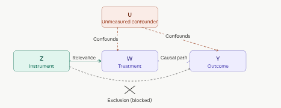
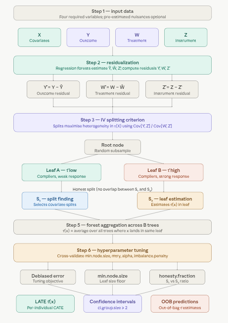

# 1.4 Instrumental Forest 

This section introduces the **Instrumental Forest**, a powerful method for estimating heterogeneous treatment effects in settings where treatment assignment is endogenous. We will cover the key concepts, how the method works, and provide a practical implementation using R. The example focuses on estimating the causal effect of education on wages using proximity to college as an instrument, a classic application in econometrics. By the end of this section, you will understand how to use Instrumental Forests to estimate treatment effects while addressing endogeneity concerns.

## Overview

An **Instrumental Forest** estimates heterogeneous treatment effects in settings where treatment assignment is *endogenous* — meaning it's correlated with unobserved factors that also affect the outcome, making naive comparisons biased. The solution is an **instrumental variable (IV)**: a variable $Z$ that shifts who receives treatment but has no direct path to the outcome except *through* the treatment.

The forest estimates the **Conditional Local Average Treatment Effect (LATE)**:

$$\tau(X) = \frac{\text{Cov}[Y,\, Z \mid X = x]}{\text{Cov}[W,\, Z \mid X = x]}$$

Intuitively, the numerator captures how much $Z$ moves the outcome; the denominator captures how much $Z$ moves the treatment. Their ratio isolates the causal effect of treatment on outcome — purged of confounding — for individuals with covariate profile $X = x$.

When $Z = W$ (the instrument equals the treatment itself, as in a clean randomized trial), the Instrumental Forest collapses to a standard Causal Forest.

::: callout-note
An **instrumental variable (IV)** is a tool used in statistics and econometrics to estimate causal relationships when a randomized controlled trial is not feasible, or when there is concern about endogeneity—i.e., when the treatment or exposure variable is correlated with unobserved factors that also affect the outcome. IV methods help isolate the causal effect of a treatment (or independent variable) on an outcome by leveraging an external variable, called the instrument, that influences the treatment but does not directly affect the outcome except through the treatment.

The **Conditional Local Average Treatment Effect (LATE)** is a causal effect measure used in instrumental variable (IV) analysis to estimate the effect of a treatment (or exposure) on an outcome for a specific subpopulation, known as the "compliers," conditional on a set of covariates $X$. It extends the Local Average Treatment Effect (LATE) by allowing the treatment effect to vary across different values of covariates, making it particularly useful in heterogeneous treatment effect estimation. :::
:::

### Key Concepts

**Endogeneity** occurs when treatment $W$ is correlated with unmeasured factors $U$ that also affect $Y$ — for example, sicker patients self-selecting into treatment. This invalidates simple comparisons.

**Instrumental variable** requirements: (1) *Relevance* — $Z$ must meaningfully predict $W$; (2) *Exclusion restriction* — $Z$ affects $Y$ only through $W$, not directly; (3) *Independence* — $Z$ is as good as randomly assigned conditional on $X$.

**Compliers** are the subpopulation whose treatment status actually changes because of $Z$. LATE is the treatment effect specifically for compliers — not for always-takers or never-takers.

**Residualization** removes confounding signal before splitting. The forest works with residuals $Y - \hat{Y}$, $W - \hat{W}$, and $Z - \hat{Z}$ (estimated via regression forests), so splits focus purely on treatment effect heterogeneity.

**Honesty** separates the data subsample used to find splits from the subsample used to estimate effects in each leaf, preventing overfitting.

### How It Works

The diagram below shows the structural logic of IV: $Z$ reaches $Y$ only through $W$ (the two solid arrows), while the dashed confounder paths from $U$ are bypassed entirely.



Now the full pipeline:



A few things worth highlighting from the pipeline:

**Step 2 (residualization) is the critical differentiator** from a plain causal forest. By subtracting estimated conditional means $\hat{Y}$, $\hat{W}$, $\hat{Z}$ before splitting, the forest's splitting criterion is de-correlated from confounders. This is the forest-based analogue of the first stage in two-stage least squares (2SLS).

**Step 3 uses a ratio-based splitting criterion** — rather than just maximizing variance in outcomes, each candidate split evaluates $\text{Cov}[\tilde{Y}, \tilde{Z}] / \text{Cov}[\tilde{W}, \tilde{Z}]$ in child nodes. A split is only made if it creates meaningfully different *causal* effects, not just different raw outcomes.

**Step 6 (tuning) matters more here than in standard forests.** IV estimation is noisier than direct outcome prediction — weak instruments amplify estimation variance, so settings like `min.node.size` and `imbalance.penalty` need careful calibration. The `imbalance.penalty` parameter specifically guards against splits that create leaves with very unequal instrument variation, which would degrade the IV estimate.

### Key Features and Considerations

-   `Endogeneity Correction`: [By using an instrument, the forest corrects for biases due to unmeasured confounders, unlike standard regression or causal forests](https://pubsonline.informs.org/doi/abs/10.1287/mnsc.2021.4084)

-   `Heterogeneous Effects`:[It captures how treatment effects vary across subgroups defined by covariates (X), making it suitable for personalized medicine, targeted marketing, etc](https://pubsonline.informs.org/doi/abs/10.1287/mnsc.2021.4084)

-   `Challenges`:

-   Requires a valid instrument ($Z$ must affect $W$ but not $Y$ directly, except through $W$).

-   Sensitive to tuning parameters, which can significantly impact performance.[ ](https://github.com/grf-labs/grf/issues/501)

-   Computationally intensive, especially for large datasets or when tuning is involved.

-   `Applications`: [Used in fields like economics, medicine, and policy evaluation to estimate causal effects in observational data studies, such as the effect of early surgery on patient outcomes or laparoscopic colectomy in hospitals](https://bmcmedresmethodol.biomedcentral.com/articles/10.1186/s12874-022-01663-0)[ ](https://pubsonline.informs.org/doi/abs/10.1287/mnsc.2021.4084)

###  Instrumental Forest and Causal Forests

Both Instrumental Forests and Causal Forests are machine learning methods within the `Generalized Random Forests (GRF)` framework, implemented in the `{grf}` package in R, designed for estimating causal effects\* in observational data or experimental settings. They aim to estimate `heterogeneous treatment effects` (i.e., how the effect of a treatment varies across subgroups defined by covariates). However, they differ in their assumptions, use cases, and how they handle endogeneity. Below is a detailed comparison of Instrumental Forests`and Causal Forests`, including their differences, similarities, and when to use each.

| **Aspect** | **Causal Forest** | **Instrumental Forest** |
|------------------|---------------------------|---------------------------|
| `Purpose` | Estimates CATE for a treatment assuming unconfoundedness. | Estimates LATE using an instrumental variable to address endogeneity. |
| `Key Assumption` | Unconfoundedness: Treatment assignment $W$ is independent of potential outcomes $Y(0), Y(1)$ given covariates $X$. | Valid instrument: $Z$ affects $W$, not $Y$ directly (exclusion restriction), and is uncorrelated with confounders (independence). |
| `Treatment (W)` | Binary or continuous, assumed exogenous (random or conditionally random given $X$). | Binary or continuous, potentially endogenous (affected by unobserved confounders). |
| `Instrument (Z)` | Not required (assumes $W = Z$). | Required: A variable that influences $W$ but not $Y$ except through $W$. |
| `Endogeneity` | Cannot handle unobserved confounding. | Explicitly addresses unobserved confounding via the instrument. |
| `Estimation Formula` | $\tau(X) = E[Y(1) - Y(0) | X = x]$ | $\tau(X) = \frac{\text{Cov}[Y - \hat{Y}, Z - \hat{Z} | X = x]}{\text{Cov}[W - \hat{W}, Z - \hat{Z} | X = x]}$ |
| `Use Case` | Randomized experiments or observational studies with strong unconfoundedness. | Observational studies with endogeneity or imperfect compliance in experiments. |
| `Output` | CATE for the entire treated population. | LATE for the subpopulation of compliers (those whose ( W ) is influenced by ( Z )). |

## Instrumental Forest in R

This tutorial demonstrates how to implement an Instrumental Forest using the `{grf}` package wrapped with {RCausalML} package in R, focusing on estimating treatment effects in a hypothetical scenario using the lung dataset. We will use `card` dataset for focusing on estimating the **causal effect of education on wages** using proximity to college as an instrument—a classic IV application (Card, 1995).

## Set Up

### Check and Install Required R Packages

Following R packages are required to run this notebook. If any of these packages are not installed, you can install them using the code below:

`tidyverse`, `plyr`, `RCausalML`, `haven`, `car`

```{r}
#| label: lst-packages-vector
#| lst-cap: "Required R package names used throughout the notebook."
packages <- c(
  "tidyverse",
  "plyr",
  "RCausalML",
  "haven",
  "car"
)
```

### Install Missing Packages

```{r}
#| label: lst-install-missing-packages
#| lst-cap: "Optional commands to install missing CRAN/GitHub dependencies (commented by default)."
#| warning: false
#| error: false
# Install missing packages
# new_packages <- packages[!(packages %in% installed.packages()[, "Package"])]
# if (length(new_packages)) install.packages(new_packages)
```

### Verify Installation

```{r}
#| label: lst-verify-package-installation
#| lst-cap: "Check that each required package namespace is available."
# Verify installation
cat("Installed packages:\n")
print(sapply(packages, requireNamespace, quietly = TRUE))
```

### Load R Packages

```{r}
#| warning: false
#| error: false
# Load packages with suppressed messages
invisible(lapply(packages, function(pkg) {
  suppressPackageStartupMessages(library(pkg, character.only = TRUE))
}))
```

### Check Loaded Packages

```{r}
#| label: lst-check-loaded-packages
#| lst-cap: "Confirm which package environments are attached on the search path."
# Check loaded packages
cat("Successfully loaded packages:\n")
print(search()[grepl("package:", search())])
```

### Data: Returns to Education (Card Dataset)

We'll estimate the causal effect of **education on wages** using proximity to college as an instrument—a classic IV application (Card, 1995).

Key variables:

- `lwage`   = log(wage) — outcome (Y)
- `educ`    = years of education — endogenous treatment (W)
- `nearc4`  = binary: grew up near 4-year college (instrument Z)
- `exper`   = potential work experience
- `expersq` = experience squared
- `black`   = binary: Black
- `smsa`    = binary: lives in SMSA (standard metropolitan statistical area)
- `south`   = binary: lives in South

### Load and Prepare Data

```{r}
#| label: ivf-load-card-data
# Direct download from known reliable source (Stata .dta format)
card_url <- "https://storage.googleapis.com/causal-inference-mixtape.appspot.com/card.dta"
card <- read_dta(card_url)

# Create experience squared (often used in Mincerian wage equations)

card <- card %>%
  mutate(expersq = exper^2) %>%
  select(lwage, educ, nearc4, exper, expersq, black, smsa, south) %>%
  na.omit()

# Convert to matrix for grf (X must be numeric matrix)

X <- card %>%
  select(exper, expersq, black, smsa, south) %>%
  as.matrix()

Y <- as.numeric(card$lwage)   # Outcome: log wage
W <- as.numeric(card$educ)    # Treatment: years of education
Z <- as.numeric(card$nearc4)  # Instrument: near 4-year college
```

### Descriptive Statistics & First-Stage Check

```{r}
#| label: ivf-first-stage-regression
#| fig.width: 7
#| fig.height: 5
# First-stage regression: Does instrument affect education?
first_stage <- lm(educ ~ nearc4 + exper + expersq + black + smsa + south,
                  data = card)
summary(first_stage)$coefficients["nearc4", 1:4]

# F-statistic for instrument strength (should be >10 for strong IV)
linearHypothesis(first_stage, "nearc4 = 0")
```

```{r}
#| label: ivf-first-stage-boxplot
#| fig.width: 7
#| fig.height: 5
# Visualize first stage
ggplot(card, aes(x = factor(nearc4), y = educ)) +
  geom_boxplot(fill = c("#E69F00", "#56B4E9")) +
  labs(title = "First Stage: College Proximity Increases Years of Education",
       x = "Grew up near 4-year college (nearc4)", y = "Years of Education (educ)") +
  theme_minimal()
```

### Training an Instrumental Forest

We use `instrumental_forest()` from the `{grf}` package to estimate heterogeneous returns to education (conditional LATE τ(X)).

```{r}
#| label: ivf-train-instrumental-forest
# Train the instrumental forest
iv_forest <- instrumental_forest(
  X = X,
  Y = Y,
  W = W,
  Z = Z,
  num.trees = 1000,          # Reduced for speed; use 2000+ in production
  honesty = TRUE,
  tune.parameters = "all"    # Auto-tune important hyperparameters
)

iv_forest
```

### Predicting Treatment Effects

```{r}
#| label: ivf-predict-oob
# Out-of-bag predictions (for training data)
iv_pred <- predict(iv_forest)
tau_hat <- iv_pred$predictions  # Estimated conditional LATE τ(X)

# Average treatment effect (doubly robust / average over forest)
ate <- average_treatment_effect(iv_forest)
cat("Average Treatment Effect (LATE):", round(ate$estimate, 3),
    "+/-", round(1.96 * ate$std.err, 3), "\n")
```

### Visualizing Results

```{r}
#| label: ivf-plot-tau-vs-exper
#| fig.width: 6
#| fig.height: 5
# Plot heterogeneous effects vs experience (example)
plot(card$exper, tau_hat, pch = 16, col = rgb(0,0,0,0.3),
     xlab = "Potential Experience (exper)", ylab = "Estimated Return to Education (τ(X))",
     main = "Heterogeneous Returns to Schooling by Experience")
abline(h = ate$estimate, col = "red", lwd = 2, lty = 2)
legend("topright", legend = "Average LATE", col = "red", lwd = 2, lty = 2)
```

### Predicting Treatment Effects for New Data

```{r}
#| label: ivf-predict-newdata
# Example: Predict for a hypothetical individual
new_data <- data.frame(
  exper = 10,
  expersq = 10^2,
  black = 0,
  smsa = 1,
  south = 0
)

new_pred <- predict(iv_forest, newdata = as.matrix(new_data))
cat("Predicted return to education (LATE) for this profile:", round(new_pred$predictions, 3), "\n")
```

### Evaluate Model Performance

```{r}
#| label: ivf-debiased-error
# Debiased error from tuning (lower = better)
tuning_info <- iv_forest$debiased.error
cat("Average debiased error (tuning):", round(mean(tuning_info, na.rm = TRUE), 4), "\n")
```

::: callout-note
- In practice, verify instrument validity (relevance + exclusion) carefully.
- Education is treated as continuous here (common in Card-style applications).
- Increase `num.trees` and tune more aggressively for production use.
- Check first-stage F-stat >10 (rule of thumb for strong instrument).
:::

### Compute Kernel SHAP values for CATE using shapviz

```{r}
#| label: compute-kernel-shap-iv
#| fig.width: 7
#| fig.height: 5
#| eval: true

library(kernelshap)
library(shapviz)
library(future)

#  Parallel backend 
n_cores <- max(1L, parallel::detectCores() - 1L)
plan(multisession, workers = n_cores)

#  Scale sizes to data
set.seed(42)
n_total <- nrow(X)

if (n_total > 5000L) {
  n_explain <- 400L
  n_bg      <- 80L

} else if (n_total > 1000L) {
  n_explain <- 250L
  n_bg      <- 60L

} else {
  n_explain <- min(150L, n_total)
  n_bg      <- min(50L,  n_total)
}

# Non-overlapping explain / background sets 
if (n_total >= n_explain + n_bg) {
  all_idx     <- sample(n_total)
  explain_idx <- all_idx[seq_len(n_explain)]
  bg_idx      <- all_idx[seq(n_explain + 1L, n_explain + n_bg)]

} else {
  # Small dataset — overlap allowed
  explain_idx <- sample(n_total, n_explain, replace = FALSE)
  bg_idx      <- sample(n_total, n_bg,      replace = FALSE)
}

X_explain <- X[explain_idx, , drop = FALSE]
bg_small  <- X[bg_idx,      , drop = FALSE]

# Prediction wrapper 
pred_tau <- function(object, newdata) {
  predict(object, newdata = newdata)$predictions
}

#  permshap instead of kernelshap (5–20x faster, same output) 
shap_iv <- permshap(
  object   = iv_forest,
  X        = X_explain,
  bg_X     = bg_small,
  pred_fun = pred_tau,
  verbose  = FALSE     # flip to TRUE to monitor progress
)

# Reset workers 
plan(sequential)
```

### Visualise SHAP values for the Instrumental Forest

```{r}
#| label: plot-shap-iv
# Wrap for plotting
shp_iv <- shapviz(shap_iv)

# Visualise 
sv_importance(shp_iv, kind = "both") +
  ggtitle("SHAP Importance: Drivers of Heterogeneous Returns to Education")

sv_dependence(shp_iv, v = "exper") +
  ggtitle("SHAP Dependence: Experience")

sv_dependence(shp_iv, v = "smsa") +
  ggtitle("SHAP Dependence: Metropolitan Area")

```


## Summary and Conclusion

Instrumental Forest is a powerful tool for estimating treatment effects in the presence of endogeneity, leveraging the strengths of random forests and instrumental variable analysis. It allows researchers to estimate heterogeneous treatment effects while addressing confounding issues, making it suitable for various applications in causal inference. This tutorial provided a step-by-step guide to implementing an Instrumental Forest using the `{grf}` package in R, demonstrating how to estimate heterogeneous returns to schooling using the classic Card (1995) dataset and college proximity as an instrument. At the end of the tutorial, we summarized the results, including the average treatment effect and SHAP explanations of heterogeneity. The code can be adapted to other real-world datasets with appropriate instruments and covariates.

## Resources

1.  [Athey, Susan, Julie Tibshirani, and Stefan Wager. "Generalized Random Forests." Annals of Statistics, 47(2), 2019](https://grf-labs.github.io/grf/reference/instrumental_forest.html)
2.  [Chernozhukov, Victor, and Christian Hansen. "The reduced form: A simple approach to inference with weak instruments." Economics Letters, 100(1), 2008.](https://github.com/grf-labs/grf/issues/501)
3.  [Wang, Guihua, et al. "An Instrumental Variable Forest Approach for Detecting Heterogeneous Treatment Effects in Observational Studies." Management Science, 2021](https://pubsonline.informs.org/doi/abs/10.1287/mnsc.2021.4084)
4.  Card, David (1995). "Using Geographic Variation in College Proximity to Estimate the Return to Schooling." In Aspects of Labour Market Behaviour: Essays in Honour of John Vanderkamp.


