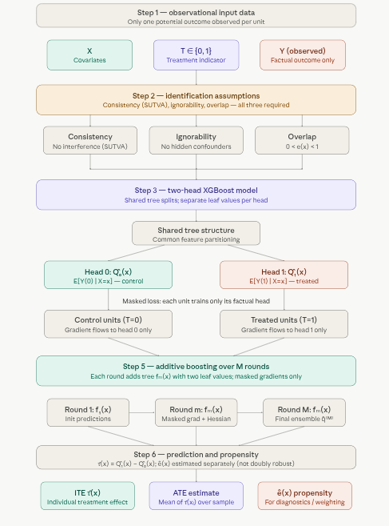

# 1.6 The Boosted Model of Causal Inference (causalXGBoost)

## Overview

**C-XGBoost** is a tree-boosting method for estimating individual and average treatment effects from observational data. It belongs to the *outcome regression* family of causal inference methods — the same conceptual family as TARNet and DragonNet — but replaces neural networks with XGBoost. The result is a model that brings DragonNet-style causal masking to boosted trees, combining the counterfactual reasoning of neural causal models with XGBoost's well-known strengths on tabular data: robustness to irregular boundaries, excellent calibration on medium-sized datasets, and minimal tuning overhead.

The core idea is simple: train **one** XGBoost model with **two output heads** that simultaneously predict potential outcomes under control ($\hat{Q}_0(x)$) and treatment ($\hat{Q}_1(x)$). The individual treatment effect falls out as their difference.

### Causal Setup

C-XGBoost operates within the **potential outcomes framework**. For each unit $i$, two potential outcomes exist — $Y_i(0)$ under control and $Y_i(1)$ under treatment — but only one is observed:

$$Y_i = T_i\, Y_i(1) + (1 - T_i)\, Y_i(0)$$

The quantities of interest are:

$$\tau_i = Y_i(1) - Y_i(0) \quad \text{(ITE — individual treatment effect)}$$ $$\tau(x) = E[Y(1) - Y(0) \mid X = x] \quad \text{(CATE — conditional average treatment effect)}$$ $$\text{ATE} = E[Y(1) - Y(0)] \quad \text{(population average)}$$

These are identifiable from observational data $(X, T, Y)$ under three standard assumptions: **consistency** (SUTVA — no interference between units), **ignorability** (no unmeasured confounders: $(Y(0), Y(1)) \perp T \mid X$), and **overlap** ($0 < e(x) < 1$, where $e(x) = P(T=1 \mid X=x)$). If any of these fail — especially ignorability — the estimates break down.

### The Two-Head Architecture

C-XGBoost learns two conditional expectation functions inside a single model:

$$\hat{Q}_0(x) \approx E[Y(0) \mid X = x], \qquad \hat{Q}_1(x) \approx E[Y(1) \mid X = x]$$

The ITE estimate is then:

$$\hat{\tau}(x) = \hat{Q}_1(x) - \hat{Q}_0(x)$$

The heads **share tree structure** but have **separate leaf values**. This is the key design choice: shared splits mean the model learns a common feature-space partitioning that generalizes across both heads, so counterfactuals are borrowed from structurally similar units rather than extrapolated blindly.

### The Masked Loss

Each training unit contributes gradient signal to *only* the head that matches its observed treatment assignment:

$$\mathcal{L}_i(\theta) = (1 - t_i)\bigl(\hat{Q}_0(x_i) - y_i\bigr)^2 + t_i\bigl(\hat{Q}_1(x_i) - y_i\bigr)^2$$

In vector form, this is implemented as a masked squared error:

$$\mathcal{L} = \frac{1}{n} \sum_i \| m_i \odot (\hat{q}(x_i) - \tilde{y}_i) \|_2^2, \qquad m_i = \begin{bmatrix} 1 - t_i \\ t_i \end{bmatrix}$$

The intuition: control units ($t_i = 0$) teach the $\hat{Q}_0$ head what $Y(0)$ looks like as a function of $X$; treated units ($t_i = 1$) teach the $\hat{Q}_1$ head what $Y(1)$ looks like. Because the splits are shared, information flows across both heads — a treated unit in region $\mathcal{R}$ of covariate space indirectly informs the $\hat{Q}_0$ prediction for control units in the same region, and vice versa.

### How Boosting Works

XGBoost builds the two-output predictor additively over $M$ rounds:

$$\hat{q}^{(M)}(x) = \sum_{m=1}^M f_m(x)$$

where each $f_m$ is a tree that outputs **two numbers per leaf** — one for each head. At each round $m$:

1.  Compute current predictions $\hat{q}^{(m-1)}(x_i)$ for all units.
2.  Compute **masked gradients and Hessians** — only the factual head gets non-zero curvature:

$$g_{i0} = 2(1-t_i)(\hat{q}_{i0} - y_i), \quad g_{i1} = 2t_i(\hat{q}_{i1} - y_i)$$ $$h_{i0} = 2(1-t_i), \quad h_{i1} = 2t_i$$

3.  Fit a new tree $f_m$ that minimizes the standard XGBoost second-order objective jointly across both heads.
4.  Update predictions: $\hat{q}^{(m)} = \hat{q}^{(m-1)} + \eta\, f_m(x)$, where $\eta$ is the learning rate.

The shared structure + separate leaf values lets the model capture rich interactions while still learning distinct counterfactual surfaces.

### Propensity Score

C-XGBoost separately fits a propensity model $\hat{e}(x) = \widehat{P}(T=1 \mid X=x)$ — typically a random forest. Importantly, this propensity score is **not** integrated into the XGBoost training loss (unlike DragonNet), which means the model is **not doubly robust**: if the outcome model is misspecified, the propensity estimate provides no correction. The propensity is returned purely for downstream use — overlap diagnostics, inverse probability weighting, or subgroup analysis.

### Prediction and Evaluation

For a new unit $x$, a single forward pass returns $\hat{Q}_0(x)$, $\hat{Q}_1(x)$, $\hat{e}(x)$, and $\hat{\tau}(x) = \hat{Q}_1(x) - \hat{Q}_0(x)$. Two standard evaluation metrics apply:

**ATE error** — absolute difference between the true and estimated population average effect.

**PEHE** (Precision in Estimation of Heterogeneous Effects) — mean squared error over individual effects:

$$\varepsilon_\text{PEHE} = \frac{1}{n} \sum_i \bigl((Y_i(1) - Y_i(0)) - \hat{\tau}(x_i)\bigr)^2$$

PEHE requires knowledge of both potential outcomes, so it can only be computed on semi-synthetic benchmarks (e.g., IHDP, Jobs). In real data, only indirect evaluation (e.g., policy learning, subgroup validation) is possible.

### Limitations

-   **Not doubly robust.** Propensity is estimated but not used in training, so the model has no safety net against outcome model misspecification.
-   **Binary outcome clipping.** The regression loss does not constrain outputs to $[0, 1]$; post-hoc clipping or calibration may be needed.
-   **Classical assumptions required.** Hidden confounding, SUTVA violations, or lack of overlap each break identification.
-   **Two heads only.** The current architecture supports binary treatment. Multi-arm extensions would require additional heads and a revised masking scheme.



A few things worth emphasizing from the pipeline:

**Step 3 is the architectural heart.** The shared tree structure means splits are chosen to explain variation in *both* $Y(0)$ and $Y(1)$ simultaneously. A region of covariate space where treated and control units are interleaved will push the trees to carve boundaries that serve both heads — effectively using treated units to regularize the counterfactual surface of control units, and vice versa.

**Step 4 (masked loss) is what makes this causal rather than predictive.** A standard multi-output XGBoost regression would naively assign $Y_i$ to both heads, which would corrupt the counterfactual estimates. The mask $m_i = (1-t_i,\, t_i)$ ensures only the factual head receives gradient signal, keeping each head honest about what it actually observed.

**Step 6's propensity caveat matters practically.** Because $\hat{e}(x)$ is not wired into the training objective, severe overlap violations — regions where nearly all units are treated or nearly all are control — will degrade the counterfactual head for the sparse group, and no propensity reweighting inside the loss will correct for it. Checking the propensity score distribution before trusting CATE estimates in low-overlap regions is essential.

### Why It Works Well on Tabular Causal Data

-   XGBoost excels at nonlinearities, interactions, and irregular boundaries (classic strengths on tabular data).
-   The masking + shared splits give the same representational power as neural causal models but with far better calibration and robustness on medium-sized tabular datasets.
-   Conceptually: “DragonNet-style causal masking, but with boosted trees instead of neural nets.”


## Implementation in R

The RCausalML package provides an implementation of C-XGBoost in R via the R6 class `CXGBoost`. You create a model with `CXGBoost$new()`, optionally passing a list of XGBoost `parameters` (e.g. `eta`, `max_depth`) and an optional pre-fitted `propensity_model` (ranger). You then fit with `$fit(X, t, y, nrounds, verbose, eval_data)` and predict with `$predict(X)`, which returns a list with `y0_hat`, `y1_hat`, `tau_hat` (ITE), and `propensity_score`. The package also provides:

-   **`$summary()`** — formatted print of model config, fit time, propensity OOB error, and top variable importance.
-   **`$evaluate(y_true, X)`** — computes PEHE and ATE error against ground-truth (matrix `[Y(0), Y(1)]` or vector of true ITEs) and returns a list with `PEHE`, `ATE_error`, `tau_hat`, `y0_hat`, `y1_hat`.
-   **`$plot_importance(top_n, metric)`** — ggplot2 variable importance chart (Gain, Cover, or Frequency).
-   **`$save_model(path)`** and **`load_cxgboost(path)`** — save/load fitted models.
-   **`$clone_reset()`** — return an unfitted copy with the same hyperparameters (e.g. for cross-validation).

The package exports **`PEHE()`** and **`ATE()`** with two calling conventions: matrix form `(y, y_hat)` with columns `[Y(0), Y(1)]`, or vector form `(tau_true, tau_hat)` for ITEs.

## Set Up

### Check and Install Required R Packages

Following R packages are required to run this notebook. If any of these packages are not installed, you can install them using the code below:

`tidyverse`, `plyr`, `RCausalML`, `causaldata`, `mlbench`, `xgboost`

```{r}
#| label: lst-packages-vector
#| lst-cap: "Required R package names used throughout the notebook."
packages <- c(
  "tidyverse",
  "plyr",
  "RCausalML",
  "causaldata",
  "mlbench",
  "xgboost"
)
```

### Install Missing Packages

```{r}
#| label: lst-install-missing-packages
#| lst-cap: "Optional commands to install missing CRAN/GitHub dependencies (commented by default)."
#| warning: false
#| error: false
# Install missing packages
# new_packages <- packages[!(packages %in% installed.packages()[, "Package"])]
# if (length(new_packages)) install.packages(new_packages)
```

### Verify Installation

```{r}
#| label: lst-verify-package-installation
#| lst-cap: "Check that each required package namespace is available."
# Verify installation
cat("Installed packages:\n")
print(sapply(packages, requireNamespace, quietly = TRUE))
```

### Load R Packages

```{r}
#| warning: false
#| error: false
# Load packages with suppressed messages
invisible(lapply(packages, function(pkg) {
  suppressPackageStartupMessages(library(pkg, character.only = TRUE))
}))
```

### Check Loaded Packages

```{r}
#| label: lst-check-loaded-packages
#| lst-cap: "Confirm which package environments are attached on the search path."
# Check loaded packages
cat("Successfully loaded packages:\n")
print(search()[grepl("package:", search())])
```

## Getting Started with Causal XGBoost in R

### Data Generation and Train/Test Split

```{r}
#| label: synthetic-data-train-test
# Synthetic data: generate potential outcomes and observed (X, T, Y)
set.seed(42)
n_syn <- 500
p_syn <- 5
X_syn <- matrix(rnorm(n_syn * p_syn), n_syn, p_syn)
tau_syn <- 0.5 * X_syn[, 1] + 0.3 * X_syn[, 2]   # CATE
Y0_syn <- 1 + rowSums(X_syn[, 1:2]) + rnorm(n_syn, 0, 0.5)
Y1_syn <- Y0_syn + tau_syn
e_syn <- plogis(0.5 * X_syn[, 1])
T_syn <- as.integer(runif(n_syn) < e_syn)
Y_syn <- ifelse(T_syn == 1, Y1_syn, Y0_syn)
potential_Y_syn <- cbind(Y0_syn, Y1_syn)

# Train / test split
idx_train <- sample(1:n_syn, 0.8 * n_syn)
trainX <- X_syn[idx_train, ]; trainT <- T_syn[idx_train]; trainY <- Y_syn[idx_train]
testX <- X_syn[-idx_train, ]; test_potential_Y <- potential_Y_syn[-idx_train, ]
```

### Fit Causal XGBoost on Synthetic Data

`CXGBoost()` fits a two-head XGBoost regressor with the masked loss. The `parameters` list can include any XGBoost hyperparameters (e.g. `eta`, `max_depth`, `lambda`, `alpha`, `tree_method`). The number of boosting rounds is passed separately to `fit()` via `nrounds`.

Here below we show the constructor parameters and default XGBoost parameters used in `fit()` if not overridden. The defaults are designed for general tabular data but can be tuned for specific datasets.

**Constructor parameters** (for `CXGBoost$new(...)`)

| Parameter | Type | Default | Description |
|------------------|----------------|----------------|----------------------|
| **`parameters`** | `list` | `list()` | XGBoost hyperparameters to override defaults. Can include: `eta`, `max_depth`, `subsample`, `colsample_bytree`, `min_child_weight`, `lambda`, `alpha`, `tree_method`, `num_target`, `multi_strategy`. |
| **`propensity_model`** | `ranger` or `NULL` | `NULL` | Pre-fitted `ranger` model for propensity scores. If `NULL`, a ranger model (200 trees, max.depth 4) is fitted inside `fit()` from `X` and `t`; OOB error is stored in `$oob_error`. |
| **`scale_pos_weight`** | (optional) | `NULL` | Reserved for future use. |

**Default XGBoost parameters** (used in `fit()` if not overridden)

Defined in `fit()` and merged with `self$parameters`:

-   **`eta`** = 0.05\
-   **`max_depth`** = 6\
-   **`subsample`** = 0.8\
-   **`colsample_bytree`** = 0.8\
-   **`min_child_weight`** = 1\
-   **`lambda`** = 1\
-   **`alpha`** = 0\
-   **`tree_method`** = `"hist"`\
-   **`num_target`** = 2L\
-   **`multi_strategy`** = `"multi_output_tree"`\
-   **`disable_default_eval_metric`** = TRUE

**`fit()` parameters** (training)

-   **`X`** – Covariate matrix (numeric). NAs are median-imputed before training.\
-   **`t`** – Binary treatment (0/1), length = `nrow(X)`.\
-   **`y`** – Observed outcome, same length as `t`.\
-   **`nrounds`** – XGBoost boosting rounds (default **100**).\
-   **`verbose`** – Integer verbosity: 0 = silent, 1 = progress (default **0**).\
-   **`eval_data`** – Optional list `list(X=..., t=..., y=...)` for XGBoost watchlist; evaluation loss is printed when `verbose >= 1` (no early stopping applied).

``` r
model <- CXGBoost$new(parameters = list(eta = 0.1, max_depth = 8))
model$fit(X, t, y, nrounds = 200, verbose = 0)
# Optional: eval_data = list(X = X_val, t = t_val, y = y_val) for watchlist
```

Below we fit with a simple configuration; feel free to experiment with different hyperparameters and see how it affects the results.

```{r}
#| label: fit-cxgboost-synthetic
#| warning: false
# Fit with same model configuration
model_syn <- CXGBoost$new(parameters = list(
                  max_depth = 5, 
                  eta = 1e-2, 
                  lambda = 5, 
                  alpha = 1.0, 
                  tree_method = "hist", 
                  nthread = -1
))
model_syn$fit(trainX, trainT, trainY, nrounds = 100L, verbose = 0L)
```

### Predict and evaluate (synthetic data)

`predict()` returns `y0_hat`, `y1_hat`, `tau_hat`, and `propensity_score`. For evaluation when ground truth is available, use `$evaluate(y_true, X)` or the exported `PEHE()` and `ATE()` (matrix or vector form).

```{r}
#| label: predict-synthetic
# Predict (includes tau_hat = y1_hat - y0_hat)
pred_syn <- model_syn$predict(testX)
predicted_potential_outcomes_syn <- cbind(pred_syn$y0_hat, pred_syn$y1_hat)
```

### Model summary and evaluation

```{r}
#| label: summary-synthetic
# Print model summary (config, fit time, propensity OOB, top variables)
model_syn$summary()
```

```{r}
#| label: evaluate-synthetic
# Evaluate against ground truth: $evaluate() accepts matrix [Y(0), Y(1)] or ITE vector
eval_syn <- model_syn$evaluate(y_true = test_potential_Y, X = testX)
true_ate <- mean(test_potential_Y[, 2] - test_potential_Y[, 1])
cat(sprintf("True ATE     : %.3f\n", true_ate))
# Alternative: PEHE(y, y_hat) and ATE(y, y_hat), or vector form PEHE(tau_true=..., tau_hat=pred_syn$tau_hat)
```

## Use Case: Causal XGBoost on the Abortion Dataset

### Data

R package `{causaldata}` provides a collection of datasets for causal inference. We integrate {causaldata} with {RCausalML} to easily load datasets. In this tutorial, we use the **abortion** dataset, which contains state-year observations on gonorrhea rates among 15–19 year olds, with a binary indicator for early repeal of abortion prohibition. This dataset is commonly used to study the effects of abortion legalization on risky sexual behavior among teenagers, proxied by gonorrhea rates.

This dataset is commonly used to study the **causal effects of abortion legalization policies** (specifically, early repeal of abortion prohibitions in certain U.S. states) on **risky sexual behavior** among teenagers. Risky behavior is proxied by the **incidence of gonorrhea** (a sexually transmitted infection) among 15–19 year olds. The idea is that access to abortion might influence sexual decision-making or risk-taking behavior in this age group.

Here are the most important columns (based on the package documentation):

-   **fip** — State FIPS code (numeric identifier for each U.S. state)
-   **age** — Age in years (focused on 15–19 year olds)
-   **race** — Race: 1 = white, 2 = black (or similar coding)
-   **year** — Calendar year
-   **t** — A rescaled time variable (often centered around policy change for DiD)
-   **sex** — Sex: 1 = male, 2 = female
-   **totpop** — Total population (state-level)
-   **ir** — Incarcerated males per 100,000 (proxy for criminal justice environment)
-   **crack** — Crack cocaine index (proxy for drug epidemic intensity)
-   **alcohol** — Alcohol consumption per capita
-   **income** — Real income per capita
-   **ur** — State unemployment rate
-   **poverty** — Poverty rate
-   **repeal** — Treatment indicator: 1 = state had an **early repeal** of abortion prohibition (treatment group), 0 = otherwise (control group). This is the main policy/treatment variable.
-   **pi** — Parental involvement law in effect (another policy control)
-   **bf15** — Indicator: Is a black female in the 15–19 age group (useful for subgroup analysis)

```{r}
#| label: list-causaldata-datasets
# causaldata integration
list_causaldata_datasets()
```

### Load Data

The **outcome variable** is typically **lnr** (logged gonorrhea rate per 100,000 population among 15–19 year olds), which measures the logged incidence of gonorrhea as a proxy for risky sexual behavior.

```{r}
#| label: load-abortion-data
# Load abortion dataset (use $data for the raw dataframe; load_causaldata returns list with X, w, y, data, citation)
abortion <- load_causaldata("abortion")$data
# Quick look
head(abortion)
str(abortion)
summary(abortion$repeal)      # Treatment balance
table(abortion$repeal, abortion$race)  # Example crosstab
```

### Data Processing

```{r}
#| label: abortion-data-processing
# Select relevant subset (focus on 15-19 year olds, complete cases)
abortion_clean <- abortion %>%
  dplyr::filter(age >= 15 & age <= 19) %>%
  na.omit()

# Define covariates (X), outcome (Y), treatment (W)
X <- abortion_clean[, c("age", "race", "sex", "totpop", "ir", "crack", 
                        "alcohol", "income", "ur", "poverty")]

Y <- abortion_clean$lnr          # Logged gonorrhea rate per 100,000 (continuous)
W <- abortion_clean$repeal       # 1 = early repeal (treatment), 0 = otherwise

# Convert X to numeric matrix
X <- as.matrix(X)
colnames(X) <- c("age", "race", "sex", "totpop", "ir", "crack", 
                 "alcohol", "income", "ur", "poverty")

# Remove near-zero variance columns (if any)
X <- X[, apply(X, 2, stats::var) > 1e-10, drop = FALSE]
cat("Covariates used:", colnames(X), "\n")
```

### Split Data into Training and Test Sets

We’ll split the data into 80% training and 20% test sets using random sampling.

```{r}
#| label: abortion-train-test-split
# Split data into training (80%) and test (20%) sets
train_prop <- 0.8
n <- nrow(abortion_clean)
train_idx <- sample(1:n, size = round(train_prop * n))
X_train <- X[train_idx, , drop = FALSE]
Y_train <- Y[train_idx]
W_train <- W[train_idx]
X_test <- X[-train_idx, , drop = FALSE]
Y_test <- Y[-train_idx]
W_test <- W[-train_idx]
cat("Training set size:", nrow(X_train), "\n")
cat("Test set size:", nrow(X_test), "\n")
cat("Column names of X_train:", colnames(X_train), "\n")
```

### Train Causal XGBoost on Training Data

The `CXGBoost` R6 class fits a two-head XGBoost outcome model (and an optional propensity model via ranger).

Key arguments for `CXGBoost`:

-   **`parameters`**: List of XGBoost hyperparameters (e.g. `eta`, `max_depth`, `lambda`, `alpha`, `tree_method`). Defaults include `num_target = 2`, `multi_strategy = "multi_output_tree"`.
-   **`$fit(X, t, y, nrounds, verbose, eval_data)`**: `X` = covariate matrix (NAs median-imputed), `t` = binary treatment (0/1), `y` = observed outcome; `nrounds` = boosting rounds (default 100); optional `eval_data` for watchlist when `verbose >= 1`.
-   **`$predict(X)`**: Returns a list with `y0_hat`, `y1_hat`, `tau_hat`, and `propensity_score`.
-   **`$summary()`**, **`$evaluate(y_true, X)`**, **`$plot_importance()`**, **`$save_model(path)`**, **`load_cxgboost(path)`**, **`$clone_reset()`**: see the Implementation in R section above.

```{r}
#| label: fit-cxgboost-abortion
#| warning: false
# -----------------------------------------------------------------------------
# Model Configuration and Training
# -----------------------------------------------------------------------------
model_params <- list(
  max_depth = 5,
  eta = 1e-2,           # learning_rate
  nrounds = 100,         # n_estimators (passed to fit())
  nthread = -1,          # n_jobs = -1 (use all cores)
  lambda = 5,
  alpha = 1.0,           # reg_alpha
  # reg_lambda in Python is lambda above
  tree_method = "hist"
)

nrounds <- model_params$nrounds
model_params$nrounds <- NULL  # fit() takes nrounds separately

cx_model <- CXGBoost$new(parameters = model_params)
cx_model$fit(X_train, W_train, Y_train, nrounds = nrounds, verbose = 0L)
cx_model$summary()
```

Sample **ATE** on the training set (mean of predicted CATE). The `predict()` output includes `tau_hat` for convenience.

```{r}
#| label: abortion-pred-train-ate
pred_train <- cx_model$predict(X_train)
ate_train_est <- mean(pred_train$tau_hat)
cat("Training sample ATE (mean CATE):", round(ate_train_est, 4), "\n")
```

The **ATE** is the average treatment effect on the logged gonorrhea rate (lnr) across the training population—i.e., how much early repeal of abortion prohibition is associated with a change in lnr.

### Prediction

```{r}
#| label: abortion-predict-test
# -----------------------------------------------------------------------------
# Prediction (returns y0_hat, y1_hat, tau_hat, propensity_score)
# -----------------------------------------------------------------------------
pred_test <- cx_model$predict(X_test)
predicted_potential_outcomes <- cbind(pred_test$y0_hat, pred_test$y1_hat)
cate_test_pred <- pred_test$tau_hat
hist(cate_test_pred, main = "CATE Distribution (Test Set)", xlab = "Estimated Treatment Effect (lnr)", col = "lightblue")
```

### CATE summary and sample ATE

C-XGBoost does not implement RATE/AUTOC; for prioritization metrics use **{grf}** with a causal forest. Below we summarize CATE heterogeneity on the test set and the sample ATE.

```{r}
#| label: abortion-cate-summary
#| fig.width: 6
#| fig.height: 5
cat("CATE on test set: mean =", round(mean(cate_test_pred), 3),
    ", sd =", round(sd(cate_test_pred), 3), "\n")
cat("Sample ATE (test):", round(mean(cate_test_pred), 4), "\n")
cat("Range:", round(min(cate_test_pred), 3), "to", round(max(cate_test_pred), 3), "\n")
```

### Evaluation

When ground-truth potential outcomes are available (e.g. synthetic data), use **`$evaluate(y_true, X)`** (which accepts a matrix `[Y(0), Y(1)]` or a vector of true ITEs) or the exported **`PEHE()`** and **`ATE()`** (matrix form `(y, y_hat)` or vector form `(tau_true, tau_hat)`). The abortion dataset is observational, so we do not observe both potential outcomes \[Y(0), Y(1)\] for each unit; true PEHE and ATE error cannot be computed. The code below illustrates the placeholder case (all NA) for completeness.

```{r}
#| label: abortion-observational-eval-note
# Observational data: no ground-truth potential outcomes
test_potential_Y <- matrix(NA_real_, nrow = nrow(predicted_potential_outcomes), ncol = 2)
colnames(test_potential_Y) <- c("Y0", "Y1")
# With synthetic data you would use: model$evaluate(y_true = test_potential_Y, X = testX)
cat("For observational data, PEHE/ATE evaluation is not available (no ground-truth ITEs).\n")
cat("Sample ATE (mean predicted CATE):", round(mean(cate_test_pred), 4), "\n")
```

### Variable importance (XGBoost)

Use the built-in **`$plot_importance()`** method for a ggplot2 chart. You can pass `top_n` and `metric` (`"Gain"`, `"Cover"`, or `"Frequency"`). The model uses a multi-output tree (`num_target = 2`); importance is over the shared tree structure (or the Y(1) booster in two-booster fallback mode).

```{r}
#| label: abortion-plot-importance
#| fig.width: 6
#| fig.height: 5
cx_model$plot_importance(top_n = 15L, metric = "Gain")
```

### SHAP analysis

We use the {shapviz} package for SHAP analysis. This package is integrated with {RCausalML} via `explain_cate()`: you compute SHAP values with {kernelshap} (or {permshap}), then pass the result to `shapviz()` for importance, dependence, waterfall, and force plots.

#### SHAP estimation

SHAP values are computed for the causal forest’s CATE predictions using `explain_cate()`, then visualized with {shapviz}. A subsample of the training data is used for speed.

```{r}
#| label: define-explain-cate
explain_cate <- function(object,
                        X,
                        bg_X = NULL,
                        n_samples = NULL,
                        use_permshap = FALSE,
                        pred_fun = NULL,          # keep this
                        ...) {                    # ... for bg_n, verbose, etc.

  if (!requireNamespace("kernelshap", quietly = TRUE)) {
    stop("...")
  }

  X <- as.data.frame(X)
  if (!is.null(n_samples) && nrow(X) > n_samples) {
    X <- X[seq_len(n_samples), , drop = FALSE]
  }
  if (!is.null(bg_X)) bg_X <- as.data.frame(bg_X)

  # Define default only if not provided
  if (is.null(pred_fun)) {
    pred_fun <- function(m, x) rcausalml_predict_numeric(m, as.data.frame(x))
  }

  if (use_permshap) {
    ks <- kernelshap::permshap(object, X = X, pred_fun = pred_fun, bg_X = bg_X, ...)
  } else {
    ks <- kernelshap::kernelshap(object, X = X, pred_fun = pred_fun, bg_X = bg_X, ...)
  }
  ks
}
```

```{r}
#| label: shap-estimation
#| fig.width: 6
#| fig.height: 5

  # Subsample for speed (kernelshap can be slow on large data)
  set.seed(42)
  n_explain <- min(80, nrow(X_train))
  X_explain <- as.data.frame(X_train[sample(nrow(X_train), n_explain), ])
  xvars     <- colnames(X_explain)

  # To avoid the "pred_fun matched by multiple actual arguments" error,
  # do NOT set 'pred_fun' directly in explain_cate() when use_permshap = TRUE. 
  # For kernelshap (the default), passing pred_fun is acceptable:
ks <- explain_cate(
  cx_model,
  X_explain,
  bg_X = X_explain,
  use_permshap = FALSE,
  verbose = FALSE,
  # Pass custom pred_fun without naming it "pred_fun" again if you want,
  # but since the argument exists in the wrapper, this is fine and clear:
  pred_fun = function(object, newdata) {
    object$predict(as.matrix(newdata))$tau_hat
  }
)
shp <- shapviz::shapviz(ks)
```

#### Importance plot (bar / beeswarm)

```{r}
#| label: shap-importance-plot
#| fig.width: 6
#| fig.height: 5

shapviz::sv_importance(shp, kind = "beeswarm")

```

```{r}
#| label: shap-importance-plot-number
#| fig.width: 6
#| fig.height: 5

  shapviz::sv_importance(shp, show_numbers = TRUE)
```

#### SHAP dependence

Dependence of SHAP values on each covariate (patchwork object).

```{r}
#| label: shap-dependence-plots
#| fig.width: 8
#| fig.height: 8

shapviz::sv_dependence(shp, v = xvars, share_y = TRUE)

```

#### Decompose single predictions

Waterfall and force plots show how each feature contributes to the predicted CATE for one observation.

```{r}
#| label: shap-single-prediction
#| fig.width: 6
#| fig.height: 5

shapviz::sv_waterfall(shp, row_id = 1) +
    theme(axis.text = element_text(size = 11))

  shapviz::sv_force(shp, row_id = 1)

```

#### Averaged SHAP values (importance by subgroup)

You can show waterfall plots for a subset of observations (e.g., by covariate). Here we show one observation where `sex == 2` (female) as an example; the bar importance plot above summarizes average \|SHAP\| across all explained rows.

```{r}
#| label: shap-female-waterfall
#| fig.width: 6
#| fig.height: 5

if (exists("shp") && "sex" %in% names(shp$X)) {
  idx_female <- which(shp$X$sex == 2)
  row_show   <- if (length(idx_female) > 0) idx_female[1] else 1
  shapviz::sv_waterfall(shp, row_id = row_show) +
    theme(axis.text = element_text(size = 11))
} else if (exists("shp")) {
  shapviz::sv_waterfall(shp, row_id = 2) +
    theme(axis.text = element_text(size = 11))
}
```

### Propensity scores

C-XGBoost fits a separate propensity model (ranger) and returns propensity scores with predictions. These are not used in the XGBoost loss but are useful for diagnostics or weighting.

```{r}
#| label: abortion-propensity-histogram
#| fig.width: 6
#| fig.height: 5
hist(pred_test$propensity_score, main = "Propensity scores (test set)", xlab = "P(T=1|X)", col = "lightgreen", breaks = 20)
```

## Summary and Conclusion

C-XGBoost (causal XGBoost) is a boosted tree model for estimating heterogeneous treatment effects from observational data. It fits a single multi-output XGBoost with two heads for potential outcomes Y(0) and Y(1), using a DragonNet-style treatment mask so each unit only contributes loss to its factual head. The **RCausalML** package provides the R6 class `CXGBoost` with `$fit()`, `$predict()` (returning `y0_hat`, `y1_hat`, `tau_hat`, `propensity_score`), `$summary()`, `$evaluate(y_true, X)`, `$plot_importance()`, `$save_model()` / `load_cxgboost()`, and `$clone_reset()`, plus exported `PEHE()` and `ATE()` (matrix or vector form) for evaluation when ground-truth potential outcomes exist. This tutorial demonstrated fitting C-XGBoost on synthetic data and on the **abortion** dataset from `{causaldata}`, including data preprocessing, training, CATE prediction, sample ATE, variable importance via `$plot_importance()`, and propensity scores from the built-in ranger model.

This tutorial covered the core concepts, implementation details, and evaluation workflow for C-XGBoost in R. For more advanced use cases (e.g., RATE/AUTOC, doubly-robust extensions, multiclass potential outcomes), additional methods and packages may be needed. We encourage readers to explore the reference implementation and related literature for deeper understanding and further experimentation.

## Resources

1.  C-XGBoost: two-head XGBoost with treatment masking for causal inference (see package `R/causalXGBoost.R` and C-XGBoost reference implementation).

2.  DragonNet-style outcome regression: Shi et al., "Adapting Neural Networks for the Estimation of Treatment Effects" (2019).

3.  For causal forests and RATE/AUTOC in R, see the **{grf}** package (Athey, Tibshirani, Wager; Annals of Statistics, 2019).
