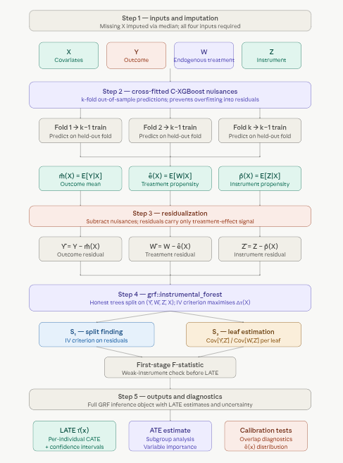

# 1.7 Instrumental Causal XGBoost (Boosted IV Forest) {.unnumbered}

**Boosted IV Forest** (Instrumental Causal XGBoost) is a machine learning method that combines **cross-fitted C-XGBoost** nuisance estimation with **Generalized Random Forests (GRF)** instrumental forest to estimate **conditional local average treatment effects (LATE)** in the presence of endogeneity. It uses XGBoost to flexibly estimate $E[Y|X]$, $E[W|X]$, and $E[Z|X]$, residualises the outcome, treatment, and instrument, then fits an instrumental forest on the residuals—delivering robust, heterogeneous LATE estimates when a valid instrument is available.

## Overview

A **Boosted IV Forest** estimates heterogeneous treatment effects in settings where treatment assignment is endogenous — that is, correlated with unobserved factors that also affect the outcome. Like a standard Instrumental Forest, it exploits an **instrumental variable** $Z$ that shifts treatment $W$ without directly affecting the outcome $Y$. The "boosted" part refers to how nuisance functions are estimated: rather than using regression forests in the first stage, it uses **C-XGBoost** (two-head XGBoost) inside a **cross-fitting** pipeline, enabling more flexible capture of nonlinearities and interactions. The second stage remains a standard `grf::instrumental_forest`, preserving GRF's interpretability, honest estimation, and asymptotically valid confidence intervals.

The result is a two-stage estimator that combines the best of both worlds: XGBoost's strength on tabular data in the first stage, and GRF's principled causal inference machinery in the second.

### The Conditional LATE

The quantity of interest is the **Conditional Local Average Treatment Effect (LATE)** — the treatment effect for *compliers* (units whose treatment status changes because of $Z$), allowed to vary with covariates:

$$\tau(X) = \frac{\text{Cov}[Y - \hat{m}(X),\; Z - \hat{p}(X) \mid X]}{\text{Cov}[W - \hat{e}(X),\; Z - \hat{p}(X) \mid X]}$$

where the three nuisance functions are:

-   $\hat{m}(X) = E[Y \mid X]$ — the conditional mean outcome, estimated to partial out baseline variation in $Y$;
-   $\hat{e}(X) = E[W \mid X]$ — the treatment propensity, estimated to partial out selection into treatment;
-   $\hat{p}(X) = E[Z \mid X]$ — the instrument propensity, estimated to partial out any covariate-driven variation in $Z$.

After residualizing, the numerator $\text{Cov}[\tilde{Y}, \tilde{Z} \mid X]$ captures how much the instrument moves the outcome; the denominator $\text{Cov}[\tilde{W}, \tilde{Z} \mid X]$ captures how much the instrument moves the treatment. Their ratio isolates the local causal effect of $W$ on $Y$ — purged of confounding — for the complier subpopulation with covariates $X = x$.

### Why "Boosted"?

A standard instrumental forest estimates $\hat{m}$, $\hat{e}$, and $\hat{p}$ using regression forests (or skips nuisance estimation entirely if the instrument is assumed randomized). This works well when nuisance functions are smooth and additive, but can underfit when outcomes and treatments depend on complex interactions between covariates.

Replacing the first stage with **cross-fitted C-XGBoost** addresses this directly:

-   XGBoost captures irregular boundaries, high-order interactions, and nonlinear feature effects that regression forests can miss.
-   **Cross-fitting** (k-fold out-of-sample prediction) prevents the nuisance estimates from overfitting to the training data, which would otherwise inflate the apparent signal in the residuals and bias the second-stage LATE estimates.
-   The second stage remains unchanged — `grf::instrumental_forest` on residualized $(\tilde{Y}, \tilde{W}, \tilde{Z}, X)$ — so the improvement is surgical: better nuisances, same inference.

The theoretical justification is the **Neyman orthogonality** of the GRF moment condition: the LATE estimator is locally insensitive to small errors in nuisance estimation, meaning flexible first-stage models improve finite-sample performance without introducing asymptotic bias, as long as nuisances converge at a reasonable rate.

### Validity Conditions

The Boosted IV Forest inherits the standard IV assumptions:

-   **Relevance** — $Z$ must be a strong predictor of $W$ conditional on $X$. Weak instruments inflate the variance of $\tau(X)$ and can cause severe bias; the implementation reports a first-stage F-statistic and issues weak-instrument warnings.
-   **Exclusion restriction** — $Z$ affects $Y$ only through $W$, with no direct path. This is not testable from data and must be justified by domain knowledge.
-   **Independence** — $Z$ is as good as randomly assigned conditional on $X$ (no unmeasured confounders of the $Z \to Y$ path).

### Pipeline: Five Steps



A few things worth highlighting from the pipeline:

**Step 2 (cross-fitting) is the critical upgrade over a standard instrumental forest.** Fitting nuisance models on the full training set and then predicting on the same data induces overfitting into the residuals — the residuals appear smaller than they should be, which inflates the apparent signal in the IV covariance. K-fold cross-fitting breaks this feedback loop by ensuring every nuisance prediction is made out-of-sample. The theoretical grounding is **Neyman orthogonality**: the IV moment condition is locally insensitive to small errors in $\hat{m}$, $\hat{e}$, and $\hat{p}$, so cross-fitted nuisances at a moderate convergence rate are sufficient for root-$n$ inference on $\tau(X)$.

**Step 3 is where the two methods meet.** The residuals $(\tilde{Y}, \tilde{W}, \tilde{Z})$ carry only the variation attributable to treatment effect heterogeneity — all confounding signal that could be explained by $X$ has been subtracted. GRF then operates on clean data, splitting the covariate space to find where $\text{Cov}[\tilde{Y}, \tilde{Z}] / \text{Cov}[\tilde{W}, \tilde{Z}]$ differs most across subgroups.

**The first-stage F-statistic in step 4 is not optional.** A weak instrument ($F < 10$ is a common rule of thumb) means $Z$ explains little variation in $W$ after partialling out $X$, which causes the denominator $\text{Cov}[\tilde{W}, \tilde{Z} \mid X]$ to be near zero. The resulting LATE estimates become extremely noisy and potentially severely biased — the XGBoost first stage cannot rescue a fundamentally weak instrument.

### Key Features

-   **Endogeneity correction**: Instrument $Z$ isolates exogenous variation in $W$.
-   **Heterogeneous effects**: LATE $\tau(X)$ varies with covariates.
-   **Flexible first stage**: XGBoost nuisances can capture nonlinearities; cross-fitting avoids overfitting.
-   **Instrument diagnostics**: First-stage F-statistic and weak-instrument warnings.
-   **Subgroup analysis**, **variable importance**, and **calibration tests** via the underlying GRF object.

## Boosted IV Forest with R

This tutorial uses the **Card (1995)** dataset to estimate **returns to education** (effect of education on log wages) using **proximity to a 4-year college** as an instrument, implemented with the `BoostedIVForest` class from the RCausalML package (see `R/causalBoosted_IV.R`).

## Set Up

### Check and Install Required R Packages

Following R packages are required to run this notebook. If any of these packages are not installed, you can install them using the code below:

`tidyverse`, `plyr`, `RCausalML`, `haven`, `car`, `kernelshap`, `shapviz`, `Metrics`, `future`, `future.apply`

```{r}
#| label: lst-packages-vector
#| lst-cap: "Required R package names used throughout the notebook."
packages <- c(
  "tidyverse",
  "plyr",
  "RCausalML",
  "haven",
  "car",
  "kernelshap",
  "shapviz",
  "Metrics",
  "future",
  "future.apply"
)
```

### Install Missing Packages

```{r}
#| label: lst-install-missing-packages
#| lst-cap: "Optional commands to install missing CRAN/GitHub dependencies (commented by default)."
#| warning: false
#| error: false
# Install missing packages
# new_packages <- packages[!(packages %in% installed.packages()[, "Package"])]
# if (length(new_packages)) install.packages(new_packages)
```

### Verify Installation

```{r}
#| label: lst-verify-package-installation
#| lst-cap: "Check that each required package namespace is available."
# Verify installation
cat("Installed packages:\n")
print(sapply(packages, requireNamespace, quietly = TRUE))
```

### Load R Packages

```{r}
#| warning: false
#| error: false
# Load packages with suppressed messages
invisible(lapply(packages, function(pkg) {
  suppressPackageStartupMessages(library(pkg, character.only = TRUE))
}))
```

### Check Loaded Packages

```{r}
#| label: lst-check-loaded-packages
#| lst-cap: "Confirm which package environments are attached on the search path."
# Check loaded packages
cat("Successfully loaded packages:\n")
print(search()[grepl("package:", search())])
```

## Data: Returns to Education (Card Dataset)

We estimate the causal effect of **education on wages** using **proximity to a 4-year college** as an instrument (Card, 1995).

-   `lwage` = log(wage) — outcome (Y)
-   `educ` = years of education — endogenous treatment (W)
-   `nearc4` = grew up near 4-year college — instrument (Z)
-   `exper`, `expersq`, `black`, `smsa`, `south` — covariates (X)

### Load and Prepare Data

```{r}
#| label: load-prepare-card-data
card_url <- "https://storage.googleapis.com/causal-inference-mixtape.appspot.com/card.dta"
card <- read_dta(card_url)

card <- card %>%
  dplyr::mutate(expersq = exper^2) %>%
  dplyr::select(lwage, educ, nearc4, exper, expersq, black, smsa, south) %>%
  na.omit()

X <- card %>%
  dplyr::select(exper, expersq, black, smsa, south) %>%
  as.matrix()

Y <- as.numeric(card$lwage)
W <- as.numeric(card$educ)
Z <- as.numeric(card$nearc4)
```

### Descriptive Statistics and First-Stage Check

```{r}
#| label: first-stage-regression
#| fig.width: 7
#| fig.height: 5
first_stage <- lm(educ ~ nearc4 + exper + expersq + black + smsa + south, data = card)
summary(first_stage)$coefficients["nearc4", 1:4]

linearHypothesis(first_stage, "nearc4 = 0")
```

```{r}
#| label: first-stage-boxplot
#| fig.width: 7
#| fig.height: 5
ggplot(card, aes(x = factor(nearc4), y = educ)) +
  geom_boxplot(fill = c("#E69F00", "#56B4E9")) +
  labs(title = "First Stage: College Proximity and Years of Education",
       x = "Grew up near 4-year college (nearc4)", y = "Years of Education (educ)") +
  theme_minimal()
```

### Training a Boosted IV Forest

We use `BoostedIVForest` with cross-fitting and optional parallelisation. Set `future::plan(multisession, workers = K)` before `$fit()` to speed up cross-fitting.

```{r}
#| label: fit-boosted-iv-forest
# Ensure xgboost is both installed and attached, so that xgb.DMatrix is available in the workspace
if (!requireNamespace("xgboost", quietly = TRUE)) {
  install.packages("xgboost")
}
suppressPackageStartupMessages(library(xgboost)) # Ensures exported functions like xgb.DMatrix are attached

# Optional: parallel cross-fitting (recommended for larger data)
if (!requireNamespace("future", quietly = TRUE)) {
  install.packages("future")
}
suppressPackageStartupMessages(library(future))
future::plan(future::multisession, workers = min(4L, future::availableCores() - 1L))
on.exit(future::plan(future::sequential), add = TRUE)

model <- BoostedIVForest$new(
  n_folds     = 5L,
  nrounds     = 100L,
  forest_args = list(num.trees = 1000L, honesty = TRUE, tune.parameters = "all")
)
model$fit(X, Y, W, Z, verbose = TRUE)
```

### Model Summary

```{r}
#| label: model-summary
model$summary()
```

### Predicting Treatment Effects

```{r}
#| label: predict-late-ate
# Out-of-sample (training) CATE predictions
iv_pred   <- model$predict()
tau_hat   <- iv_pred$predictions

ate <- model$average_treatment_effect()
cat("Average Treatment Effect (LATE):", round(ate["estimate"], 3),
    "+/-", round(1.96 * ate["std.err"], 3), "\n")
```

### Visualizing Results

```{r}
#| label: plot-tau-by-experience
#| fig.width: 6
#| fig.height: 5
plot(card$exper, tau_hat, pch = 16, col = rgb(0, 0, 0, 0.3),
     xlab = "Potential Experience (exper)", ylab = "Estimated Return to Education (τ(X))",
     main = "Heterogeneous Returns to Schooling by Experience (Boosted IV Forest)")
abline(h = ate["estimate"], col = "red", lwd = 2, lty = 2)
legend("topright", legend = "Average LATE", col = "red", lwd = 2, lty = 2)
```

### CATE Distribution and Partial Dependence

```{r}
#| label: plot-cate-partial-dependence
#| fig.width: 8
#| fig.height: 5
if (requireNamespace("ggplot2", quietly = TRUE)) {
  model$plot_cate(top_var = "exper")
}
```

### Predicting for New Data

```{r}
#| label: predict-new-profile
new_data <- data.frame(
  exper   = 10,
  expersq = 10^2,
  black   = 0,
  smsa    = 1,
  south   = 0
)
new_X <- as.matrix(new_data)
new_pred <- model$predict(X_new = new_X)
cat("Predicted return to education (LATE) for this profile:", round(new_pred$predictions, 3), "\n")
```

### Subgroup Analysis

```{r}
#| label: subgroup-analysis
model$subgroup_analysis(quantile = 0.5)
```

### Variable Importance

```{r}
#| label: variable-importance
vi <- model$variable_importance()
print(vi)
```

### Calibration Test

```{r}
#| label: calibration-test
cal <- model$test_calibration()
if (!is.null(cal)) {
  print(cal$coefficients[, c("Estimate", "Std. Error", "Pr(>|t|)")])
} else {
  cat("Calibration test not supported for instrumental forest (grf).\n")
}
```

### Kernel SHAP for CATE

```{r}
#| label: compute-kernel-shap-boosted-iv
#| fig.width: 7
#| fig.height: 5
#| eval: true

library(kernelshap)
library(shapviz)

pred_tau <- function(object, newdata) {
  p <- object$predict(X_new = newdata)
  p$predictions
}

set.seed(42)
n_bg <- min(50, nrow(X))
bg_idx <- sample(nrow(X), n_bg)
bg_small <- X[bg_idx, , drop = FALSE]

invisible(capture.output({
  shap_iv <- kernelshap(
    object   = model,
    X        = X,
    bg_X     = bg_small,
    pred_fun = pred_tau,
    verbose  = FALSE
  )
}, type = "output"))

shp_iv <- shapviz(shap_iv)

sv_importance(shp_iv, kind = "both") +
  ggtitle("Kernel SHAP: What Drives Heterogeneous Returns to Education? (Boosted IV Forest)")

sv_dependence(shp_iv, v = "exper") +
  ggtitle("SHAP Dependence: Experience")

sv_dependence(shp_iv, v = "smsa") +
  ggtitle("SHAP Dependence: Metropolitan Area")
```

::: callout-note
-   Check first-stage F-statistic \> 10 (strong instrument).
-   Verify instrument validity (relevance and exclusion restriction) in your application.
-   Increase `n_folds`, `nrounds`, and `num.trees` for production use.
-   Use `future::plan(multisession, workers = K)` before `$fit()` to parallelise cross-fitting.
:::

## Summary and Conclusion

**Boosted IV Forest** (Instrumental Causal XGBoost) combines cross-fitted C-XGBoost nuisance estimation with GRF instrumental forest to estimate heterogeneous LATE in the presence of endogeneity. This tutorial used the Card dataset and proximity to college as an instrument to estimate returns to education, demonstrated `BoostedIVForest` fit, summary, predictions, subgroup analysis, variable importance, calibration, and optional SHAP explanations. The same workflow applies to other IV settings with a valid instrument and covariates.

## Resources

1.  Athey, Susan, Julie Tibshirani, and Stefan Wager. "Generalized Random Forests." *Annals of Statistics*, 47(2), 2019.
2.  Card, David (1995). "Using Geographic Variation in College Proximity to Estimate the Return to Schooling." In *Aspects of Labour Market Behaviour: Essays in Honour of John Vanderkamp*.
3.  Wang, Guihua, et al. "An Instrumental Variable Forest Approach for Detecting Heterogeneous Treatment Effects in Observational Studies." *Management Science*, 2021.
4.  RCausalML: `R/causalBoosted_IV.R` — BoostedIVForest implementation.
