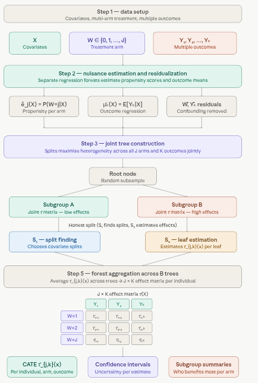

# 1.8 Boosted Multi-Arm Causal Model {.unnumbered}

This tutorial demonstrates how to use the `MultiArmCausalBoost` class in `RCausalML` to estimate heterogeneous treatment effects in a multi-arm setting with boosted trees. We cover the motivation, assumptions, and implementation details of this approach, along with practical code examples using a simulated multi-arm dataset based on the `lung` dataset from the `survival` package.

## Overview

A **Boosted Multi-Arm Causal Model** estimates heterogeneous treatment effects (HTE) in settings with more than two treatment options — for example, a placebo arm alongside two or more active interventions. Rather than fitting a single causal model across all arms simultaneously, it adopts a **T-learner strategy**: one outcome model per arm, each capturing the arm-specific relationship between covariates and outcomes. Treatment effects are then recovered as contrasts between arm predictions, relative to a chosen baseline.

The "boosted" label refers to the choice of learner: each outcome model is a **C-XGBoost** (two-head XGBoost) regressor, bringing strong tabular performance — nonlinear interactions, robustness to irrelevant features, and good calibration on moderate sample sizes — to each arm independently.

This approach trades off some efficiency (arm models share no parameters) for simplicity and flexibility: it makes no assumptions about how treatment effects relate across arms, and each arm model can be tuned independently.

### When to Use It

The Boosted Multi-Arm Causal Model is appropriate when:

-   There are $K \geq 3$ treatment conditions (including control/placebo), and binary causal forest methods do not apply directly.
-   The relationship between covariates and outcomes is likely nonlinear or involves interactions that regression-based methods would miss.
-   The primary goal is **individual-level treatment effect estimation** — identifying which arm benefits which subgroup — rather than population-average inference.
-   Observational data requires covariate adjustment, but a fully structural IV or GRF approach is not warranted or feasible.

Typical applications include clinical trials comparing multiple drug regimens against placebo, policy evaluations with several intervention variants, and marketing experiments with multiple campaign conditions.

### Key Concepts

**T-learner.** The T-learner (or "treatment-specific learner") fits a separate outcome model for each arm $k$:

$$\hat{\mu}_k(x) \approx E[Y \mid X = x,\, W = k], \qquad k = 0, 1, \ldots, K-1$$

where arm $k = b$ (typically $k = 0$, placebo or control) serves as the **baseline**. Each model is trained only on units assigned to arm $k$, so the models are entirely independent of one another.

**Treatment contrasts.** The conditional average treatment effect (CATE) for arm $k$ relative to baseline $b$ is:

$$\tau_{k \leftarrow b}(x) = \hat{\mu}_k(x) - \hat{\mu}_b(x)$$

For $K$ arms, this yields $K - 1$ contrast surfaces over the covariate space. For example, with arms $\{$placebo, drug A, drug B$\}$, the model returns $\hat{\tau}_{A \leftarrow \text{placebo}}(x)$ and $\hat{\tau}_{B \leftarrow \text{placebo}}(x)$ for each individual.

**Pairwise contrasts.** Any two non-baseline arms can also be compared directly:

$$\tau_{k \leftarrow j}(x) = \hat{\mu}_k(x) - \hat{\mu}_j(x)$$

This is straightforward since all $\hat{\mu}_k$ are defined over the full covariate space.

**Propensity scores.** A multiclass propensity model estimates $\hat{e}_k(x) = P(W = k \mid X = x)$ for all arms jointly, typically using a probability forest or multinomial model. These propensity scores are **not** incorporated into the outcome model training (the approach is not doubly robust), but serve three diagnostic purposes: detecting covariate imbalance across arms, flagging low-overlap regions where counterfactual predictions are unreliable, and enabling inverse probability weighting (IPW) for population-level ATE estimation if needed.

**Identification assumptions.** Like all observational causal methods, the T-learner requires:

-   **Consistency** — the observed outcome for a unit assigned to arm $k$ equals its potential outcome $Y(k)$.
-   **Ignorability** — conditional on $X$, treatment assignment is independent of potential outcomes: $W \perp (Y(0), \ldots, Y(K-1)) \mid X$. There must be no unmeasured confounders.
-   **Overlap** — every unit has a non-zero probability of receiving any arm: $P(W = k \mid X = x) > 0$ for all $k$ and all $x$ in the support.

### Known Limitations

**T-learner bias in small arms.** When one arm has few observations, its outcome model is poorly estimated, which degrades the contrast estimates for that arm disproportionately. S-learner or X-learner variants can partially mitigate this by sharing information across arms.

**No regularization toward a common effect.** Unlike the Multi-Arm/Multi-Outcome Causal Forest (which uses a joint splitting criterion), T-learner arm models are fully independent. If treatment effects are genuinely similar across arms, a joint model would be more efficient.

**Not doubly robust.** Propensity scores are estimated but not used in the outcome model training. Misspecification of $\hat{\mu}_k$ is not corrected by a well-estimated propensity model.

**Extrapolation risk.** Each $\hat{\mu}_k$ must produce predictions for all units regardless of arm assignment — including covariate regions where that arm had few or no training observations. Low-propensity regions should be interpreted cautiously.

### Pipeline: Five Steps



A few things worth emphasizing from the pipeline:

**Step 2 extrapolation is the central challenge.** Each arm model is trained on only the units assigned to that arm, but must predict $\hat{\mu}_k(x)$ for *every* unit in the dataset — including those from other arms. In regions of covariate space where arm $k$ is rare (low propensity), the model is extrapolating from very little data. The propensity scores in step 4 directly diagnose this risk: wherever $\hat{e}_k(x)$ is near zero, the corresponding $\hat{\mu}_k(x)$ estimates should be treated with caution.

**Step 3's "best arm" output** is operationally the most useful in personalized treatment settings. For each individual, the model returns $\text{argmax}_k\, \hat{\tau}_{k \leftarrow b}(x)$, identifying which arm delivers the largest estimated benefit. This is the basis for **individualized treatment rules (ITRs)** — policies that assign different arms to different subgroups based on predicted effect heterogeneity. That said, uncertainty around CATE estimates should be factored in before acting on these assignments; small margin differences between arms may not be reliable.

**Step 4 propensity scores serve three distinct roles** that are worth keeping separate: (1) *diagnostics* — visualizing covariate overlap across arms to identify extrapolation risk; (2) *ATE correction* — IPW-adjusted averages account for non-random arm assignment in observational data; and (3) *sensitivity analysis* — comparing naive and propensity-weighted ATEs reveals how sensitive conclusions are to the observational design.

## Implementation in R

Boosted Multi-Arm Causal Model is implemented in `RCausalML` as the R6 class `MultiArmCausalBoost` in `R/multi_arm_causal_boost.R`. The implementation is designed for flexibility and interpretability, with the following features:

-   **Outcome models**: one C-XGBoost regressor per arm and outcome, trained with user-specified parameters.
-   **Propensity model**: a multiclass probability forest via `ranger` for diagnostics
-   **Prediction output**: potential outcomes $\hat{\mu}_k(x)$, contrasts $\hat{\tau}_{k \leftarrow b}(x)$, and propensity scores $\hat{e}_k(x)$ for each individual.

## Set Up

### Check and Install Required R Packages

Following R packages are required to run this notebook. If any of these packages are not installed, you can install them using the code below:

`tidyverse`, `survival`, `RCausalML`, `xgboost`, `ranger`, `ggplot2`, `kernelshap`, `shapviz`, `patchwork`

```{r}
#| label: lst-packages-vector
#| lst-cap: "Required R package names used throughout the notebook."
packages <- c(
  "tidyverse",
  "survival",
  "RCausalML",
  "xgboost",
  "ranger",
  "ggplot2",
  "kernelshap",
  "shapviz",
  "patchwork"
)
```

### Install Missing Packages

```{r}
#| label: lst-install-missing-packages
#| lst-cap: "Optional commands to install missing CRAN/GitHub dependencies (commented by default)."
#| warning: false
#| error: false
# Install missing packages
# new_packages <- packages[!(packages %in% installed.packages()[, "Package"])]
# if (length(new_packages)) install.packages(new_packages)
```

### Verify Installation

```{r}
#| label: lst-verify-package-installation
#| lst-cap: "Check that each required package namespace is available."
# Verify installation
cat("Installed packages:\n")
print(sapply(packages, requireNamespace, quietly = TRUE))
```

### Load R Packages

```{r}
#| warning: false
#| error: false
# Load packages with suppressed messages
invisible(lapply(packages, function(pkg) {
  suppressPackageStartupMessages(library(pkg, character.only = TRUE))
}))
```

### Check Loaded Packages

```{r}
#| label: lst-check-loaded-packages
#| lst-cap: "Confirm which package environments are attached on the search path."
# Check loaded packages
cat("Successfully loaded packages:\n")
print(search()[grepl("package:", search())])
```

### Data: Lung dataset with simulated multi-arm treatment

We use `lung` from `{survival}` and simulate a 3-arm treatment:

-   `placebo` (baseline)
-   `A`
-   `B`

We also create two outcomes:

-   `log_time`: log survival time
-   `health_status`: a simulated binary secondary outcome with treatment-dependent probabilities

```{r load-data}
#| warning: false
#| error: false

data(lung, package = "survival")

set.seed(123)
lung_data <- lung %>%
  dplyr::filter(!is.na(age), !is.na(sex), !is.na(ph.ecog), !is.na(time)) %>%
  dplyr::mutate(
    treatment = as.factor(sample(
      c("placebo", "A", "B"),
      n(),
      replace = TRUE,
      prob = c(0.4, 0.3, 0.3)
    )),
    health_status = rbinom(
      n(),
      1,
      prob = 0.3 + 0.10 * (treatment == "A") + 0.15 * (treatment == "B")
    ),
    log_time = log(time)
  )

# For a fast, reproducible tutorial render, keep a moderate sample size.
set.seed(123)
n_keep <- min(250, nrow(lung_data))
lung_data <- lung_data %>% dplyr::slice_sample(n = n_keep)

# Covariates, treatment, outcomes
X <- lung_data %>% dplyr::select(age, sex, ph.ecog) %>% as.matrix()
W <- relevel(lung_data$treatment, ref = "placebo")
Y <- lung_data %>% dplyr::select(log_time, health_status) %>% as.matrix()
colnames(Y) <- c("log_time", "health_status")

# Train/test split
set.seed(123)
n <- nrow(lung_data)
train_idx <- sample(seq_len(n), size = floor(0.8 * n))
test_idx  <- setdiff(seq_len(n), train_idx)

X_train <- X[train_idx, , drop = FALSE]
W_train <- W[train_idx]
Y_train <- Y[train_idx, , drop = FALSE]

X_test <- X[test_idx, , drop = FALSE]
W_test <- W[test_idx]
Y_test <- Y[test_idx, , drop = FALSE]
```

### Train `MultiArmCausalBoost` on `log_time` and `health_status`

`MultiArmCausalBoost` fits:

-   one XGBoost model per treatment arm **and** per outcome (here: `log_time` and `health_status`)
-   one multiclass propensity model $\Pr(W \mid X)$ via `ranger` (probability forest)

Key choices you control:

-   **baseline**: the reference arm for contrasts (we use `placebo`)
-   **xgboost parameters**: passed as `parameters = list(...)` (same objective for both outcomes here; binary `health_status` uses squared error for a smooth tutorial)
-   **nrounds**: boosting rounds (kept moderate for tutorial runtime)

```{r fit-model}
#| warning: false
#| error: false

model <- MultiArmCausalBoost$new(
  parameters = list(
    eta = 0.10,
    max_depth = 3L,
    subsample = 0.8,
    colsample_bytree = 0.8,
    tree_method = "hist",
    objective = "reg:squarederror"
  ),
  baseline = "placebo"
)

model$fit(
  X = X_train,
  Y = Y_train,
  W = W_train,
  nrounds = 10L,
  verbose = 1L
)

model$summary()
```

## Predict contrasts on the test set (`tau_hat_*`)

The `predict()` method returns a list:

-   `mu_hat`: potential outcomes array $[n, \text{arms}, \text{outcomes}]$
-   `tau_hat`: contrasts array $[n, (\text{arms} - 1), \text{outcomes}]$ relative to `baseline`
-   `propensity_score`: matrix $[n, \text{arms}]$

Below we store contrasts for each outcome as $n \times (\text{number of contrasts})$ matrices.

```{r predict-test}
#| warning: false
#| error: false

pred <- model$predict(X_test, drop = FALSE)

tau_hat_log_time <- pred$tau_hat[, , "log_time", drop = TRUE]
tau_hat_health_status <- pred$tau_hat[, , "health_status", drop = TRUE]
cn_tau <- dimnames(pred$tau_hat)[[2]]
if (is.null(dim(tau_hat_log_time))) {
  tau_hat_log_time <- matrix(tau_hat_log_time, ncol = 1L, dimnames = list(NULL, cn_tau))
} else {
  colnames(tau_hat_log_time) <- cn_tau
}
if (is.null(dim(tau_hat_health_status))) {
  tau_hat_health_status <- matrix(
    tau_hat_health_status,
    ncol = 1L,
    dimnames = list(NULL, cn_tau)
  )
} else {
  colnames(tau_hat_health_status) <- cn_tau
}

str(pred$mu_hat)
str(pred$tau_hat)
head(tau_hat_log_time)
head(tau_hat_health_status)
head(pred$propensity_score)
```

## Doubly robust average treatment effects (AIPW plug-in)

For each non-baseline arm $k$ and outcome $m$, we use the standard multi-arm doubly robust score (same spirit as AIPW), evaluated at the fitted outcome models $\hat\mu_a(X)$ and propensities $\hat e_a(X)$:

$$
\psi_i^{(k)} = \hat\mu_k(X_i) - \hat\mu_b(X_i)
+ \bigl(Y_{im} - \hat\mu_{W_i}(X_i)\bigr)\left(\frac{\mathbb{1}\{W_i=k\}}{\hat e_k(X_i)} - \frac{\mathbb{1}\{W_i=b\}}{\hat e_b(X_i)}\right),
$$

with baseline $b$ = `placebo`. We average $\psi_i^{(k)}$ over the **training** sample (where $Y$ is observed). This is a **plug-in** DR estimator (nuisances fit on the same data); for rigorous inference, sample splitting or cross-fitting is preferred.

```{r aipw-ate}
#| warning: false
#| error: false

multi_arm_dr_ate <- function(Y, W, mu_hat, ps, baseline) {
  W_char <- as.character(droplevels(W))
  arms <- dimnames(mu_hat)[[2]]
  outcomes <- dimnames(mu_hat)[[3]]
  n <- nrow(Y)
  M <- dim(mu_hat)[3]
  arm_idx <- match(W_char, arms)
  contrast_arms <- setdiff(arms, baseline)
  cn <- paste0(contrast_arms, " - ", baseline)
  out <- matrix(
    NA_real_,
    nrow = length(contrast_arms),
    ncol = M,
    dimnames = list(cn, outcomes)
  )
  idx_row <- seq_len(n)
  for (m in seq_len(M)) {
    mu_w <- mu_hat[cbind(idx_row, arm_idx, m)]
    for (j in seq_along(contrast_arms)) {
      k <- contrast_arms[j]
      mu_k <- mu_hat[, k, m]
      mu_b <- mu_hat[, baseline, m]
      e_k <- ps[, k]
      e_b <- ps[, baseline]
      I_k <- as.numeric(W_char == k)
      I_b <- as.numeric(W_char == baseline)
      psi <- (mu_k - mu_b) + (Y[, m] - mu_w) * (I_k / e_k - I_b / e_b)
      out[j, m] <- mean(psi)
    }
  }
  out
}

pred_train <- model$predict(X_train, drop = FALSE)
ate_tab <- multi_arm_dr_ate(
  Y_train,
  W_train,
  pred_train$mu_hat,
  pred_train$propensity_score,
  baseline = model$baseline
)
ate_log_time <- ate_tab[, "log_time"]
ate_health_status <- ate_tab[, "health_status"]

print(ate_tab)
```

### Summarize average (model-implied) contrasts on the test set

These are **not** doubly-robust estimates; they’re simply averages of the model’s predicted individual contrasts (use `ate_log_time` / `ate_health_status` above for DR averages on the training sample).

```{r avg-contrasts}
#| warning: false
#| error: false

tau_test <- pred$tau_hat

avg_tau <- apply(tau_test, c(2, 3), mean)
avg_tau_df <- as.data.frame(as.table(avg_tau))
colnames(avg_tau_df) <- c("contrast", "outcome", "avg_contrast")

avg_tau_df <- tibble::as_tibble(avg_tau_df)
avg_tau_df %>%
  dplyr::arrange(outcome, contrast) %>%
  print(n = Inf)
```

### Visualize heterogeneity in a contrast

As a simple check, plot a contrast against a key covariate.

```{r cate-vs-age}
#| fig.width: 7
#| fig.height: 4.5
#| warning: false
#| error: false

contrast_names <- dimnames(pred$tau_hat)[[2]]
outcome_names <- dimnames(pred$tau_hat)[[3]]

# pick the first available contrast/outcome for a compact demo
chosen_contrast <- contrast_names[1]
chosen_outcome  <- outcome_names[1]

tau_slice <- if (identical(chosen_outcome, "log_time")) {
  tau_hat_log_time
} else {
  tau_hat_health_status
}
plot_df <- tibble::tibble(
  age = X_test[, "age"],
  tau = tau_slice[, chosen_contrast]
)

ggplot(plot_df, aes(x = age, y = tau)) +
  geom_point(alpha = 0.5) +
  geom_smooth(method = "loess", se = TRUE, color = "#4E79A7") +
  labs(
    title = paste0("Estimated contrast vs age: ", chosen_contrast, " (", chosen_outcome, ")"),
    x = "age",
    y = "Estimated treatment contrast"
  ) +
  theme_minimal()
```

## Variable importance: `log_time` and `health_status`

Because the model fits **one booster per (arm, outcome)**, gain-based importance is specific to an arm/outcome pair. Below: arm `A` with outcome index `1L` = `log_time`, then `2L` = `health_status` (`plot_importance()` takes a numeric outcome index).

```{r importance-log-time}
#| fig.width: 7
#| fig.height: 4.5
#| warning: false
#| error: false

model$plot_importance(arm = "A", outcome = 1L, top_n = 10L, metric = "Gain")
```

```{r importance-health-status}
#| fig.width: 7
#| fig.height: 4.5
#| warning: false
#| error: false

model$plot_importance(arm = "A", outcome = 2L, top_n = 10L, metric = "Gain")
```

### Access the underlying XGBoost model directly

If you need custom XGBoost tooling (e.g., advanced importance, SHAP from `xgboost`), you can retrieve a fitted booster:

```{r extract-booster}
#| warning: false
#| error: false

booster_A_log_time <- model$outcome_models[["A"]][["log_time"]]
booster_A_log_time
```

### Kernel SHAP for predicted CATE (`shapviz` + `kernelshap`)

We explain the **predicted contrast** $\hat\tau_k(X) = \hat\mu_k(X) - \hat\mu_{\text{placebo}}(X)$ as a function of $X$, separately for `log_time` and `health_status`. Use a small background set and a subsample of the test rows so kernel SHAP stays fast.

```{r kernel-shap-cate}
#| fig.width: 10
#| fig.height: 10
#| warning: false
#| error: false

library(kernelshap)
library(shapviz)
library(patchwork)

pred_A_vs_placebo_log <- function(object, newdata) {
  pr <- object$predict(as.matrix(newdata), drop = FALSE)
  pr$tau_hat[, "A - placebo", "log_time"]
}

pred_B_vs_placebo_log <- function(object, newdata) {
  pr <- object$predict(as.matrix(newdata), drop = FALSE)
  pr$tau_hat[, "B - placebo", "log_time"]
}

pred_A_vs_placebo_health <- function(object, newdata) {
  pr <- object$predict(as.matrix(newdata), drop = FALSE)
  pr$tau_hat[, "A - placebo", "health_status"]
}

pred_B_vs_placebo_health <- function(object, newdata) {
  pr <- object$predict(as.matrix(newdata), drop = FALSE)
  pr$tau_hat[, "B - placebo", "health_status"]
}

set.seed(42)
n_bg <- min(50L, nrow(X_train))
bg_idx <- sample.int(nrow(X_train), n_bg)
bg_small <- X_train[bg_idx, , drop = FALSE]

n_explain <- min(40L, nrow(X_test))
X_shap <- X_test[seq_len(n_explain), , drop = FALSE]

shap_A_log <- kernelshap(
  object = model,
  X = X_shap,
  bg_X = bg_small,
  pred_fun = pred_A_vs_placebo_log,
  verbose = FALSE
)

shap_B_log <- kernelshap(
  object = model,
  X = X_shap,
  bg_X = bg_small,
  pred_fun = pred_B_vs_placebo_log,
  verbose = FALSE
)

shap_A_health <- kernelshap(
  object = model,
  X = X_shap,
  bg_X = bg_small,
  pred_fun = pred_A_vs_placebo_health,
  verbose = FALSE
)

shap_B_health <- kernelshap(
  object = model,
  X = X_shap,
  bg_X = bg_small,
  pred_fun = pred_B_vs_placebo_health,
  verbose = FALSE
)

shp_A_log <- shapviz(shap_A_log)
shp_B_log <- shapviz(shap_B_log)
shp_A_health <- shapviz(shap_A_health)
shp_B_health <- shapviz(shap_B_health)

plt1 <- sv_importance(shp_A_log, kind = "both") + ggplot2::ggtitle("CATE SHAP — log_time: A vs placebo")
plt2 <- sv_importance(shp_B_log, kind = "both") + ggplot2::ggtitle("CATE SHAP — log_time: B vs placebo")
plt3 <- sv_importance(shp_A_health, kind = "both") + ggplot2::ggtitle("CATE SHAP — health_status: A vs placebo")
plt4 <- sv_importance(shp_B_health, kind = "both") + ggplot2::ggtitle("CATE SHAP — health_status: B vs placebo")

(plt1 | plt2) / (plt3 | plt4)
```

## Save and load a fitted model

`RCausalML` includes helpers to persist the fitted R6 object.

```{r save-load}
#| warning: false
#| error: false

tmp_path <- tempfile(fileext = ".rds")
save_multi_arm_causal_boost(model, tmp_path)

model2 <- load_multi_arm_causal_boost(tmp_path)
model2$summary()
```

## Notes and limitations

-   Outcome models are **T-learner style** (separate boosters per arm); the **DR/AIPW averages** above reuse those fits plus the ranger propensities—they are not from a dedicated DR-learner objective.
-   DR estimates use **plug-in nuisances** on the training set; prefer **cross-fitting** for formal inference.
-   You need adequate sample size **per arm**, since each arm has its own outcome model(s).
-   For multi-outcome $Y$, the implementation fits one booster per outcome per arm (no explicit outcome correlation modeling).
-   Kernel SHAP explains **predicted** CATE $\hat\tau(X)$, not necessarily the structural causal effect unless identification holds.

## Summary

You now have a practical workflow for multi-arm causal effect modeling with boosting:

-   fit `MultiArmCausalBoost` once on multi-outcome $Y$ (`log_time`, `health_status`)
-   predict contrasts on the test set (`tau_hat_log_time`, `tau_hat_health_status`)
-   summarize **doubly robust** average contrasts on the training sample (`ate_log_time`, `ate_health_status`)
-   interpret drivers with per-outcome gain importance and kernel SHAP for CATE

## Resources

1.  Künzel, S. R., Sekhon, J. S., Bickel, P. J., & Yu, B. (2019). Metalearners for estimating heterogeneous treatment effects using machine learning. PNAS.
2.  `{xgboost}` documentation for boosted trees and model interpretation.
