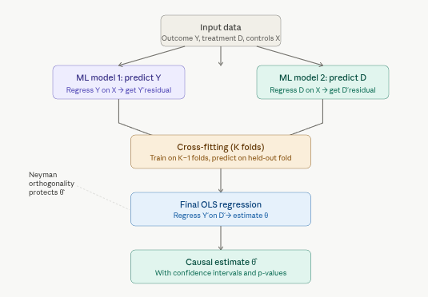

# 4. Double/Debiased Machine Learning  {.unnumbered}

## Overview

Two powerful methodologies have historically talked past each other:

**Machine learning** predicts outcomes with remarkable accuracy, but its regularization techniques — shrinking or zeroing out coefficients to prevent overfitting — introduce *systematic bias* into any coefficient it produces. You can't use a Lasso regression to estimate a causal effect and trust the result.

**Classical econometrics** (OLS, IV, etc.) produces unbiased, inferentially valid estimates, but breaks down under high dimensionality. With hundreds or thousands of control variables, standard regression is either infeasible or hopelessly overfit.

**Double Machine Learning** solves both problems simultaneously. It uses ML's predictive power to handle high-dimensional confounders, then recovers valid causal inference through a clever two-step residualization procedure.

------------------------------------------------------------------------

## How it works

### The model

DML assumes a *partially linear* data-generating process:

$$Y = \theta D + g(X) + \varepsilon$$ $$D = m(X) + V$$

where $Y$ is the outcome, $D$ is the treatment, $X$ is a (potentially very large) vector of confounders, and $\theta$ is the causal effect you want. The functions $g(X)$ and $m(X)$ are called *nuisance functions* — they govern how confounders affect the outcome and treatment, but you don't care about them directly.

### The five-step pipeline

**Step 1 — Residualize the outcome.** Train any ML model to predict $Y$ from $X$. Compute the residual $\tilde{Y} = Y - \hat{g}(X)$: the part of $Y$ that confounders cannot explain.

**Step 2 — Residualize the treatment.** Train a second ML model to predict $D$ from $X$. Compute $\tilde{D} = D - \hat{m}(X)$: the part of $D$ that confounders cannot explain.

**Step 3 — Cross-fit to prevent overfitting.** If you train the nuisance models and compute residuals on the *same* data, the residuals will be artificially small (overfitting). Instead, split the data into $K$ folds, train on $K-1$ folds, and predict residuals on the held-out fold. Rotate through all folds and aggregate.

**Step 4 — Final OLS.** Regress $\tilde{Y}$ on $\tilde{D}$: $$\tilde{Y} = \theta\,\tilde{D} + \text{error}$$

The coefficient $\hat{\theta}$ is your causal estimate. By construction, you've *partialled out* all confounding variation captured in $X$.

**Step 5 — Inference.** Because of the orthogonality property (below), $\hat{\theta}$ is $\sqrt{n}$-consistent and asymptotically normal, giving you valid standard errors, confidence intervals, and p-values.

### Why this works: Neyman orthogonality

The critical insight is that the score function used to estimate $\theta$ is *orthogonal* to the nuisance parameters. In plain terms: if your ML models for $g(X)$ and $m(X)$ are slightly wrong — which they always are — those errors have only a *second-order* (negligible) impact on $\hat{\theta}$. This is the "debiasing" step that makes valid inference possible despite using regularized ML.

------------------------------------------------------------------------

## Supported models and causal structures

The `DoubleML` package (R and Python) is *learner-agnostic* — you can plug in virtually any supervised learning algorithm:

| Category         | Examples                                   |
|------------------|--------------------------------------------|
| Penalized linear | Lasso, Ridge, Elastic Net                  |
| Tree-based       | Random Forest, XGBoost, LightGBM, CatBoost |
| Neural networks  | MLPs via scikit-learn or PyTorch wrappers  |
| Other            | SVM, k-NN                                  |

It also supports four structural causal models:

| Model | When to use |
|------------------------------------|------------------------------------|
| **PLR** — Partially Linear Regression | Standard observational setting; no endogeneity |
| **PLIV** — Partially Linear IV | Endogenous treatment; requires valid instruments |
| **IRM** — Interactive Regression Model | Treatment effect varies across units (heterogeneous effects) |
| **IIVM** — Interactive IV Model | IV + heterogeneous effects |

------------------------------------------------------------------------

## Advantages

| Capability | What it enables |
|------------------------------------|------------------------------------|
| High dimensionality | Works when the number of controls $p \gg n$ |
| Nonlinearity | Captures complex confounder–outcome relationships OLS cannot |
| Valid inference | Produces standard errors, CIs, and hypothesis tests |
| Robustness | Resilient to moderate ML estimation error (orthogonality) |
| Modularity | Swap learners freely; XGBoost today, Random Forest tomorrow |

------------------------------------------------------------------------

## Limitations

**No hidden confounders.** Like all observational methods, standard DML (PLR) assumes *unconfoundedness*: every variable affecting both $D$ and $Y$ is in $X$. An unmeasured confounder still biases $\hat{\theta}$. The PLIV variant handles endogeneity, but requires valid instruments.

**Sample size still matters.** DML handles high *dimensionality* but not small *n*. The final OLS step requires enough observations for asymptotic normality to hold.

**Nuisance functions remain black boxes.** $\hat{\theta}$ is interpretable; $\hat{g}(X)$ and $\hat{m}(X)$ are not. You learn the effect of treatment but not *how* each confounder influences the outcome.

**Computational cost.** Cross-fitting means training $K$ nuisance models per variable instead of one. Expect runtime roughly $K\times$ that of a comparable OLS workflow.

**Weak instruments.** If you use PLIV, DML inherits the weak-instrument problem from classical 2SLS — a weak instrument inflates standard errors and can bias estimates.

------------------------------------------------------------------------

## R ecosystem

### Primary package: `DoubleML`

The official R implementation, built on the `mlr3` ecosystem.

-   Implements all four model types: PLR, PLIV, IRM, IIVM
-   Plug in any `mlr3` learner (Random Forest, XGBoost, Lasso, etc.)
-   Built-in cross-fitting, inference, and hyperparameter tuning via `mlr3tuning`
-   CRAN: `DoubleML` | GitHub: `DoubleML/DoubleML-R`
-   **`RCausalML`**: Native R Double ML (EconML-style) with cross-fitted nuisance models and flexible final stages — `LinearDML`, `SparseLinearDML`, `KernelDML`, `NonParamDML`, `CausalForestDML`, plus panel (`DynamicDMLearner`) and IV variants. When **DoubleML** and **mlr3** are installed, optional helpers (`doubleml_plr()`, `doubleml_pliv()`, DiD functions) wrap the official **DoubleML** package for PLR/PLIV workflows.

### Predecessor: `hdm`

Developed by the same authors; focuses on Lasso-based inference (Post-Double Lasso). Less flexible but has a lighter dependency footprint. Use it if you specifically need sparse linear settings and want to avoid the `mlr3` stack.

### Supporting packages

Since `DoubleML` depends on `mlr3`, you'll typically also install:

-   `mlr3` — core ML framework
-   `mlr3learners` — Random Forest, Lasso, etc.
-   `mlr3extralearners` — XGBoost, LightGBM, etc.
-   `glmnet` — fast Lasso/Ridge
-   `ranger` — fast Random Forests

### Alternative for heterogeneous effects: `grf`

If your primary question is *who* benefits from treatment (CATE estimation) rather than the average effect, the **Generalized Random Forests** package (`grf`) is the natural choice. It uses a related but distinct framework and is optimized for effect heterogeneity.

------------------------------------------------------------------------

## Applications

DML is the natural choice wherever causal questions meet high-dimensional data:

-   **Economics** — price elasticity controlling for thousands of product and market characteristics
-   **Marketing** — true ad-campaign lift after controlling for browsing history and demographics
-   **Healthcare** — drug efficacy controlling for genomic or electronic health record data
-   **Policy evaluation** — job-training program impact controlling for employment history, education, and local conditions

**Double Machine Learning** is the state-of-the-art method for estimating causal effects in the era of Big Data. It allows data scientists to use the predictive power of algorithms like XGBoost or Neural Networks to control for confounders, without sacrificing the statistical rigor required to make causal claims. The `DoubleML` package in R provides a user-friendly interface to implement this powerful method, supporting a wide range of machine learning models and causal structures. While it has limitations (like any method), it represents a significant advancement in the toolkit for causal inference in high-dimensional settings.

## Resources

**Key References**

-   Chernozhukov, V., Chetverikov, D., Demirer, M., Duflo, E., Hansen, C., Newey, W., & Robins, J. (2018). *Double/debiased machine learning for treatment and structural parameters*. The Econometrics Journal, 21(1), C1–C68.
-   Chernozhukov, V., Hansen, C., & Spindler, M. (2020). *DoubleML – Double/debiased machine learning in R and Python*. Journal of Statistical Software.

**Documentation**

-   [DoubleML Getting Started](https://docs.doubleml.org/stable/intro/intro.html)
-   [DoubleML User Guide](https://docs.doubleml.org/stable/guide/index.html)
-   [DoubleML R API](https://docs.doubleml.org/r/stable/)

