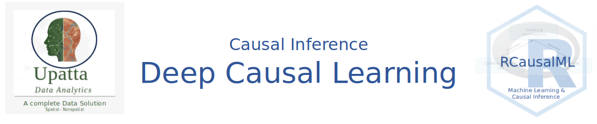

# 5. Deep Causal Learning {.unnumbered}

Deep causal learning integrates deep neural networks with causal inference techniques to uncover cause-and-effect relationships from data, going beyond mere correlations typical in standard machine learning.

This field addresses limitations in traditional deep learning, such as poor generalization to new distributions or inability to answer "what if" questions, by incorporating causal structures like directed acyclic graphs (DAGs) and interventions. It enables models to perform counterfactual reasoning, estimate treatment effects, and handle high-dimensional data like images or time series.

### Key Components

Deep causal learning typically spans three main areas: - **Representation**: Neural networks learn latent causal variables from unstructured data, such as using autoencoders or graph neural networks to extract features that respect causal independencies. - **Discovery**: Algorithms identify causal graphs or directions, often via score-based optimization or generative models to test for asymmetries in data distributions. - **Inference**: Once a causal model is learned, it supports queries like average treatment effects (ATE) or individual-level predictions, using techniques like variational inference or adversarial training.

A common framework involves a "causal deep learning" paradigm with structural, parametric, and temporal dimensions, allowing partial causal knowledge to guide deep models. For instance, in high-dimensional settings, models might use kernel density estimation (KDE) images fed into CNNs to infer graph edges.

Here's an illustrative diagram of a deep causal learning architecture for structure discovery: FIh. 1 42256_2023_744_Fig2_HTML.png

### Methods and Approaches

Popular methods include: - **Causal Variational Autoencoders (Causal VAEs)**: Extend VAEs to enforce causal factorizations in the latent space. - **Graph Neural Networks for Causality**: Combine GNNs with causal discovery to handle relational data. - **Deep Structural Causal Models**: Parameterize structural equations with neural nets for nonlinear relationships. - **Counterfactual Generation**: Use generative models like GANs to simulate interventions.

Recent innovations, like "Causal-JEPA," force models to learn interactions by intervening on object latents during training, improving counterfactual accuracy by up to 20%. End-to-end training of neural nets to output causal graphs directly from data has also shown promise.

### Applications

-   **Healthcare**: Predicting personalized treatment outcomes or discovering disease mechanisms from electronic health records.
-   **Robotics**: Enhancing explainability and extrapolation in dynamic environments by learning physical cause-effect.
-   **Economics and Policy**: Estimating intervention impacts without randomized trials.
-   **Fairness in AI**: Using causal Bayesian networks to detect and mitigate dataset biases.

In marketing, deep causal models extend mixed-media modeling (MMM) for better attribution of ad effects.

### Challenges and Future Directions

Challenges include identifiability (distinguishing causes from effects without experiments), scalability to very high dimensions, and incorporating time-series dynamics. Future work may focus on hybrid models blending deep learning with symbolic causal reasoning for artificial general intelligence.

For a visual overview of how causal inference integrates with deep networks:

## Types of Deep Causal Learning Models

Deep Causal Learning models can be categorized based on their **primary objective**: are they trying to estimate an effect, discover a graph, learn robust representations, or make sequential decisions?

Here is a detailed breakdown of the different types of Deep Causal Learning models, organized by their function and architecture.

### 1. Causal Effect Estimation Models

**Goal:** Estimate the Conditional Average Treatment Effect (CATE) or Individual Treatment Effect (ITE) from high-dimensional observational data. **Problem:** Standard regression fails due to confounding bias and selection bias.

-   **Representation Learning Networks (TARNet / CFRNet)**

   -   **Architecture:** A neural network learns a representation $\Phi(X)$ of the covariates. This representation is fed into two separate "heads" (networks): one predicts the outcome for the treated group, one for the control group.
   -   **Key Mechanism:** **Balancing Loss.** The model is penalized if the distribution of representations $\Phi(X)$ differs between the treated and control groups. This mimics propensity score matching but in a latent space.
   -   **Use Case:** Clinical trials with high-dimensional patient data.

-   **Propensity-Adjusted Networks (Dragonnet)**

  -   **Architecture:** Similar to TARNet but adds a third output head that predicts the **propensity score** $P(T=1|X)$.
  -   **Key Mechanism:** **Targeted Regularization.** By forcing the lower layers to predict the treatment assignment accurately, the network is encouraged to learn sufficient statistics for the propensity score, which theoretically reduces bias in the effect estimate (based on the theory of Targeted Maximum Likelihood Estimation).
    -   **Use Case:** When selection bias is strong and known covariates drive treatment assignment.

-   **Generative Counterfactual Models (CEVAE / GANITE)**

  -   **Architecture:**
      -   **CEVAE (Causal Effect VAE):** Uses a Variational Autoencoder to infer latent confounders $Z$ from proxy variables $X$, then estimates effects using $Z$.
      -   **GANITE:** Uses a Generative Adversarial Network. The generator imputes missing counterfactuals (e.g., generating the outcome for a treated patient as if they were untreated), and the discriminator tries to distinguish real factual data from generated counterfactuals.
    -   **Key Mechanism:** **Imputation.** Explicitly modeling the joint distribution $P(X, T, Y)$ to sample counterfactual outcomes.
    -   **Use Case:** When there are unobserved confounders that can be proxied by high-dimensional data (e.g., images, text).

### 2. Causal Structure Learning Models

**Goal:** Discover the causal graph (DAG) from data without prior knowledge of the edges. **Problem:** Traditional constraint-based methods (PC Algorithm) struggle with non-linear relationships and high dimensions.

-   **Continuous Optimization Models (NOTEARS)**

   -   **Architecture:** Treats the adjacency matrix of the graph as a learnable parameter matrix $W$.
   -   **Key Mechanism:** **Acyclicity Constraint.** Instead of a discrete search, it uses a smooth mathematical constraint (trace of matrix exponential) to ensure the learned graph has no cycles, allowing gradient descent to find the DAG.
    -   **Use Case:** Learning non-linear causal relationships in tabular data.

-   **Variational Graph Models (DAG-GNN)**

   -   **Architecture:** Combines a Variational Autoencoder (VAE) with a graphical model. The adjacency matrix is learned as part of the VAE's latent structure.
   -   **Key Mechanism:** **Evidence Lower Bound (ELBO).** Maximizes the likelihood of the data under the constraint that the underlying structure is a DAG.
  -   **Use Case:** When data is noisy or contains latent variables.

-   **Neural Structural Equation Models (GraN-DAG)**

   -   **Architecture:** Each node in the graph is parameterized by a neural network (an MLP) that takes its parents as input.
   -   **Key Mechanism:** **Functional Mechanism Learning.** Instead of just finding edges, it learns the specific non-linear function $X_i = f_i(Pa_i) + \epsilon_i$ for each node.
    -   **Use Case:** Complex systems where causal mechanisms are highly non-linear.

### 3. Causal Representation Learning Models

**Goal:** Map low-level observations (pixels, audio) to high-level causal variables (objects, forces). **Problem:** Standard deep learning learns correlated features, not causal factors.

-   **Identifiable VAEs (iVAE)**
    -   **Architecture:** A VAE that conditions the latent prior on an auxiliary variable (e.g., domain index or time segment).
    -   **Key Mechanism:** **Weak Supervision.** By observing how the latent distribution changes with the auxiliary variable, the model can mathematically guarantee (under assumptions) that the latents correspond to the true causal factors.
    -   **Use Case:** Disentangling object position, color, and shape in images.
-   **CausalVAE**
    -   **Architecture:** Integrates a Structural Causal Model (SCM) layer into the latent space of a VAE.
    -   **Key Mechanism:** **Causal Mask.** The latent variables interact via a causal mask matrix before being decoded into the observation.
    -   **Use Case:** Video generation where objects move according to physical causal laws.
-   **Independent Mechanism Networks**
    -   **Architecture:** Enforces that the conditional distribution of a cause given its effect is independent of the distribution of the effect.
    -   **Key Mechanism:** **Independence Penalties.** Regularization terms that minimize the mutual information between learned mechanisms.
    -   **Use Case:** Domain adaptation and transfer learning.

### 4. Invariant & Robust Learning Models

**Goal:** Learn predictors that generalize across different environments (domains) by relying on causal features rather than spurious correlations. **Problem:** Models fail when test data distribution differs from training data (OOD generalization).

-   **Invariant Risk Minimization (IRM)**
    -   **Architecture:** A feature extractor $\Phi$ and a classifier $w$. Trained on multiple environments (e.g., data from different hospitals).
    -   **Key Mechanism:** **Invariance Constraint.** Finds a representation $\Phi$ such that the optimal classifier $w$ is the *same* across all training environments. This forces the model to ignore features that correlate with the label only in specific environments.
    -   **Use Case:** Medical diagnosis across different scanner types; autonomous driving in different weather.
-   **Risk Extrapolation (REx)**
    -   **Architecture:** Similar to IRM but focuses on variance.
    -   **Key Mechanism:** **Variance Regularization.** Penalizes the variance of the risk (loss) across different training environments. If the loss is stable across environments, the features are likely causal.
    -   **Use Case:** Robust classification tasks.

### 5. Causal Time-Series Models

**Goal:** Discover causality or estimate effects in sequential data. **Problem:** Temporal dependencies and lagged effects complicate standard causal assumptions.

-   **Temporal Causal Discovery Framework (TCDF)**
    -   **Architecture:** Uses Attention-based Convolutional Neural Networks (CNNs).
    -   **Key Mechanism:** **Attention Interpretation.** The attention weights indicate which time series and which time lags are causally influencing the target.
    -   **Use Case:** Financial market analysis, gene regulatory networks.
-   **Recurrent Structural Causal Models**
    -   **Architecture:** Uses RNNs or LSTMs to model the structural equations $X_t = f(X_{t-1}, \epsilon_t)$.
    -   **Key Mechanism:** **Temporal SCMs.** Extends the SCM framework to include time steps, allowing for counterfactual reasoning in time series (e.g., "What would the stock price be today if interest rates hadn't risen last month?").
    -   **Use Case:** Climate modeling, economic forecasting.

### 6. Causal Reinforcement Learning (Causal RL)

**Goal:** Agents that learn policies by understanding the causal structure of the environment. **Problem:** Standard RL learns correlations between actions and rewards, leading to poor transfer.

-   **Model-Based Causal RL**
    -   **Architecture:** The agent learns a causal model of the transition dynamics $P(S_{t+1} | S_t, A_t)$ rather than a black-box transition function.
    -   **Key Mechanism:** **Interventional Planning.** The agent plans by simulating interventions ($do(A_t)$) on the learned causal model.
    -   **Use Case:** Robotics where physical laws are invariant but textures/lighting change.
-   **Counterfactual Data Augmentation**
    -   **Architecture:** Standard RL algorithm (e.g., PPO, DQN) augmented with a generative model.
    -   **Key Mechanism:** **Counterfactual Generation.** Generates synthetic experiences ("What if I took action B instead of A?") to enrich the replay buffer and reduce sample complexity.
    -   **Use Case:** Environments where data collection is expensive or dangerous.

### Summary Comparison Table

| Model Type | Primary Goal | Key Architecture | Key Constraint/Loss |
|:-----------------|:-----------------|:-----------------|:-----------------|
| **TARNet / CFRNet** | Effect Estimation | Siamese NN | Representation Balancing |
| **Dragonnet** | Effect Estimation | Multi-head NN | Propensity Score Prediction |
| **CEVAE** | Effect Estimation | VAE | Latent Confounder Inference |
| **NOTEARS** | Structure Learning | Linear/Non-linear NN | Acyclicity (Trace Exp) |
| **IRM** | Robustness | Feature Extractor + Classifier | Risk Invariance across Environments |
| **CausalVAE** | Representation | VAE + SCM Layer | Causal Mask in Latent Space |
| **TCDF** | Time-Series Causality | Attention CNN | Attention Weight Interpretation |

### Which Model Should You Choose?

1.  **If you have a known graph** and want to estimate effects: Use **Deep DML** or **TARNet**.
2.  **If you don't have a graph** and want to find one: Use **NOTEARS** (for tabular) or **TCDF** (for time-series).
3.  **If you have images/text** and want causal features: Use **CausalVAE** or **iVAE**.
4.  **If your test data differs from training data:** Use **IRM**.
5.  **If you suspect hidden confounders:** Use **CEVAE** (if you have proxy data).

## Summary and Conclusion

Deep causal learning represents a powerful fusion of deep learning and causal inference, enabling models to uncover cause-and-effect relationships from complex, high-dimensional data. By leveraging architectures like VAEs, GANs, and attention mechanisms, these models can estimate treatment effects, discover causal graphs, learn robust representations, and handle temporal dynamics. While challenges remain in identifiability and scalability, ongoing research continues to push the boundaries of what deep causal learning can achieve across domains like healthcare, robotics, and economics. For practitioners, the choice of model depends on the specific causal question, data type, and assumptions about the underlying causal structure. As the field evolves, we can expect more sophisticated models that blend symbolic reasoning with deep learning for even greater causal understanding.

## Resources

Here's a curated set of resources across papers, books, courses, libraries, and tutorials.

### Foundational Papers

#### Representation Learning for Causal Inference

-   **"Estimating individual treatment effect: generalization bounds and algorithms"** — Shalit, Johansson & Sontag (2017). The paper that introduced TARNet and CFRNet. Establishes the theoretical IPM bound. [proceedings.mlr.press](https://proceedings.mlr.press/v70/shalit17a.html)

-   **"Adapting Neural Networks for the Estimation of Treatment Effects"** — Shi, Blei & Veitch (2019). Introduces DragonNet — propensity-integrated architecture with targeted regularization. [arxiv.org](https://arxiv.org/abs/1906.02120)

-   **"A Primer on Deep Learning for Causal Inference"** — Koch, Sainburg et al. (2021, updated 2023). The most comprehensive survey of deep learning methods under the potential outcomes framework. [arxiv.org](https://arxiv.org/abs/2110.04442)

#### Causal Discovery

-   **"DAGs with NO TEARS: Continuous Optimization for Structure Learning"** — Zheng et al. (2018). The foundational paper for differentiable DAG learning. [arxiv.org](https://arxiv.org/abs/1803.01422)

-   **"DYNOTEARS: Structure Learning from Time-Series Data"** — Pamfil et al. (2020). Extends NOTEARS to temporal/lagged causal graphs. [arxiv.org](https://arxiv.org/abs/2002.00498)

-   **"Neural Granger Causality"** — Tank et al. (2022). Introduces cMLP and cLSTM with group LASSO for nonlinear Granger causal discovery. [arxiv.org](https://arxiv.org/abs/1802.05842)

-   **"Temporal Causal Discovery Framework"** — Nauta et al. (2019). Attention-based discovery of causal relationships in multivariate time series. [arxiv.org](https://arxiv.org/abs/1912.12915)

#### Double Machine Learning & Semiparametric Methods

-   **"Double/Debiased Machine Learning for Treatment and Structural Parameters"** — Chernozhukov et al. (2018). The DML paper — cross-fitting + Neyman orthogonality. [arxiv.org](https://arxiv.org/abs/1608.00060)

-   **"Quasi-oracle estimation of heterogeneous treatment effects"** — Nie & Wager (2021). Introduces the R-Learner — a flexible meta-learning approach compatible with any ML model. [arxiv.org](https://arxiv.org/abs/1712.04912)

#### Causal Reinforcement Learning & Counterfactual Forecasting

-   **"CausalImpact"** — Brodersen et al. (2015). Bayesian structural time-series for counterfactual causal inference. [research.google](https://research.google/pubs/inferring-causal-impact-using-bayesian-structural-time-series-models/)

-   **"Causal Inference and Machine Learning in Practice"** — Battocchi et al. (2021). The EconML paper — Microsoft's library for heterogeneous effect estimation. [arxiv.org](https://arxiv.org/abs/2106.09020)

### Python Books

|  |  |  |  |  |  |  |
|-----------|-----------|-----------|-----------|-----------|-----------|-----------|
|  |  |  |  |  |  |  |
|  | Title |  | Authors |  | Focus |  |
|  |  |  |  |  |  |  |
|  | **The Book of Why** |  | Pearl & Mackenzie (2018) |  | Intuitive intro to causality — do-calculus, DAGs |  |
|  |  |  |  |  |  |  |
|  | **Causality** (2nd ed.) |  | Judea Pearl (2009) |  | Rigorous formal treatment of causal inference |  |
|  |  |  |  |  |  |  |
|  | **Causal Inference: The Mixtape** |  | Cunningham (2021) |  | Econometrics + causal methods, free online |  |
|  |  |  |  |  |  |  |
|  | **Causal Inference for the Brave and True** |  | Facure (2022) |  | Python-based, very practical, free online |  |
|  |  |  |  |  |  |  |
|  | **Elements of Causal Inference** |  | Peters, Janzing & Schölkopf (2017) |  | ML-oriented, free PDF available |  |
|  |  |  |  |  |  |  |
|  | **Introduction to Causal Inference** |  | Brady Neal (2020) |  | Course notes — bridges Pearl and potential outcomes |  |
|  |  |  |  |  |  |  |

### R Books

|  |  |  |  |  |  |  |
|-----------|-----------|-----------|-----------|-----------|-----------|-----------|
|  |  |  |  |  |  |  |
|  | Title |  | Authors |  | Notes |  |
|  |  |  |  |  |  |  |
|  | **Causal Inference: What If** |  | Hernán & Robins (2020) |  | Free PDF; rigorous epidemiological approach |  |
|  |  |  |  |  |  |  |
|  | **Causal Inference: The Mixtape** |  | Cunningham (2021) |  | Has full R code companion; free online |  |
|  |  |  |  |  |  |  |
|  | **Mostly Harmless Econometrics** |  | Angrist & Pischke (2009) |  | Classic econometrics + causal identification |  |
|  |  |  |  |  |  |  |
|  | **Introduction to Modern Causal Inference** |  | Luque-Fernandez et al. |  | R-based; epidemiology focus |  |
|  |  |  |  |  |  |  |
|  | **Targeted Learning** |  | van der Laan & Rose (2011) |  | TMLE in R; semiparametric efficiency |  |
|  |  |  |  |  |  |  |

### Online Courses

-   **Brady Neal — Introduction to Causal Inference** (free)\
    Full course with lecture videos, slides, and notes. Covers DAGs, potential outcomes, do-calculus, and connections to ML. [bradyneal.com](https://www.bradyneal.com/causal-inference-course)

-   **Susan Athey & Stefan Wager — Causal Inference and Learning** (Stanford)\
    Graduate-level course connecting ML and econometrics. Covers forests, DML, and policy learning. [online.stanford.edu](https://online.stanford.edu/)

-   **Ferenc Huszár — Causal Inference** (YouTube)\
    Clear lecture series on identifiability, do-calculus, and modern ML methods. [youtube.com](https://www.youtube.com/watch?v=zvrcyqcN9Wo)

-   **Practical Deep Learning for Causal Inference** — Bernard Koch's tutorials\
    Hands-on TensorFlow/PyTorch notebooks for TARNet, CFRNet, DragonNet, and TMLE. [bernardjkoch.com](http://bernardjkoch.com/dlci/)

### Python Libraries

|  |  |  |  |  |  |  |
|-----------|-----------|-----------|-----------|-----------|-----------|-----------|
|  |  |  |  |  |  |  |
|  | Library |  | Maintainer |  | What it Does |  |
|  |  |  |  |  |  |  |
|  | **EconML** |  | Microsoft |  | DML, causal forests, DR-Learner, OrthoForests |  |
|  |  |  |  |  |  |  |
|  | **DoWhy** |  | PyWhy / Microsoft |  | Causal graphs, refutation tests, identification |  |
|  |  |  |  |  |  |  |
|  | **CausalML** |  | Uber |  | Meta-learners (S/T/X/R), uplift modeling |  |
|  |  |  |  |  |  |  |
|  | **pgmpy** |  | Community |  | Probabilistic graphical models, structure learning |  |
|  |  |  |  |  |  |  |
|  | **causal-learn** |  | CMU |  | PC, FCI, GES, LiNGAM algorithms |  |
|  |  |  |  |  |  |  |
|  | **tigramite** |  | PIK |  | Time series causal discovery (PCMCI) |  |
|  |  |  |  |  |  |  |
|  | **tfcausalimpact** |  | Community |  | Counterfactual time series (CausalImpact in TF) |  |
|  |  |  |  |  |  |  |
|  | **gcastle** |  | Huawei |  | Deep causal discovery: NOTEARS, DAG-GNN, CORL |  |
|  |  |  |  |  |  |  |

### R Packages for Causal Inference

|  |  |  |  |  |  |  |
|-----------|-----------|-----------|-----------|-----------|-----------|-----------|
|  |  |  |  |  |  |  |
|  | Package |  | Focus |  | Install |  |
|  |  |  |  |  |  |  |
|  | **grf** |  | Causal forests, heterogeneous effects, DML |  | `install.packages("grf")` |  |
|  |  |  |  |  |  |  |
|  | **DoubleML** |  | Double machine learning, Neyman orthogonality |  | `install.packages("DoubleML")` |  |
|  |  |  |  |  |  |  |
|  | **dagitty** |  | DAG specification, identification, d-separation |  | `install.packages("dagitty")` |  |
|  |  |  |  |  |  |  |
|  | **bnlearn** |  | Bayesian network structure learning |  | `install.packages("bnlearn")` |  |
|  |  |  |  |  |  |  |
|  | **pcalg** |  | PC, FCI, GES, LiNGAM algorithms |  | `install.packages("pcalg")` |  |
|  |  |  |  |  |  |  |
|  | **CausalImpact** |  | Counterfactual time series (Google) |  | `install.packages("CausalImpact")` |  |
|  |  |  |  |  |  |  |
|  | **tidysynth** |  | Synthetic control method |  | `install.packages("tidysynth")` |  |
|  |  |  |  |  |  |  |
|  | **MatchIt** |  | Propensity score matching |  | `install.packages("MatchIt")` |  |
|  |  |  |  |  |  |  |
|  | **bart** |  | Bayesian Additive Regression Trees for CATE |  | `install.packages("bart")` |  |
|  |  |  |  |  |  |  |
|  | **estimatr** |  | Robust causal estimators |  | `install.packages("estimatr")` |  |
|  |  |  |  |  |  |  |
|  | **mediation** |  | Causal mediation analysis |  | `install.packages("mediation")` |  |
|  |  |  |  |  |  |  |
|  | **sensitivitymv** |  | Sensitivity analysis for unmeasured confounding |  | `install.packages("sensitivitymv")` |  |
|  |  |  |  |  |  |  |

### Python Tutorials and Notebooks

-   **EconML Documentation Notebooks** — End-to-end examples for DML, Causal Forest, IV, and policy learning. [econml.azurewebsites.net](https://econml.azurewebsites.net/spec/estimation/dml.html)

-   **DoWhy + EconML Integration Tutorial** — Full pipeline from graph to effect estimation. [pywhy.org](https://www.pywhy.org/dowhy/v0.8/example_notebooks/tutorial-causalinference-machinelearning-using-dowhy-econml.html)

-   **Causal Inference for the Brave and True** (free online book with code)\
    All chapters have runnable Python notebooks. [matheusfacure.github.io](https://matheusfacure.github.io/python-causality-handbook/)

-   **Hands-on Causal Effect Estimation with Python** — Tigramite-based walkthrough from discovery to estimation. [medium.com](https://medium.com/causality-in-data-science/hands-on-causal-effect-estimation-with-python-aac40ca2cae0)

-   **gCastle Tutorials** — Huawei's deep causal discovery library with notebooks for DAG-GNN, NOTEARS, and CORL. [github.com](https://github.com/huawei-noah/trustworthyAI/tree/master/gcastle)

### R Tutorials and Courses

-   **Introduction to Causal Inference with R** — Nick Huntington-Klein's free course and book *The Effect*, entirely in R with `ggdag`, `dagitty`, `MatchIt`, and `fixest`. [theeffectbook.net](https://theeffectbook.net/)

-   **Causal Inference in R** — Emil Hvitfeldt & Julia Silge style tidymodels-compatible walkthroughs covering matching, IPW, and DML. [r-causal.org](https://r-causal.org/)

-   **grf Vignettes** — Stanford's official tutorials for causal forests, policy learning, and instrumental variables in R. [grf-labs.github.io](https://grf-labs.github.io/grf/)

-   **DoubleML R Vignettes** — End-to-end DML examples with PLM, IRM, and IIVM models. [docs.doubleml.org](https://docs.doubleml.org/stable/guide/models.html)

-   **dagitty.net** — Interactive browser tool for building and testing DAGs; has a full R package companion. [dagitty.net](https://dagitty.net/)

### Key GitHub Repositories

```         
Shalit et al. (TARNet/CFRNet)
  → github.com/clinicalml/cfrnet
Koch et al. (Deep Learning for Causal Inference)
  → github.com/kochbj/Deep-Learning-for-Causal-Inference
Microsoft EconML
  → github.com/microsoft/EconML
PyWhy / DoWhy
  → github.com/py-why/dowhy
Huawei gCastle (deep causal discovery)
  → github.com/huawei-noah/trustworthyAI
Tank et al. (Neural Granger / cMLP / cLSTM)
  → github.com/iancovert/Neural-GC
DYNOTEARS
  → github.com/quantumblacklabs/causalnex
```


