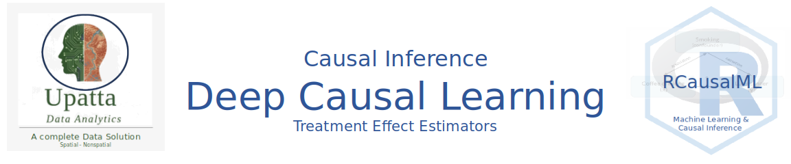
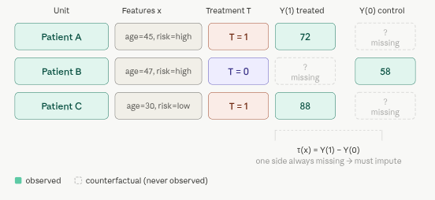
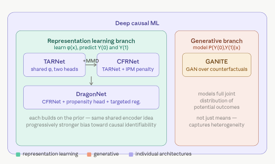

 

# 5.1 Treatment Effect Estimators {.unnumbered}

Treatment effect estimation is the core problem of causal inference: estimating how an intervention (treatment) changes outcomes compared to a counterfactual scenario. Deep Causal ML has developed several architectures to tackle this, each with different assumptions and tradeoffs. In this section, we'll give an overview of the key ideas behind four influential models: **DragonNet**, **TARNet**, **CFRNet**, and **GANITE**.

## Overview

The heart of causal inference is the **Fundamental Problem of Causal Inference**: for any individual, you can only ever observe *one* potential outcome. If a patient took a drug, you see $Y(1)$. You never see what would have happened had they not taken it, $Y(0)$. That missing value -- the *counterfactual* -- is what we're always trying to estimate.

The **Individual Treatment Effect (ITE)** is defined as:

$$
\tau(x) = Y(1) - Y(0)
$$

for a unit with features $x$.

Since $Y(1)$ and $Y(0)$ are never both observed, estimating $\tau(x)$ is fundamentally an imputation problem disguised as a prediction problem. Classical stats gave us ATE (average treatment effect across populations). What we really want is the *individual* version -- does *this specific patient* benefit from *this* drug?

Here's what the data actually looks like, and why it's hard:

{width="504"}

### Where deep learning enters: the representation-learning insight

Classical methods (matching, IPW, doubly-robust estimators) try to handle confounding through explicit statistical adjustments. Deep Causal ML takes a different approach: **learn a representation** $\phi(x)$ of covariates that is simultaneously useful for predicting outcomes and balanced across treatment groups.

The key insight — formalized by Shalit et al. (2017) — is that counterfactual error is bounded by factual error plus a term measuring how different the treated and control distributions look *in representation space*. Minimize both, and you get good counterfactual predictions.

Here below are the four main architectures that operationalize this insight in different ways:

**DragonNet** jointly learns three things from a single shared representation $\phi(x)$: two potential outcome heads $\mu_0$, $\mu_1$, and a propensity score head $P(T=1 \mid x)$. The propensity head isn't just for estimation -- it provides a *targeted regularisation* signal (inspired by targeted learning / TMLE) that nudges the representation toward features that matter for both treatment assignment and outcomes. This makes it more robust than simply training outcome heads alone.

**TARNet** (Treatment-Agnostic Representation Network) is the simpler foundation. It learns a single shared encoder $\phi(x)$ and then splits into two separate head networks -- one for control ($h_0$) and one for treated ($h_1$). The key idea is that the shared encoder learns features useful for predicting outcomes regardless of treatment, while the separate heads allow the response surfaces to differ between groups. There is *no explicit distributional constraint* on $\phi$, meaning the representation can still be biased toward whichever treatment group dominates the data.

**CFRNet** (Counterfactual Regression Network) adds exactly one thing on top of TARNet: an integral probability metric (IPM) penalty -- typically MMD or Wasserstein distance -- that penalises the distance between $\phi(X \mid T=0)$ and $\phi(X \mid T=1)$. This forces the encoder to produce *balanced* representations where treated and control units overlap, theoretically bounding the counterfactual generalisation error. The tradeoff is a hyperparameter $\lambda$ controlling how aggressively you enforce balance at the cost of factual fit.

**GANITE** takes a generative approach. A GAN-style generator $G$ is trained to produce plausible *counterfactual* outcomes $\tilde{Y}(1-T)$ for each unit, given $(x, T, Y_{\text{obs}})$ and noise -- a discriminator $D$ tries to distinguish real factual outcomes from generated counterfactuals, providing adversarial training signal. Once the generator is trained, a separate ITE network $\tau(x)$ is trained on the full set of generated potential outcome pairs $(\tilde{Y}_0, \tilde{Y}_1)$. This allows GANITE to model the *full joint distribution* of potential outcomes, not just their means, making it theoretically attractive for capturing treatment effect heterogeneity.

A quick comparison axis: `TARNet` is the baseline; `CFRNet` adds distributional balance; `DragonNet` adds propensity weighting for efficiency; `GANITE` replaces regression with generation, trading interpretability for expressiveness.

This is the bridge to the four architectures:

{width="637"}

### How the pieces connect

**Causal inference** asks: *what would happen under a different intervention?* This is fundamentally counterfactual reasoning — not prediction, not correlation. Traditional ML optimises predictive accuracy on observed data; causal ML optimises for accuracy on *unobserved* potential outcomes, which requires additional structure (assumptions like SUTVA, ignorability, overlap).

**Deep Causal ML** is the subfield that uses neural networks to do this, specifically by exploiting three things deep learning is good at:

1.  Learning flexible, high-dimensional representations $\phi(x)$ of covariates -- useful when $x$ is images, text, or hundreds of clinical variables.
2.  Sharing information across treatment groups through a common encoder, rather than fitting completely separate models.
3.  Optimising auxiliary objectives (distribution matching, propensity estimation, adversarial losses) jointly with the outcome loss.

The four architectures trace a clean lineage: `TARNet` establishes the shared-encoder-plus-two-heads paradigm. `CFRNet` asks "but what if the treated and control distributions in $\phi$-space are miles apart?" and adds an IPM penalty to force overlap. `DragonNet` asks "can we use the propensity score to make the representation even more causally informative?" and adds targeted regularisation borrowed from semiparametric efficiency theory. `GANITE` takes a completely different angle -- instead of regressing to point estimates of $E[Y(t) \mid x]$, it models the entire *joint distribution* of $(Y(0), Y(1))$ with a GAN, which is theoretically more faithful to the heterogeneous nature of treatment effects.

The deeper connection to **Causal ML more broadly**: all four sit within the Neyman-Rubin potential outcomes framework, assume *ignorability* (no unmeasured confounders), and address the *covariate shift* between treated and control groups -- which is the main reason naive regression fails for counterfactual estimation. What deep learning adds is the capacity to handle complex, high-dimensional $x$ where classical propensity score matching or inverse probability weighting breaks down.

## Summary and Conclusion

In summary, these four architectures represent a progression of ideas in deep causal inference, each building on the last to address key challenges in estimating individual treatment effects from observational data. They illustrate how deep learning can be harnessed to learn representations that are both predictive and balanced, enabling more accurate counterfactual predictions and ultimately better decision-making in high-stakes domains like healthcare. The choice between them depends on the specific context, data characteristics, and the tradeoffs you're willing to make between bias, variance, interpretability, and computational complexity — but understanding their core principles is essential for anyone looking to apply deep causal inference in practice.

## Resources

1.  Rubin, D. B. (1974). *Estimating causal effects of treatments in randomized and nonrandomized studies.* Journal of Educational Psychology, 66(5), 688–701. [psycnet.apa.org](https://psycnet.apa.org/record/1975-06502-001)

2.  Holland, P. W. (1986). *Statistics and causal inference.* JASA, 81(396), 945–960. [jstor.org](https://www.jstor.org/stable/2289064)

3.  **TARNet & CFRNet** — Shalit, Johansson & Sontag (2017). *Estimating individual treatment effect: generalization bounds and algorithms.* ICML. [proceedings.mlr.press](https://proceedings.mlr.press/v70/shalit17a/shalit17a.pdf); arXiv: [arxiv.org/abs/1606.03976](https://arxiv.org/abs/1606.03976)

4.  **DragonNet** — Shi, Blei & Veitch (2019). *Adapting neural networks for the estimation of treatment effects.* NeurIPS. [cs.columbia.edu](https://www.cs.columbia.edu/~blei/papers/ShiBleiVeitch2019.pdf); arXiv: [arxiv.org/abs/1906.02120](https://arxiv.org/abs/1906.02120); Code: [github.com/claudiashi57/dragonnet](https://github.com/claudiashi57/dragonnet)

5.  **GANITE** — Yoon, Jordon & van der Schaar (2018). *GANITE: Estimation of individualized treatment effects using generative adversarial nets.* ICLR. [openreview.net](https://openreview.net/forum?id=ByKWUeWA-)

6.  **Targeted Learning / TMLE** (the inspiration for DragonNet's targeted regularisation), - van der Laan & Rose (2011). *Targeted Learning.* Springer. [link.springer.com](https://link.springer.com/book/10.1007/978-1-4419-9782-1)

