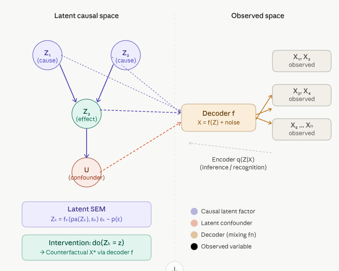

 

# 5.2 Generative Latent-Variable Causal Models (GLVCMs) {.unnumbered}

Generative Latent-Variable Causal Models (GLVCMs) are a powerful class of models that combine the strengths of deep generative modeling, latent variable modeling, and causal inference. They provide a framework for learning interpretable, disentangled representations of data that capture underlying causal mechanisms, and enable reasoning about interventions and counterfactuals. This makes them particularly useful for applications in fields like genomics, healthcare, and any domain where understanding the causal structure of data is crucial.

## Overview

A **Generative Latent-Variable Causal Model** sits at the intersection of three ideas — generative modeling, latent variable modeling, and causal structure — and fuses them into a single unified framework. Before explaining the fusion, it helps to understand each piece.

### The Three Building Blocks

**1. Latent Variables (Z)** These are hidden, unobserved variables that explain the variation in what we actually see. Lots of variability in data (such as images) is due to factors like gender, eye color, pose, etc. — but unless data is annotated, these factors are not explicitly available and are therefore latent. The idea is to explicitly model these factors using latent variables Z.

**2. Generative Models** Deep latent variable models are generative frameworks that use latent variables and nonlinear mappings to represent complex, high-dimensional data. They integrate probabilistic inference with deep neural networks using techniques like variational autoencoders and normalizing flows for flexible, robust modeling.

**3. Causal Structure** Structural causal models (SCMs) describe data-generating processes and model complex causal relationships and mechanisms among variables in a system, and can naturally be combined with deep generative models.

Putting these together:

> **A Generative Latent-Variable Causal Model learns a deep generative model where the latent space is not just a compressed representation — it is a structured causal graph, where each latent dimension corresponds to a distinct causal factor.**

{width="598"}

### The Formal Structure

A GLVCM is defined by three interlocking components:

**1. A Latent Causal Prior — the SCM on Z**

The latent variables $Z = \{Z_1, Z_2, \ldots, Z_k\}$ are generated by a **Structural Causal Model**:

$Z_k = f_k(\text{pa}(Z_k), \varepsilon_k), \ \varepsilon_k \sim p(\varepsilon)$

where $\text{pa}(Z_k)$ are the causal parents of $Z_k$ in a latent DAG $G$, and $\varepsilon_k$ is independent noise. This means the latent space is not a flat cloud — it has internal causal architecture.

**2. A Nonlinear Decoder — the Mixing Function**

The observed data $X$ is generated from $Z$ through a deep neural network decoder:

$X = f(Z) + \text{noise}$, with $f$ parameterized by a neural network

The function f is typically estimated with deep neural networks, as in a deep generative model, and causal relationships are inferred through data arising from multiple environments such as different experimental interventions, time points, etc. Examples of generative models of this form include diffusion models, variational autoencoders, and flows.

**3. An Encoder — the Inference Network**

To learn from data, the model also needs to invert: given observed $X$, infer which latent $Z$ caused it:

$q(Z \mid X) \approx p(Z \mid X)$ (approximate posterior / encoder)

This is the variational inference step in VAE-based models, or the discriminator step in GAN-based models.

## How It Differs from a Regular Latent Variable Model

|   | Standard VAE / LVM | Generative Latent-Variable **Causal** Model |
|------------------|------------------|------------------------------------|
| Latent prior p(Z) | Factorized Gaussian (iid) | Structured causal DAG (SCM on Z) |
| Latent dimensions | Entangled, uninterpretable | Each Zₖ = a distinct causal factor |
| Interventions | Not supported | `do(Zₖ = z)` directly in latent space |
| Counterfactuals | Not possible | Yes — fix Z, decode X\* |
| Identifiability | Generally not identifiable | Identifiable under causal + disentanglement constraints |

## The Core Goal: Causal Representation Learning

Interpretability is achieved by enforcing sparsity (to simplify the model) and causality (to allow for an interventionist interpretation of the latent factors) through the use of causal graphical models. Transferability is achieved through the use of causal models, which are widely believed to yield stable, invariant, transferable predictions across changing contexts and environments.

The dream is a latent space where each dimension means something causally real — not just a useful compression, but a genuine **mechanism** in the world.

### Key Model Architectures

#### 1. CEVAE (Causal Effect Variational Autoencoder)

The pioneering model is **CEVAE**, introduced by Louizos et al. (NeurIPS 2017). It uses a variational autoencoder to learn a bidirectional mapping between high-dimensional observed covariates and a low-dimensional latent space. The architecture explicitly models how different subsets of latent variables influence treatment assignment and the outcome variable. By extracting latent features that affect both treatment and outcome, the model mitigates confounding bias when estimating causal effects.

**Key insight**: The latent variables $Z$ capture **unmeasured confounders**. The model jointly infers these confounders from proxy variables in the observed data and uses them to debias the causal effect estimation between treatment and outcome.

#### 2. CausalVAE

**CausalVAE** extends the standard VAE framework by replacing the independent Gaussian prior with a **causal prior** structured as a Directed Acyclic Graph (DAG) over the latent variables $Z$. Each latent dimension corresponds to a node in the graph, and structural equations (typically linear or neural) govern how each $Z_k$ depends on its causal parents in the latent space. This design imparts full interventional semantics to the latent representations, enabling $do$-operations and counterfactual generation directly in the latent space.

#### 3. iVAE (Identifiable Variational Autoencoder)

-   **Paper**: Khemakhem et al. (2019/2020) — “Variational Autoencoders and Nonlinear ICA: A Unifying Framework” (AISTATS 2020).
-   **Core idea**: Standard VAEs (and nonlinear ICA) suffer from identifiability issues due to rotational and functional ambiguities. iVAE achieves identifiability of the latent factors and generative parameters (up to permutation and scaling) by introducing **auxiliary variables** $u$ (e.g., class labels, additional observations, or time indices).
-   **Generative model**:
    -   Latent variables $Z$ are conditionally independent given $u$: $p(Z \mid u) = \prod_i p(Z_i \mid u)$.
    -   The prior on $Z$ is a flexible conditional distribution (often parameterized by a neural network) that depends on $u$.
    -   Observations follow $X = g(Z) + \text{noise}$, where $g$ is a nonlinear mixing function.
-   **Mechanism**: The auxiliary information $u$ breaks the inherent ambiguities of unsupervised nonlinear ICA/VAE, enabling recovery of the true independent components.
-   **Goal**: Principled disentanglement and recovery of the underlying generative factors, effectively solving nonlinear Independent Component Analysis within a VAE framework. It emphasizes **identifiability** rather than explicit causal graphs or treatment-outcome modeling.
-   **Key strength**: Strong theoretical guarantees for recovering the true latent structure when auxiliary variables are available. The learned latents are not only statistically independent but **identifiable**.

#### 4. CausalVAE-Opt (Optimized CausalVAE)

This is a practically tuned variant of the original **CausalVAE** (Yang et al., 2021), retaining the same core architecture—including the Causal Layer, DAG-based structural equations, acyclicity constraints, sparsity penalties, and support for counterfactuals and interventions. The main differences lie in implementation optimizations, such as improved hyperparameters, training schedules, or efficiency tweaks that enable faster convergence and better out-of-the-box performance without altering the fundamental causal modeling capabilities.

#### 5. CausalGAN

**CausalGAN** learns causal implicit generative models through adversarial training (Kocaoglu et al., ICLR 2018). The generator is conditioned on causal labels structured according to a known or assumed causal graph. The training procedure enforces that the learned distribution respects the causal structure for both observational and interventional queries, enabling sampling from interventional and counterfactual distributions.

#### 6. Deep Structural Causal Models (DSCM)

**Deep Structural Causal Models** (Pawlowski et al., NeurIPS 2020) integrate deep learning components (e.g., neural networks) into structural causal models and use normalizing flows in the decoder to achieve full invertibility. This invertibility allows exact (or highly accurate) mapping from observations $X$ back to the exogenous noise variables, which is essential for precise **individual-level counterfactual inference**—beyond mere population-level average effects.

#### 7. CausalDiscrepancy VAE

The **CausalDiscrepancy VAE** augments the standard VAE objective with a maximum mean discrepancy (MMD) term. This term encourages the model's generated data under virtual interventions to closely match real interventional data (when available). It has been applied, for example, to single-cell Perturb-Seq datasets involving CRISPR-based gene perturbations to improve estimation of causal effects from genetic interventions.

#### 8. CausalEGM

**CausalEGM** (Causal Encoding Generative Modeling) is a deep learning framework for nonlinear dimension reduction and generative modeling of dependencies among high-dimensional covariates that affect both treatment and outcome (Wang et al., PNAS 2024). It employs an autoencoder combined with GAN-based distribution matching and an adversarial loss to identify a compact set of latent confounders. By separating latent factors into those influencing treatment, outcome, both, or neither, it enables robust causal effect estimation in high-dimensional settings.

These models represent key advancements in combining deep generative modeling (VAEs, GANs, flows) with causal reasoning, each addressing different aspects such as confounder adjustment, identifiability, interventional semantics, counterfactuals, and scalability to high-dimensional or interventional data.

### Comparison Table

| Model | Core Technique | Main Goal | Key Innovation | Causal Strength | Best For | Limitations |
|-----------|-----------|-----------|-----------|-----------|-----------|-----------|
| **CEVAE** (2017) | Variational Autoencoder (VAE) | Estimate average treatment effects (ATE) in the presence of unobserved confounding | Treats unmeasured confounders as latent Z; joint modeling of X, T, Y via latent variables | Adjusts for hidden confounding using proxies | Causal effect estimation from observational data with high-dimensional covariates | No explicit causal graph in latent space; identifiability not guaranteed; mainly population-level effects |
| **CausalVAE** (2021) | VAE with causal prior | Disentangled representation learning with causal structure | Replaces independent Gaussian prior with a **DAG-structured causal prior** over latents (Causal Layer + structural equations) | Full interventional semantics ("do"-operations) and counterfactuals in latent space | Learning causally disentangled, interpretable latents; "what-if" queries | Assumes linear or simple causal relations in latent space initially; requires learning DAG structure |
| **iVAE** (2020) | Identifiable VAE + auxiliary variables | Identifiable nonlinear ICA / disentanglement | Introduces auxiliary variables ( u ) to make latents conditionally independent given ( u ), breaking rotational ambiguity | Strong theoretical **identifiability** guarantees (recover true factors up to permutation/scaling) | Principled disentanglement when side information (labels, time, etc.) is available | Does not explicitly model treatment-outcome or causal graphs; focuses on identifiability rather than interventions |
| **CausalVAE-Opt** | Optimized version of CausalVAE | Same as CausalVAE but with practical efficiency | Hyperparameter tuning, better training schedules, implementation tweaks | Same as CausalVAE | Faster training and deployment of CausalVAE-style models | Not a new model — just a tuned implementation |
| **CausalGAN** (2018) | Generative Adversarial Network (GAN) | Implicit causal generative modeling | Adversarial training conditioned on causal labels; enforces causal graph in generated distribution | Sampling from interventional and counterfactual distributions | Image/data generation that respects causal structure (e.g., labeled images) | Less stable training than VAEs; implicit model (harder to interpret exact mechanisms) |
| **DSCM** (2020) | Deep Structural Causal Models with normalizing flows | Tractable **individual-level counterfactuals** | Uses invertible normalizing flows in the decoder for exact (or highly accurate) inversion X → noise | Full Pearl’s ladder: association, intervention, **and precise individual counterfactuals** | Scenarios needing subject-specific "what if I had..." (e.g., medical imaging) | Computationally heavier due to flows; requires careful design of invertible mechanisms |
| **CausalDiscrepancy VAE** | VAE + Maximum Mean Discrepancy (MMD) | Causal disentanglement from interventions/soft interventions | Adds MMD term to align virtual interventional distributions with real interventional data | Improves identifiability and disentanglement when partial interventional data is available (e.g., Perturb-Seq) | Single-cell or perturbation datasets with some known interventions | Relies on availability of interventional data; MMD can be sensitive to kernel choice |
| **CausalEGM** (2024) | Encoding Generative Modeling (autoencoder + GAN-like matching) | Nonlinear dimension reduction for high-dimensional causal inference | Learns low-dimensional latent confounders by partitioning latents (affects treatment, outcome, both, or neither) with generative reconstruction | Robust covariate adjustment in very high-dimensional settings via dependency-aware reduction | Observational studies with massive covariates (genomics, etc.); scalable causal effect estimation | Focuses more on dimension reduction than full generative counterfactuals; newer with fewer benchmarks |

### Key Conceptual Differences

-   **Treatment-Outcome Focus vs. General Disentanglement**:
    -   CEVAE and CausalEGM are primarily designed for **causal effect estimation** (adjusting for confounding in observational data).
    -   iVAE focuses on **identifiability** of independent factors (more statistical/ML than applied causality).
    -   CausalVAE, CausalGAN, and DSCM emphasize **generative capabilities** with explicit causal structure for interventions and counterfactuals.
-   **How They Handle Latent Structure**:
    -   Standard VAE (baseline): Assumes independent latents → suffers from entanglement and lack of identifiability.
    -   CEVAE: Learns latents that capture shared confounders but without structured DAG.
    -   CausalVAE: Explicit **causal DAG** in latent space → allows "do"-interventions on individual latent factors.
    -   iVAE: Uses auxiliary info to achieve **identifiability** without needing a causal graph.
    -   DSCM: Models full **structural equations** with deep invertible components → best for individual counterfactuals (abduction step is tractable).
-   **Training Paradigm**:
    -   VAE-based (CEVAE, CausalVAE, iVAE, CausalDiscrepancy): Evidence Lower Bound (ELBO) optimization — stable but approximate inference.
    -   GAN-based (CausalGAN, elements in CausalEGM): Adversarial training — good for sharp samples but can be unstable.
    -   Flow-based (DSCM): Invertibility enables exact likelihood and precise noise inference.
-   **Level of Causality (Pearl’s Ladder)**:
    -   Most handle **association** and **intervention**.
    -   DSCM and CausalVAE excel at **counterfactuals**.
    -   CEVAE is strongest for **average treatment effects**.

### Practical Takeaways

-   Need **fast causal effect estimation** from observational data? → Start with **CEVAE** or **CausalEGM** (especially for very high dimensions).
-   Want **interpretable causal disentanglement** with interventions? → **CausalVAE**.
-   Have auxiliary information (labels, etc.)? → **iVAE** for theoretically grounded disentanglement.
-   Need **individual-level counterfactuals** (e.g., personalized medicine)? → **DSCM**.
-   Working with **real interventions** (like gene perturbations)? → **CausalDiscrepancy VAE**.
-   Generating data (images, etc.) that respects causality? → **CausalGAN**.

These models often complement each other. Many modern works combine ideas (e.g., causal priors + flows + identifiability constraints).

Would you like a deeper dive into any specific pair (e.g., CEVAE vs CausalVAE), or examples of when to choose one over the others for a particular application?

### Three Things You Can Do That Regular Models Cannot

**1. Interventional Sampling** — `do(Zₖ = z)` Fix a latent causal factor to a specific value, propagate through the latent DAG, decode to X. This generates data from an interventional distribution P(X \| do(Zₖ = z)) — impossible in a standard VAE.

**2. Counterfactual Generation** Given an observed individual X, infer their latent Z via the encoder, then ask: *"What would X have looked like if Z₂ had been different?"* This is the Rung 3 of Pearl's causal ladder, and it requires both the encoder (abduction) and the decoder (prediction).

**3. Disentangled, Interpretable Representations** Generative models can be used to learn latent representations that better capture factors of variation — in particular, latent factors that capture causal dependencies. In cell microscopy, for example, each intervention may correspond to CRISPR knockouts or drug administration, where the effects act on latent factors rather than at the individual pixel level.

### The Identifiability Challenge

The central theoretical problem: even when X is linear in Z, it is impossible to recover the causal graph G without at least one intervention on each latent factor. This is why modern GLVCM research heavily focuses on **multi-environment data**, **interventional datasets**, and **contrastive learning** to achieve identifiability — recovering not just a useful Z, but the *true* causal Z.

## Summary and Conclusion

Generative Latent-Variable Causal Models (GLVCMs) are a powerful framework that combines deep generative modeling with causal inference. By structuring the latent space as a causal DAG, these models enable interventional and counterfactual reasoning directly in the latent space, while the decoder maps these causal latents to complex, high-dimensional observed data. This allows for learning disentangled representations that capture underlying causal mechanisms, and provides a principled way to perform causal inference and generate counterfactuals in complex domains.

```         
Generative Latent-Variable Causal Model
│
├── Latent Space Z          ← Structured as a causal DAG (SCM)
│   ├── Z₁, Z₂, ...        ← Each = one interpretable causal mechanism
│   └── Zₖ = f(pa(Zₖ), ε) ← Structural equations govern Z
│
├── Decoder X = f(Z)        ← Deep neural net (VAE / Flow / GAN)
│   └── Maps causal latents → observed high-dimensional data
│
├── Encoder q(Z|X)          ← Infers latent causes from observations
│
└── What you gain
    ├── Interventional distributions  P(X | do(Z=z))
    ├── Counterfactual generation     "What if Z₂ had been different?"
    └── Disentangled, causal representations that transfer across domains
```

These models are now central to **causal representation learning** — one of the most active frontiers in deep learning, with applications from drug discovery and genomics to computer vision and robotics.

## Resources

1.  Louizos, C., Shalit, U., Mooij, J. M., Sontag, D., Zemel, R., & Welling, M. (2017). Causal Effect Inference with Deep Latent-Variable Models. *Advances in Neural Information Processing Systems (NeurIPS)*.\
    arXiv:1705.08821.

2.  Yang, M., Liu, F., Chen, Z., Shen, X., Hao, J., & Wang, J. (2021). CausalVAE: Disentangled Representation Learning via Neural Structural Causal Models. *Proceedings of the IEEE/CVF Conference on Computer Vision and Pattern Recognition (CVPR)*, 9588–9597.\
    arXiv:2004.08697 (earlier version).

3.  Khemakhem, I., Kingma, D. P., Monti, R. P., & Hyvärinen, A. (2020). Variational Autoencoders and Nonlinear ICA: A Unifying Framework. *Proceedings of the 23rd International Conference on Artificial Intelligence and Statistics (AISTATS)*, 2207–2217.\
    arXiv:1907.04809.

4.  Kocaoglu, M., Snyder, C., Dimakis, A. G., & Vishwanath, S. (2018). CausalGAN: Learning Causal Implicit Generative Models with Adversarial Training. *International Conference on Learning Representations (ICLR)*.\
    arXiv:1709.02023.

5.  Pawlowski, N., Castro, D. C., & Glocker, B. (2020). Deep Structural Causal Models for Tractable Counterfactual Inference. *Advances in Neural Information Processing Systems (NeurIPS)*.\
    arXiv:2006.06485.

6.  Liu, Q., et al. (2024). An encoding generative modeling approach to dimension reduction and covariate adjustment in causal inference with observational studies. *Proceedings of the National Academy of Sciences (PNAS)*, 121(23), e2322376121.

**Note on the remaining models:**

-   **CausalVAE-Opt**: This appears to be a practically optimized implementation or tuned variant of the original CausalVAE (Yang et al., 2021) rather than a distinct published model. No separate paper was identified; it typically refers to improved hyperparameters, training schedules, or codebase defaults built on the base CausalVAE architecture.

-   **CausalDiscrepancy VAE**: This refers to discrepancy-based VAE approaches for causal disentanglement, often linked to frameworks using Maximum Mean Discrepancy (MMD) to align virtual interventional distributions with observed interventional data (e.g., in single-cell Perturb-Seq settings). A closely related published work is:\
    Zhang, J., et al. (2023). Identifiability Guarantees for Causal Disentanglement from Soft Interventions. *Advances in Neural Information Processing Systems (NeurIPS)*.\
    Related code and extensions exist under “discrepancy_vae” for identifiability in causal disentanglement.


