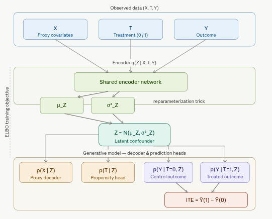

# 5.2.1 CEVAE: Generative Model with Latent Confounders

Generative models for causal inference have become a powerful framework for estimating treatment effects in complex, high-dimensional settings. Among them, the **Counterfactual Variational Autoencoder (CEVAE)** stands out for its ability to handle *latent confounding* — a pervasive challenge in observational data where the true confounders are not directly measured but are only accessible through noisy proxy variables. By embedding causal assumptions directly into a deep generative model, CEVAE learns a structured latent representation that supports principled counterfactual reasoning and accurate individual treatment effect estimation.

This notebook provides a comprehensive overview of CEVAE's architecture, assumptions, and training procedure, followed by an implementation in R using the [{RCausalML}](https://github.com/zia207/RCausalML) package. We benchmark CEVAE against traditional meta-learners (S-, T-, X-, and R-Learners) on both the IHDP semi-synthetic dataset and a synthetic dataset with hidden confounding, evaluating performance in terms of ATE, MAE, AUUC, and cumulative gain.

## Overview

CEVAE is a deep generative model for causal inference introduced by Louizos et al. (2017). Its central insight is that in many real-world settings the observed covariates **X** are not the true confounders — they are noisy proxies of some underlying latent variable **Z** that simultaneously influences both treatment assignment and outcomes. Standard causal methods that condition on **X** directly therefore fail to fully eliminate confounding. CEVAE addresses this by learning **Z** from data using a Variational Autoencoder (VAE) framework and then performing causal inference in that latent space.

### The Causal Problem CEVAE Solves

Methods such as `TARNet`, `CFRNet`, `DragonNet`, and `GANITE` all rely on the standard *ignorability* assumption — that all confounders are observed in **X**. In practice this is rarely satisfied. A patient's true health status **Z** is never fully measured; the clinician sees only noisy proxies such as blood pressure readings, laboratory values, and clinical notes. Conditioning on these proxies as if they were **Z** leaves residual confounding that biases causal estimates.

CEVAE (Louizos et al., NeurIPS 2017) takes a different approach: it uses a VAE to *infer* the latent confounder **Z** from the proxy measurements, and then trains a causal model on top of this inferred representation. Treatment and outcome information are fed into the encoder during training, giving the model every available signal to disentangle the underlying confounder from measurement noise.

In the standard potential outcomes setup, we observe:

-   **X** — proxy covariates (e.g., test scores, survey responses, clinical measurements)
-   **T** — binary treatment indicator
-   **Y** — observed outcome

The key assumption is that there exists a latent **Z** such that:

$$T \perp Y(t) \mid Z \quad \text{(ignorability holds in the latent space)}$$

but *not* necessarily $T \perp Y(t) \mid X$. Because **X** is an imperfect, noisy measurement of the true confounder **Z**, conditioning only on **X** leaves residual bias. CEVAE recovers **Z** and conditions on it instead.

### The Generative Model

CEVAE specifies a joint generative process over all observed variables, driven by the latent confounder **Z**:

$$p(Z) = \mathcal{N}(0, I)$$

$$p(X \mid Z) = \prod_j p(x_j \mid Z) \quad \text{(factored, mixed likelihood)}$$

$$p(T \mid Z) = \text{Bernoulli}\!\left(\sigma(f_T(Z))\right)$$

$$p(Y \mid T, Z) = p(Y \mid T=0, Z)\cdot(1-T) + p(Y \mid T=1, Z)\cdot T$$

where $f_T$ and the outcome distributions are parameterized by neural networks. The outcome likelihood is Gaussian for continuous outcomes and Bernoulli for binary outcomes. Critically, **T and Y are conditionally independent given Z**, which enforces the ignorability assumption in the latent space.

### The Inference Model (Encoder)

Because **Z** is unobserved, CEVAE must infer it from data. It defines a variational posterior

$$q(Z \mid X, T, Y) \approx p(Z \mid X, T, Y)$$

implemented as a neural network that takes all observed variables as input and outputs the parameters $(\mu_Z, \sigma_Z^2)$ of a Gaussian approximate posterior. Feeding treatment and outcome into the encoder during training allows the model to use all available signal about the latent confounder. The reparameterization trick makes end-to-end backpropagation through stochastic **Z** samples possible.

### Training via the ELBO

CEVAE is trained by maximizing the Evidence Lower Bound (ELBO), which balances reconstruction fidelity against regularization of the latent space:

$$\mathcal{L} = \mathbb{E}_{q(Z|X,T,Y)}\!\left[\log p(X|Z) + \log p(T|Z) + \log p(Y|T,Z)\right] - D_{\mathrm{KL}}\!\left(q(Z|X,T,Y) \,\|\, p(Z)\right)$$

The **reconstruction terms** ensure the generative model explains the observed data well. The **KL divergence** regularizes **Z** toward the unit Gaussian prior, preventing overfitting and encouraging a smooth, well-structured latent space. Optimizing this objective jointly trains the encoder and all decoder heads.

### Counterfactual Prediction

Once trained, CEVAE estimates individual treatment effects (ITE) through a three-step procedure:

1.  **Encode**: given $(X_i, T_i, Y_i)$, sample $Z_i \sim q(Z \mid X_i, T_i, Y_i)$
2.  **Predict both potential outcomes**: $\hat{Y}_i(0) = \mathbb{E}[Y \mid T{=}0, Z_i]$ and $\hat{Y}_i(1) = \mathbb{E}[Y \mid T{=}1, Z_i]$
3.  **Estimate ITE**: $\hat{\tau}_i = \hat{Y}_i(1) - \hat{Y}_i(0)$

Both potential outcomes are predicted from the same inferred **Z**, which is what gives CEVAE its *counterfactual coherence* — the factual and counterfactual are grounded in the same underlying confounder estimate.

### Key Architectural Components

| Component | Role |
|------------------------------------|------------------------------------|
| **Encoder** $q(Z \mid X, T, Y)$ | Infers the latent confounder from all observed variables |
| **Decoder** $p(X \mid Z)$ | Reconstructs proxy covariates; anchors the latent space to observables |
| **Treatment head** $p(T \mid Z)$ | Models the propensity score in latent space |
| **Outcome heads** $p(Y \mid T{=}0, Z),\ p(Y \mid T{=}1, Z)$ | Separate networks for each potential outcome |
| **Prior** $p(Z)$ | Standard Gaussian regularizer |

### CEVAE Model Architecture

The figure below illustrates the full data flow through CEVAE. The left side shows the *inference path* (encoder), and the right side shows the *generative path* (decoder and prediction heads).



### How CEVAE Relates to Other Methods

| Method | Handles latent confounders | Architecture |
|------------------------|------------------------|------------------------|
| TARNet / CFRNet | No — assumes **X** contains all confounders | Shared encoder + two outcome heads |
| DragonNet | No — same assumption; adds a propensity head | Shared encoder + propensity + outcome heads |
| **CEVAE** | **Yes** — explicitly models **Z** as latent | Full VAE generative model |

CEVAE is strictly more general in its confounding assumptions. The trade-off is that it is harder to train, more sensitive to generative model misspecification, and computationally heavier than discriminative approaches such as TARNet.

### Assumptions and Limitations

**Assumptions:**

-   Ignorability holds in the latent space **Z**, not necessarily in **X**
-   The generative model structure (the way **Z** produces **X**, **T**, **Y**) is correctly specified
-   The variational posterior approximation is sufficiently flexible

**Practical limitations:**

-   Sensitive to the choice of decoder architecture for **X** — misspecifying $p(X \mid Z)$ can corrupt the inferred **Z**
-   Identifiability of **Z** is not guaranteed in general; the structured causal graph helps anchor the latent space, but cannot guarantee it
-   Harder to train stably than TARNet or CFRNet, especially on small datasets
-   Counterfactual quality depends on how well the encoder separates confounding signal from measurement noise in **X**

### Extensions

Subsequent work has refined and extended the CEVAE framework:

-   **DCEVAE** disentangles the latent space into components that are *independent* of treatment versus *correlated* with it, improving counterfactual generation quality. See [ojs.aaai.org](https://ojs.aaai.org/index.php/AAAI/article/view/16990) for details.
-   **VCI (Variational Causal Inference)** argues that the vanilla CEVAE formulation is not fully aligned with Pearl's counterfactual semantics, and proposes a stricter framework with disentangled exogenous noise abduction — particularly important for high-dimensional outcomes such as gene expression profiles. See [arxiv.org](https://arxiv.org/html/2410.12730v2) for the full treatment.

The primary limitation shared by all these approaches is that **X** must be sufficiently informative about **Z** to allow reliable recovery. When proxy measurements are very weak, the confounder posterior will be poorly identified and causal estimates will degrade.

## Implementation in R

We use {RCausalML}'s `cevae()` implementation — torch-based when the `torch` package is available, otherwise falling back to a CPU placeholder — to fit the model on two benchmarks: the IHDP semi-synthetic dataset and a synthetic dataset with hidden confounding. We compare CEVAE's ITE predictions against meta-learners (S, T, X, R) and evaluate ATE, MAE, and AUUC on both training and validation splits.

The {RCausalML} package can be installed directly from GitHub:

## Set Up

### Check and Install Required R Packages

Following R packages are required to run this notebook. If any of these packages are not installed, you can install them using the code below:

`tidyverse`, `plyr`, `RCausalML`, `causaldata`, `torch`, `ForCausality`, `mlbench`, `xgboost`, `future`

```{r}
#| label: lst-packages-vector
#| lst-cap: "Required R package names used throughout the notebook."
packages <- c(
  "tidyverse",
  "plyr",
  "RCausalML",
  "causaldata",
  "torch",
  "ForCausality",
  "mlbench",
  "xgboost",
  "future"
)
```

### Install Missing Packages

```{r}
#| label: lst-install-missing-packages
#| lst-cap: "Optional commands to install missing CRAN/GitHub dependencies (commented by default)."
#| warning: false
#| error: false
# Install missing packages
# new_packages <- packages[!(packages %in% installed.packages()[, "Package"])]
# if (length(new_packages)) install.packages(new_packages)
```

### Verify Installation

```{r}
#| label: lst-verify-package-installation
#| lst-cap: "Check that each required package namespace is available."
# Verify installation
cat("Installed packages:\n")
print(sapply(packages, requireNamespace, quietly = TRUE))
```

### Load R Packages

```{r}
#| warning: false
#| error: false
# Load packages with suppressed messages
invisible(lapply(packages, function(pkg) {
  suppressPackageStartupMessages(library(pkg, character.only = TRUE))
}))
```

### Check Loaded Packages

```{r}
#| label: lst-check-loaded-packages
#| lst-cap: "Confirm which package environments are attached on the search path."
# Check loaded packages
cat("Successfully loaded packages:\n")
print(search()[grepl("package:", search())])
```

```{r}
#| label: setup
#| warning: false
run_fast <- Sys.getenv("CAUSALML_FAST_RENDER", "TRUE") == "TRUE"
device_use <- NULL
if (requireNamespace("torch", quietly = TRUE)) {
  device_use <- if (torch::cuda_is_available()) "cuda" else "cpu"
  torch::torch_manual_seed(42L)
}
set.seed(42)
```

## Fitting CEVAE on the IHDP Dataset (semi-synthetic)

We first benchmark CEVAE on the Infant Health and Development Program (IHDP) dataset, a widely used semi-synthetic benchmark for treatment effect estimation. The dataset simulates a randomized early childhood intervention and augments the real-world covariates with simulated potential outcomes, giving us access to ground-truth individual treatment effects.

### Dataset

We load all nine IHDP replication files (`ihdp_npci_1.csv` through `ihdp_npci_9.csv`) from the CausalML repository and concatenate them. The combined dataset is then replicated to match the scale used in the original CEVAE experiments (Louizos et al., 2017). Columns follow the standard IHDP convention: `treatment`, `y_factual`, `y_cfactual`, `mu0`, `mu1`, and 25 covariates. Covariates are reordered so that binary features come first (Python indices 6–24; R columns 7–25), followed by continuous features (Python indices 0–5; R columns 1–6), matching the feature ordering in the [Python CausalML CEVAE example](https://causalml.readthedocs.io/en/latest/examples/cevae_example.html).

```{r}
#| label: load-ihdp
base_url <- "https://raw.githubusercontent.com/uber/causalml/master/docs/examples/data"
cols <- c("treatment", "y_factual", "y_cfactual", "mu0", "mu1", paste0("X", 0:24))
df <- NULL
for (i in 1:9) {
  url <- sprintf("%s/ihdp_npci_%d.csv", base_url, i)
  tmp <- tryCatch({
    read.csv(url, header = FALSE)
  }, error = function(e) NULL)
  if (!is.null(tmp) && nrow(tmp) > 0) {
    colnames(tmp) <- cols[seq_len(ncol(tmp))]
    if (is.null(df)) df <- tmp else df <- rbind(df, tmp)
  }
}
if (!is.null(df) && nrow(df) > 0) {
  replications <- if (run_fast) 2L else 10L
  df <- do.call(rbind, replicate(replications, df, simplify = FALSE))
  message("Loaded IHDP (all 9 files × ", replications, " replications): ",
          nrow(df), " × ", ncol(df))
} else {
  df <- NULL
}

# Fallback to a synthetic dataset if the IHDP files cannot be downloaded
if (is.null(df) || nrow(df) == 0) {
  d <- synthetic_data(mode = 1, n = 5000, p = 25, sigma = 1.0, adj = 0)
  df <- as.data.frame(d$X)
  colnames(df) <- paste0("X", 0:(ncol(df) - 1))
  df$treatment  <- d$w
  df$y_factual  <- d$y
  df$y_cfactual <- ifelse(d$w == 1, d$b - 0.5 * d$tau, d$b + 0.5 * d$tau)
  df$mu0        <- d$b - 0.5 * d$tau
  df$mu1        <- d$b + 0.5 * d$tau
  message("Using synthetic fallback: ", nrow(df), " × ", ncol(df))
}

# Feature ordering: binary first, continuous second (matches the Python example)
binfeats  <- 7:25
contfeats <- 1:6
perm      <- c(binfeats, contfeats)
xcols     <- paste0("X", 0:24)
X         <- as.matrix(df[, xcols][, perm])
treatment <- as.integer(df$treatment)
y         <- as.numeric(df$y_factual)
y_cf      <- as.numeric(df$y_cfactual)
mu0       <- as.numeric(df$mu0)
mu1       <- as.numeric(df$mu1)
tau       <- ifelse(df$treatment == 1,
                    df$y_factual - df$y_cfactual,
                    df$y_cfactual - df$y_factual)

# 80/20 train–validation split (random_state = 1, matching the Python example)
n <- nrow(X)
set.seed(1)
ite <- sample(n, size = round(0.2 * n))
itr <- setdiff(seq_len(n), ite)

X_train         <- X[itr, ]; X_val       <- X[ite, ]
treatment_train <- treatment[itr]; treatment_val <- treatment[ite]
y_train         <- y[itr];   y_val       <- y[ite]
tau_train       <- tau[itr]; tau_val     <- tau[ite]
mu_0_train      <- mu0[itr]; mu_1_train  <- mu1[itr]

cat("Train size:", length(itr), "| Val size:", length(ite), "\n")
```

### Fitting the CEVAE Model

We fit CEVAE on the training set and obtain ITE predictions for both the training and validation splits. When `run_fast = TRUE`, we use smaller networks, fewer epochs, and a single deterministic prediction pass for rapid rendering. Setting `run_fast = FALSE` switches to the full hyperparameter configuration from Louizos et al. (2017) — 200-unit hidden layers, 20-dimensional latent space, and 100 Monte Carlo samples per prediction.

```{r}
#| label: cevae-model
n_samp_pred <- if (run_fast) 1L else 100L  # 1 = deterministic; >1 = MC averaging

cv <- cevae(
  X_train, treatment_train, y_train,
  device     = device_use,
  num_epochs = if (run_fast) 10L else 50L,
  num_samples= if (run_fast) 20L else 1000L,
  batch_size = if (run_fast) 256L else 100L,
  hidden_dim = if (run_fast) 64L else 200L,
  num_layers = if (run_fast) 2L else 3L,
  latent_dim = if (run_fast) 10L else 20L,
  verbose    = !run_fast
)

ite_train_cevae <- predict(cv, X_train, num_samples = n_samp_pred)
ite_val_cevae   <- predict(cv, X_val,   num_samples = n_samp_pred)

if (is.matrix(ite_train_cevae)) ite_train_cevae <- ite_train_cevae[, 1]
if (is.matrix(ite_val_cevae))   ite_val_cevae   <- ite_val_cevae[, 1]

ate_train_cevae <- mean(ite_train_cevae)
ate_val_cevae   <- mean(ite_val_cevae)

cat("CEVAE — ATE (train):", round(ate_train_cevae, 4),
    "| ATE (val):",         round(ate_val_cevae,   4), "\n")
```

### Fitting Meta-Learners

For comparison, we fit propensity scores with elastic net regularization (matching Python's `ElasticNetPropensityModel`) and four meta-learners — S-, T-, X-, and R-Learners — using random forest (`ranger`) as the base learner (Python uses LightGBM). The X- and R-Learners additionally receive estimated propensity scores.

```{r}
#| label: meta-learners
p_train <- propensity_glmnet(X_train, treatment_train)
p_val   <- propensity_glmnet(X_val,   treatment_val)

n_fold_meta <- if (run_fast) 3L else 5L

sl <- fit(SLearner(learner = "ranger"), X_train, treatment_train, y_train)
tl <- fit(TLearner(learner = "ranger"), X_train, treatment_train, y_train)
xl <- fit(XLearner(learner = "ranger"), X_train, treatment_train, y_train, p = p_train)
rl <- fit(RLearner(learner = "ranger", n_fold = n_fold_meta),
          X_train, treatment_train, y_train, p = p_train)

s_ite_train <- as.vector(predict(sl, X_train))
s_ite_val   <- as.vector(predict(sl, X_val))
t_ite_train <- as.vector(predict(tl, X_train))
t_ite_val   <- as.vector(predict(tl, X_val))
x_ite_train <- as.vector(predict(xl, X_train))
x_ite_val   <- as.vector(predict(xl, X_val))
r_ite_train <- as.vector(predict(rl, X_train))
r_ite_val   <- as.vector(predict(rl, X_val))
```

### Results: Training Set

We assemble a prediction data frame and compute ATE, MAE (relative to ground-truth $\tau$), and AUUC (area under the uplift curve, normalized) for all models. We then plot the cumulative gain curve.

```{r}
#| label: df-preds-train
df_preds_train <- data.frame(
  S     = s_ite_train,
  T     = t_ite_train,
  X     = x_ite_train,
  R     = r_ite_train,
  CEVAE = ite_train_cevae,
  tau   = tau_train,
  w     = treatment_train,
  y     = y_train
)
```

```{r}
#| label: result-train
df_result_train <- data.frame(
  Method = c("S", "T", "X", "R", "CEVAE", "actual"),
  ATE    = c(mean(s_ite_train), mean(t_ite_train), mean(x_ite_train),
             mean(r_ite_train), ate_train_cevae, mean(tau_train))
)
tau_train_1d <- as.numeric(tau_train)
df_result_train$MAE <- c(
  mean(abs(s_ite_train   - tau_train_1d)),
  mean(abs(t_ite_train   - tau_train_1d)),
  mean(abs(x_ite_train   - tau_train_1d)),
  mean(abs(r_ite_train   - tau_train_1d)),
  mean(abs(ite_train_cevae - tau_train_1d)),
  NA_real_
)

gain_train  <- get_cumgain(df_preds_train, outcome_col = "y",
                           treatment_col = "w", treatment_effect_col = "tau",
                           normalize = TRUE)
model_cols  <- intersect(c("S", "T", "X", "R", "CEVAE", "tau"),
                         colnames(gain_train))
auuc_train  <- colMeans(gain_train[, model_cols, drop = FALSE])

df_result_train$AUUC <- NA_real_
for (m in names(auuc_train)) {
  idx <- which(df_result_train$Method == if (m == "tau") "actual" else m)
  if (length(idx)) df_result_train$AUUC[idx] <- auuc_train[m]
}
knitr::kable(df_result_train, digits = 4,
             caption = "Training set: ATE, MAE, and AUUC by method")
```

```{r plot-gain-train, fig.height=5}
plot_gain(df_preds_train, outcome_col = "y", treatment_col = "w",
          treatment_effect_col = "tau",
          model_cols = c("S", "T", "X", "R", "CEVAE", "tau"),
          main = "Cumulative gain — training set", normalize = TRUE)
```

### Results: Validation Set

We repeat the same evaluation on the held-out validation set to assess generalization.

```{r}
#| label: df-preds-val
df_preds_val <- data.frame(
  S     = s_ite_val,
  T     = t_ite_val,
  X     = x_ite_val,
  R     = r_ite_val,
  CEVAE = ite_val_cevae,
  tau   = tau_val,
  w     = treatment_val,
  y     = y_val
)
```

```{r}
#| label: result-val
df_result_val <- data.frame(
  Method = c("S", "T", "X", "R", "CEVAE", "actual"),
  ATE    = c(mean(s_ite_val), mean(t_ite_val), mean(x_ite_val),
             mean(r_ite_val), ate_val_cevae, mean(tau_val))
)
tau_val_1d <- as.numeric(tau_val)
df_result_val$MAE <- c(
  mean(abs(s_ite_val   - tau_val_1d)),
  mean(abs(t_ite_val   - tau_val_1d)),
  mean(abs(x_ite_val   - tau_val_1d)),
  mean(abs(r_ite_val   - tau_val_1d)),
  mean(abs(ite_val_cevae - tau_val_1d)),
  NA_real_
)

gain_val   <- get_cumgain(df_preds_val, outcome_col = "y",
                          treatment_col = "w", treatment_effect_col = "tau",
                          normalize = TRUE)
auuc_val   <- colMeans(gain_val[, model_cols, drop = FALSE])

df_result_val$AUUC <- NA_real_
for (m in names(auuc_val)) {
  idx <- which(df_result_val$Method == if (m == "tau") "actual" else m)
  if (length(idx)) df_result_val$AUUC[idx] <- auuc_val[m]
}
knitr::kable(df_result_val, digits = 4,
             caption = "Validation set: ATE, MAE, and AUUC by method")
```

```{r plot-gain-val, fig.height=5}
plot_gain(df_preds_val, outcome_col = "y", treatment_col = "w",
          treatment_effect_col = "tau",
          model_cols = c("S", "T", "X", "R", "CEVAE", "tau"),
          main = "Cumulative gain — validation set", normalize = TRUE)
```

## Fitting CEVAE on a Synthetic Dataset with Hidden Confounding

The IHDP benchmark involves semi-synthetic outcomes layered onto real covariates. To stress-test CEVAE in a setting where the proxy-confounder structure is known by design, we use `simulate_hidden_confounder()`, which generates a data generating process where the observed **X** are explicitly constructed as noisy proxies of an underlying latent confounder.

### Dataset

We generate a dataset with `simulate_hidden_confounder(n, p = 5, sigma = 1.0, adj = 0)` and compare S-, T-, X-, and R-Learners (with both linear and random forest base learners) against CEVAE. This mirrors the Python CausalML example, which uses linear regression and XGBoost as base learners. Summary metrics include ATE, MSE, absolute percentage error of ATE, and AUUC; results are reported on both training and validation splits.

```{r}
#| label: synthetic-data
n_syn <- if (run_fast) 2000L else 10000L
d_syn <- simulate_hidden_confounder(n = n_syn, p = 5, sigma = 1.0, adj = 0)

X_syn   <- d_syn$X
y_syn   <- d_syn$y
w_syn   <- d_syn$w
tau_syn <- d_syn$tau
b_syn   <- d_syn$b
e_syn   <- d_syn$e

set.seed(123)
n_syn     <- nrow(X_syn)
idx_val   <- sample(n_syn, size = round(0.2 * n_syn))
idx_train <- setdiff(seq_len(n_syn), idx_val)

X_syn_tr  <- X_syn[idx_train, , drop = FALSE]; X_syn_val  <- X_syn[idx_val, , drop = FALSE]
y_syn_tr  <- y_syn[idx_train];                 y_syn_val  <- y_syn[idx_val]
w_syn_tr  <- w_syn[idx_train];                 w_syn_val  <- w_syn[idx_val]
tau_syn_tr<- tau_syn[idx_train];               tau_syn_val<- tau_syn[idx_val]

p_syn_tr  <- propensity_glmnet(X_syn_tr,  w_syn_tr)
p_syn_val <- propensity_glmnet(X_syn_val, w_syn_val)
```

### Fitting CEVAE and Meta-Learners

```{r}
#| label: synthetic-models
n_samp_syn <- if (run_fast) 1L else 100L

cv_syn <- cevae(
  X_syn_tr, w_syn_tr, y_syn_tr,
  device     = device_use,
  num_epochs = if (run_fast) 8L else 50L,
  num_samples= if (run_fast) 20L else 1000L,
  batch_size = if (run_fast) 256L else 100L,
  hidden_dim = if (run_fast) 64L else 200L,
  num_layers = if (run_fast) 2L else 3L,
  latent_dim = if (run_fast) 10L else 20L,
  verbose    = FALSE
)

ite_syn_cevae_tr  <- as.vector(predict(cv_syn, X_syn_tr,  num_samples = n_samp_syn))
ite_syn_cevae_val <- as.vector(predict(cv_syn, X_syn_val, num_samples = n_samp_syn))
if (is.matrix(ite_syn_cevae_tr))  ite_syn_cevae_tr  <- ite_syn_cevae_tr[, 1]
if (is.matrix(ite_syn_cevae_val)) ite_syn_cevae_val <- ite_syn_cevae_val[, 1]

preds_syn_train <- list()
preds_syn_valid <- list()

for (learner_name in c("lm", "ranger")) {
  sl_s <- fit(SLearner(learner = learner_name), X_syn_tr, w_syn_tr, y_syn_tr)
  tl_s <- fit(TLearner(learner = learner_name), X_syn_tr, w_syn_tr, y_syn_tr)
  xl_s <- fit(XLearner(learner = learner_name), X_syn_tr, w_syn_tr, y_syn_tr, p = p_syn_tr)
  rl_s <- fit(RLearner(learner = learner_name, n_fold = n_fold_meta),
              X_syn_tr, w_syn_tr, y_syn_tr, p = p_syn_tr)

  label <- function(meta) paste0(meta, " (", learner_name, ")")
  preds_syn_train[[label("S")]] <- as.vector(predict(sl_s, X_syn_tr))
  preds_syn_train[[label("T")]] <- as.vector(predict(tl_s, X_syn_tr))
  preds_syn_train[[label("X")]] <- as.vector(predict(xl_s, X_syn_tr))
  preds_syn_train[[label("R")]] <- as.vector(predict(rl_s, X_syn_tr))
  preds_syn_valid[[label("S")]] <- as.vector(predict(sl_s, X_syn_val))
  preds_syn_valid[[label("T")]] <- as.vector(predict(tl_s, X_syn_val))
  preds_syn_valid[[label("X")]] <- as.vector(predict(xl_s, X_syn_val))
  preds_syn_valid[[label("R")]] <- as.vector(predict(rl_s, X_syn_val))
}

preds_syn_train[["CEVAE"]] <- ite_syn_cevae_tr
preds_syn_valid[["CEVAE"]] <- ite_syn_cevae_val
```

### Results: Synthetic Dataset

```{r}
#| label: synthetic-summary
actual_ate_train <- mean(tau_syn_tr)
actual_ate_val   <- mean(tau_syn_val)

build_summary <- function(preds, tau_ref, actual_ate) {
  df <- data.frame(
    Method = c(names(preds), "Actuals"),
    ATE    = c(vapply(preds, mean, numeric(1)), actual_ate),
    MSE    = c(vapply(preds, function(p) mean((p - tau_ref)^2), numeric(1)), NA_real_)
  )
  df$AbsPctErrorATE <- if (actual_ate != 0)
    abs(df$ATE / actual_ate - 1) else rep(NA_real_, nrow(df))
  df$AbsPctErrorATE[df$Method == "Actuals"] <- NA_real_
  df
}

syn_sum_train <- build_summary(preds_syn_train, tau_syn_tr,  actual_ate_train)
syn_sum_val   <- build_summary(preds_syn_valid, tau_syn_val, actual_ate_val)

# AUUC on training
df_syn_train        <- as.data.frame(preds_syn_train)
df_syn_train$tau    <- tau_syn_tr
df_syn_train$w      <- w_syn_tr
df_syn_train$y      <- y_syn_tr
gain_syn_tr         <- get_cumgain(df_syn_train, outcome_col = "y",
                                   treatment_col = "w", treatment_effect_col = "tau",
                                   normalize = TRUE)
syn_sum_train$AUUC <- NA_real_
for (m in names(preds_syn_train)) {
  if (m %in% colnames(gain_syn_tr))
    syn_sum_train$AUUC[syn_sum_train$Method == m] <- mean(gain_syn_tr[, m])
}

# AUUC on validation
df_syn_val       <- as.data.frame(preds_syn_valid)
df_syn_val$tau   <- tau_syn_val
df_syn_val$w     <- w_syn_val
df_syn_val$y     <- y_syn_val
gain_syn         <- get_cumgain(df_syn_val, outcome_col = "y",
                                treatment_col = "w", treatment_effect_col = "tau",
                                normalize = TRUE)
syn_sum_val$AUUC <- NA_real_
for (m in names(preds_syn_valid)) {
  if (m %in% colnames(gain_syn))
    syn_sum_val$AUUC[syn_sum_val$Method == m] <- mean(gain_syn[, m])
}

cat("Synthetic — training summary:\n")
knitr::kable(syn_sum_train, digits = 4,
             caption = "Synthetic training set: ATE, MSE, Abs % Error ATE, AUUC")
cat("\nSynthetic — validation summary:\n")
knitr::kable(syn_sum_val, digits = 4,
             caption = "Synthetic validation set: ATE, MSE, Abs % Error ATE, AUUC")
```

### Cumulative Gain — Synthetic Validation Set

```{r plot-gain-synthetic, fig.height=5}
df_syn_val$Actuals <- tau_syn_val
plot_gain(df_syn_val, outcome_col = "y", treatment_col = "w",
          treatment_effect_col = "tau",
          model_cols = c(names(preds_syn_valid), "Actuals"),
          main = "Cumulative gain — synthetic validation set", normalize = TRUE)
```

## Summary and Conclusions

CEVAE is best understood as a principled answer to a problem that simpler methods ignore: *what if our covariates are only noisy measurements of the true underlying confounders?* By embedding causal assumptions directly into a generative model and learning a latent representation that satisfies ignorability, it provides a theoretically grounded path to counterfactual inference under proxy confounding. The trade-off is increased modeling complexity and a stronger reliance on correct generative model specification.

**Key takeaways from this notebook:**

-   **IHDP benchmark**: Replicates the structure of the [Python CausalML CEVAE example](https://causalml.readthedocs.io/en/latest/examples/cevae_example.html): all 9 IHDP files loaded, replicated ($2\times$ when `run_fast = TRUE`, $10\times$ otherwise), binary-first feature ordering; CEVAE plus S-, T-, X-, and R-Learners with elastic-net propensity; ATE, MAE, and AUUC reported on both training and validation sets with cumulative gain plots.

-   **Synthetic hidden-confounder benchmark**: `simulate_hidden_confounder(n, p = 5, sigma = 1, adj = 0)` with an 80/20 split; S-, T-, X-, and R-Learners with both `lm` and `ranger` base learners plus CEVAE; summary table (ATE, MSE, Abs % Error ATE, AUUC) and cumulative gain plot on the validation set.

-   **CEVAE runtime options**: When `torch` is installed, the full VAE-based CEVAE is used (GPU if CUDA is available); otherwise a CPU placeholder is used. Set `run_fast = TRUE` (default) for rapid rendering; set `run_fast = FALSE` for the full benchmark configuration.

## References

-   [CEVAE vs. Meta-Learners Benchmark (CausalML)](https://causalml.readthedocs.io/en/latest/examples/cevae_example.html)
-   Louizos, C., Shalit, U., Mooij, J. M., Sontag, D., Zemel, R., & Welling, M. (2017). [Causal Effect Inference with Deep Latent Variable Models](http://papers.nips.cc/paper/7223-causal-effect-inference-with-deep-latent-variable-models.pdf). *Advances in Neural Information Processing Systems (NeurIPS)*.
-   [RCausalML: R package for Machine Learning-based Causal Inference](https://github.com/zia207/RCausalML)
