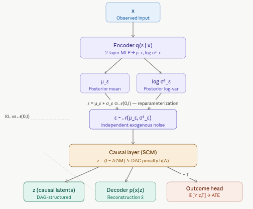
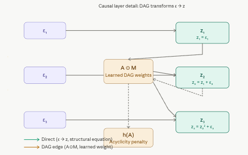

# 5.2.3 Causal Variational Autoencoder (CausalVAE)

This notebook provides a detailed guide to implementing and applying the **Causal Variational Autoencoder (CausalVAE)** in R, following the architecture introduced in "CausalVAE: Disentangled Representation Learning via Neural Structural Causal Models" (Yang et al., CVPR 2021). We cover the theoretical motivation, a full `torch`-based implementation via the [{RCausalML}](https://github.com/zia207/RCausalML) package, and an application to Average Treatment Effect (ATE) estimation on synthetic data with a known causal ground truth.

## Overview

Standard VAEs — and even identifiable VAEs such as iVAEs — assume that the latent dimensions are *statistically independent*. This is a convenient mathematical assumption, but it conflicts with how the world actually generates data: causes produce effects, and latent factors are often related by causal mechanisms rather than being simply correlated or independent.

**CausalVAE** addresses this by embedding a **Structural Causal Model (SCM)** directly in the latent space. Where a standard VAE encodes $x$ to a vector of independent noise variables $\varepsilon$ and decodes back, CausalVAE adds a *causal layer* between the encoder and decoder that transforms the independent $\varepsilon$ into causally structured latent variables $z$ according to a learnable Directed Acyclic Graph (DAG). The result is a generative model whose latent space is not just disentangled — it is *causally disentangled*, meaning each latent dimension corresponds to a distinct node in a causal graph, and the learned edges describe how those nodes causally influence one another.

This structure enables operations that are impossible in standard VAEs:

-   **Interventions**: set $\mathrm{do}(z_i = v)$ and propagate the effect through the graph to the other latents and to the reconstruction, without touching the unrelated dimensions.
-   **Counterfactual reasoning**: ask "what would $z_2$ have been if $z_1$ had taken a different value?"
-   **Treatment effect estimation**: because the causal graph is explicit, ATE can be estimated by intervening on the relevant latent node and reading off the downstream effect on the outcome.

## Model Architecture

### The Two-Stage Latent Space

CausalVAE separates the latent space into two layers with distinct roles:

-   **Exogenous variables** $\varepsilon$: Independent noise sources with prior $p(\varepsilon) = \mathcal{N}(0, I)$. These are what the encoder directly outputs — a representation that is, by construction, free of causal dependencies.

-   **Endogenous variables** $z$: Causally generated from $\varepsilon$ via the learned SCM. Each $z_i$ is a function of its parents in the DAG plus its own exogenous noise $\varepsilon_i$.

The forward pass therefore has an additional step compared to a standard VAE: after sampling $\varepsilon$, the causal layer applies the structural equations to produce $z$, and the decoder then reconstructs $x$ from $z$.

### The Causal Layer (SCM)

The causal layer implements the structural equations of the SCM. In the linear case:

$$z = (I - A \odot M)^{-1} \varepsilon$$

where $A$ is a matrix of learnable real-valued edge weights and $M$ is a binary mask that determines which edges are structurally permitted. In practice, this inversion is replaced by an additive fixed-point iteration:

$$z = \varepsilon + (A \odot M)\, z$$

Because $z$ must follow a DAG (no cycles), the matrix $A \odot M$ must be nilpotent, which is enforced by a continuous differentiable DAG penalty on $A$:

$$h(A) = \mathrm{tr}\!\left(\exp(A \circ A)\right) - d$$

where $d$ is the number of latent dimensions. This penalty equals zero if and only if $A \circ A$ has no positive-weight cycles, i.e., $A$ encodes a DAG. It is added to the loss with a Lagrange multiplier $\gamma$, giving the optimizer a continuous incentive to push the learned graph toward acyclicity without requiring discrete search.

### Data Flow

The complete forward pass is:

$$x \;\xrightarrow{\text{encoder}}\; (\mu_\varepsilon, \log\sigma^2_\varepsilon) \;\xrightarrow{\text{reparam.}}\; \varepsilon \;\xrightarrow{\text{causal layer}}\; z \;\xrightarrow{\text{decoder}}\; (\mu_x, \log\sigma^2_x)$$

The encoder outputs parameters of a Gaussian over $\varepsilon$ (not $z$ directly). The decoder receives the causally structured $z$ (not $\varepsilon$). This separation means the KL divergence is computed in the $\varepsilon$ space against $\mathcal{N}(0,I)$, keeping that term tractable, while the causal structure lives entirely in the transformation $\varepsilon \to z$.

### Loss Function

The training objective is a $\beta$-VAE ELBO augmented with causal regularizers:

$$\mathcal{L} = \underbrace{\mathbb{E}_{q(\varepsilon|x)}\!\left[\log p(x \mid z)\right]}_{\text{reconstruction}} - \underbrace{\beta\, D_{\mathrm{KL}}\!\left(q(\varepsilon \mid x) \,\|\, \mathcal{N}(0,I)\right)}_{\text{KL regularization}} - \underbrace{\gamma\!\left(h(A) + \lambda \|A\|_1\right)}_{\text{DAG + sparsity penalty}}$$

The three terms serve distinct purposes:

-   The **reconstruction loss** ensures the decoded output faithfully reproduces the input.
-   The **KL term** (weighted by $\beta > 1$ for stronger disentanglement) regularizes the exogenous variables toward independence.
-   The **DAG penalty** $h(A)$ enforces acyclicity of the learned causal graph.
-   The $\ell_1$ sparsity term $\lambda \|A\|_1$ encourages the learned graph to have few edges, promoting parsimonious causal explanations.



The causal layer deserves its own close-up showing how the DAG transforms ε into z.



### Identifiability and Weak Supervision

CausalVAE, like iVAE, faces identifiability challenges. Without additional constraints, the latent space can be arbitrarily rotated. In practice, the paper addresses this through **weak supervision**: the training procedure uses partial knowledge of the causal graph (e.g., which edges are forbidden, or which interventional experiments have been performed) to anchor the latent space. In the implementation below, the synthetic data is generated from a *known* causal chain, giving us ground-truth latents against which to evaluate the learned representation.

### Performing Interventions

Once trained, an intervention $\mathrm{do}(z_i = v)$ is carried out by:

1.  Encoding $x$ to obtain $\varepsilon$.
2.  Setting the $i$-th component of $z$ to $v$, bypassing the structural equation for node $i$.
3.  Propagating $v$ through the downstream edges in $A$ to update the children of $z_i$.
4.  Decoding the modified $z$ to produce the interventional reconstruction $\hat{x}_{\mathrm{do}(z_i=v)}$.

This is the mechanism that enables ATE estimation: intervene on the treatment node, observe the change in the outcome node, and average over the data distribution.

## Implementation in R

## Set Up

### Check and Install Required R Packages

Following R packages are required to run this notebook. If any of these packages are not installed, you can install them using the code below:

`torch`, `progress`, `ggplot2`, `corrplot`, `coro`, `RCausalML`, `tidyverse`

```{r}
#| label: lst-packages-vector
#| lst-cap: "Required R package names used throughout the notebook."
packages <- c(
  "torch",
  "progress",
  "ggplot2",
  "corrplot",
  "coro",
  "RCausalML",
  "tidyverse"
)
```

### Install Missing Packages

```{r}
#| label: lst-install-missing-packages
#| lst-cap: "Optional commands to install missing CRAN/GitHub dependencies (commented by default)."
#| warning: false
#| error: false
# Install missing packages
# new_packages <- packages[!(packages %in% installed.packages()[, "Package"])]
# if (length(new_packages)) install.packages(new_packages)
```

### Verify Installation

```{r}
#| label: lst-verify-package-installation
#| lst-cap: "Check that each required package namespace is available."
# Verify installation
cat("Installed packages:\n")
print(sapply(packages, requireNamespace, quietly = TRUE))
```

### Load R Packages

```{r}
#| warning: false
#| error: false
# Load packages with suppressed messages
invisible(lapply(packages, function(pkg) {
  suppressPackageStartupMessages(library(pkg, character.only = TRUE))
}))
```

### Check Loaded Packages

```{r}
#| label: lst-check-loaded-packages
#| lst-cap: "Confirm which package environments are attached on the search path."
# Check loaded packages
cat("Successfully loaded packages:\n")
print(search()[grepl("package:", search())])
```

### Device Setup

```{r}
#| label: device-setup
#| message: false

device <- if (torch::cuda_is_available()) "cuda" else "cpu"
cat("Using device:", device, "\n")
set.seed(42)
torch::torch_manual_seed(42L)
```

### Data Generation

We generate synthetic data from a known three-node causal chain $z_1 \to z_2 \to z_3$ with nonlinear structural equations:

$$z_1 = \varepsilon_1, \qquad z_2 = z_1 + \varepsilon_2, \qquad z_3 = z_2^2 + \varepsilon_3$$

Observations $x$ are a nonlinear mix of the causal latents, ensuring that the true causal structure cannot be read off from $x$ directly and must be recovered from the learned representation. Having access to the ground-truth latents $z$ allows us to directly evaluate whether the causal layer has learned the correct graph.

```{r}
#| label: generate-synthetic-data

generate_data <- function(n_samples = 5000L, latent_dim = 3L) {
  epsilon_mat <- matrix(rnorm(n_samples * latent_dim),
                        nrow = n_samples, ncol = latent_dim)
  z_mat <- matrix(0.0, nrow = n_samples, ncol = latent_dim)
  x_mat <- matrix(0.0, nrow = n_samples, ncol = latent_dim)

  # Causal chain: z1 -> z2 -> z3
  z_mat[, 1] <- epsilon_mat[, 1]
  z_mat[, 2] <- z_mat[, 1] + epsilon_mat[, 2]
  z_mat[, 3] <- z_mat[, 2]^2 + epsilon_mat[, 3]

  # Nonlinear observation model
  x_mat[, 1] <- z_mat[, 1] * z_mat[, 3]
  x_mat[, 2] <- sin(z_mat[, 2]) + z_mat[, 1]
  x_mat[, 3] <- z_mat[, 3]^2 + rnorm(n_samples, 0, 0.1)

  list(
    x       = torch_tensor(x_mat,       dtype = torch_float(), device = device),
    z       = torch_tensor(z_mat,       dtype = torch_float(), device = device),
    epsilon = torch_tensor(epsilon_mat, dtype = torch_float(), device = device)
  )
}

synthetic_data <- generate_data(n_samples = 5000L)
x             <- synthetic_data$x
true_z        <- synthetic_data$z
true_epsilon  <- synthetic_data$epsilon

# Standardize observations
normalize_data <- function(x) {
  mean_val <- x$mean(dim = 1L)
  std_val  <- x$std(dim  = 1L)
  list(x_norm = (x - mean_val) / std_val, mean = mean_val, std = std_val)
}

norm_result <- normalize_data(x)
x_norm      <- norm_result$x_norm
x_mean      <- norm_result$mean
x_std       <- norm_result$std

# 80/10/10 train–validation–test split
n_samples  <- nrow(x_norm)
train_size <- as.integer(0.8 * n_samples)
val_size   <- as.integer(0.1 * n_samples)

x_train <- x_norm[1:train_size, ]
x_val   <- x_norm[(train_size + 1):(train_size + val_size), ]
x_test  <- x_norm[(train_size + val_size + 1):n_samples, ]

true_z_train <- true_z[1:train_size, ]
true_z_val   <- true_z[(train_size + 1):(train_size + val_size), ]
true_z_test  <- true_z[(train_size + val_size + 1):n_samples, ]

cat(sprintf("Train: %d  |  Val: %d  |  Test: %d\n",
            nrow(x_train), nrow(x_val), nrow(x_test)))
```

### Model Initialization

The `CausalVAE()` constructor (from {RCausalML}) builds the encoder, causal layer, and decoder. The `loss_function()` computes the full augmented ELBO including the DAG penalty and sparsity regularizer.

We use a learning rate scheduler that halves the learning rate when validation loss plateaus, and a LR warmup phase in the first 10 epochs to prevent the DAG penalty from dominating before the reconstruction loss has stabilized.

```{r}
#| label: loss-function
#| warning: false

model     <- CausalVAE()$to(device = device)
optimizer <- optim_adam(model$parameters, lr = 1e-3, weight_decay = 1e-5)
scheduler <- lr_reduce_on_plateau(optimizer, mode = "min", factor = 0.5, patience = 15)
epochs    <- 200L

cat(sprintf("Model class  : %s\n", class(model)[1]))
cat(sprintf("Device       : %s\n", device))
cat(sprintf("Max epochs   : %d (with early stopping)\n", epochs))
cat(sprintf("Initial LR   : %.0e\n", 1e-3))
```

### Training

The training loop implements several practical stability measures:

-   **LR warmup** (first 10 epochs): the optimizer starts at a fraction of the target learning rate and ramps up linearly, preventing large early updates from disrupting the nascent causal structure.
-   **Capped gamma schedule**: the DAG penalty weight $\gamma$ is introduced gradually over the first 50 epochs and capped at 0.35, preventing the acyclicity constraint from overwhelming reconstruction early in training.
-   **Gradient clipping** (max norm 0.5): prevents gradient explosions, which are especially common when the matrix exponential in $h(A)$ produces large gradients.
-   **NaN/Inf detection**: batches with numerically unstable losses are skipped rather than allowed to corrupt the model weights.
-   **Early stopping**: training halts 10 epochs after the validation loss stops improving, and the best checkpoint is restored at the end.

```{r}
#| label: training-loop
#| warning: false
#| message: false

train_losses <- numeric(epochs)
val_losses   <- numeric(epochs)

# Hyperparameters
learning_rate       <- 2e-4
min_learning_rate   <- 5e-6
weight_decay        <- 1e-5
batch_size          <- 128L
epochs              <- 250L
warmup              <- 50L     # epochs over which gamma ramps up
lr_warmup_epochs    <- 10L
gamma_scale_cap     <- 0.35
grad_clip_max       <- 0.5
loss_skip_threshold <- 50.0

optimizer <- optim_adam(model$parameters, lr = learning_rate, weight_decay = weight_decay)
scheduler <- lr_reduce_on_plateau(optimizer, mode = "min", factor = 0.5,
                                  patience = 8, min_lr = min_learning_rate)

train_dataset <- torch::tensor_dataset(x_train)
train_loader  <- torch::dataloader(train_dataset, batch_size = batch_size, shuffle = TRUE)
val_dataset   <- torch::tensor_dataset(x_val)
val_loader    <- torch::dataloader(val_dataset,   batch_size = batch_size, shuffle = FALSE)

if (!requireNamespace("coro", quietly = TRUE))
  stop("Package 'coro' is required: install.packages('coro')")

best_val_loss          <- Inf
early_stopping_patience <- 10
early_stopping_counter <- 0
best_model_path        <- tempfile("causalvae_best_", fileext = ".pt")

save_best_model <- function(model, path) torch::torch_save(model$state_dict(), path)

for (epoch in 1:epochs) {

  # LR warmup: scale up from 0 to learning_rate over the first lr_warmup_epochs
  if (epoch <= lr_warmup_epochs)
    optimizer$param_groups[[1]]$lr <- learning_rate * (epoch / lr_warmup_epochs)

  # Gradually introduce the DAG penalty, capped to avoid post-valley instability
  gamma_scale <- min(gamma_scale_cap, (epoch + 1) / warmup)

  # ── Training phase ────────────────────────────────────────────────────────
  model$train()
  epoch_train_loss <- 0.0
  batch_count      <- 0

  for (batch in coro::collect(train_loader)) {
    x_batch <- (if (is.list(batch)) batch[[1]] else batch)$to(device = device)
    optimizer$zero_grad()

    out  <- model$forward(x_batch)
    loss <- loss_function(x_batch,
                          out$dec_mu, out$dec_logvar,
                          out$enc_mu, out$enc_logvar,
                          model, gamma_scale = gamma_scale)
    loss_val <- loss$item()

    if (!is.finite(loss_val)) {
      cat(sprintf("Warning: non-finite loss at epoch %d, skipping batch\n", epoch))
      next
    }
    if (loss_val > loss_skip_threshold) {
      cat(sprintf("Warning: loss %.1f > threshold %.1f at epoch %d, skipping\n",
                  loss_val, loss_skip_threshold, epoch))
      next
    }

    loss$backward()
    tryCatch(
      nn_utils_clip_grad_norm_(model$parameters, max_norm = grad_clip_max),
      error = function(e) { optimizer$zero_grad(); cat("Gradient clip error — zeroed grads\n") }
    )
    optimizer$step()
    epoch_train_loss <- epoch_train_loss + loss_val
    batch_count      <- batch_count + 1
  }
  train_losses[epoch] <- if (batch_count > 0) epoch_train_loss / batch_count else NA

  # ── Validation phase ──────────────────────────────────────────────────────
  model$eval()
  epoch_val_loss  <- 0.0
  val_batch_count <- 0

  with_no_grad({
    for (val_batch in coro::collect(val_loader)) {
      x_v <- (if (is.list(val_batch)) val_batch[[1]] else val_batch)$to(device = device)
      out  <- model$forward(x_v)
      loss <- loss_function(x_v,
                            out$dec_mu, out$dec_logvar,
                            out$enc_mu, out$enc_logvar,
                            model, gamma_scale = gamma_scale)
      lv <- loss$item()
      if (is.finite(lv)) {
        epoch_val_loss  <- epoch_val_loss + lv
        val_batch_count <- val_batch_count + 1
      }
    }
  })
  val_losses[epoch] <- if (val_batch_count > 0) epoch_val_loss / val_batch_count else NA

  # ── Scheduler + early stopping ────────────────────────────────────────────
  vl <- if (is.finite(val_losses[epoch])) val_losses[epoch] else Inf
  scheduler$step(vl)

  if (vl < best_val_loss - 1e-5) {
    best_val_loss          <- vl
    early_stopping_counter <- 0
    save_best_model(model, best_model_path)
  } else {
    early_stopping_counter <- early_stopping_counter + 1
  }

  if (early_stopping_counter >= early_stopping_patience) {
    cat(sprintf("Early stopping at epoch %d (no improvement for %d epochs)\n",
                epoch, early_stopping_patience))
    break
  }

  if (epoch == 1 || epoch %% 5 == 0) {
    lr <- optimizer$param_groups[[1]]$lr
    cat(sprintf("Epoch %3d — train: %.4f  val: %.4f  lr: %.2e  γ: %.3f\n",
                epoch, train_losses[epoch], val_losses[epoch], lr, gamma_scale))
  }
}

actual_epochs <- epoch
if (file.exists(best_model_path))
  model$load_state_dict(torch::torch_load(best_model_path))
```

### Training and Validation Loss

The plot below shows the negative ELBO over training. A well-behaved run exhibits three phases: a rapid initial decline as the reconstruction loss improves; a mid-training inflection as the DAG penalty activates and temporarily increases the loss; and a final convergence as the graph structure stabilizes and the ELBO settles. Early stopping ensures that we restore the checkpoint from the first loss valley rather than continuing into a noisier regime.

```{r}
#| label: visualize-training
#| fig-width: 6
#| fig-height: 5

epoch_df <- data.frame(
  Epoch      = 1:actual_epochs,
  Train_Loss = train_losses[1:actual_epochs],
  Val_Loss   = val_losses[1:actual_epochs]
)
epoch_df <- epoch_df[!is.na(epoch_df$Train_Loss) & !is.na(epoch_df$Val_Loss), ]

ggplot(epoch_df, aes(x = Epoch)) +
  geom_line(aes(y = Train_Loss, color = "Train"), linewidth = 1.0) +
  geom_line(aes(y = Val_Loss,   color = "Validation"), linewidth = 1.0) +
  labs(
    title = "CausalVAE: augmented ELBO by epoch",
    x = "Epoch", y = "Negative ELBO", color = ""
  ) +
  theme_minimal(base_size = 12) +
  theme(plot.title = element_text(hjust = 0.5, size = 13),
        legend.position = "top")
```

## ATE Estimation via Causal Interventions

### Why CausalVAE Can Estimate ATE

Because the learned latent space has explicit causal structure, ATE estimation reduces to a simple intervention: set the treatment node $T$ to 1 (treated) versus 0 (control), hold all exogenous noise $\varepsilon$ fixed, propagate through the DAG, and read off the expected change in the outcome. This is the do-calculus $\mathrm{do}(T = t)$ operationalized directly on the learned graph, without needing a separate propensity model or outcome regression.

In the synthetic setting below, treatment $T$ acts on $z_1$ and the outcome $Y$ is generated as $Y = z_3 + T \cdot 0.5 \cdot z_2 + \varepsilon_Y$, giving a true ATE of $0.5 \cdot \mathbb{E}[z_2]$.

### Generating Data with Treatment and Outcome

```{r}
#| label: ate-data-generation

generate_data_with_treatment <- function(n_samples = 5000L, latent_dim = 3L) {
  epsilon_mat <- matrix(rnorm(n_samples * latent_dim), nrow = n_samples, ncol = latent_dim)
  z_mat <- matrix(0.0, nrow = n_samples, ncol = latent_dim)
  z_mat[, 1] <- epsilon_mat[, 1]
  z_mat[, 2] <- z_mat[, 1] + epsilon_mat[, 2]
  z_mat[, 3] <- z_mat[, 2]^2 + epsilon_mat[, 3]

  T_vec <- rbinom(n_samples, 1, 0.5)
  Y_vec <- z_mat[, 3] + T_vec * 0.5 * z_mat[, 2] + rnorm(n_samples, 0, 0.1)

  x_mat <- matrix(0.0, nrow = n_samples, ncol = latent_dim)
  x_mat[, 1] <- z_mat[, 1] * z_mat[, 3]
  x_mat[, 2] <- sin(z_mat[, 2]) + z_mat[, 1]
  x_mat[, 3] <- z_mat[, 3]^2 + rnorm(n_samples, 0, 0.1)

  list(
    x       = torch_tensor(x_mat,                  dtype = torch_float(), device = device),
    z       = torch_tensor(z_mat,                  dtype = torch_float(), device = device),
    epsilon = torch_tensor(epsilon_mat,             dtype = torch_float(), device = device),
    T       = torch_tensor(matrix(T_vec, ncol = 1), dtype = torch_float(), device = device),
    Y       = torch_tensor(matrix(Y_vec, ncol = 1), dtype = torch_float(), device = device)
  )
}

ate_data      <- generate_data_with_treatment(n_samples = 5000L)
x_ate         <- ate_data$x
z_ate         <- ate_data$z
T_ate         <- ate_data$T
Y_ate         <- ate_data$Y
x_ate_norm    <- normalize_data(x_ate)$x_norm

train_size_ate <- as.integer(0.8 * nrow(x_ate_norm))
val_size_ate   <- as.integer(0.1 * nrow(x_ate_norm))

x_ate_test  <- x_ate_norm[(train_size_ate + val_size_ate + 1):nrow(x_ate_norm), ]
z_ate_test  <- z_ate[(train_size_ate + val_size_ate + 1):nrow(z_ate), ]
T_ate_test  <- T_ate[(train_size_ate + val_size_ate + 1):nrow(T_ate), ]
Y_ate_test  <- Y_ate[(train_size_ate + val_size_ate + 1):nrow(Y_ate), ]

# True ATE: E[0.5 * z2] over the test set
true_ate <- (0.5 * z_ate_test[, 2])$mean()$item()
cat(sprintf("True ATE (test set): %.4f\n", true_ate))
```

### Training the Outcome-Augmented Model

`CausalVAE_ATE` extends the base model with a linear outcome head $\mathbb{E}[Y \mid z, T]$. The outcome head is trained jointly with the VAE objective, so the latent representation learns to encode variation that is relevant for predicting $Y$ — not just for reconstructing $x$.

```{r}
#| label: ate-prediction
#| warning: false
#| message: false

x_ate_train <- x_ate_norm[1:train_size_ate, ]
T_ate_train <- T_ate[1:train_size_ate, ]
Y_ate_train <- Y_ate[1:train_size_ate, ]

ate_dataset <- torch::tensor_dataset(x_ate_train, T_ate_train, Y_ate_train)
ate_loader  <- torch::dataloader(ate_dataset, batch_size = 256L, shuffle = TRUE)

model_ate <- CausalVAE_ATE(
  input_dim       = dim(x_ate_norm)[2],
  latent_dim      = dim(z_ate)[2],
  hidden_dim      = 64L,
  beta            = 1.0,
  gamma           = 1.0,
  lambda_sparsity = 0.1
)$to(device = device)

optimizer_ate <- optim_adam(model_ate$parameters, lr = 1e-3)

for (epoch in 1:100) {
  model_ate$train()
  for (batch in coro::collect(ate_loader)) {
    x_b <- batch[[1]]$to(device = device)
    t_b <- batch[[2]]$to(device = device)
    y_b <- batch[[3]]$to(device = device)

    optimizer_ate$zero_grad()
    out      <- model_ate$forward(x_b, t_b)
    loss_vae <- loss_function(x_b, out$dec_mu, out$dec_logvar,
                              out$enc_mu, out$enc_logvar, model_ate)
    loss_mse <- nnf_mse_loss(out$y_pred, y_b)

    (loss_vae + loss_mse)$backward()
    tryCatch(nn_utils_clip_grad_norm_(model_ate$parameters, max_norm = 1.0),
             error = function(e) NULL)
    optimizer_ate$step()
  }
  if ((epoch + 1) %% 50 == 0)
    cat(sprintf("Epoch %d: VAE + MSE loss computed.\n", epoch + 1))
}

# ATE estimation: E[Y|do(T=1)] - E[Y|do(T=0)] via the learned outcome head
estimate_ate_CausalVAE_ATE <- function(model, n_samples = 500L,
                                        treatment_dim = 1L, device = "cpu") {
  model$eval()
  z_samples <- torch_randn(n_samples, model$latent_dim, device = device)
  t_ones    <- torch_ones(n_samples,  treatment_dim,    device = device)
  t_zeros   <- torch_zeros(n_samples, treatment_dim,    device = device)

  zt1 <- torch_cat(list(z_samples, t_ones),  dim = 2L)
  zt0 <- torch_cat(list(z_samples, t_zeros), dim = 2L)

  y1 <- as.numeric(model$outcome_head$forward(zt1)$squeeze())
  y0 <- as.numeric(model$outcome_head$forward(zt0)$squeeze())
  mean(y1) - mean(y0)
}

pred_ate <- estimate_ate_CausalVAE_ATE(model_ate, n_samples = 500L,
                                        treatment_dim = 1L, device = device)
cat(sprintf("Predicted ATE : %.4f\n", pred_ate))
cat(sprintf("True ATE      : %.4f\n", true_ate))
cat(sprintf("Absolute error: %.4f\n", abs(pred_ate - true_ate)))
```


## Summary and Conclusions

CausalVAE combines the expressive power of variational autoencoders with the structural guarantees of causal graphical models. By embedding a learnable DAG directly in the latent space, it enables a form of representation learning that goes beyond statistical disentanglement to *causal* disentanglement: each latent dimension corresponds to a distinct node in a causal graph, and the learned edges describe how those nodes influence one another.

The practical consequences are significant. Interventions on the latent space are well-defined (via do-calculus on the learned DAG), counterfactuals can be computed by fixing $\varepsilon$ and modifying $z$, and ATE estimation reduces to a simple evaluation of the outcome head under two interventional distributions. These capabilities are unavailable in CEVAE, iVAE, or standard VAEs.

The main practical challenges are identifiability (which typically requires weak supervision from partial graph knowledge or interventional data), training stability (the DAG penalty requires careful scheduling to avoid disrupting reconstruction early in training), and scalability (the matrix exponential penalty is $O(d^3)$ in the latent dimension $d$, so very large latent spaces are expensive to regularize).

For production applications: use weak supervision whenever any partial graph knowledge is available; monitor the DAG penalty and reconstruction loss separately to diagnose convergence issues; and validate the learned graph against any available domain knowledge before trusting the inferred causal structure for downstream decisions.

## References

-   Yang, M., Liu, F., Chen, Z., Shen, X., Hao, J., & Wang, J. (2021). [CausalVAE: Disentangled Representation Learning via Neural Structural Causal Models](https://arxiv.org/abs/2004.08697). *Proceedings of the IEEE/CVF Conference on Computer Vision and Pattern Recognition (CVPR)*.
-   Zheng, X., Aragam, B., Ravikumar, P., & Xing, E. P. (2018). [DAGs with NO TEARS: Continuous Optimization for Structure Learning](https://arxiv.org/abs/1803.01422). *NeurIPS*. (Source of the $h(A)$ acyclicity penalty.)
-   Khemakhem, I., et al. (2020). [Variational Autoencoders and Nonlinear ICA: A Unifying Framework](https://arxiv.org/abs/1907.04809). *AISTATS*. (iVAE, predecessor in the identifiable VAE family.)
-   Louizos, C., et al. (2017). [Causal Effect Inference with Deep Latent Variable Models](https://arxiv.org/abs/1705.08821). *NeurIPS*. (CEVAE, complementary approach for proxy confounding.)
-   [RCausalML: R package for Machine Learning-based Causal Inference](https://github.com/zia207/RCausalML)
-   Yang et al. [Official CausalVAE implementation](https://github.com/huawei-noah/trustworthyAI/tree/master/research/CausalVAE). Huawei Noah's Ark Lab.


