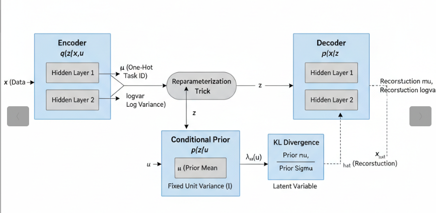

# 5.2.3 Identifiable Variational Autoencoders (iVAEs)

## Overview

Standard Variational Autoencoders are expressive generative models, but they suffer from a fundamental statistical weakness: their latent representations are not *identifiable*. In practice, many different latent spaces can produce the same data distribution, meaning the model has no way to pin down which latent structure is the "true" one. This ambiguity makes it impossible to reliably recover the underlying factors of variation, which is precisely what causal inference and disentanglement require.

**Identifiable VAEs (iVAEs)**, introduced by Khemakhem et al. (2020), solve this problem by conditioning the latent prior on an observed auxiliary variable $u$ — for example, a class label, a time index, or an experimental context. This single change is enough to break the symmetry that causes non-identifiability, and the authors prove rigorously that the resulting model can recover the true latent factors *up to a simple coordinate-wise transformation* (permutation and element-wise rescaling). In effect, iVAEs bridge deep generative modelling with nonlinear Independent Component Analysis (ICA), inheriting the theoretical guarantees of the latter.

For causal inference, identifiability matters because estimating treatment effects requires that the latent representation capture the *correct* confounding structure — not just *a* representation that happens to fit the data. iVAEs provide that assurance.

## Where iVAE Fits: CEVAE, iVAE, and CausalVAE Compared

These three notebooks collectively cover the main families of deep generative models for causal inference. They share the VAE backbone but make fundamentally different assumptions about the latent space, and each is the right tool in a different setting. The table below places iVAE in that landscape before we dive into its architecture.

| Model | Latent structure | What is learned | Key assumption | Best suited for |
|---|---|---|---|---|
| CEVAE | Independent $z$; $x$ are noisy proxies | Latent confounder recovered from proxy covariates | Ignorability holds in latent space | Settings where the true confounders are *unobserved* but leave a measurable trace in $x$ |
| **iVAE** | **Independent $z$; prior conditioned on $u$** | **Identifiable latent factors anchored by an auxiliary variable** | **Sufficient variation in $u$; injective decoder** | **Settings where an observed context variable (label, time, environment) can anchor the latent space** |
| CausalVAE | DAG over $z$; $\varepsilon$ are independent exogenous noises | Causal graph and structural equations jointly | DAG is acyclic; weak supervision on graph structure | Settings where the *causal relationships among* latent factors need to be modelled and intervened on |

The key conceptual distinction is what each model treats as the source of non-identifiability and how it resolves it:

- **CEVAE** resolves confounding by inferring a latent common cause from proxy measurements. It does not attempt to make $z$ identifiable in the ICA sense — it is concerned with removing bias, not with uniquely pinning down the latent axes.
- **iVAE** resolves rotational non-identifiability by conditioning the prior on $u$, giving the latent axes fixed reference points. Each component of $z$ is independently recoverable, but $z$ carries no explicit causal graph.
- **CausalVAE** goes further and represents the *causal structure among* the latent components explicitly as a DAG, enabling do-calculus interventions directly in the latent space. This is the most expressive but also the most demanding in terms of supervision and identifiability requirements.

Reading these three notebooks in sequence — CEVAE → iVAE → CausalVAE — traces a progression from *bias removal* to *identifiable representation* to *explicit causal structure*.

## Model Architecture

The iVAE extends the standard VAE by introducing a *conditional prior* $p(z \mid u)$ in place of the fixed standard Gaussian prior $\mathcal{N}(0, I)$. Every component of the model is described below.

### Inputs

- $x$ — the observed data (e.g., a sensor reading, a patient record, an image).
- $u$ — an auxiliary variable providing context. In the diagram below this is a one-hot task identifier, but it can be any observed variable that meaningfully segments the data: class labels, experimental conditions, time periods, or treatment assignments.

### Encoder $q(z \mid x, u)$

Unlike the standard VAE encoder which sees only $x$, the iVAE encoder receives *both* $x$ and $u$. It passes them through shared hidden layers and outputs two parameter vectors:

- $\mu$ — the mean of the approximate posterior.
- $\log\sigma^2$ — the log-variance of the approximate posterior.

Together, these define the distribution $q(z \mid x, u) = \mathcal{N}(\mu(x,u),\, \text{diag}(\sigma^2(x,u)))$, a Gaussian whose location and spread depend on the full observed context.

### Conditional Prior $p(z \mid u)$

This is the architectural innovation that drives identifiability. In a standard VAE the prior $\mathcal{N}(0,I)$ is completely static — it carries no information about what the data actually is. In the iVAE, a small neural network $g(u)$ maps the auxiliary variable to a *context-specific* prior mean:

$$p(z \mid u) = \mathcal{N}(g(u),\, I)$$

Because the prior now shifts as $u$ changes, different segments of the data are anchored to different regions of the latent space. This is what prevents the latent axes from rotating freely and what ultimately enables identifiability.

In the fully general treatment (Khemakhem et al., 2020) the prior belongs to the exponential family:

$$p(z_i \mid u) = \exp\!\bigl(T_i(z_i) \cdot \lambda_i(u) - \log A(\lambda_i(u))\bigr)$$

where $T_i(z_i)$ are sufficient statistics and $\lambda_i(u)$ are natural parameters that vary with $u$. The Gaussian formulation above is the special case used in most practical implementations, including the one in this notebook.

### Reparameterization

To allow gradients to flow through the stochastic sampling step, the model uses the standard reparameterization trick:

$$z = \mu + \sigma \odot \varepsilon, \qquad \varepsilon \sim \mathcal{N}(0, I)$$

This expresses the random sample as a deterministic function of the distributional parameters plus independent noise, making backpropagation through $z$ straightforward.

### Decoder $p(x \mid z)$

The decoder maps the latent code $z$ back to data space to produce a reconstruction $\hat{x}$. Crucially, **the decoder does not see $u$**. All information needed to reconstruct $x$ must pass through $z$. This architectural constraint forces the encoder to compress everything about $x$ that is not already explained by the conditional prior into the latent code.

### Loss Function

The iVAE is trained by maximizing the following Evidence Lower Bound (ELBO):

$$\mathcal{L}_{\text{iVAE}} = \mathbb{E}_{q(z \mid x, u)}\!\bigl[\log p(x \mid z)\bigr] - D_{\mathrm{KL}}\!\bigl(q(z \mid x, u) \,\|\, p(z \mid u)\bigr)$$

Comparing this with the standard VAE objective:

$$\mathcal{L}_{\text{VAE}} = \mathbb{E}_{q(z \mid x)}\!\bigl[\log p(x \mid z)\bigr] - D_{\mathrm{KL}}\!\bigl(q(z \mid x) \,\|\, \mathcal{N}(0, I)\bigr)$$

the difference is entirely in the KL term. In the iVAE, the encoder posterior is compared against the *context-specific* prior $p(z \mid u)$ rather than a fixed zero-mean Gaussian. This forces latent codes belonging to the same context $u$ to cluster around the prior mean $g(u)$, creating distinct, anchored regions in latent space for each value of $u$.

The reconstruction term is unchanged: it measures how faithfully the decoder recovers $x$ from $z$.

### iVAE Architecture



### Why This Achieves Identifiability

Three conditions together guarantee that the latent representation is identifiable (recoverable up to permutation and element-wise scaling):

1. **Injective mixing function.** The map from latent $z$ to data $x$ must be one-to-one: no two distinct latent codes can produce the same observation. This prevents the model from "hiding" distinct causal factors inside the same data point.

2. **Sufficient variation in $u$.** The auxiliary variable must genuinely shift the prior across its different values. If $p(z \mid u)$ were identical for all $u$, the model would collapse back to an unidentifiable standard VAE. In practice, the number of distinct values of $u$ must be large enough relative to the latent dimensionality.

3. **Conditional independence of latent components.** Given $u$, the components of $z$ must be statistically independent. This is what allows each component to be recovered separately without interference from the others.

When all three conditions hold, Khemakhem et al. (2020) prove that the learned encoder recovers the true latent factors — even when the mixing function is a deep nonlinear network.

## Implementation in R

The implementation below uses the `torch` package through the [{RCausalML}](https://github.com/zia207/RCausalML) package, which provides the `iVAE()` constructor and the `elbo_loss()` function. We fit the model on a synthetic multi-class dataset designed to mimic the structure of a controlled experiment, then examine reconstruction quality, latent structure, and the alignment between latent dimensions and input features.

## Set Up

### Check and Install Required R Packages

Following R packages are required to run this notebook. If any of these packages are not installed, you can install them using the code below:

`torch`, `HDclassif`, `tidyverse`, `tidyr`, `corrplot`, `patchwork`, `mlr3`, `mlr3tuning`, `paradox`, `Matrix`, `RCausalML`, `Rcpp`

```{r}
#| label: lst-packages-vector
#| lst-cap: "Required R package names used throughout the notebook."
packages <- c(
  "torch",
  "HDclassif",
  "tidyverse",
  "tidyr",
  "corrplot",
  "patchwork",
  "mlr3",
  "mlr3tuning",
  "paradox",
  "Matrix",
  "RCausalML",
  "Rcpp"
)
```

### Install Missing Packages

```{r}
#| label: lst-install-missing-packages
#| lst-cap: "Optional commands to install missing CRAN/GitHub dependencies (commented by default)."
#| warning: false
#| error: false
# Install missing packages
# new_packages <- packages[!(packages %in% installed.packages()[, "Package"])]
# if (length(new_packages)) install.packages(new_packages)
```

### Verify Installation

```{r}
#| label: lst-verify-package-installation
#| lst-cap: "Check that each required package namespace is available."
# Verify installation
cat("Installed packages:\n")
print(sapply(packages, requireNamespace, quietly = TRUE))
```

### Load R Packages

```{r}
#| warning: false
#| error: false
# Load packages with suppressed messages
invisible(lapply(packages, function(pkg) {
  suppressPackageStartupMessages(library(pkg, character.only = TRUE))
}))
```

### Check Loaded Packages

```{r}
#| label: lst-check-loaded-packages
#| lst-cap: "Confirm which package environments are attached on the search path."
# Check loaded packages
cat("Successfully loaded packages:\n")
print(search()[grepl("package:", search())])
```

```{r setup-ivae}
#| warning: false
#| error: true
# Load iVAE from package source if not already available in installed version
pkg_src <- "/home/zia207/Github/RCausalML"
if (!exists("iVAE", mode = "function") && requireNamespace("devtools", quietly = TRUE)) {
  try(devtools::load_all(pkg_src, quiet = TRUE), silent = TRUE)
}
if (!exists("iVAE", mode = "function")) {
  stop(
    "iVAE() is not in your installed RCausalML. Reinstall from the package root:\n",
    "  devtools::install()   or   R CMD INSTALL ."
  )
}
```

### Device Setup

```{r}
#| label: device-setup
#| message: false

device <- if (torch::cuda_is_available()) "cuda" else "cpu"
cat("Using device:", device, "\n")
set.seed(42)
torch::torch_manual_seed(42L)
```


## Fitting the iVAE on Synthetic Data

### Generating Synthetic Data

We construct a synthetic dataset with three class-specific Gaussian clusters in 13-dimensional input space. The class label plays the role of the auxiliary variable $u$: each class defines a distinct prior mean in the latent space. This setup is deliberately analogous to a multi-environment experiment, where each "environment" or "task" anchors a different region of the latent space — exactly the structure that iVAE identifiability theory exploits.

The data are standardized before training so that each input feature contributes on the same scale to the reconstruction loss.

```{r}
#| label: synthetic-data
#| message: false

set.seed(42)

n_samples_syn <- 400
input_dim_syn <- 13
n_aux_syn     <- 3
n_per_class   <- c(
  floor(n_samples_syn / n_aux_syn),
  floor(n_samples_syn / n_aux_syn),
  n_samples_syn - 2 * floor(n_samples_syn / n_aux_syn)
)

# Each class has its own mean vector, separated enough to create
# distinct prior anchors in the latent space.
class_means <- lapply(0:(n_aux_syn - 1), function(k) {
  rnorm(input_dim_syn) * 2 + k * 3
})

X_syn_list <- list()
y_syn_list <- list()

for (k in 0:(n_aux_syn - 1)) {
  cov_mat  <- diag(input_dim_syn) * 0.5 +
    matrix(runif(input_dim_syn^2) * 0.1, input_dim_syn, input_dim_syn)
  cov_mat  <- (cov_mat + t(cov_mat)) / 2
  n_k      <- n_per_class[k + 1]
  chol_cov <- chol(cov_mat)
  X_k      <- matrix(rnorm(n_k * input_dim_syn), n_k, input_dim_syn) %*% chol_cov +
    matrix(class_means[[k + 1]], n_k, input_dim_syn, byrow = TRUE)
  X_syn_list[[k + 1]] <- X_k
  y_syn_list[[k + 1]] <- rep(k, n_k)
}

X_syn_raw <- do.call(rbind, X_syn_list)
y_syn     <- unlist(y_syn_list)

# Standardize features
X_syn_mean <- colMeans(X_syn_raw)
X_syn_sd   <- apply(X_syn_raw, 2, sd)
X_syn      <- matrix(as.numeric(scale(X_syn_raw,
                                      center = X_syn_mean,
                                      scale  = X_syn_sd)),
                     nrow = nrow(X_syn_raw))

# Stratified 80/20 train–test split
set.seed(42)
train_idx <- c()
test_idx  <- c()
for (cls in unique(y_syn)) {
  idx_cls    <- which(y_syn == cls)
  n_test     <- round(0.2 * length(idx_cls))
  test_samp  <- sample(idx_cls, n_test)
  train_samp <- setdiff(idx_cls, test_samp)
  train_idx  <- c(train_idx, train_samp)
  test_idx   <- c(test_idx,  test_samp)
}

x_train_syn <- X_syn[train_idx, ]
x_test_syn  <- X_syn[test_idx,  ]
u_train_syn <- y_syn[train_idx]
u_test_syn  <- y_syn[test_idx]

cat(sprintf("Synthetic data: %d samples, %d features, %d classes\n",
            nrow(X_syn), input_dim_syn, n_aux_syn))
cat(sprintf("Train: %d  |  Test: %d\n", length(train_idx), length(test_idx)))
```

### Model Construction and Training

We instantiate the iVAE with a 4-dimensional latent space — substantially lower than the 13-dimensional input — and 128-unit hidden layers. The latent dimensionality is deliberately small so that the model must find a compact, structured representation rather than simply memorizing the inputs.

Training uses the Adam optimizer with mild weight decay. Gradient clipping is applied to stabilize the early epochs when the KL term can otherwise dominate and prevent the encoder from learning useful representations.

```{r}
#| label: synthetic-training
#| message: false
#| error: true

latent_dim_syn <- 4

model_syn <-iVAE(
  input_dim  = input_dim_syn,
  latent_dim = latent_dim_syn,
  hidden_dim = 128,
  n_aux      = n_aux_syn,
  dropout    = 0.15
)
model_syn$to(device = device)

optimizer_syn <- optim_adam(model_syn$parameters, lr = 1e-3, weight_decay = 1e-5)

epochs_syn     <- 60
batch_size_syn <- 32
train_losses_syn <- numeric(epochs_syn)
val_losses_syn   <- numeric(epochs_syn)

# Evaluation helper: average ELBO over mini-batches without gradient tracking
evaluate_model <- function(model, X, u, batch_size = 64) {
  model$eval()
  n <- nrow(X)
  total_loss <- 0
  n_batches  <- 0
  with_no_grad({
    for (start in seq(1, n, by = batch_size)) {
      end     <- min(start + batch_size - 1, n)
      x_batch <- torch_tensor(X[start:end, , drop = FALSE],
                              dtype = torch_float())$to(device = device)
      u_batch <- torch_tensor(u[start:end],
                              dtype = torch_long())$to(device = device)
      out  <- model(x_batch, u_batch)
      loss <- elbo_loss(x_batch,
                        out$dec_mu, out$dec_logvar,
                        out$enc_mu, out$enc_logvar,
                        out$prior_mu, out$prior_logvar)
      total_loss <- total_loss + loss$item()
      n_batches  <- n_batches  + 1
    }
  })
  total_loss / n_batches
}

# Main training loop
n_train <- nrow(x_train_syn)

for (epoch in seq_len(epochs_syn)) {
  model_syn$train()
  shuf_idx   <- sample(n_train)
  train_loss <- 0
  n_batches  <- 0

  for (start in seq(1, n_train, by = batch_size_syn)) {
    end       <- min(start + batch_size_syn - 1, n_train)
    idx_batch <- shuf_idx[start:end]

    x_batch <- torch_tensor(x_train_syn[idx_batch, , drop = FALSE],
                            dtype = torch_float())$to(device = device)
    u_batch <- torch_tensor(u_train_syn[idx_batch],
                            dtype = torch_long())$to(device = device)

    optimizer_syn$zero_grad()
    out  <- model_syn(x_batch, u_batch)
    loss <- elbo_loss(x_batch,
                      out$dec_mu, out$dec_logvar,
                      out$enc_mu, out$enc_logvar,
                      out$prior_mu, out$prior_logvar)
    loss$backward()
    nn_utils_clip_grad_norm_(model_syn$parameters, max_norm = 5.0)
    optimizer_syn$step()

    train_loss <- train_loss + loss$item()
    n_batches  <- n_batches  + 1
  }

  train_avg_syn <- train_loss / n_batches
  val_avg_syn   <- evaluate_model(model_syn, x_test_syn, u_test_syn)

  train_losses_syn[epoch] <- train_avg_syn
  val_losses_syn[epoch]   <- val_avg_syn

  if (epoch == 1 || epoch %% 15 == 0) {
    cat(sprintf("Epoch %2d/%d — train ELBO: %.4f  |  val ELBO: %.4f\n",
                epoch, epochs_syn, train_avg_syn, val_avg_syn))
  }
}

cat("Training complete.\n")
```

### Training and Validation Loss

The plot below shows the negative ELBO over training. A well-behaved run sees both curves decline quickly in the early epochs (reconstruction improving) and then converge smoothly (the KL term settling as the posterior anchors to the conditional prior). A persistent gap between training and validation loss would suggest overfitting to the small synthetic dataset; approximate parity indicates that the model has learned a generalizable latent structure.

```{r}
#| label: syn-loss-plot
#| fig.width: 7
#| fig.height: 4
#| error: true

df_loss_syn <- data.frame(
  Epoch = seq_len(epochs_syn),
  Train = train_losses_syn,
  Val   = val_losses_syn
)

df_long_syn <- df_loss_syn |>
  pivot_longer(cols = c(Train, Val), names_to = "Type", values_to = "Loss")

ggplot(df_long_syn, aes(x = Epoch, y = Loss, color = Type)) +
  geom_line(linewidth = 0.8) +
  labs(
    title = "iVAE training on synthetic data: ELBO loss by epoch",
    x = "Epoch", y = "Negative ELBO", color = ""
  ) +
  theme_minimal(base_size = 12) +
  theme(legend.position = "top")
```

### Reconstruction Quality

After training, we pass the test set through the full encoder–decoder pipeline and compare the reconstructions $\hat{x}$ with the original inputs $x$. The scatter plot on the left overlays original and reconstructed points in the space of the first two input features; the parity plot on the right plots original against reconstructed values directly — perfect reconstruction would align all points on the diagonal.

```{r}
#| label: syn-reconstruction
#| fig.width: 10
#| fig.height: 4
#| error: true

model_syn$eval()

x_test_tensor_syn <- torch_tensor(x_test_syn, dtype = torch_float())$to(device = device)
u_test_tensor_syn <- torch_tensor(u_test_syn, dtype = torch_long())$to(device = device)

with_no_grad({
  enc_out_syn <- model_syn$encode(x_test_tensor_syn, u_test_tensor_syn)
  z_syn_test  <- enc_out_syn$mu
  dec_out_syn <- model_syn$decode(z_syn_test)
  x_recon_syn <- dec_out_syn$mu
})

x_orig_syn_np  <- as.matrix(x_test_syn)
x_recon_syn_np <- as.matrix(x_recon_syn$squeeze(2)$cpu())

df_orig  <- data.frame(f1 = x_orig_syn_np[, 1],  f2 = x_orig_syn_np[, 2],  Type = "Original")
df_recon <- data.frame(f1 = x_recon_syn_np[, 1], f2 = x_recon_syn_np[, 2], Type = "Reconstructed")
df_scatter <- rbind(df_orig, df_recon)

p1 <- ggplot(df_scatter, aes(x = f1, y = f2, color = Type, alpha = Type)) +
  geom_point(size = 1.5) +
  scale_alpha_manual(values = c("Original" = 0.9, "Reconstructed" = 0.6)) +
  scale_color_manual(values = c("Original" = "#1f77b4", "Reconstructed" = "#ff7f0e")) +
  labs(
    title = "Test set: original vs reconstructed\n(first two features)",
    x = "Feature 1", y = "Feature 2", color = "", alpha = ""
  ) +
  theme_minimal(base_size = 10) +
  theme(legend.position = "top")

df_parity <- data.frame(
  Original      = c(x_orig_syn_np[, 1], x_orig_syn_np[, 2]),
  Reconstructed = c(x_recon_syn_np[, 1], x_recon_syn_np[, 2]),
  Feature       = rep(c("Feature 1", "Feature 2"), each = nrow(x_orig_syn_np))
)
lim_range <- range(c(df_parity$Original, df_parity$Reconstructed))

p2 <- ggplot(df_parity, aes(x = Original, y = Reconstructed, color = Feature)) +
  geom_point(size = 1.5, alpha = 0.6) +
  geom_abline(intercept = 0, slope = 1, linetype = "dashed",
              color = "black", linewidth = 0.8) +
  coord_equal(xlim = lim_range, ylim = lim_range) +
  labs(
    title = "Parity plot: first two features",
    x = "Original value", y = "Reconstructed value", color = ""
  ) +
  theme_minimal(base_size = 10) +
  theme(legend.position = "top")

p1 + p2
```

### Latent Space Structure

A key diagnostic for an identifiable model is whether the learned latent space organizes observations by their true generating class. The left panel below plots the first two latent dimensions on the test set, colored by class $u$. Clear separation indicates that the conditional prior has successfully anchored each class to a distinct region. The right panel shows the same class coloring in the original 13-dimensional input space (projected to the first two features), providing a reference for how much structure already existed in the raw data.

```{r}
#| label: syn-latent-space
#| fig.width: 10
#| fig.height: 4
#| error: true

z_syn_np    <- as.matrix(z_syn_test$squeeze(2)$cpu())
u_test_fac  <- factor(u_test_syn, labels = paste0("Class ", 0:(n_aux_syn - 1)))

df_latent_syn <- data.frame(z1 = z_syn_np[, 1], z2 = z_syn_np[, 2], Class = u_test_fac)
df_input_syn  <- data.frame(f1 = x_orig_syn_np[, 1], f2 = x_orig_syn_np[, 2], Class = u_test_fac)

p3 <- ggplot(df_latent_syn, aes(x = z1, y = z2, color = Class)) +
  geom_point(size = 1.5, alpha = 0.7) +
  labs(
    title = "Learned latent space (test set)\ncolored by auxiliary class u",
    x = "Latent dimension z₁", y = "Latent dimension z₂"
  ) +
  theme_minimal(base_size = 10) +
  theme(legend.position = "top")

p4 <- ggplot(df_input_syn, aes(x = f1, y = f2, color = Class)) +
  geom_point(size = 1.5, alpha = 0.7) +
  labs(
    title = "Input space (test set, first 2 features)\ncolored by auxiliary class u",
    x = "Feature 1", y = "Feature 2"
  ) +
  theme_minimal(base_size = 10) +
  theme(legend.position = "top")

p3 + p4
```

### Latent–Feature Correlation Heatmap

The heatmap below reports Pearson correlations between each of the four learned latent dimensions ($z_1$–$z_4$) and the first five input features on the test set. Strong correlations (positive or negative) indicate that a latent dimension has specialized to capture variation in a particular input feature. In an ideally identifiable model, each latent dimension should align predominantly with one or a small number of independent sources of variation rather than diffusely mixing information from all features.

```{r}
#| label: syn-corr-heatmap
#| fig.width: 7
#| fig.height: 4
#| error: true

n_show_syn <- min(5, input_dim_syn)
corr_mat_syn <- cor(z_syn_np, x_orig_syn_np[, 1:n_show_syn])

df_corr_syn <- as.data.frame(corr_mat_syn)
df_corr_syn$z_dim <- paste0("z", 1:nrow(corr_mat_syn))

df_corr_long_syn <- df_corr_syn |>
  pivot_longer(-z_dim, names_to = "Feature", values_to = "Correlation") |>
  mutate(
    z_dim   = factor(z_dim, levels = paste0("z", nrow(corr_mat_syn):1)),
    Feature = factor(Feature,
                     levels = paste0("V", 1:n_show_syn),
                     labels = paste0("Feature ", 1:n_show_syn))
  )

ggplot(df_corr_long_syn, aes(x = Feature, y = z_dim, fill = Correlation)) +
  geom_tile(color = "white") +
  geom_text(aes(label = sprintf("%.2f", Correlation)), size = 3) +
  scale_fill_gradient2(low = "#4575b4", mid = "white", high = "#d73027",
                       midpoint = 0, limits = c(-1, 1)) +
  labs(
    title = "Test set: Pearson correlation between\nlearned latent dimensions and input features",
    x = NULL, y = NULL
  ) +
  theme_minimal(base_size = 10) +
  theme(axis.text.x = element_text(angle = 30, hjust = 1))
```


## Summary and Conclusions

iVAEs extend standard VAEs by replacing the uninformative fixed prior with a *conditional prior* $p(z \mid u)$ that depends on an observed auxiliary variable. This single change has profound theoretical consequences: under mild regularity conditions, the learned latent representation is provably identifiable up to permutation and element-wise scaling, meaning the model recovers the true underlying factors of variation rather than an arbitrary rotation of them. For causal inference, this property is essential — estimating average or individual treatment effects requires that the model capture the *correct* confounding structure, not merely *a* structure that fits the data.

The synthetic experiment above illustrates the key behaviors to look for in practice:

- The negative ELBO should decline smoothly for both training and validation, with the two curves remaining close together.
- Reconstructed points should overlap tightly with the originals in input space.
- The latent space should organize observations by their auxiliary class, reflecting the distinct prior anchors learned for each value of $u$.
- Each latent dimension should show concentrated correlations with a small subset of input features rather than diffuse correlations across all of them.

Future directions for this framework include applying iVAEs to real-world observational datasets where the auxiliary variable is a treatment indicator or an experimental environment, integrating the identifiable latent representation with downstream causal estimators (e.g., meta-learners or double machine learning), and exploring extensions that relax the requirement for a fully observed $u$ by learning the auxiliary structure jointly with the generative model.

## References

- Khemakhem, I., Kingma, D. P., Monti, R. P., & Hyvärinen, A. (2020). [Variational Autoencoders and Nonlinear ICA: A Unifying Framework](https://arxiv.org/abs/1907.04809). *Proceedings of the 23rd International Conference on Artificial Intelligence and Statistics (AISTATS)*.
- Xie, F., et al. (2024). [Causal Effect Estimation using Identifiable Variational AutoEncoder with Latent Confounders and Post-Treatment Variables](https://arxiv.org/abs/2408.07219). *arXiv:2408.07219*.
- Ilkhem Dridi. [iVAE: Reference implementation](https://github.com/ilkhem/iVAE). GitHub.
- [RCausalML: R package for Machine Learning-based Causal Inference](https://github.com/zia207/RCausalML)
- R `torch` package: [mlverse/torch](https://torch.mlverse.org/)


