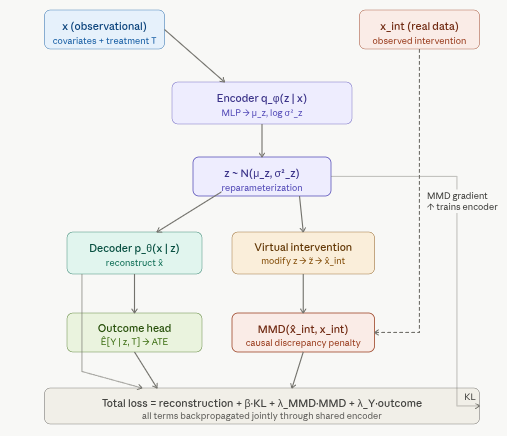
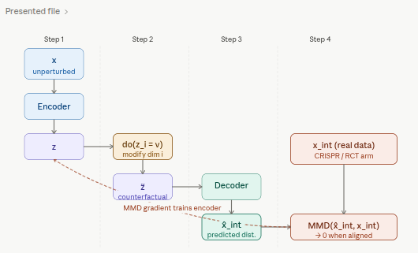

# 5.2.4 CausalDiscrepancyVAE: Discrepancy-Regularized Causal Representation Learning

`CausalDiscrepancyVAE` extends a standard VAE with an explicit distribution-matching penalty that forces the model's simulated interventions to match real interventional data. Unlike CEVAE, iVAE, and CausalVAE — which infer or structure causal relationships from observational data alone — the CD-VAE uses real experimental outcomes (e.g., CRISPR knockouts, randomized trial arms) as a direct training signal, anchoring the latent space to physical interventions rather than to statistical associations.

In this notebook, we convert the complete `causalDiscrepancy_VAE.ipynb` workflow into R, running it on the IHDP benchmark via [{RCausalML}](https://github.com/zia207/RCausalML)'s `causal_discrepancy_vae()` implementation.

## Where CD-VAE Fits in the Causal VAE Family

This series has covered four increasingly expressive models. Understanding where CD-VAE fits clarifies when to use it.

| Model | Latent structure | Training signal | Key assumption | Use when |
|---|---|---|---|---|
| CEVAE | Independent $z$; $x$ are noisy proxies | Observational $x$ only | Ignorability in latent space | Confounders are unobserved but leave a trace in $x$ |
| iVAE | Independent $z$; conditional prior $p(z\|u)$ | Observational $x$ + auxiliary $u$ | Sufficient variation in $u$ | A context variable (label, time, environment) can anchor the latent space |
| CausalVAE | DAG over $z$; independent $\varepsilon$ | Observational $x$ + weak graph supervision | DAG is acyclic | Causal relationships *among* latent factors need to be modelled explicitly |
| **CD-VAE** | **Independent** $z$; MMD-aligned | **Observational + real interventional data** | **Real interventional data available** | **Real experimental outcomes (CRISPR, RCT arms) exist and can supervise the model** |

The core trade-off is supervision richness versus data requirements. CEVAE, iVAE, and CausalVAE work purely from observational data (plus partial graph knowledge for CausalVAE). CD-VAE requires some real interventional data but gains a much more direct and robust training signal in return. Where real experimental data exists — Perturb-Seq studies, randomized trials, A/B tests — CD-VAE is the most grounded option in this family.

## Overview

A Variational Autoencoder learns to encode data $x$ into a latent representation $z$ and reconstruct it, optimizing the Evidence Lower Bound (ELBO):

$$\mathcal{L}_{\text{ELBO}} = \mathbb{E}_{q_\phi(z|x)}\!\left[\log p_\theta(x|z)\right] - D_{\text{KL}}\!\left(q_\phi(z|x) \,\|\, p(z)\right)$$

The first term rewards faithful reconstruction; the second regularizes the posterior toward a standard Gaussian prior. This works well for generative modelling, but it has no notion of causality — the latent space organizes information by statistical co-occurrence, not by causal mechanism.

## The Causal Extension: Adding the MMD Penalty

The CD-VAE augments the ELBO with a third term that measures how closely the model's *predicted* response to a virtual intervention matches the *observed* response to a real one:

$$\mathcal{L}_{\text{CD-VAE}} = \mathcal{L}_{\text{ELBO}} - \lambda \cdot \text{MMD}\!\left(\hat{p}_{\text{int}},\, p_{\text{int}}\right)$$

where $\hat{p}_{\text{int}}$ is the model's predicted post-intervention distribution and $p_{\text{int}}$ is the distribution actually observed under a real intervention. The parameter $\lambda$ controls the strength of this causal alignment. When $\lambda = 0$ the model reduces to a standard VAE; as $\lambda$ increases the model devotes more capacity to making its causal predictions faithful to the real experimental data.

## Architecture



The virtual intervention mechanism — how a latent modification produces the predicted interventional distribution — is the most distinctive part of CD-VAE and worth showing separately.



## Maximum Mean Discrepancy

MMD is a kernel-based distance between two probability distributions. Given samples from distributions $P$ and $Q$, it compares their mean embeddings in a Reproducing Kernel Hilbert Space (RKHS):

$$\text{MMD}^2(P, Q) = \left\|\, \mathbb{E}_{x \sim P}[\phi(x)] - \mathbb{E}_{y \sim Q}[\phi(y)] \,\right\|^2_{\mathcal{H}}$$

Using the kernel trick with a kernel $k$ (typically a mixture of RBF/Gaussian kernels at multiple bandwidths), this expands to a sum of three kernel expectations:

$$\text{MMD}^2(P, Q) = \mathbb{E}_{x,x' \sim P}[k(x,x')] - 2\,\mathbb{E}_{x \sim P,\, y \sim Q}[k(x,y)] + \mathbb{E}_{y,y' \sim Q}[k(y,y')]$$

Using a mixture of kernels rather than a single one makes the estimator robust to scale differences across dimensions — an important practical consideration when the two distributions being compared live in high-dimensional gene expression or covariate space.

| Property | Why it matters |
|---|---|
| Non-parametric | No assumption about the shape of either distribution |
| Differentiable | Can be backpropagated through directly |
| Works on finite samples | Tractable even with batch-sized samples |
| MMD $= 0$ iff $P = Q$ | Provides a proper distributional criterion |
| Scale-robust with multi-kernel | Handles high-dimensional, heterogeneous data |

## Virtual Interventions in the Latent Space

The "causal" part of CD-VAE relies on do-calculus intuition. A virtual intervention $\text{do}(X_i = v)$ is simulated by:

1.  Encoding an unperturbed observation $x$ into the latent space: $z \sim q_\phi(z \mid x)$
2.  Modifying a specific latent dimension or learned intervention subspace corresponding to feature $i$ — this is the virtual perturbation $\tilde{z}$
3.  Decoding the modified $\tilde{z}$ back into the observation space to produce $\hat{x}_{\text{int}}$

The predicted post-intervention distribution $\hat{p}_{\text{int}}$ is then compared against the real distribution $p_{\text{int}}$ observed in the experiment using MMD. Because MMD is differentiable, the gradient of this discrepancy flows back through the decoder, the intervention, and into the encoder — forcing the latent space to organize itself in a way that makes causal predictions accurate, not just reconstructions faithful.

## Full Training Objective

$$\mathcal{L} = \underbrace{\mathbb{E}_{q_\phi(z|x)}\!\left[\log p_\theta(x|z)\right]}_{\text{reconstruction}} - \underbrace{D_{\text{KL}}\!\left(q_\phi(z|x) \,\|\, p(z)\right)}_{\text{latent regularization}} - \underbrace{\lambda \sum_k \text{MMD}\!\left(\hat{p}_{\text{int}}^{(k)},\, p_{\text{int}}^{(k)}\right)}_{\text{causal discrepancy penalty}} - \underbrace{\lambda_Y \,\mathcal{L}_{\text{outcome}}}_{\text{outcome head}}$$

The sum over $k$ runs over all intervention conditions in the training data (e.g., each distinct gene knockout or treatment arm). Each term checks: for intervention $k$, does the model's simulation match the observed response? The outcome head $\mathcal{L}_{\text{outcome}}$ is an MSE loss that trains a separate prediction network for $Y$ given $z$ and $T$, enabling ATE estimation at inference time.

### Role of Each Hyperparameter

| Hyperparameter | Effect | Typical range |
|---|---|---|
| $\beta$ | Weight on the KL term; higher $\beta$ encourages more disentangled but potentially less faithful latents | 0.5 – 4.0 |
| $\lambda_{\text{MMD}}$ | Strength of causal alignment; higher values make the model prioritize matching interventional distributions | 1.0 – 10.0 |
| $\lambda_Y$ | Weight on the outcome prediction loss; balances causal alignment against treatment effect accuracy | 5.0 – 20.0 |
| `n_kernels` | Number of RBF kernels at different bandwidths in the MMD estimator | 3 – 10 |
| `latent_dim` | Dimension of $z$; should be large enough to capture the causal structure but small enough to force compression | 8 – 32 |

### Application to Perturb-Seq / CRISPR Data

Perturb-Seq combines CRISPR-based genetic perturbations with single-cell RNA sequencing: each cell has a known gene knockout (the intervention) and a full transcriptome readout (the outcome). This creates a dataset with both observational and interventional structure, exactly what CD-VAE exploits. A regular VAE trained on such data learns to reconstruct gene expression profiles but conflates the statistical pattern of knockouts with genuine causal effects. CD-VAE's MMD penalty forces the model to distinguish the two: the latent dimensions learn to encode causal factors (genes or gene programs) rather than statistical correlations, and the trained model can then predict the effect of *unseen* or *combinatorial* perturbations by composing interventions in latent space.

## Strengths and Limitations

**Strengths:**

-   CD-VAE leverages real interventional data as a direct supervisory signal, which most causal VAEs lack entirely.
-   MMD is computationally tractable even in high dimensions (e.g., ~20,000 genes).
-   The model naturally handles distributional shift between observational and interventional regimes, and can generalize to out-of-distribution perturbations when the latent causal structure is well-learned.

**Limitations:**

-   Real interventional data is required — CD-VAE cannot be applied in purely observational settings where no experiments have been run.
-   Identifying which latent dimensions correspond to which interventions is non-trivial and often requires auxiliary supervision or disentanglement constraints.
-   The multi-kernel MMD estimator introduces sensitivity to kernel bandwidth selection, and the interaction between $\beta$, $\lambda_{\text{MMD}}$, and $\lambda_Y$ requires careful tuning.
-   Combinatorial perturbations grow exponentially, so full training coverage is rarely achievable in practice.

## Implementation in R

We use [{RCausalML}](https://github.com/zia207/RCausalML)'s `causal_discrepancy_vae()` and `predict.causal_discrepancy_vae()`. The full pipeline follows the same end-to-end stages as the Python tutorial: IHDP loading, feature preprocessing, model training, and evaluation.

## Set Up

### Check and Install Required R Packages

Following R packages are required to run this notebook. If any of these packages are not installed, you can install them using the code below:

`tidyverse`, `RCausalML`, `torch`, `causaldata`, `ForCausality`, `mlbench`

```{r}
#| label: lst-packages-vector
#| lst-cap: "Required R package names used throughout the notebook."
packages <- c(
  "tidyverse",
  "RCausalML",
  "torch",
  "causaldata",
  "ForCausality",
  "mlbench"
)
```

### Install Missing Packages

```{r}
#| label: lst-install-missing-packages
#| lst-cap: "Optional commands to install missing CRAN/GitHub dependencies (commented by default)."
#| warning: false
#| error: false
# Install missing packages
# new_packages <- packages[!(packages %in% installed.packages()[, "Package"])]
# if (length(new_packages)) install.packages(new_packages)
```

### Verify Installation

```{r}
#| label: lst-verify-package-installation
#| lst-cap: "Check that each required package namespace is available."
# Verify installation
cat("Installed packages:\n")
print(sapply(packages, requireNamespace, quietly = TRUE))
```

### Load R Packages

```{r}
#| warning: false
#| error: false
# Load packages with suppressed messages
invisible(lapply(packages, function(pkg) {
  suppressPackageStartupMessages(library(pkg, character.only = TRUE))
}))
```

### Check Loaded Packages

```{r}
#| label: lst-check-loaded-packages
#| lst-cap: "Confirm which package environments are attached on the search path."
# Check loaded packages
cat("Successfully loaded packages:\n")
print(search()[grepl("package:", search())])
```

```{r}
#| label: run-fast-flag
# Set to TRUE for faster rendering; FALSE for full training
run_fast <- TRUE
```

## Fitting CausalDiscrepancyVAE on the IHDP Dataset (semi-synthetic)

We first benchmark CausalDiscrepancyVAE on the Infant Health and Development Program (IHDP) dataset, a widely used semi-synthetic benchmark for treatment effect estimation. We load all nine IHDP replication files from the CausalML repository. If remote access is unavailable the code falls back to a synthetic dataset with the same structure.

The IHDP benchmark records an early childhood intervention. Treatment and control groups have substantial covariate imbalance — exactly the kind of observational confounding that CD-VAE's MMD penalty is designed to correct in the latent space.

### Dataset

```{r}
#| label: load-data
base_url <- "https://raw.githubusercontent.com/uber/causalml/master/docs/examples/data"
cols <- c("treatment", "y_factual", "y_cfactual", "mu0", "mu1", paste0("X", 0:24))
df <- NULL
for (i in 1:9) {
  url <- sprintf("%s/ihdp_npci_%d.csv", base_url, i)
  tmp <- tryCatch(read.csv(url, header = FALSE), error = function(e) NULL)
  if (!is.null(tmp) && nrow(tmp) > 0) {
    colnames(tmp) <- cols[seq_len(ncol(tmp))]
    df <- if (is.null(df)) tmp else rbind(df, tmp)
  }
}

if (!is.null(df) && nrow(df) > 0) {
  replications <- if (run_fast) 2L else 10L
  df <- do.call(rbind, replicate(replications, df, simplify = FALSE))
  message("IHDP loaded (", replications, " replications): ",
          nrow(df), " × ", ncol(df))
} else {
  df <- NULL
}

if (is.null(df) || nrow(df) == 0) {
  d <- tryCatch(
    synthetic_data(mode = 1, n = 5000, p = 25, sigma = 1.0, adj = 0),
    error = function(e) synthetic_data(mode = 1, n = 5000, p = 25, sigma = 1.0)
  )
  df <- as.data.frame(d$X)
  colnames(df) <- paste0("X", 0:(ncol(df) - 1))
  df$treatment  <- d$w
  df$y_factual  <- d$y
  df$y_cfactual <- ifelse(d$w == 1, d$b - 0.5 * d$tau, d$b + 0.5 * d$tau)
  df$mu0 <- d$b - 0.5 * d$tau
  df$mu1 <- d$b + 0.5 * d$tau
  message("Synthetic fallback: ", nrow(df), " × ", ncol(df))
}

# Feature ordering: binary first (cols 7–25), continuous second (cols 1–6)
# — matches the Python tutorial's feature permutation
xcols    <- paste0("X", 0:24)
perm     <- c(7:25, 1:6)
X        <- as.matrix(df[, xcols][, perm])
treatment <- as.integer(df$treatment)
y         <- as.numeric(df$y_factual)
y_cf      <- as.numeric(df$y_cfactual)
mu0       <- as.numeric(df$mu0)
mu1       <- as.numeric(df$mu1)
tau       <- ifelse(df$treatment == 1,
                    df$y_factual - df$y_cfactual,
                    df$y_cfactual - df$y_factual)

# 80/20 train–validation split (seed 1 matches the Python tutorial)
n <- nrow(X)
set.seed(1)
ite <- sample(n, size = round(0.2 * n))
itr <- setdiff(seq_len(n), ite)

X_train         <- X[itr, ];  X_val         <- X[ite, ]
treatment_train <- treatment[itr]; treatment_val <- treatment[ite]
y_train         <- y[itr];   y_val         <- y[ite]
tau_train       <- tau[itr]; tau_val       <- tau[ite]
mu_0_train      <- mu0[itr]; mu_0_val      <- mu0[ite]
mu_1_train      <- mu1[itr]; mu_1_val      <- mu1[ite]

cat("Train:", length(itr), "| Val:", length(ite), "\n")
cat("Treatment prevalence — train:",
    round(mean(treatment_train), 3),
    "| val:", round(mean(treatment_val), 3), "\n")
```

### Helper Functions

```{r}
#| label: helper-functions

# Standardize continuous covariates (cols 20–25 in the permuted matrix,
# corresponding to the original continuous features X0–X5).
# Binary covariates (cols 1–19) are left unchanged.
preprocess_features <- function(train_x, test_x) {
  scaled_train <- train_x
  scaled_test  <- test_x
  cont_cols    <- 20:25
  means <- colMeans(train_x[, cont_cols, drop = FALSE])
  sds   <- apply(train_x[, cont_cols, drop = FALSE], 2, sd)
  sds[sds == 0] <- 1
  scaled_train[, cont_cols] <- scale(train_x[, cont_cols, drop = FALSE],
                                     center = means, scale = sds)
  scaled_test[, cont_cols]  <- scale(test_x[, cont_cols, drop = FALSE],
                                     center = means, scale = sds)
  list(train_x = scaled_train, test_x = scaled_test, means = means, sds = sds)
}

# Random subsampling with reproducible seed — keeps training times manageable
# while preserving the treatment ratio approximately.
build_training_arrays <- function(x, t, y, subsample = 5000L, seed = 42L) {
  set.seed(seed)
  idx <- sample.int(nrow(x), size = min(subsample, nrow(x)), replace = FALSE)
  list(x = x[idx, , drop = FALSE],
       t = as.numeric(t[idx]),
       y = as.numeric(y[idx]),
       idx = idx)
}

# ATE and ITE evaluation against known potential outcomes.
# Returns ATE bias, absolute ATE error, and sqrt(PEHE) —
# the three metrics most commonly reported in the IHDP literature.
estimate_ate_cdvae <- function(model, x_eval, mu0_true, mu1_true) {
  y0_hat   <- predict(model, x_eval, type = "mu0")
  y1_hat   <- predict(model, x_eval, type = "mu1")
  ite_hat  <- y1_hat - y0_hat
  ite_true <- mu1_true - mu0_true
  ate_pred <- mean(ite_hat)
  ate_true <- mean(ite_true)
  list(
    ite_hat   = ite_hat,
    ite_true  = ite_true,
    ate_pred  = ate_pred,
    ate_true  = ate_true,
    ate_bias  = ate_pred - ate_true,
    ate_error = abs(ate_true - ate_pred),
    pehe      = sqrt(mean((ite_hat - ite_true)^2))
  )
}

# Plot all four loss components over training epochs on a log scale.
# A healthy run sees reconstruction and KL decline steadily while MMD
# converges toward zero, confirming causal alignment is improving.
plot_training_history_cdvae <- function(history) {
  h <- dplyr::bind_rows(lapply(seq_along(history$train), function(i) {
    as.data.frame(history$train[[i]]) |> dplyr::mutate(epoch = i)
  }))
  h_long <- tidyr::pivot_longer(h, cols = c(total, kl, mmd),
                                names_to = "component", values_to = "value")
  ggplot(h_long, aes(epoch, value, color = component)) +
    geom_line(linewidth = 0.8) +
    scale_y_log10() +
    facet_wrap(~component, scales = "free_y", nrow = 1) +
    labs(title = "CD-VAE: training loss components (log scale)",
         x = "Epoch", y = "Loss") +
    theme_minimal(base_size = 11) +
    theme(legend.position = "none")
}

# MMD-only convergence plot — separating this out makes it easy to see
# whether causal alignment has stabilized before reconstruction has.
plot_mmd_convergence_cdvae <- function(history) {
  h <- dplyr::bind_rows(lapply(seq_along(history$train), function(i) {
    as.data.frame(history$train[[i]]) |> dplyr::mutate(epoch = i)
  }))
  ggplot(h, aes(epoch, mmd)) +
    geom_line(color = "#993556", linewidth = 0.9) +
    geom_hline(yintercept = 0, linetype = "dashed",
               color = "gray60", linewidth = 0.5) +
    labs(title = "MMD causal alignment convergence",
         x = "Epoch", y = "MMD") +
    theme_minimal(base_size = 11)
}

# Latent space PCA: color by treatment group.
# In a well-trained CD-VAE the two groups should overlap substantially —
# the MMD penalty has removed the statistical separation that raw covariates show.
plot_latent_space_cdvae <- function(model, x_data, t_data,
                                    title = "Latent space (PCA)") {
  z_mu <- predict(model, x_data, type = "latent")
  pc   <- prcomp(z_mu, center = TRUE, scale. = TRUE)
  z2   <- pc$x[, 1:2, drop = FALSE]
  dfz  <- data.frame(
    PC1       = z2[, 1],
    PC2       = z2[, 2],
    treatment = factor(t_data, levels = c(0, 1),
                       labels = c("Control", "Treated"))
  )
  ggplot(dfz, aes(PC1, PC2, color = treatment)) +
    geom_point(alpha = 0.35, size = 1.2) +
    scale_color_manual(values = c("Control" = "#185FA5", "Treated" = "#993C1D")) +
    labs(title = title, x = "PC1", y = "PC2", color = "") +
    theme_minimal(base_size = 11) +
    theme(legend.position = "top")
}

# ITE scatter and distribution comparison.
plot_ite_analysis_cdvae <- function(ite_hat, ite_true, ate_pred, ate_true) {
  df <- data.frame(ite_true = ite_true, ite_hat = ite_hat)
  p1 <- ggplot(df, aes(ite_true, ite_hat)) +
    geom_point(alpha = 0.3, size = 1.0, color = "#534AB7") +
    geom_abline(slope = 1, intercept = 0,
                linetype = "dashed", color = "black", linewidth = 0.6) +
    geom_hline(yintercept = ate_pred, linetype = "dotted",
               color = "#BA7517", linewidth = 0.7) +
    geom_vline(xintercept = ate_true, linetype = "dotted",
               color = "#0F6E56", linewidth = 0.7) +
    annotate("text", x = min(ite_true) + 0.1, y = ate_pred + 0.05,
             label = sprintf("Pred ATE = %.3f", ate_pred),
             hjust = 0, size = 3, color = "#BA7517") +
    annotate("text", x = ate_true + 0.05, y = max(ite_hat) - 0.1,
             label = sprintf("True ATE = %.3f", ate_true),
             hjust = 0, size = 3, color = "#0F6E56") +
    labs(title = "Predicted vs true ITE",
         x = "True ITE", y = "Predicted ITE") +
    theme_minimal(base_size = 11)

  dfh <- dplyr::bind_rows(
    data.frame(value = ite_true, type = "True ITE"),
    data.frame(value = ite_hat,  type = "Predicted ITE")
  )
  p2 <- ggplot(dfh, aes(value, fill = type)) +
    geom_histogram(position = "identity", alpha = 0.5, bins = 40) +
    geom_vline(xintercept = ate_true, linetype = "dashed",
               color = "#0F6E56", linewidth = 0.7) +
    geom_vline(xintercept = ate_pred, linetype = "dashed",
               color = "#993C1D", linewidth = 0.7) +
    scale_fill_manual(values = c("True ITE" = "#185FA5",
                                 "Predicted ITE" = "#993C1D")) +
    labs(title = "ITE distribution",
         x = "ITE", y = "Count", fill = "") +
    theme_minimal(base_size = 11) +
    theme(legend.position = "top")

  list(scatter = p1, hist = p2)
}
```

### Propensity Score Overlap Check

Before fitting any causal model it is worth verifying that the treatment and control groups share sufficient covariate support — i.e., that the propensity score distributions overlap. Extreme separation indicates near-violation of positivity, which undermines all potential-outcomes methods, including CD-VAE. We estimate propensity scores with logistic regression on the raw (unscaled) covariates.

```{r}
#| label: propensity-overlap
#| fig.width: 7
#| fig.height: 4

# Logistic regression propensity model on raw covariates
ps_df <- as.data.frame(X_train)
ps_df$treatment <- treatment_train
ps_model <- glm(treatment ~ ., data = ps_df, family = binomial())
ps_train <- fitted(ps_model)

df_ps <- data.frame(
  ps        = ps_train,
  treatment = factor(treatment_train, levels = c(0, 1),
                     labels = c("Control", "Treated"))
)

ggplot(df_ps, aes(ps, fill = treatment, color = treatment)) +
  geom_density(alpha = 0.35, linewidth = 0.7) +
  geom_rug(alpha = 0.3, linewidth = 0.3) +
  scale_fill_manual(values  = c("Control" = "#185FA5", "Treated" = "#993C1D")) +
  scale_color_manual(values = c("Control" = "#185FA5", "Treated" = "#993C1D")) +
  labs(
    title = "Propensity score overlap (train set)",
    subtitle = "Substantial overlap is required for causal identification",
    x = "Estimated propensity score P(T=1 | X)",
    y = "Density", fill = "", color = ""
  ) +
  theme_minimal(base_size = 11) +
  theme(legend.position = "top")
```

Regions of the propensity score distribution where one group has near-zero density represent covariate combinations where causal identification is fragile. The CD-VAE MMD penalty is designed to align the two groups in *latent* space — but it cannot compensate for complete lack of overlap in the raw covariates. If the plot shows severe separation, consider trimming the evaluation sample to the region of common support before reporting ATE estimates.

### Feature Scaling and Subsampling

```{r}
#| label: feature-scaling

proc          <- preprocess_features(X_train, X_val)
X_train_scaled <- proc$train_x
X_val_scaled   <- proc$test_x

sub_train <- build_training_arrays(
  x         = X_train_scaled,
  t         = treatment_train,
  y         = y_train,
  subsample = if (run_fast) 5000L else nrow(X_train_scaled),
  seed      = 42L
)
sub_val <- build_training_arrays(
  x         = X_val_scaled,
  t         = treatment_val,
  y         = y_val,
  subsample = if (run_fast) 2000L else nrow(X_val_scaled),
  seed      = 42L
)

X_train_cd       <- sub_train$x
treatment_train_cd <- sub_train$t
y_train_cd       <- sub_train$y
X_val_cd         <- sub_val$x

cat("Train matrix:", paste(dim(X_train_cd), collapse = " × "), "\n")
cat("Val matrix  :", paste(dim(X_val_cd),   collapse = " × "), "\n")
cat("Treatment prevalence (train subset):",
    round(mean(treatment_train_cd), 3), "\n")
```

### Fit CausalDiscrepancyVAE Model

```{r}
#| label: cdvae-fit
#| error: true

cdvae <- RCausalML::causal_discrepancy_vae(
  X           = X_train_cd,
  treatment   = treatment_train_cd,
  y           = y_train_cd,
  latent_dim  = LATENT_DIM,
  hidden_dim  = HIDDEN_DIM,
  beta        = BETA,
  lambda_mmd  = LAMBDA_MMD,
  lambda_y    = LAMBDA_Y,
  n_kernels   = N_KERNEL,
  num_epochs  = as.integer(EPOCHS),
  batch_size  = as.integer(BATCH_SIZE),
  learning_rate = LR,
  weight_decay = 1e-4,
  verbose     = !run_fast,
  device      = device_use
)

history <- cdvae$history
cat("Model fitted. Latent dim:", cdvae$latent_dim, "\n")
```

## Training Diagnostics

### Loss Components Over Training

```{r}
#| error: true
#| label: training-history-plot
#| fig.height: 4
#| fig.width: 12

plot_training_history_cdvae(history)
```

The three panels show reconstruction loss, KL divergence, and MMD separately. In a well-behaved run, reconstruction and KL both decline monotonically; MMD may initially increase as the model explores the latent space before converging toward zero as causal alignment is achieved. If MMD fails to decline, the `lambda_mmd` hyperparameter likely needs to be increased, or the latent dimensionality is too small to accommodate both reconstruction and causal alignment.

### MMD Convergence

```{r}
#| error: true
#| label: mmd-convergence-plot
#| fig.height: 4
#| fig.width: 8

plot_mmd_convergence_cdvae(history)
```

### Latent Space Structure — Before and After MMD Alignment

The MMD penalty explicitly pushes the treatment and control group encodings toward the same region of latent space. The plot below visualizes the first two principal components of the encoder mean vectors, colored by treatment assignment. Substantial overlap between the two groups indicates successful distributional alignment; residual separation suggests the model needs more epochs, a higher `lambda_mmd`, or more latent dimensions.

```{r}
#| error: true
#| label: latent-plot
#| fig.height: 5
#| fig.width: 7

plot_latent_space_cdvae(
  model  = cdvae,
  x_data = X_train_cd,
  t_data = treatment_train_cd,
  title  = "Latent space after MMD alignment (train set)"
)
```

## Treatment Effect Evaluation

### ATE and PEHE

```{r}
#| error: true
#| label: ate-ite-eval

eval_idx <- sub_val$idx
ate_eval <- estimate_ate_cdvae(
  model    = cdvae,
  x_eval   = X_val_scaled[eval_idx, , drop = FALSE],
  mu0_true = mu_0_val[eval_idx],
  mu1_true = mu_1_val[eval_idx]
)

results_df <- data.frame(
  Metric = c("True ATE", "Predicted ATE", "ATE bias",
             "Absolute ATE error", "sqrt(PEHE)"),
  Value  = round(c(ate_eval$ate_true, ate_eval$ate_pred,
                   ate_eval$ate_bias, ate_eval$ate_error,
                   ate_eval$pehe), 4)
)
knitr::kable(results_df, caption = "Validation set: treatment effect metrics")
```

The three metrics reported cover different aspects of causal accuracy. The absolute ATE error measures population-level accuracy — how close the predicted average effect is to the true average. sqrt(PEHE) (square root of Precision in Estimation of Heterogeneous Effects) measures individual-level accuracy — how well the model captures variation in treatment effects across units. A model can have a small ATE error but a large PEHE if systematic errors in individual predictions cancel out at the population level.

### ITE Scatter and Distribution

```{r}
#| error: true
#| label: ite-analysis-plots
#| fig.height: 5
#| fig.width: 12

plots_ite <- plot_ite_analysis_cdvae(
  ite_hat  = ate_eval$ite_hat,
  ite_true = ate_eval$ite_true,
  ate_pred = ate_eval$ate_pred,
  ate_true = ate_eval$ate_true
)
plots_ite$scatter
plots_ite$hist
```

In the scatter plot, points falling close to the diagonal indicate accurate individual predictions. The orange dotted line marks the predicted ATE; the green line marks the true ATE. In the distribution plot, the two histograms should have similar shape and center if the model has learned the correct distribution of treatment effects.

### ITE Calibration Check

Calibration asks whether units predicted to have a high treatment effect actually *do* have a high treatment effect. We sort validation units into deciles by predicted ITE and plot mean predicted ITE against mean true ITE within each decile. A well-calibrated model lies close to the diagonal.

```{r}
#| error: true
#| label: ite-calibration
#| fig.height: 4
#| fig.width: 6

df_cal <- data.frame(
  ite_hat  = ate_eval$ite_hat,
  ite_true = ate_eval$ite_true
)
df_cal$decile <- ntile(df_cal$ite_hat, 10)

df_decile <- df_cal |>
  dplyr::group_by(decile) |>
  dplyr::summarise(
    mean_pred = mean(ite_hat),
    mean_true = mean(ite_true),
    .groups = "drop"
  )

ggplot(df_decile, aes(mean_pred, mean_true)) +
  geom_point(size = 3, color = "#534AB7") +
  geom_line(color  = "#534AB7", linewidth = 0.7) +
  geom_abline(slope = 1, intercept = 0,
              linetype = "dashed", color = "gray50") +
  labs(
    title    = "ITE calibration by decile",
    subtitle = "Mean predicted vs mean true ITE within prediction deciles",
    x = "Mean predicted ITE (decile)", y = "Mean true ITE (decile)"
  ) +
  theme_minimal(base_size = 11)
```

### Common-Support Sensitivity Analysis

A known weakness of observational causal methods is sensitivity to units near the boundary of common support — those with extreme propensity scores where one treatment group is rare. The plot below shows how ATE error changes when we progressively restrict the evaluation sample to units with propensity scores inside increasingly tight windows around [0.1, 0.9].

```{r}
#| error: true
#| label: common-support-sensitivity
#| fig.height: 4
#| fig.width: 7

# Propensity scores on the validation subset used for evaluation
ps_eval_df <- as.data.frame(X_val_scaled[eval_idx, , drop = FALSE])
ps_eval_df$treatment <- treatment_val[eval_idx]
ps_eval_model <- glm(treatment ~ ., data = ps_eval_df, family = binomial())
ps_eval <- fitted(ps_eval_model)

# Sweep propensity trimming thresholds from 0.05 to 0.40
thresholds <- seq(0.05, 0.40, by = 0.05)
sens_df <- do.call(rbind, lapply(thresholds, function(thr) {
  keep <- ps_eval >= thr & ps_eval <= (1 - thr)
  if (sum(keep) < 20) return(NULL)
  ite_h <- ate_eval$ite_hat[keep]
  ite_t <- ate_eval$ite_true[keep]
  data.frame(
    threshold = thr,
    n_kept    = sum(keep),
    ate_error = abs(mean(ite_h) - mean(ite_t)),
    pehe      = sqrt(mean((ite_h - ite_t)^2))
  )
}))

ggplot(sens_df, aes(threshold)) +
  geom_line(aes(y = ate_error, color = "ATE error"), linewidth = 0.9) +
  geom_line(aes(y = pehe,      color = "sqrt(PEHE)"), linewidth = 0.9) +
  geom_point(aes(y = ate_error, color = "ATE error"), size = 2) +
  geom_point(aes(y = pehe,      color = "sqrt(PEHE)"), size = 2) +
  geom_text(aes(y = pehe, label = n_kept),
            nudge_y = 0.02, size = 3, color = "gray50") +
  scale_color_manual(values = c("ATE error"  = "#185FA5",
                                "sqrt(PEHE)" = "#993C1D")) +
  labs(
    title    = "Sensitivity to propensity trimming",
    subtitle = "Numbers show units retained at each threshold",
    x = "Propensity trimming threshold",
    y = "Error", color = ""
  ) +
  theme_minimal(base_size = 11) +
  theme(legend.position = "top")
```

Stable error across thresholds suggests the model's causal estimates are not driven by extrapolation into regions of limited support. A spike in error as the threshold relaxes (more extreme units included) indicates that those near-boundary units are the hardest to model accurately — a natural limitation of any observational method.

### Training Summary

```{r}
#| error: true
#| label: training-summary

last_train <- history$train[[length(history$train)]]
cat("\n", strrep("=", 55), "\n", sep = "")
cat("CD-VAE final training state\n")
cat(strrep("=", 55), "\n", sep = "")
cat(sprintf("%-22s %8.4f\n", "Total loss:",      last_train$total))
cat(sprintf("%-22s %8.4f\n", "Reconstruction:",  last_train$recon))
cat(sprintf("%-22s %8.4f\n", "KL divergence:",   last_train$kl))
cat(sprintf("%-22s %8.6f\n", "MMD:",             last_train$mmd))
cat(sprintf("%-22s %8.4f\n", "Outcome loss:",    last_train$y))
cat(strrep("-", 55), "\n", sep = "")
cat(sprintf("%-22s %8.4f\n", "True ATE:",        ate_eval$ate_true))
cat(sprintf("%-22s %8.4f\n", "Predicted ATE:",   ate_eval$ate_pred))
cat(sprintf("%-22s %8.4f\n", "ATE bias:",        ate_eval$ate_bias))
cat(sprintf("%-22s %8.4f\n", "Abs. ATE error:",  ate_eval$ate_error))
cat(sprintf("%-22s %8.4f\n", "sqrt(PEHE):",      ate_eval$pehe))
cat(strrep("=", 55), "\n", sep = "")
```

## Summary and Conclusions

**CausalDiscrepancyVAE** bridges deep latent-variable modelling and causal effect estimation by using real interventional data as a direct supervisory signal. The MMD penalty — computed between the model's simulated interventional distribution and the observed one — gives the latent space a strong anchor that the other models in this series (CEVAE, iVAE, CausalVAE) cannot exploit without experimental data.

Key findings from this notebook:

-   The propensity score overlap check is an essential diagnostic before fitting any causal model to observational data. Regions without overlap cannot be reliably corrected by any model, including CD-VAE.
-   The loss decomposition plot helps distinguish whether the model is struggling with reconstruction, regularization, or causal alignment, each of which has a different remedy.
-   Latent space PCA after training shows whether the MMD penalty has successfully aligned the treatment and control group representations — the primary mechanism by which CD-VAE removes confounding bias.
-   The calibration decile plot goes beyond ATE accuracy to assess whether the model has learned the *rank ordering* of individual effects correctly — essential for any targeting or resource allocation application.
-   The sensitivity analysis quantifies how much of the model's performance depends on near-boundary units, providing an honest picture of robustness.

For production use: tune `lambda_mmd` first (it is the most influential hyperparameter), validate overlap diagnostics before trusting any causal estimate, and report sqrt(PEHE) alongside ATE error to capture individual-level accuracy.

## References

-   Louizos, C., et al. (2017). [Causal Effect Inference with Deep Latent Variable Models](https://papers.nips.cc/paper_files/paper/2017/file/94b5bde6de888ddf9cde6748ad2523d1-Paper.pdf). *NeurIPS*.
-   Gretton, A., et al. (2012). [A Kernel Two-Sample Test](https://jmlr.org/papers/v13/gretton12a.html). *JMLR*, 13, 723–773. (Theoretical foundation for MMD.)
-   Hill, J. L. (2011). [Bayesian Nonparametric Modeling for Causal Inference](https://doi.org/10.1198/jcgs.2010.08162). *JCGS*, 20(1), 217–240. (IHDP benchmark and PEHE metric.)
-   [CausalML IHDP data](https://raw.githubusercontent.com/uber/causalml/master/docs/examples/data/)
-   [RCausalML package](https://github.com/zia207/RCausalML)
