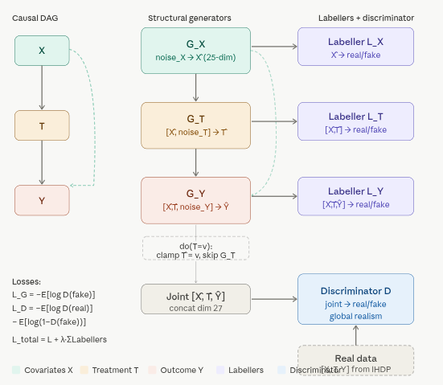

# 5.2.5 Causal Generative Network (CausalGAN) {.unnumbered}

**Causal Generative Network (CausalGAN)** is a causal-aware extension of
the classic GAN framework, introduced by Kocaoglu et al. (2018) in the
paper *CausalGAN: Learning Causal Implicit Generative Models with
Adversarial Training*. It lets you train a generative model that
respects a **user-specified causal DAG** while still producing
high-quality, realistic samples from the joint distribution. The key
advantage is that the model can answer *causal queries*—interventions
($\mathrm{do}(\cdot)$) and counterfactuals—**without any retraining or
additional data**, something a vanilla GAN cannot do.

### Why Standard GANs Fall Short

A normal GAN (Goodfellow et al., 2014) learns an implicit generator $G$
that maps noise $Z \sim p_Z$ to samples $\hat{\mathbf{v}} = G(Z)$ so
that the joint distribution $p(\hat{X}, \hat{T}, \hat{Y})$ matches the
data distribution $p(X, T, Y)$. However, because the generator is a
black-box neural network, it has no notion of *causal mechanisms*. You
cannot ask it: - Interventional query: “What would $Y$ be if we *forced*
$T = 1$ for everyone?” ($\mathbb{E}[Y \mid \mathrm{do}(T=1)]$). -
Counterfactual query: “Given that this patient had $T=0$ and outcome
$Y=0$, what would their $Y$ have been *if* they had received treatment
$T=1$?”

CausalGAN fixes this by turning the generator into a **Structural Causal
Model (SCM)** whose functional form is exactly the causal graph you
provide.

### How CausalGAN Works

#### 1. Structural Equation Generators (The Core Architecture)

Architecturally, CausalGAN decomposes the generator into separate
modules that mirror the structure of the causal DAG. For a simple DAG
with $X \to T \to Y$ and $X \to Y$, the generator is structured as
follows:



Instead of one monolithic generator, CausalGAN decomposes the generator
according to the topological order of the DAG. Every node $V_i$ gets its
own sub-generator $G_i$:

$$
\begin{align*}
\hat{X} &= G_X(Z_X) \\
\hat{T} &= G_T(\hat{X}, Z_T) \\
\hat{Y} &= G_Y(\hat{X}, \hat{T}, Z_Y)
\end{align*}
$$

-   $Z_X, Z_T, Z_Y \sim \mathcal{N}(0, I)$ are independent exogenous
    noise vectors (the “unobserved confounders” in the SCM).
-   Each $G_i$ is a neural network (typically MLPs or CNNs depending on
    the domain) that takes:
    -   The generated values of its **causal parents** (already sampled
        upstream), and
    -   Its own private noise.
-   Data flow is strictly causal: a child never “sees” its descendants.
    This exactly implements the structural equations of a causal DAG: $$
    V_i := f_i(\text{Pa}(V_i), U_i), \quad U_i \perp\!\!\!\perp \text{other noises}
    $$

Because the architecture *hard-wires* the graph, the generator
automatically satisfies the Markov factorization of the joint
distribution induced by the DAG.

#### 2. Interventions via Clamping (Do-Calculus in One Line)

To perform an intervention $\mathrm{do}(T = t)$:

1.  Skip $G_T$ entirely.
2.  Set $\hat{T} \leftarrow t$ (a constant).
3.  Feed the clamped $\hat{T}$ into all downstream generators ($G_Y$ in
    the example).

$$
\hat{Y}_{\mathrm{do}(T=1)} = G_Y(\hat{X}, \hat{T}=1, Z_Y)
$$

No weights are changed. This is exactly Pearl’s $\mathrm{do}$-operator
realized inside the generator. You can now compute interventional
quantities by sampling many such trajectories and averaging (e.g.,
average treatment effect, conditional interventions, etc.).

#### 3. Labeller Networks (The Key Training Innovation)

Standard GANs only have one global discriminator $D$ that tries to
distinguish real $(X,T,Y)$ from fake $(\hat{X},\hat{T},\hat{Y})$.
CausalGAN adds **one small “labeller” (local discriminator/classifier)
per node**.

-   Global discriminator $D_{\text{joint}}$: ensures the *entire joint*
    looks realistic.
-   Node-specific labellers $D_i$: each $D_i$ is trained to distinguish
    the marginal/conditional distribution of node $i$ given its parents
    in both real and generated data.

The total adversarial loss becomes: 

$$
\mathcal{L} = \mathcal{L}_{\text{joint}} + \sum_i \lambda_i \mathcal{L}_{\text{label},i}
$$


This extra supervision forces each structural equation $G_i$ to match
the *correct conditional* $p(V_i \mid \text{Pa}(V_i))$ implied by the
data. Without labellers, a plain GAN could learn a joint that is
statistically close but violates the causal conditionals.


#### 4. Counterfactual Abduction (Answering “What if this specific patient had been treated?”)

Counterfactuals require three steps (abduction → action → prediction),
exactly as in Pearl’s SCM framework:

1.  **Abduction**: Given a real observation $(x, t, y)$, find the *noise
    realization* $\mathbf{u}^* = (u_X^*, u_T^*, u_Y^*)$ that best
    explains it: 
    
  $$
   \mathbf{u}^* = \arg\min_{\mathbf{u}} \;\; \bigl\| G(\mathbf{u}) - (x,t,y) \bigr\|_2^2 + \text{regularizers}
  $$ 
    This is solved by gradient descent on the noise vectors (a few
    dozen steps at inference time; no retraining).

2.  **Action**: Apply the intervention by clamping the desired variable
    (e.g., set $\hat{T} = 1$).

3.  **Prediction**: Re-run the generator with the *same* noise

  $\mathbf{u}^*$ but the new intervention: 
    
  $$
    y_{\text{CF}} = G_Y(x, \hat{T}=1, u_Y^*)
  $$

Because the noises are held fixed, you are answering “what would *this
exact individual* have experienced under the counterfactual
treatment?”—the purest form of individual-level causal reasoning.

### Advantages and Practical Notes

-   **Zero extra training cost for causal queries**: once trained, any
    intervention or counterfactual is a simple forward pass (or a short
    abduction optimization).
-   **Works with any differentiable generator** (MLPs, CNNs,
    transformers, etc.).
-   **Scalable**: the number of extra labellers is linear in the number
    of nodes, and each is tiny.
-   **Applications**: medical imaging (what-if different treatments?),
    fairness (counterfactual fairness auditing), causal data
    augmentation, policy evaluation, etc.

In short, CausalGAN is the first practical way to turn a black-box
generative model into a **white-box Structural Causal Model** that obeys
both statistical realism *and* the causal graph you care about. The
combination of structural-equation generators, per-node labellers, and
explicit noise abduction gives you full do-calculus and counterfactual
power inside the adversarial training loop.

## Implementation in R

We use {RCuasalML}s `causalGAN` implementation (torch-based when
available, else a placeholder) to fit the model on the IHDP
semi-synthetic dataset.

## Set Up

### Check and Install Required R Packages

Following R packages are required to run this notebook. If any of these packages are not installed, you can install them using the code below:

`tidyverse`, `plyr`, `RCausalML`, `causaldata`, `torch`, `dagitty`, `ggdag`, `igraph`

```{r}
#| label: lst-packages-vector
#| lst-cap: "Required R package names used throughout the notebook."
packages <- c(
  "tidyverse",
  "plyr",
  "RCausalML",
  "causaldata",
  "torch",
  "dagitty",
  "ggdag",
  "igraph"
)
```

### Install Missing Packages

```{r}
#| label: lst-install-missing-packages
#| lst-cap: "Optional commands to install missing CRAN/GitHub dependencies (commented by default)."
#| warning: false
#| error: false
# Install missing packages
# new_packages <- packages[!(packages %in% installed.packages()[, "Package"])]
# if (length(new_packages)) install.packages(new_packages)
```

### Verify Installation

```{r}
#| label: lst-verify-package-installation
#| lst-cap: "Check that each required package namespace is available."
# Verify installation
cat("Installed packages:\n")
print(sapply(packages, requireNamespace, quietly = TRUE))
```

### Load R Packages

```{r}
#| label: load-required-libraries
#| warning: false
# When rendering from package root, use local RCausalML (so causal_tree fixes are used)
if (file.exists("DESCRIPTION") && requireNamespace("devtools", quietly = TRUE)) {
  try(devtools::load_all(".", quiet = TRUE), silent = TRUE)
}
invisible(lapply(packages, function(pkg) {
  suppressPackageStartupMessages(library(pkg, character.only = TRUE))
}))
```


### Check Loaded Packages

```{r}
#| label: lst-check-loaded-packages
#| lst-cap: "Confirm which package environments are attached on the search path."
# Check loaded packages
cat("Successfully loaded packages:\n")
print(search()[grepl("package:", search())])
```


```{r}
#| label: setup
#| include: true
run_fast <- Sys.getenv("CAUSALML_FAST_RENDER", "TRUE") == "TRUE"
device_use <- NULL
if (requireNamespace("torch", quietly = TRUE)) {
  device_use <- if (run_fast || !torch::cuda_is_available()) "cpu" else "cuda"
  torch::torch_manual_seed(42L)
}
device <- device_use
set.seed(42)
```

### Data loading and preprocessing

IHDP is small per replication (~6.7k rows after merging the nine NPCI CSVs). Setting `replications=100` stacks 100 copies for Monte Carlo–style
benchmarks but needs **large RAM** and can stress the machine; this tutorial defaults to `replications=1`.

The next cell defines **`Z_train`**, **`Z_test`** (needed for **`Z_test_t`** in training), **`Z_test_eval`** (float64 copy for metrics), and
**`cols`**.

```{r}
SEED <- 42L
set.seed(SEED)
torch_manual_seed(SEED)

build_causal_matrix <- function(x, t, y, subsample = 5000L, seed = SEED) {
  set.seed(seed)
  Z <- cbind(x, t, y)
  idx <- sample.int(nrow(Z), size = min(as.integer(subsample), nrow(Z)), replace = FALSE)
  Z[idx, , drop = FALSE]
}

VAR_NAMES <- c(sprintf("x%d", 1:25), "T", "Y")
Y_IDX <- length(VAR_NAMES)

data_loading_ihdp <- function(train_rate = 0.8, replications = 1L) {
  base_url <- "https://raw.githubusercontent.com/uber/causalml/master/docs/examples/data/ihdp_npci_"
  df <- tryCatch({
    dfs <- lapply(1:9, function(i) utils::read.csv(sprintf("%s%d.csv", base_url, i), header = FALSE))
    df0 <- dplyr::bind_rows(dfs)
    colnames(df0) <- c(
      "treatment", "y_factual", "y_cfactual", "mu0", "mu1",
      sprintf("x%d", 1:25)
    )
    df0
  }, error = function(e) {
    message("IHDP download unavailable; using synthetic fallback data.")
    n <- 6000L
    x <- matrix(stats::rnorm(n * 25L), nrow = n, ncol = 25L)
    colnames(x) <- sprintf("x%d", 1:25)

    # Simple semi-synthetic structure: nonlinear response + heterogeneous effect
    lin <- 0.3 * x[, 1] - 0.2 * x[, 2] + 0.15 * x[, 3] + 0.1 * x[, 4]
    tau <- 0.5 + 0.2 * base::tanh(x[, 5]) - 0.1 * x[, 6]
    mu0 <- lin + 0.1 * (x[, 7]^2)
    mu1 <- mu0 + tau

    ps <- stats::plogis(0.2 * x[, 1] - 0.1 * x[, 2] + 0.05 * x[, 8])
    treatment <- stats::rbinom(n, size = 1, prob = ps)

    y_factual <- ifelse(treatment == 1, mu1, mu0) + stats::rnorm(n, sd = 1)
    y_cfactual <- ifelse(treatment == 1, mu0, mu1) + stats::rnorm(n, sd = 1)

    data.frame(
      treatment = treatment,
      y_factual = y_factual,
      y_cfactual = y_cfactual,
      mu0 = mu0,
      mu1 = mu1,
      x,
      check.names = FALSE
    )
  })
  if (replications > 1L) {
    df <- dplyr::bind_rows(replicate(replications, df, simplify = FALSE))
  }

  x <- as.matrix(df[, sprintf("x%d", 1:25)])
  t <- as.numeric(df$treatment)
  y <- as.numeric(df$y_factual)
  potential_y <- as.matrix(df[, c("mu0", "mu1")])

  n <- nrow(x)
  idx <- sample.int(n)
  train_n <- floor(train_rate * n)
  train_idx <- idx[seq_len(train_n)]
  test_idx <- idx[(train_n + 1):n]

  list(
    train_x = x[train_idx, , drop = FALSE],
    train_t = t[train_idx],
    train_y = y[train_idx],
    train_potential_y = potential_y[train_idx, , drop = FALSE],
    test_x = x[test_idx, , drop = FALSE],
    test_potential_y = potential_y[test_idx, , drop = FALSE],
    df = df
  )
}

preprocess_features <- function(train_x, test_x) {
  a <- train_x
  b <- test_x
  m <- colMeans(train_x[, 1:6, drop = FALSE])
  s <- apply(train_x[, 1:6, drop = FALSE], 2, sd)
  s[s == 0] <- 1
  a[, 1:6] <- scale(train_x[, 1:6, drop = FALSE], center = m, scale = s)
  b[, 1:6] <- scale(test_x[, 1:6, drop = FALSE], center = m, scale = s)
  list(train_x = a, test_x = b, scaler = list(center = m, scale = s))
}

cat("Loading IHDP data ...\n")
data_result <- data_loading_ihdp(train_rate = 0.8, replications = 1L)

train_x <- data_result$train_x
train_t <- data_result$train_t
train_y <- data_result$train_y
train_potential_y <- data_result$train_potential_y
test_x <- data_result$test_x
test_potential_y <- data_result$test_potential_y
df <- data_result$df

pp <- preprocess_features(train_x, test_x)
train_x <- pp$train_x
test_x <- pp$test_x

cat(sprintf("Train size : %s\n", format(nrow(train_x), big.mark = ",")))
cat(sprintf("Test size  : %s\n", format(nrow(test_x), big.mark = ",")))
cat(sprintf("Covariates : %d\n", ncol(train_x)))
cat(sprintf("Treatment prevalence: %.3f\n", mean(train_t)))

Z_train <- build_causal_matrix(train_x, train_t, train_y, subsample = 5000L)
Z_test <- build_causal_matrix(
  test_x,
  test_potential_y[, 2] - test_potential_y[, 1],
  rep(0, nrow(test_x)),
  subsample = 2000L
)

Z_test_eval <- Z_test
colnames(Z_train) <- VAR_NAMES
colnames(Z_test) <- VAR_NAMES

cat(sprintf(
  "Causal matrix shapes -> Train: (%d, %d) | Test: (%d, %d)\n",
  nrow(Z_train), ncol(Z_train), nrow(Z_test), ncol(Z_test)
))
cat("Column layout:", paste(VAR_NAMES, collapse = ", "), "\n")
```

### Model Hyperparameters & MLP Utils

```{r}
#| label: hyperparameters
DIM_X <- 25L
DIM_T <- 1L
DIM_Y <- 1L
DIM_Z <- DIM_X + DIM_T + DIM_Y

NOISE_X <- 32L
NOISE_T <- 8L
NOISE_Y <- 8L

HIDDEN <- 128L
if (run_fast) {
  HIDDEN <- 64L
  BATCH <- 256L
  EPOCHS <- 50L
} else {
  BATCH <- 256L
  EPOCHS <- 300L
}
LR_G <- 2e-4
LR_D <- 1e-4
```

### Structural Equation Model (Generators classes)

```{r}
#| label: structural-equation-model
# In this R notebook we use the package implementation:
#   causalGAN(X, treatment, y, ...)
# which internally defines GeneratorX/GeneratorT/GeneratorY and trains them jointly.
```

### Discriminator & Labellers

```{r}
#| label: discriminator-labellers
# The package implementation includes:
# - a global discriminator for (X,T,Y)
# - auxiliary labellers for X, (X,T), and (X,T,Y)
# mirroring the Python tutorial structure.
```

### Training Loop and Loss Function

```{r}
#| label: train-causalgan
#| message: true
#| warning: false
cg <- causalGAN(
  X = train_x,
  treatment = train_t,
  y = train_y,
  hidden_dim = HIDDEN,
  noise_x = NOISE_X,
  noise_t = NOISE_T,
  noise_y = NOISE_Y,
  epochs = EPOCHS,
  batch_size = BATCH,
  lr_g = LR_G,
  lr_d = LR_D,
  lambda_label = 0.5,
  label_smooth = 0.9,
  verbose = TRUE,
  device = device
)
```

### Interventional Analysis (do-T)

```{r}
#| label: interventional-analysis
#| message: false
#| warning: false
N_INTERV <- 4000L
do_samp <- predict(cg, newdata = NULL, n_samples = N_INTERV)

ate_gen <- mean(do_samp$y1 - do_samp$y0)
cat(sprintf("Estimated ATE via do(T=1)\u2212do(T=0) : %.4f\n", ate_gen))

true_tau <- test_potential_y[, 2] - test_potential_y[, 1]
ate_true <- mean(true_tau)
cat(sprintf("True ATE from IHDP potential outcomes : %.4f\n", ate_true))
```

### Counterfactual Inference (Abduction–Action–Prediction)

```{r}
#| label: counterfactual-inference
#| message: false
#| warning: false

# Abduction: optimize noise vectors to reconstruct observed (X,T,Y),
# then keep inferred noise fixed and swap T to its counterfactual.
#
# We do this directly against the fitted generator modules inside the causalGAN object.

.infer_noise_x_dim <- function(cg) {
  g <- cg$generator
  lin1 <- g$g_x$net[[1]]
  as.integer(lin1$weight$size(2))
}

abduction <- function(
    cg,
    obs_x,
    obs_t,
    obs_y,
    steps = 300L,
    lr = 5e-3
) {
  gen <- cg$generator
  device_use <- if (!is.null(cg$device)) cg$device else "cpu"
  B <- as.integer(nrow(obs_x))
  noise_x <- .infer_noise_x_dim(cg)
  noise_t <- as.integer(cg$noise_t %||% 4L)
  noise_y <- as.integer(cg$noise_y %||% 4L)

  x_t <- torch::torch_tensor(obs_x, dtype = torch::torch_float32(), device = device_use)
  t_t <- torch::torch_tensor(matrix(obs_t, ncol = 1), dtype = torch::torch_float32(), device = device_use)
  y_t <- torch::torch_tensor(matrix(obs_y, ncol = 1), dtype = torch::torch_float32(), device = device_use)

  nz_x <- torch::nn_parameter(torch::torch_randn(c(B, noise_x), device = device_use))
  nz_t <- torch::nn_parameter(torch::torch_randn(c(B, noise_t), device = device_use))
  nz_y <- torch::nn_parameter(torch::torch_randn(c(B, noise_y), device = device_use))

  opt_abd <- torch::optim_adam(list(nz_x, nz_t, nz_y), lr = lr)
  mse <- function(a, b) torch::nnf_mse_loss(a, b)

  for (i in seq_len(as.integer(steps))) {
    opt_abd$zero_grad()
    x_hat <- gen$g_x(nz_x)
    t_hat <- gen$g_t(x_hat, nz_t)
    y_hat <- gen$g_y(x_hat, t_t, nz_y)
    loss <- mse(x_hat, x_t) + mse(t_hat, t_t) + mse(y_hat, y_t)
    loss$backward()
    opt_abd$step()
  }
  list(nz_x = nz_x$detach(), nz_t = nz_t$detach(), nz_y = nz_y$detach())
}

counterfactual <- function(cg, obs_x, obs_t, obs_y, cf_t = 0) {
  gen <- cg$generator
  device_use <- if (!is.null(cg$device)) cg$device else "cpu"
  B <- nrow(obs_x)
  abd <- abduction(cg, obs_x, obs_t, obs_y, steps = 200L, lr = 5e-3)
  torch::with_no_grad({
    x_cf <- gen$g_x(abd$nz_x)
    t_cf <- torch::torch_full(c(B, 1L), as.numeric(cf_t),
                              dtype = torch::torch_float32(), device = device_use)
    y_cf <- gen$g_y(x_cf, t_cf, abd$nz_y)
    y_cf$to(device = torch::torch_device("cpu"))
  })
}

`%||%` <- function(a, b) if (!is.null(a)) a else b

# Demo: pick 64 individuals and estimate their counterfactual Y(T=0)
B_demo <- 64L
sample_x <- train_x[1:B_demo, , drop = FALSE]
sample_t <- train_t[1:B_demo]
sample_y <- train_y[1:B_demo]

cat("\nRunning counterfactual abduction (64 samples, 200 steps) ...\n")
y_cf0_t <- counterfactual(cg, sample_x, sample_t, sample_y, cf_t = 0)
y_cf0 <- as.numeric(y_cf0_t$squeeze(2L))

ite_cf <- sample_y - y_cf0
cat(sprintf("  Mean ITE (Y_obs \u2212 Y_cf[T=0]) : %.4f\n", mean(ite_cf)))
```

### Evaluation Metrics

```{r}
#| label: evaluation-metrics
#| message: false
#| warning: false

fid_proxy <- function(real, fake) {
  mu_r <- colMeans(real)
  mu_f <- colMeans(fake)
  std_r <- apply(real, 2, sd)
  std_f <- apply(fake, 2, sd)
  sum((mu_r - mu_f)^2) + sum((std_r - std_f)^2)
}

sem_r2 <- function(real_test, cg, n_gen = 5000L) {
  gen <- cg$generator
  fake_np <- torch::with_no_grad({
    gen(as.integer(n_gen))$joint$to(device = torch::torch_device("cpu"))
  })
  fake_np <- as.matrix(fake_np)

  r2s <- list()
  for (v_idx in seq_along(VAR_NAMES)) {
    feat_cols <- setdiff(seq_len(DIM_Z), v_idx)
    X_gen <- fake_np[, feat_cols, drop = FALSE]
    y_gen <- fake_np[, v_idx]
    feat_names <- paste0("f", seq_len(ncol(X_gen)))
    colnames(X_gen) <- feat_names
    df_gen <- data.frame(y_gen = y_gen, as.data.frame(X_gen, stringsAsFactors = FALSE))
    reg <- stats::lm(y_gen ~ ., data = df_gen)

    X_real <- real_test[, feat_cols, drop = FALSE]
    y_real <- real_test[, v_idx]
    colnames(X_real) <- feat_names
    df_real <- data.frame(as.data.frame(X_real, stringsAsFactors = FALSE))
    y_hat <- stats::predict(reg, newdata = df_real)
    ss_res <- sum((y_real - y_hat)^2)
    ss_tot <- sum((y_real - mean(y_real))^2) + 1e-8
    r2s[[VAR_NAMES[v_idx]]] <- as.numeric(1 - ss_res / ss_tot)
  }
  unlist(r2s)
}

cate_pehe <- function(cg, test_x_arr, true_tau, n_reps = 10L) {
  gen <- cg$generator
  device_use <- if (!is.null(cg$device)) cg$device else "cpu"
  N <- nrow(test_x_arr)
  noise_y <- as.integer(cg$noise_y %||% 4L)

  x_t <- torch::torch_tensor(test_x_arr, dtype = torch::torch_float32(), device = device_use)
  tau_hat <- matrix(NA_real_, nrow = N, ncol = as.integer(n_reps))
  torch::with_no_grad({
    for (k in seq_len(as.integer(n_reps))) {
      nz_y1 <- torch::torch_randn(c(N, noise_y), device = device_use)
      nz_y0 <- torch::torch_randn(c(N, noise_y), device = device_use)
      t1 <- torch::torch_ones(c(N, 1L), device = device_use)
      t0 <- torch::torch_zeros(c(N, 1L), device = device_use)
      y1 <- as.numeric(gen$g_y(x_t, t1, nz_y1)$to(device = torch::torch_device("cpu"))$squeeze(2L))
      y0 <- as.numeric(gen$g_y(x_t, t0, nz_y0)$to(device = torch::torch_device("cpu"))$squeeze(2L))
      tau_hat[, k] <- y1 - y0
    }
  })
  tau_hat_mean <- rowMeans(tau_hat)
  sqrt(mean((tau_hat_mean - true_tau)^2))
}

cat("\n", paste(rep("=", 60), collapse = ""), "\n", sep = "")
cat("EVALUATION\n")
cat(paste(rep("=", 60), collapse = ""), "\n", sep = "")

fake_joint_eval <- torch::with_no_grad({
  cg$generator(5000L)$joint$to(device = torch::torch_device("cpu"))
})
fake_np <- as.matrix(fake_joint_eval)

fid_val <- fid_proxy(Z_test_eval, fake_np)
cat(sprintf("\n  FID-proxy (lower is better): %.4f\n", fid_val))

# Compute SEM R^2 for a subset (fast)
r2_dict <- sem_r2(Z_test_eval, cg, n_gen = 5000L)
cat("\n  SEM R\u00b2 (sample of 5 variables):\n")
for (vname in c("x1", "x5", "x10", "T", "Y")) {
  cat(sprintf("    %4s : %.4f\n", vname, r2_dict[[vname]]))
}

true_tau_test <- test_potential_y[, 2] - test_potential_y[, 1]
pehe_val <- cate_pehe(cg, test_x, true_tau_test, n_reps = 10L)
cat(sprintf("\n  CATE PEHE (sqrt MISE, lower is better): %.4f\n", pehe_val))
cat(sprintf("  Std of true \u03c4 (benchmark): %.4f\n", sd(true_tau_test)))
```

### Visualization

```{r}
#| label: visualization
#| message: false
#| warning: false
#| fig-width: 12
#| fig-height: 9

plt_style <- theme_minimal(base_size = 11) + theme(panel.grid.minor = element_blank())

history_d <- cg$history_d
history_g <- cg$history_g

df_loss <- data.frame(
  epoch = seq_along(history_d),
  d_loss = history_d,
  g_loss = history_g
)

p_loss <- ggplot(df_loss, aes(x = epoch)) +
  geom_line(aes(y = d_loss, color = "Discriminator + Labeller loss"), linewidth = 0.8) +
  geom_line(aes(y = g_loss, color = "Generator loss"), linewidth = 0.8) +
  labs(title = "Training Loss Curves", x = "Epoch", y = "Loss", color = NULL) +
  plt_style

p_y <- {
  real_y <- Z_train[, ncol(Z_train)]
  dfy <- data.frame(
    y = c(real_y, do_samp$y1, do_samp$y0),
    group = factor(
      c(rep("Real Y", length(real_y)),
        rep("Gen Y(do T=1)", nrow(do_samp)),
        rep("Gen Y(do T=0)", nrow(do_samp))),
      levels = c("Real Y", "Gen Y(do T=1)", "Gen Y(do T=0)")
    )
  )
  ggplot(dfy, aes(x = y, fill = group)) +
    geom_histogram(aes(y = after_stat(density)), bins = 40, alpha = 0.55, position = "identity") +
    labs(title = "Outcome Y: Real vs Interventional", x = "Y", y = "Density", fill = NULL) +
    plt_style
}

p_t <- {
  # Sample generated T from the SCM (eval mode uses hard samples for T)
  t_obs <- torch::with_no_grad({
    cg$generator(3000L)$t$to(device = torch::torch_device("cpu"))$squeeze(2L)
  })
  t_obs_np <- as.numeric(t_obs)
  dft <- data.frame(
    t = c(train_t, t_obs_np),
    group = factor(c(rep("Real T", length(train_t)), rep("Gen T", length(t_obs_np))))
  )
  ggplot(dft, aes(x = t, fill = group)) +
    geom_histogram(aes(y = after_stat(density)), bins = 20, alpha = 0.6, position = "identity") +
    labs(title = "Treatment Distribution", x = "T", y = "Density", fill = NULL) +
    plt_style
}

p_cate <- {
  N_sc <- min(500L, nrow(test_x))
  pred_pair <- predict(cg, newdata = test_x[1:N_sc, , drop = FALSE], n_samples = 1L)
  tau_sc <- pred_pair$ite
  true_sc <- true_tau_test[1:N_sc]
  dft <- data.frame(true = true_sc, est = tau_sc)
  mn <- min(c(dft$true, dft$est))
  mx <- max(c(dft$true, dft$est))
  ggplot(dft, aes(x = true, y = est)) +
    geom_point(alpha = 0.5, size = 1.2, color = "#7b5ce0") +
    geom_abline(intercept = 0, slope = 1, linetype = "dashed", color = "red") +
    labs(title = "CATE: Estimated vs True", x = "True \u03c4", y = "Estimated \u03c4\u0302") +
    coord_equal(xlim = c(mn, mx), ylim = c(mn, mx)) +
    plt_style
}

p_r2 <- {
  keep <- c(seq(1, 25, by = 3), 26, 27)
  keys_sub <- VAR_NAMES[keep]
  vals_sub <- as.numeric(r2_dict[keys_sub])
  dfr <- data.frame(var = factor(keys_sub, levels = rev(keys_sub)), r2 = vals_sub)
  ggplot(dfr, aes(x = r2, y = var, fill = var %in% c("T", "Y"))) +
    geom_col() +
    scale_fill_manual(values = c("TRUE" = "#e07a5c", "FALSE" = "#5c8de0"), guide = "none") +
    labs(title = "SEM R\u00b2 per Variable", x = "R\u00b2", y = NULL) +
    plt_style
}

p_x1x2 <- {
  fx_eval <- torch::with_no_grad({
    cg$generator(3000L)$x$to(device = torch::torch_device("cpu"))
  })
  fx_np <- as.matrix(fx_eval)
  df1 <- data.frame(val = c(train_x[, 1], fx_np[, 1]),
                    group = factor(c(rep("Real x1", nrow(train_x)), rep("Gen x1", nrow(fx_np)))))
  df2 <- data.frame(val = c(train_x[, 2], fx_np[, 2]),
                    group = factor(c(rep("Real x2", nrow(train_x)), rep("Gen x2", nrow(fx_np)))))
  p1 <- ggplot(df1, aes(x = val, fill = group)) +
    geom_histogram(aes(y = after_stat(density)), bins = 35, alpha = 0.6, position = "identity") +
    labs(title = "Covariate x1: Real vs Generated", x = "x1", y = "Density", fill = NULL) +
    plt_style
  p2 <- ggplot(df2, aes(x = val, fill = group)) +
    geom_histogram(aes(y = after_stat(density)), bins = 35, alpha = 0.6, position = "identity") +
    labs(title = "Covariate x2: Real vs Generated", x = "x2", y = "Density", fill = NULL) +
    plt_style
  list(p1 = p1, p2 = p2)
}

p_ite <- {
  ggplot(data.frame(ite = ite_cf), aes(x = ite)) +
    geom_histogram(bins = 25, fill = "#5ce0b8", alpha = 0.85, color = "white") +
    geom_vline(xintercept = mean(ite_cf), color = "#e05c5c", linewidth = 1.1, linetype = "dashed") +
    labs(title = "Counterfactual ITE (abduction)", x = "Y_obs \u2212 Y_cf(T=0)", y = "Count") +
    plt_style
}

# Compose a multi-panel plot using patchwork if available; else print sequentially.
if (requireNamespace("patchwork", quietly = TRUE)) {
  library(patchwork)
  px <- p_x1x2
  (p_loss + p_y) / (p_t + p_cate + p_r2) / (px$p1 + px$p2 + p_ite) +
    plot_annotation(title = "CausalGAN Results – IHDP Dataset")
} else {
  print(p_loss); print(p_y); print(p_t); print(p_cate); print(p_r2)
  px <- p_x1x2; print(px$p1); print(px$p2); print(p_ite)
}
```


## Summary and Conclusions

This tutorial demonstrated how to implement and evaluate a Causal
Generative Adversarial Network (CausalGAN) in R using the {RCausalML}
package. We covered: - Building structural equation generators that
respect a user-specified causal graph. - Performing interventional
analysis by clamping treatment variables. - Conducting counterfactual
inference through abduction-action-prediction. - Evaluating model
performance using metrics like FID-proxy, SEM R², and CATE PEHE.

## Resources

-   Kocaoglu et al. (2018). "CausalGAN: Learning Causal Implicit
    Generative Models with Adversarial
    Training.[arXiv:1709.02023](https://arxiv.org/abs/1709.02023)
-   {CausalML} package documentation: [https://docs.uber.com/causal
    ml/](https://docs.uber.com/causalml/)


