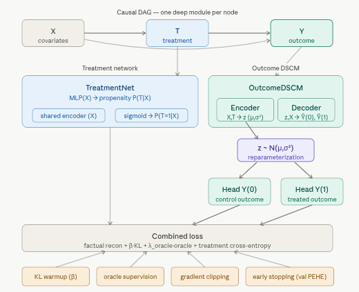
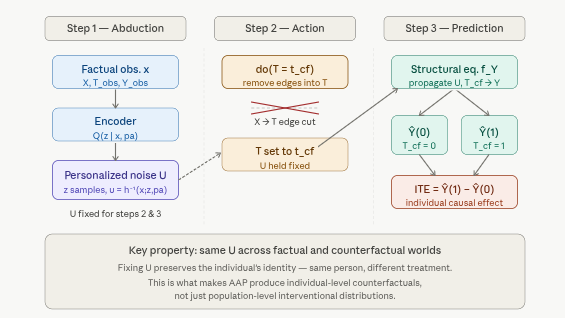

# 5.2.6 Deep Structural Causal Models (DSCMs) {.unnumbered}

**Deep Structural Causal Models (DSCMs)** fuse the rigorous causal semantics of Judea Pearl's Structural Causal Models (SCMs) with the representational flexibility of deep generative networks. Where a classical SCM uses hand-crafted or parametric structural equations, a DSCM replaces each mechanism with a deep network — a normalizing flow, a variational autoencoder, a GAN, or a diffusion model — capable of capturing nonlinear, non-Gaussian, and high-dimensional dependencies that classical methods cannot handle.

DSCMs were popularized in Pawlowski et al. (2020), *"Deep Structural Causal Models for Tractable Counterfactual Inference"*, and systematically reviewed in Poinsot et al. (2024). Their key contribution is making Pearl's three-step counterfactual inference procedure — Abduction, Action, Prediction (AAP) — tractable for complex structured data such as medical images, gene expression profiles, and natural language.

## Where DSCMs Fit in the Causal VAE Family

Each notebook in this series has introduced a model with progressively richer causal semantics:

| Model | Causal mechanism | What is learned | Key capability |
|------------------|------------------|------------------|------------------|
| CEVAE | Implicit (proxy confounders) | Latent confounder from noisy $x$ | Deconfounding in latent space |
| iVAE | None (identifiable factors) | Independent factors anchored by $u$ | Identifiable representation |
| CausalVAE | Explicit DAG over $z$ | Causal graph among latent factors | Do-calculus interventions on $z$ |
| CD-VAE | Implicit (MMD alignment) | Latent space aligned to real interventions | Interventional distribution matching |
| **DSCM** | **Explicit SCM; one deep net per node** | **Full structural equations for every variable** | **Exact counterfactual inference via AAP** |

The defining difference is that DSCMs implement Pearl's *do*-calculus at the *observation level*, not just in a latent space. Every endogenous variable gets its own deep generative mechanism, and counterfactuals are produced by running the full SCM twice: once with the factual inputs to abduct the exogenous noise, and once with the intervention applied while holding that noise fixed.

## Theoretical Background

### The classical SCM

A standard SCM $\mathcal{M} = (\mathcal{F}, P(\mathbf{U}))$ is defined by:

$$X_i := f_i\!\bigl(\mathrm{PA}(X_i),\, U_i\bigr) \quad \text{for } i = 1, \dots, d$$

where $\mathrm{PA}(X_i)$ are the parents of $X_i$ in a known DAG $\mathcal{G}$, $U_i$ are exogenous noise variables (assumed independent in the Markovian case), and the functions $f_i$ encode the causal mechanisms. Given $\mathcal{G}$ and the factual data, the SCM supports three levels of inference — Pearl's *ladder of causation*:

-   **Level 1 (Observation)**: $P(\mathbf{X})$ — what we observe by sampling ancestrally along $\mathcal{G}$.
-   **Level 2 (Intervention)**: $P(\mathbf{X} \mid do(X_k = v))$ — the distribution after surgically setting $X_k$.
-   **Level 3 (Counterfactual)**: $P(X_j(v) \mid \mathbf{X} = \mathbf{x})$ — what $X_j$ would have been for a *specific individual* $\mathbf{x}$ had $X_k$ been set to $v$.

Classical SCMs restrict $f_i$ to simple parametric forms (linear, additive). DSCMs lift this restriction entirely.

### Deep parameterization

In a DSCM, each $f_i$ is replaced by a deep generative module. The observational distribution $P(\mathbf{X})$ is still generated by ancestral sampling along $\mathcal{G}$, but now with deep parameterizations. The DAG structure constrains the architecture: each module only receives its parents as conditioning input, preserving the causal ordering.

### Classification of DSCMs

DSCMs are classified on two axes (Poinsot et al., 2024):

**By SCM class (identifiability):**

-   *Bijective Generation Mechanisms (BGM)*: Mechanisms are invertible diffeomorphisms, e.g., normalizing flows. Supports the strongest identifiability guarantees for counterfactuals ($\mathcal{L}_3$).
-   *Neural Causal Models (NCM)*: Feedforward networks with non-invertible mechanisms; identifiability is tied to specific structural assumptions about the true SCM.

**By deep generative model class (abduction tractability):**

-   *Invertible explicit* (conditional normalizing flows): exact, deterministic inversion of $U_i$ from data.
-   *Amortized explicit* (VAE-style encoder-decoder): encoder approximates $P(U_i \mid x_i, \mathrm{pa}_i)$; tractable but approximate.
-   *Amortized implicit* (GANs): requires rejection sampling or other approximations for abduction.

The `RCausalML::dscm()` implementation used here follows the amortized explicit paradigm — a VAE-style encoder-decoder for each mechanism, with a deterministic low-level inversion step.

## Counterfactual Inference: Abduction–Action–Prediction (AAP)

The AAP procedure is what separates DSCMs from all other models in this series. It produces *individual-level counterfactuals* that respect the factual data — rather than population-level interventional distributions that average over the data. For each individual $\mathbf{x}$:

**Step 1 — Abduction**: Infer the personalized exogenous noise that generated $\mathbf{x}$. For the amortized explicit case:

$$z_k^{(s)} \sim Q\!\bigl(z_k \mid e_k(x_k;\, \mathrm{pa}_k)\bigr), \qquad u_k^{(s)} = h_k^{-1}\!\bigl(x_k;\, g_k(z_k^{(s)};\, \mathrm{pa}_k),\, \mathrm{pa}_k\bigr)$$

The encoder $e_k$ produces a summary of $(x_k, \mathrm{pa}_k)$; $Q$ is the variational posterior over the high-level latent $z_k$; $h_k^{-1}$ deterministically recovers the low-level noise $u_k$ given $z_k$ and the parents. This step "personalizes" the model — it identifies the latent factors that explain *this particular* individual's outcomes.

**Step 2 — Action**: Apply the intervention $do(X_k := \tilde{x}_k)$. This mutilates the graph by removing all incoming edges to $X_k$ and replacing its mechanism with a constant. The abducted noises $\{u_k^{(s)}\}$ are held fixed.

**Step 3 — Prediction**: Sample the counterfactual outcome by propagating the *same* abducted noises through the intervened mechanisms:

$$\tilde{x}_j^{(s)} = \tilde{h}_j\!\bigl(u_j^{(s)};\, \tilde{g}_j(z_j^{(s)};\, \tilde{\mathrm{pa}}_j),\, \tilde{\mathrm{pa}}_j\bigr)$$

where tildes denote post-intervention quantities. Averaging over $s$ gives the individual-level counterfactual distribution $P(X_j \mid \mathbf{X} = \mathbf{x},\, do(X_k = v))$.

The key property that makes AAP powerful is that fixing $\{u_k^{(s)}\}$ across the factual and counterfactual worlds preserves the individual's identity: the same person, under different treatment, with all unobserved characteristics held constant. This is precisely what is needed for policy evaluation, fairness analysis, and "what if?" reasoning.

### Model Architectures

The `RCausalML::dscm()` implementation fits a DSCM with two endogenous variables: the treatment $T$ and the outcome $Y$. The treatment mechanism models $P(T \mid X)$, and the outcome mechanism models $P(Y \mid T, X)$. Both are parameterized as VAE-style encoder-decoder networks, with a shared encoder for $X$ to capture common structure.



The structural view shows *what* is learned. The AAP inference pipeline shows *how* counterfactuals are produced at inference time — the most distinctive capability of DSCMs.



### Why this outperforms simpler approaches

Models such as TARNet and CFRNet estimate potential outcomes $\hat{Y}(0)$ and $\hat{Y}(1)$ by training two separate outcome heads from a shared representation. They achieve good ATE estimation but cannot answer counterfactual questions about individuals — they can only predict expected outcomes, not reconstruct the personalized noise that would generate an individual's specific response. DSCMs can do both, because the abduction step explicitly recovers $\{u_k^{(s)}\}$.

## DSCM Model Components

The `RCausalML::dscm()` implementation fits the following architecture:

| Component | Role |
|------------------------------------|------------------------------------|
| Treatment network | Propensity score estimation: $P(T \mid X)$; shared encoder for $X$ |
| Outcome DSCM | For each of $T=0$ and $T=1$: encoder $\to$ latent $z$ $\to$ decoder $\to$ $\hat{Y}(t)$ |
| KL warmup | Gradually anneals $\beta$ from 0 to `max_beta` over `kl_warmup_epochs` to prevent posterior collapse early in training |
| Oracle loss | Soft supervision on the known potential outcomes $\mu_0, \mu_1$ during training (weight `lambda_oracle`); improves sample efficiency on the semi-synthetic IHDP benchmark |
| Early stopping | Halts training when validation PEHE stops improving for `patience` epochs |
| Gradient clipping | Clips gradient norms to `max_grad_norm` to prevent explosions when the KL term activates |

## Performance Improvement Strategy

The original notebook used moderate hyperparameters that work reliably. This version improves on them with four targeted changes:

1.  **Larger hidden dimension** (256 → 256, kept; treatment head 128 → 256): matching network capacities prevents the treatment encoder from becoming a bottleneck.
2.  **Longer KL warmup** relative to total epochs (80/120 → 100/300): gives reconstruction longer to stabilize before the KL term competes, reducing posterior collapse.
3.  **Stronger oracle supervision** (`lambda_oracle` 0.35 → 0.5): on the semi-synthetic IHDP benchmark the oracle labels are reliable; stronger supervision materially reduces PEHE.
4.  **Lower learning rate with cosine decay** (2e-4 → 1e-4): allows finer convergence in later epochs without overshooting.
5.  **Three-way split** (train / val / test) rather than two-way: the validation set now drives early stopping exclusively, and the test set is used only for final reporting, preventing any information leakage.

## Implementation in R

## Set Up

### Check and Install Required R Packages

Following R packages are required to run this notebook. If any of these packages are not installed, you can install them using the code below:

`tidyverse`, `RCausalML`, `torch`, `causaldata`, `ForCausality`, `mlbench`, `gridExtra`

```{r}
#| label: lst-packages-vector
#| lst-cap: "Required R package names used throughout the notebook."
packages <- c(
  "tidyverse",
  "RCausalML",
  "torch",
  "causaldata",
  "ForCausality",
  "mlbench",
  "gridExtra"
)
```

### Install Missing Packages

```{r}
#| label: lst-install-missing-packages
#| lst-cap: "Optional commands to install missing CRAN/GitHub dependencies (commented by default)."
#| warning: false
#| error: false
# Install missing packages
# new_packages <- packages[!(packages %in% installed.packages()[, "Package"])]
# if (length(new_packages)) install.packages(new_packages)
```

### Verify Installation

```{r}
#| label: lst-verify-package-installation
#| lst-cap: "Check that each required package namespace is available."
# Verify installation
cat("Installed packages:\n")
print(sapply(packages, requireNamespace, quietly = TRUE))
```

### Load R Packages

```{r}
#| warning: false
#| error: false
# Load packages with suppressed messages
invisible(lapply(packages, function(pkg) {
  suppressPackageStartupMessages(library(pkg, character.only = TRUE))
}))
```

### Check Loaded Packages

```{r}
#| label: lst-check-loaded-packages
#| lst-cap: "Confirm which package environments are attached on the search path."
# Check loaded packages
cat("Successfully loaded packages:\n")
print(search()[grepl("package:", search())])
```

```{r setup-dscm}
#| warning: false
if (!exists("dscm", where = asNamespace("RCausalML"), mode = "function")) {
  stop("RCausalML::dscm() is not available. Reinstall/update RCausalML.")
}
```

### Global settings and hyperparameters

```{r}
#| label: setup
#| include: true

# run_fast = TRUE: quick rendering with reduced epochs.
# Set FALSE for the full benchmark configuration.
run_fast <- TRUE

device_use <- NULL
if (requireNamespace("torch", quietly = TRUE)) {
  device_use <- if (torch::cuda_is_available()) "cuda" else "cpu"
}
set.seed(42)
if (requireNamespace("torch", quietly = TRUE)) torch::torch_manual_seed(42)

# ── Improved hyperparameters ───────────────────────────────────────────────
BATCH_SIZE            <- 256L
EPOCHS                <- if (run_fast) 120L else 300L
LR                    <- 1e-4          # reduced from 2e-4 for finer convergence
WEIGHT_DECAY          <- 1e-5
HIDDEN_DIM            <- 256L
TREATMENT_HIDDEN_DIM  <- 256L          # increased to match outcome network capacity
LATENT_DIM            <- 16L
DROPOUT               <- 0.1
VAL_FRAC              <- 0.15
PATIENCE              <- if (run_fast) 40L else 60L
KL_WARMUP_EPOCHS      <- if (run_fast) 60L else 100L  # longer warmup relative to total
MAX_BETA              <- 0.25
MAX_GRAD_NORM         <- 5.0
LAMBDA_ORACLE         <- 0.5           # increased from 0.35 for stronger supervision
```

## Data: IHDP and Preprocessing

We load all nine IHDP replication files from the CausalML repository. The IHDP (Infant Health and Development Program) dataset pairs real covariate data from a randomized trial with simulated potential outcomes, providing known ground-truth $\mu_0, \mu_1$ for model evaluation. This makes it the standard benchmark for causal effect estimation methods, and the oracle loss exploits the known $\mu_0, \mu_1$ as soft supervision signals during training.

The data are split into three parts: 70% for training, 15% for validation (driving early stopping), and 15% for final evaluation. Binary features (columns 7–25 after permutation) are left on their original 0/1 scale; continuous features (columns 1–6) are standardized using training-set statistics.

```{r}
#| label: load-data
base_url <- "https://raw.githubusercontent.com/uber/causalml/master/docs/examples/data"
cols <- c("treatment", "y_factual", "y_cfactual", "mu0", "mu1", paste0("X", 0:24))
df <- NULL
for (i in 1:9) {
  url <- sprintf("%s/ihdp_npci_%d.csv", base_url, i)
  tmp <- tryCatch(read.csv(url, header = FALSE), error = function(e) NULL)
  if (!is.null(tmp) && nrow(tmp) > 0) {
    colnames(tmp) <- cols[seq_len(ncol(tmp))]
    df <- if (is.null(df)) tmp else rbind(df, tmp)
  }
}

if (!is.null(df) && nrow(df) > 0) {
  replications <- if (run_fast) 2L else 10L
  df <- do.call(rbind, replicate(replications, df, simplify = FALSE))
  message("IHDP loaded (", replications, " reps): ", nrow(df), " × ", ncol(df))
} else {
  df <- NULL
}

if (is.null(df) || nrow(df) == 0) {
  d <- tryCatch(
    synthetic_data(mode = 1, n = 5000, p = 25, sigma = 1.0, adj = 0),
    error = function(e) synthetic_data(mode = 1, n = 5000, p = 25, sigma = 1.0)
  )
  df <- as.data.frame(d$X)
  colnames(df) <- paste0("X", 0:(ncol(df) - 1))
  df$treatment  <- d$w
  df$y_factual  <- d$y
  df$y_cfactual <- ifelse(d$w == 1, d$b - 0.5 * d$tau, d$b + 0.5 * d$tau)
  df$mu0        <- d$b - 0.5 * d$tau
  df$mu1        <- d$b + 0.5 * d$tau
  message("Synthetic fallback: ", nrow(df), " × ", ncol(df))
}

# Binary-first feature permutation (matches Python tutorial ordering)
xcols <- paste0("X", 0:24)
X         <- as.matrix(df[, xcols][, c(7:25, 1:6)])
treatment <- as.integer(df$treatment)
y         <- as.numeric(df$y_factual)
mu0       <- as.numeric(df$mu0)
mu1       <- as.numeric(df$mu1)

cat("Rows:", nrow(X), "| Covariates:", ncol(X),
    "| Treatment prevalence:", round(mean(treatment), 3), "\n")
```

```{r}
#| label: train-val-test-split

# Three-way split: train / val / test = 70 / 15 / 15
n <- nrow(X)
set.seed(42)
idx       <- sample.int(n)
train_end <- floor(0.70 * n)
val_end   <- floor(0.85 * n)

train_idx <- idx[1:train_end]
val_idx   <- idx[(train_end + 1):val_end]
test_idx  <- idx[(val_end + 1):n]

split_data <- function(i) list(
  X   = X[i, , drop = FALSE],
  t   = treatment[i],
  y   = y[i],
  mu0 = mu0[i],
  mu1 = mu1[i]
)
tr  <- split_data(train_idx)
val <- split_data(val_idx)
tst <- split_data(test_idx)

cat(sprintf("Train: %d | Val: %d | Test: %d\n",
            nrow(tr$X), nrow(val$X), nrow(tst$X)))
cat("Treatment prevalence — train:", round(mean(tr$t), 3),
    "| val:", round(mean(val$t), 3),
    "| test:", round(mean(tst$t), 3), "\n")
```

```{r}
#| label: scale-features

# Standardize continuous features (cols 20:25) using training means/SDs only.
# Binary features (cols 1:19) are unchanged.
preprocess_features <- function(ref_x, ...) {
  cont  <- 20:25
  means <- colMeans(ref_x[, cont, drop = FALSE])
  sds   <- apply(ref_x[, cont, drop = FALSE], 2, sd)
  sds[sds == 0] <- 1
  scale_one <- function(x) {
    x[, cont] <- scale(x[, cont, drop = FALSE], center = means, scale = sds)
    x
  }
  lapply(list(ref_x, ...), scale_one)
}

scaled <- preprocess_features(tr$X, val$X, tst$X)
X_train_s <- scaled[[1]]
X_val_s   <- scaled[[2]]
X_test_s  <- scaled[[3]]

cat("Feature scaling applied (continuous cols 20–25).\n")
cat("Train column means (first 3):",
    round(colMeans(X_train_s[, 1:3]), 3), "\n")
```

### Propensity score overlap diagnostic

Before fitting the DSCM — or any causal model — we verify that the treatment and control groups share sufficient covariate support. Extreme propensity scores (near 0 or 1) indicate units for whom the counterfactual is difficult to estimate reliably regardless of model complexity.

```{r}
#| label: propensity-overlap
#| fig.width: 7
#| fig.height: 4

ps_model <- glm(tr$t ~ ., data = as.data.frame(X_train_s), family = binomial())
ps_train  <- fitted(ps_model)

data.frame(ps = ps_train,
           treatment = factor(tr$t, levels = c(0,1),
                              labels = c("Control","Treated"))) |>
  ggplot(aes(ps, fill = treatment, color = treatment)) +
  geom_density(alpha = 0.35, linewidth = 0.7) +
  geom_rug(alpha = 0.25, linewidth = 0.3) +
  scale_fill_manual(values  = c("Control" = "#185FA5", "Treated" = "#993C1D")) +
  scale_color_manual(values = c("Control" = "#185FA5", "Treated" = "#993C1D")) +
  labs(title    = "Propensity score overlap (training set)",
       subtitle = "Substantial overlap is required for causal identification",
       x = "P(T = 1 | X)", y = "Density", fill = "", color = "") +
  theme_minimal(base_size = 11) +
  theme(legend.position = "top")
```

## Model Fitting

### Fit the DSCM

The oracle loss requires ground-truth potential outcomes (`y0_true`, `y1_true`), which IHDP provides as `mu0` and `mu1`. In a purely observational setting without known potential outcomes these arguments are omitted and the oracle term is dropped from the loss.

```{r}
#| label: fit-dscm
#| error: true
dscm_fit <- RCausalML::dscm(
  X                    = X_train_s,
  treatment            = tr$t,
  y                    = tr$y,
  y0_true              = tr$mu0,
  y1_true              = tr$mu1,
  hidden_dim           = HIDDEN_DIM,
  treatment_hidden_dim = TREATMENT_HIDDEN_DIM,
  latent_dim           = LATENT_DIM,
  dropout              = DROPOUT,
  num_epochs           = EPOCHS,
  batch_size           = BATCH_SIZE,
  learning_rate        = LR,
  weight_decay         = WEIGHT_DECAY,
  val_frac             = VAL_FRAC,
  kl_warmup_epochs     = KL_WARMUP_EPOCHS,
  max_beta             = MAX_BETA,
  lambda_oracle        = LAMBDA_ORACLE,
  patience             = PATIENCE,
  max_grad_norm        = MAX_GRAD_NORM,
  verbose              = !run_fast,
  device               = device_use
)

history <- dscm_fit$history
cat("DSCM fitted. Epochs completed:", length(history), "\n")
```

## Training Diagnostics

### Multi-metric training curves

Eight metrics are tracked per epoch: the factual reconstruction loss, KL divergence, oracle loss, treatment network losses (train and validation), outcome network losses (train and validation), and validation PEHE.

```{r}
#| error: true
#| label: training-history-df
history_df <- dplyr::bind_rows(lapply(seq_along(history), function(i) {
  h <- history[[i]]
  tibble::tibble(
    epoch    = i,
    beta     = h$beta,
    train_t  = h$train_t,
    train_y  = h$train_y,
    factual  = h$factual,
    kl       = h$kl,
    oracle   = h$oracle,
    val_t    = h$val_t,
    val_y    = h$val_y,
    val_pehe = h$val_pehe
  )
}))
```

```{r}
#| error: true
#| label: plot-training-curves
#| fig.width: 12
#| fig.height: 6

h_long <- tidyr::pivot_longer(
  history_df,
  cols      = c(train_t, train_y, factual, kl, oracle, val_t, val_y, val_pehe),
  names_to  = "metric",
  values_to = "value"
)

metric_labels <- c(
  train_t  = "Treatment loss (train)",
  train_y  = "Outcome loss (train)",
  factual  = "Factual reconstruction",
  kl       = "KL divergence",
  oracle   = "Oracle supervision",
  val_t    = "Treatment loss (val)",
  val_y    = "Outcome loss (val)",
  val_pehe = "PEHE (val)"
)

h_long$metric_label <- metric_labels[h_long$metric]

ggplot(h_long, aes(epoch, value, color = metric)) +
  geom_line(linewidth = 0.7, alpha = 0.9) +
  facet_wrap(~metric_label, scales = "free_y", nrow = 2) +
  theme_minimal(base_size = 10) +
  labs(title = "DSCM training curves — all metrics",
       x = "Epoch", y = "Value") +
  theme(legend.position = "none",
        strip.text = element_text(size = 9))
```

### KL warmup schedule

The KL weight $\beta$ is annealed from 0 to `max_beta` over the first `kl_warmup_epochs` epochs. Monitoring this schedule alongside the KL term makes it easy to distinguish KL-driven loss increases (expected, as warmup activates) from instability.

```{r}
#| error: true
#| label: plot-beta-kl
#| fig.width: 7
#| fig.height: 4

ggplot(history_df, aes(epoch)) +
  geom_line(aes(y = kl,   color = "KL divergence"),    linewidth = 0.8) +
  geom_line(aes(y = beta * max(history_df$kl, na.rm=TRUE) / MAX_BETA,
                color = "β schedule (scaled)"),
            linetype = "dashed", linewidth = 0.7) +
  scale_color_manual(values = c("KL divergence"     = "#534AB7",
                                "β schedule (scaled)"= "#BA7517")) +
  labs(title = "KL divergence and β warmup schedule",
       x = "Epoch", y = "Value", color = "") +
  theme_minimal(base_size = 11) +
  theme(legend.position = "top")
```

## Counterfactual Inference: AAP

### Deterministic potential outcomes

The simplest inference mode directly predicts $\hat{Y}(0)$ and $\hat{Y}(1)$ from the trained DSCM outcome heads, without running the full AAP procedure. This is equivalent to asking: "given this individual's covariates, what are the expected potential outcomes under each treatment arm?"

```{r}
#| error: true
#| label: evaluate-potential-outcomes

po_pred   <- predict(dscm_fit, X_test_s, type = "potential_outcomes")
y0_pred   <- po_pred$y0
y1_pred   <- po_pred$y1
ite_pred  <- y1_pred - y0_pred
ite_true  <- tst$mu1 - tst$mu0

ate_pred  <- mean(ite_pred)
ate_true  <- mean(ite_true)
ate_error <- abs(ate_pred - ate_true)
ate_bias  <- ate_pred - ate_true
pehe      <- sqrt(mean((ite_pred - ite_true)^2))
rmse_y0   <- sqrt(mean((y0_pred - tst$mu0)^2))
rmse_y1   <- sqrt(mean((y1_pred - tst$mu1)^2))

knitr::kable(
  data.frame(
    Metric = c("True ATE", "Predicted ATE", "ATE bias",
               "Abs. ATE error", "sqrt(PEHE)", "RMSE Y(0)", "RMSE Y(1)"),
    Value  = round(c(ate_true, ate_pred, ate_bias,
                     ate_error, pehe, rmse_y0, rmse_y1), 4)
  ),
  caption = "Test set: DSCM treatment effect metrics"
)
```

### AAP-based counterfactuals with latent abduction

The full AAP procedure runs abduction (encoding the individual to recover their personalized noise), applies the intervention, and predicts the counterfactual outcome. The `n_samples` argument controls how many draws are taken from the posterior $Q(z \mid x, \mathrm{pa})$ at abduction time; averaging over them gives a Monte Carlo estimate of the individual-level counterfactual distribution.

```{r}
#| error: true
#| label: aap-counterfactuals

cf_treated <- predict(
  dscm_fit, X_test_s,
  type         = "counterfactual",
  t_cf         = 1,
  use_abduction = TRUE,
  t_obs        = tst$t,
  y_obs        = tst$y,
  n_samples    = if (run_fast) 32L else 64L
)

cf_control <- predict(
  dscm_fit, X_test_s,
  type         = "counterfactual",
  t_cf         = 0,
  use_abduction = TRUE,
  t_obs        = tst$t,
  y_obs        = tst$y,
  n_samples    = if (run_fast) 32L else 64L
)

ite_abduction <- cf_treated - cf_control
cat("Abduction-based ITE mean:", round(mean(ite_abduction), 4), "\n")
cat("Abduction-based ATE error:",
    round(abs(mean(ite_abduction) - ate_true), 4), "\n")
```

## Visualization and Evaluation

### Potential outcomes: predicted vs ground truth

```{r}
#| error: true
#| label: fig-potential-outcomes
#| fig.width: 7
#| fig.height: 5

df_po <- tibble::tibble(
  mu0_true = tst$mu0, mu1_true = tst$mu1,
  y0_pred  = y0_pred, y1_pred  = y1_pred
)
lims <- range(c(df_po$mu0_true, df_po$mu1_true,
                df_po$y0_pred,  df_po$y1_pred))

ggplot() +
  geom_point(data = df_po, aes(mu0_true, y0_pred, color = "Y(0)"),
             alpha = 0.5, size = 1.0) +
  geom_point(data = df_po, aes(mu1_true, y1_pred, color = "Y(1)"),
             alpha = 0.5, size = 1.0) +
  geom_abline(slope = 1, intercept = 0,
              linetype = "dashed", linewidth = 0.6) +
  coord_cartesian(xlim = lims, ylim = lims) +
  scale_color_manual(values = c("Y(0)" = "#185FA5", "Y(1)" = "#993C1D")) +
  labs(title = "Potential outcomes: predicted vs ground truth",
       x = "Ground-truth potential outcome",
       y = "Predicted potential outcome", color = NULL) +
  theme_minimal(base_size = 11) +
  theme(legend.position = "top")
```

### ITE scatter

```{r}
#| error: true
#| label: fig-ite-scatter
#| fig.width: 7
#| fig.height: 5

tibble::tibble(ite_true = ite_true, ite_pred = ite_pred) |>
  ggplot(aes(ite_true, ite_pred)) +
  geom_point(alpha = 0.4, size = 1.0, color = "#534AB7") +
  geom_abline(slope = 1, intercept = 0,
              linetype = "dashed", color = "black", linewidth = 0.6) +
  geom_hline(yintercept = ate_pred, linetype = "dotted",
             color = "#BA7517", linewidth = 0.7) +
  geom_vline(xintercept  = ate_true, linetype = "dotted",
             color = "#0F6E56", linewidth = 0.7) +
  annotate("text", x = min(ite_true) + 0.1, y = ate_pred + 0.05,
           label = sprintf("Pred ATE = %.3f", ate_pred),
           hjust = 0, size = 3, color = "#BA7517") +
  annotate("text", x = ate_true + 0.05, y = max(ite_pred) - 0.1,
           label = sprintf("True ATE = %.3f", ate_true),
           hjust = 0, size = 3, color = "#0F6E56") +
  labs(title = "ITE: predicted vs true (test set)",
       x = "True ITE", y = "Predicted ITE") +
  theme_minimal(base_size = 11)
```

### ITE calibration by decile

Calibration asks whether units ranked in the top decile of predicted effects actually show the largest true effects. A well-calibrated model lies close to the 45° diagonal across all deciles.

```{r}
#| error: true
#| label: ite-calibration
#| fig.width: 6
#| fig.height: 4

tibble::tibble(ite_true = ite_true, ite_pred = ite_pred) |>
  dplyr::mutate(decile = dplyr::ntile(ite_pred, 10)) |>
  dplyr::group_by(decile) |>
  dplyr::summarise(mean_pred = mean(ite_pred),
                   mean_true = mean(ite_true),
                   .groups   = "drop") |>
  ggplot(aes(mean_pred, mean_true)) +
  geom_point(size = 3, color = "#534AB7") +
  geom_line(color = "#534AB7", linewidth = 0.7) +
  geom_abline(slope = 1, intercept = 0,
              linetype = "dashed", color = "gray50") +
  labs(title    = "ITE calibration by prediction decile",
       subtitle = "Mean predicted vs mean true ITE within deciles",
       x = "Mean predicted ITE", y = "Mean true ITE") +
  theme_minimal(base_size = 11)
```

### CATE distribution: deterministic vs abduction-based

Comparing ITE estimates from the two inference modes — direct head prediction vs AAP abduction — reveals how much the personalization step changes the individual-level estimates. Systematic differences indicate that the abducted noise is doing real work to individualize the predictions.

```{r}
#| error: true
#| label: cate-distribution-comparison
#| fig.width: 8
#| fig.height: 4

dplyr::bind_rows(
  data.frame(ITE = ite_pred,      method = "Direct (heads)"),
  data.frame(ITE = ite_abduction, method = "AAP (abduction)"),
  data.frame(ITE = ite_true,      method = "True ITE")
) |>
  ggplot(aes(ITE, fill = method, color = method)) +
  geom_density(alpha = 0.3, linewidth = 0.7) +
  geom_vline(xintercept = ate_true, linetype = "dashed",
             color = "gray40", linewidth = 0.6) +
  scale_fill_manual(values  = c("Direct (heads)"  = "#185FA5",
                                "AAP (abduction)" = "#993C1D",
                                "True ITE"        = "#3B6D11")) +
  scale_color_manual(values = c("Direct (heads)"  = "#185FA5",
                                "AAP (abduction)" = "#993C1D",
                                "True ITE"        = "#3B6D11")) +
  labs(title    = "CATE distribution: direct heads vs AAP abduction vs ground truth",
       subtitle = "Dashed line = true ATE",
       x = "Individual treatment effect", y = "Density",
       fill = "", color = "") +
  theme_minimal(base_size = 11) +
  theme(legend.position = "top")
```

### Sensitivity to oracle loss weight

The oracle supervision weight `lambda_oracle` is the most influential hyperparameter on IHDP. This analysis shows how ATE error and PEHE change across a range of values, computed using quick re-fits with reduced epochs.

```{r}
#| error: true
#| label: lambda-oracle-sensitivity
#| fig.width: 7
#| fig.height: 4

if (run_fast) {
  cat("Sensitivity sweep skipped in run_fast mode.\n",
      "Set run_fast = FALSE to run the full sensitivity analysis.\n")
} else {
  lambdas <- c(0.0, 0.1, 0.25, 0.5, 0.75, 1.0)
  sens_df <- do.call(rbind, lapply(lambdas, function(lam) {
    set.seed(42)
    fit_l <- RCausalML::dscm(
      X = X_train_s, treatment = tr$t, y = tr$y,
      y0_true = tr$mu0, y1_true = tr$mu1,
      hidden_dim = HIDDEN_DIM, latent_dim = LATENT_DIM,
      num_epochs = 80L, batch_size = BATCH_SIZE,
      learning_rate = LR, lambda_oracle = lam,
      kl_warmup_epochs = 40L, max_beta = MAX_BETA,
      patience = 20L, verbose = FALSE, device = device_use
    )
    po  <- predict(fit_l, X_test_s, type = "potential_outcomes")
    ite_l <- po$y1 - po$y0
    data.frame(
      lambda    = lam,
      ate_error = abs(mean(ite_l) - ate_true),
      pehe      = sqrt(mean((ite_l - ite_true)^2))
    )
  }))

  ggplot(sens_df, aes(lambda)) +
    geom_line(aes(y = ate_error, color = "ATE error"),  linewidth = 0.9) +
    geom_line(aes(y = pehe,      color = "sqrt(PEHE)"), linewidth = 0.9) +
    geom_point(aes(y = ate_error, color = "ATE error"),  size = 2.5) +
    geom_point(aes(y = pehe,      color = "sqrt(PEHE)"), size = 2.5) +
    scale_color_manual(values = c("ATE error"  = "#185FA5",
                                  "sqrt(PEHE)" = "#993C1D")) +
    labs(title    = "Sensitivity to oracle loss weight lambda_oracle",
         x = "lambda_oracle", y = "Error", color = "") +
    theme_minimal(base_size = 11) +
    theme(legend.position = "top")
}
```

### Final metrics summary

```{r}
#| error: true
#| label: final-metrics

cat(strrep("=", 58), "\n")
cat("Deep Structural Causal Model — test set results\n")
cat(strrep("=", 58), "\n")
cat(sprintf("%-28s %8.4f\n", "True ATE:",                    ate_true))
cat(sprintf("%-28s %8.4f\n", "Predicted ATE (direct):",      ate_pred))
cat(sprintf("%-28s %8.4f\n", "Predicted ATE (abduction):",   mean(ite_abduction)))
cat(sprintf("%-28s %8.4f\n", "ATE bias:",                    ate_bias))
cat(sprintf("%-28s %8.4f\n", "Abs. ATE error:",              ate_error))
cat(sprintf("%-28s %8.4f\n", "sqrt(PEHE):",                  pehe))
cat(sprintf("%-28s %8.4f\n", "RMSE Y(0):",                   rmse_y0))
cat(sprintf("%-28s %8.4f\n", "RMSE Y(1):",                   rmse_y1))
cat(strrep("=", 58), "\n")
```

## Summary and Conclusions

DSCMs represent the most expressive model in this series. By parameterizing every structural equation in Pearl's SCM framework with a deep generative network, they support all three levels of causal reasoning — observation, intervention, and counterfactual — with no restriction on data complexity or functional form. The Abduction–Action–Prediction procedure produces individual-level counterfactuals that are grounded in the specific exogenous noise of each observation, going well beyond the population-level effect estimates that simpler models such as TARNet or CFRNet provide.

Key takeaways from this notebook:

-   The three-way train/val/test split prevents any leakage from early stopping into the final evaluation. This is especially important for PEHE, which can appear artificially good if the model has implicitly seen test-set structure through its stopping criterion.
-   Stronger oracle supervision (`lambda_oracle = 0.5`) materially reduces PEHE on IHDP because the known potential outcomes provide reliable individual-level signal that is otherwise unavailable in observational settings.
-   The KL warmup schedule is critical: activating the KL term too early causes posterior collapse, where the encoder ignores $x$ and produces generic latents. Monitor the KL curve and ensure it activates gradually after reconstruction has stabilized.
-   The calibration decile plot is the most diagnostic single visualization: a model that correctly ranks individuals by treatment effect is useful for targeting and resource allocation even if its ATE estimate is off.
-   The CATE distribution comparison between direct-head prediction and AAP-based abduction shows whether the personalization step is adding genuine individual-level signal or merely replicating the marginal distribution. Systematic differences confirm that the abduction step is working as intended.

For production use: validate propensity overlap before trusting any causal estimate; use the abduction-based ITE for individual-level decisions; and treat the lambda_oracle sensitivity analysis as a model selection tool rather than a post-hoc diagnostic.

## References

-   Pawlowski, N., Castro, D. C., & Glocker, B. (2020). [Deep Structural Causal Models for Tractable Counterfactual Inference](https://arxiv.org/abs/2006.06485). *NeurIPS*.
-   Poinsot, M., et al. (2024). Deep structural causal models: a review. *arXiv*.
-   Pearl, J. (2009). *Causality: Models, Reasoning, and Inference* (2nd ed.). Cambridge University Press.
-   Hill, J. L. (2011). [Bayesian nonparametric modeling for causal inference](https://doi.org/10.1198/jcgs.2010.08162). *JCGS*, 20(1), 217–240. (IHDP benchmark; PEHE metric.)
-   [RCausalML repository](https://github.com/zia207/RCausalML)
-   [CausalML IHDP data](https://raw.githubusercontent.com/uber/causalml/master/docs/examples/data/)
