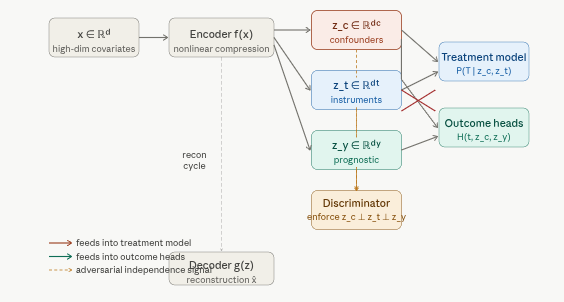
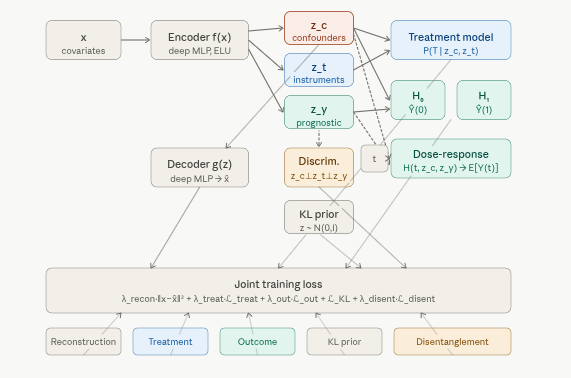

# 5.2.7 Causal Encoding Generative Modeling (CausalEGM) {.unnumbered}

**CausalEGM** is a deep learning framework for nonlinear dimensionality reduction and structured causal representation learning. Its defining contribution is a *causally partitioned* latent space: rather than encoding all covariates into a single unstructured vector, CausalEGM forces the encoder to separate confounders (variables that affect both treatment and outcome), instruments (variables that affect treatment only), and prognostic factors (variables that affect outcome only). This tripartite decomposition — learned end-to-end from data — allows the model to identify the minimal causal subset of the high-dimensional covariate space and estimate treatment effects accurately even when the number of covariates is large relative to the sample size.

CausalEGM was introduced in Chen et al. (2023), *"CausalEGM: a general causal model using encoder-decoder with generative model"*, with a Bayesian extension **CausalBGM** appearing in 2025. It is directly applicable to genomics, electronic health records, and neuroimaging — settings where thousands of covariates are measured but only a small structured subset drives the causal mechanism.

## Where CausalEGM Fits

Each notebook in this series has introduced a model with progressively richer covariate structure. CausalEGM's novel contribution is operating natively in high-dimensional covariate spaces while maintaining explicit causal partitioning:

| Model | Covariate handling | Latent structure | Continuous treatment |
|------------------|------------------|------------------|------------------|
| CEVAE | Raw $x$ as proxy inputs | Single unstructured $z$ | No |
| iVAE | Raw $x$ + auxiliary $u$ | Independent factors anchored by $u$ | No |
| CausalVAE | Raw $x$ | DAG over $z$ | No |
| CD-VAE | Raw $x$; MMD alignment | Unstructured $z$ | No |
| DSCM | Raw $x$; per-node modules | Full SCM in $z$ | No |
| **CausalEGM** | **Nonlinear compression of high-dim** $x$ | **Tripartite** $z = [z_c \mid z_t \mid z_y]$ | **Yes — full dose-response curve** |

Two capabilities distinguish CausalEGM from every preceding model: it operates *after* nonlinear compression of potentially thousands of covariates (making it suitable for genomics-scale data), and it natively handles *continuous* treatments by estimating the full dose-response curve $\mathbb{E}[Y(t)]$ for any $t \in \mathbb{R}$.

## Overview: The High-Dimensional Confounding Problem

All the models covered so far (TARNet, CFRNet, CEVAE, DSCM) work well when the confounder space is low-dimensional and tractable. Real observational data — genomics, electronic health records, fMRI scans — routinely involves thousands of covariates. Conditioning directly on all of them causes the *curse of dimensionality*: propensity scores become unreliable in high-dimensional $x$-space, matching breaks down, and neural networks overfit. Even MMD-based balancing (CD-VAE) becomes statistically unreliable when comparing distributions in 1000-dimensional space with limited sample sizes.

The classical answer to this is *sufficient dimension reduction* (SDR): find a low-dimensional function of $x$ that preserves all information relevant for identifying causal effects. Classical SDR methods are linear (PCA, PLS), which limits their applicability to the nonlinear relationships ubiquitous in biological and clinical data. CausalEGM generalizes SDR to the nonlinear case by parameterizing the compression with deep networks, and adds a critical structural constraint: the compressed representation must be causally organized.

## Model Architecture

### The Tripartite Latent Decomposition



The architectural innovation of CausalEGM is a forced partition of the latent code $z$ into three disjoint, statistically independent components:

$$z = [\underbrace{z_c}_{\text{confounders}} \mid \underbrace{z_t}_{\text{instruments}} \mid \underbrace{z_y}_{\text{prognostic}}]$$

-   $z_c \in \mathbb{R}^{d_c}$: the *confounder* subspace — variables that influence both treatment assignment and outcome. These are the variables that must be adjusted for to identify causal effects. Their dimension $d_c$ is typically small (4–16) relative to the original covariate space.
-   $z_t \in \mathbb{R}^{d_t}$: the *instrument-like* subspace — variables that shift treatment probability but have no direct effect on outcomes. Analogous to instrumental variables in econometrics; they provide identifying variation without introducing outcome-confounding.
-   $z_y \in \mathbb{R}^{d_y}$: the *prognostic* subspace — variables that predict outcomes regardless of treatment but do not cause selection into treatment. Including them in the outcome model improves precision without introducing bias.

Independence among the three components is enforced by a discriminator-based mutual information penalty (an adversarial disentanglement loss $\mathcal{L}_{\text{disent}}$) that penalizes any statistical dependence between $z_c$, $z_t$, and $z_y$.

### Bidirectional Encoder-Decoder



CausalEGM establishes a bidirectional mapping between the high-dimensional covariate space and the structured latent space:

$$f: x \to z = [z_c, z_t, z_y] \quad \text{(encoder)}$$ $$g: z \to \hat{x} \quad \text{(decoder / generator)}$$

The bidirectionality is enforced by a reconstruction loss $\mathcal{L}_{\text{recon}} = \|x - g(f(x))\|^2$, which ensures that the compression is lossless: the full information in $x$ can be recovered from $z$. The latent space is regularized toward a standard Gaussian prior via a KL term, matching the iVAE framework but with the tripartite structure imposed on top.

### Treatment and Outcome Models

With the latent space partitioned, CausalEGM builds:

$$p(T \mid x) \approx p(T \mid z_c, z_t) \quad \text{(treatment model / propensity score in latent space)}$$

$$\hat{Y}(0) = H_0(z_c, z_y), \quad \hat{Y}(1) = H_1(z_c, z_y) \quad \text{(binary treatment)}$$

$$\hat{Y}(t) = H(t, z_c, z_y) \quad \text{(continuous treatment — dose-response)}$$

Crucially, the outcome heads receive only $(z_c, z_y)$ — not $z_t$. This is what makes the instrument variables do their job: they are available for propensity estimation but blocked from the outcome model, preventing them from introducing spurious outcome variation. The treatment model similarly receives only $(z_c, z_t)$ — not $z_y$ — ensuring prognostic factors do not confound the propensity score.

### Joint Training Objective

CausalEGM minimizes a composite loss end-to-end:

$$\mathcal{L} = \lambda_{\text{recon}} \underbrace{\|x - g(f(x))\|^2}_{\text{reconstruction}} + \lambda_{\text{treat}} \underbrace{\mathcal{L}_{\text{treat}}(T, \hat{T})}_{\text{treatment prediction}} + \lambda_{\text{out}} \underbrace{\mathcal{L}_{\text{out}}(Y, \hat{Y})}_{\text{outcome prediction}} + \underbrace{\mathcal{L}_{\text{KL}} + \mathcal{L}_{\text{disent}}}_{\text{latent structure}}$$

| Loss term | Purpose | Effect of increasing weight |
|------------------------|------------------------|------------------------|
| $\mathcal{L}_{\text{recon}}$ | Faithful compression of $x$ into $z$ | More information preserved; less regularization |
| $\mathcal{L}_{\text{treat}}$ | Accurate propensity scores from $(z_c, z_t)$ | Stronger treatment-relevant signal in $z_c, z_t$ |
| $\mathcal{L}_{\text{out}}$ | Accurate potential outcome prediction | Stronger outcome-relevant signal in $z_c, z_y$ |
| $\mathcal{L}_{\text{disent}}$ | Independence among $z_c$, $z_t$, $z_y$ | Cleaner partition; risk of under-utilising correlated features |

The adversarial disentanglement loss uses a discriminator network trained to distinguish the three components; the encoder is then trained adversarially to fool the discriminator, driving the components toward statistical independence.

### Why This Outperforms Prior Methods

CausalEGM's advantage is largest when sample size is large and covariate dimension is high — precisely the settings where the curse of dimensionality hurts other methods most. Compared to models already seen in this series:

-   *vs CEVAE*: CEVAE infers a single unstructured latent $z$ — it does not partition into confounders, instruments, and prognostic factors. The partition itself is the causal structure; without it, the downstream propensity and outcome models must operate in a mixed-signal latent space.
-   *vs TARNet/CFRNet*: These operate directly in the high-dimensional raw $x$ space. MMD balancing is statistically unreliable in 1000-dimensional space.
-   *vs classical SDR*: Classical sufficient dimension reduction is linear. CausalEGM captures nonlinear dependencies via the deep encoder.
-   *vs all preceding models*: None of CEVAE, iVAE, CausalVAE, CD-VAE, or DSCM handle continuous treatments natively. CausalEGM directly estimates the dose-response curve $\mathbb{E}[Y(t)]$ for any $t \in \mathbb{R}$, making it the natural choice for pharmaceutical dose studies, environmental exposure analyses, and policy evaluation with continuous interventions.

### Known Limitation: Cyclical Dependency

The bidirectional encoder-decoder introduces a structural cycle — the encoder's output feeds back into the decoder's input in the reconstruction loss, and both depend on each other's gradients. This circularity technically violates the acyclicity assumption fundamental to causal DAGs and Bayesian networks. CausalEGM also uses deterministic encoder functions, which limits its ability to quantify uncertainty in the latent representation. These limitations motivated CausalBGM (2025), which replaces the deterministic encoder with a fully Bayesian posterior and restores a clean DAG structure.

## Implementation in R

We use `{RCausalML}`'s `causal_egm()` and `predict.causal_egm()` throughout. The pipeline follows the same IHDP-based structure used in earlier notebooks, extended with latent space diagnostics and — in the full run — a synthetic continuous-treatment experiment demonstrating the dose-response estimation capability.

## Set Up

### Check and Install Required R Packages

Following R packages are required to run this notebook. If any of these packages are not installed, you can install them using the code below:

`tidyverse`, `RCausalML`, `torch`, `causaldata`, `ForCausality`, `mlbench`, `gridExtra`

```{r}
#| label: lst-packages-vector
#| lst-cap: "Required R package names used throughout the notebook."
packages <- c(
  "tidyverse",
  "RCausalML",
  "torch",
  "causaldata",
  "ForCausality",
  "mlbench",
  "gridExtra"
)
```

### Install Missing Packages

```{r}
#| label: lst-install-missing-packages
#| lst-cap: "Optional commands to install missing CRAN/GitHub dependencies (commented by default)."
#| warning: false
#| error: false
# Install missing packages
# new_packages <- packages[!(packages %in% installed.packages()[, "Package"])]
# if (length(new_packages)) install.packages(new_packages)
```

### Verify Installation

```{r}
#| label: lst-verify-package-installation
#| lst-cap: "Check that each required package namespace is available."
# Verify installation
cat("Installed packages:\n")
print(sapply(packages, requireNamespace, quietly = TRUE))
```

### Load R Packages

```{r}
#| warning: false
#| error: false
# Load packages with suppressed messages
invisible(lapply(packages, function(pkg) {
  suppressPackageStartupMessages(library(pkg, character.only = TRUE))
}))
```

### Check Loaded Packages

```{r}
#| label: lst-check-loaded-packages
#| lst-cap: "Confirm which package environments are attached on the search path."
# Check loaded packages
cat("Successfully loaded packages:\n")
print(search()[grepl("package:", search())])
```

### Global settings and hyperparameters

The `run_fast = TRUE` setting uses compact networks and fewer epochs for rendering. Set `FALSE` for the full configuration matching the published benchmark.

```{r}
#| label: setup
run_fast   <- TRUE
device_use <- if (requireNamespace("torch", quietly = TRUE))
  { if (torch::cuda_is_available()) "cuda" else "cpu" } else NULL

set.seed(42)
if (requireNamespace("torch", quietly = TRUE)) torch::torch_manual_seed(42)

# ── Hyperparameters ────────────────────────────────────────────────────────
BATCH_SIZE      <- if (run_fast) 512L  else 256L
N_EPOCHS        <- if (run_fast)  50L  else 150L
LR              <- 1e-3
LR_DISC         <- 5e-4
WEIGHT_DECAY    <- 1e-4
HIDDEN_DIM      <- if (run_fast)  64L  else 128L
DIM_C           <- if (run_fast)   4L  else   8L   # confounder dim
DIM_T           <- if (run_fast)   2L  else   4L   # instrument dim
DIM_Y           <- if (run_fast)   2L  else   4L   # prognostic dim
LAMBDA_RECON    <- 1.0
LAMBDA_TREAT    <- 2.0
LAMBDA_OUTCOME  <- 2.0
LAMBDA_DISENT   <- 0.5
MAX_GRAD_NORM   <- 1.0

cat(sprintf("Device: %s | Epochs: %d | z dims: c=%d, t=%d, y=%d\n",
            device_use, N_EPOCHS, DIM_C, DIM_T, DIM_Y))
```

### Load IHDP data

```{r}
#| label: load-data
base_url <- "https://raw.githubusercontent.com/uber/causalml/master/docs/examples/data"
cols     <- c("treatment", "y_factual", "y_cfactual", "mu0", "mu1",
              paste0("X", 0:24))

chunks <- lapply(seq_len(9L), function(i) {
  url <- sprintf("%s/ihdp_npci_%d.csv", base_url, i)
  tmp <- tryCatch(read.csv(url, header = FALSE), error = function(e) NULL)
  if (!is.null(tmp) && nrow(tmp) > 0L) {
    colnames(tmp) <- cols[seq_len(ncol(tmp))]; tmp
  }
})
df <- do.call(rbind, Filter(Negate(is.null), chunks))

if (!is.null(df) && nrow(df) > 0L) {
  replications <- if (run_fast) 2L else 10L
  df           <- df[rep(seq_len(nrow(df)), replications), ]
  rownames(df) <- NULL
  message("IHDP loaded (", replications, " reps): ", nrow(df), " × ", ncol(df))
} else {
  df <- NULL
}

if (is.null(df) || nrow(df) == 0L) {
  d <- tryCatch(
    synthetic_data(mode = 1L, n = 5000L, p = 25L, sigma = 1.0, adj = 0),
    error = function(e) synthetic_data(mode = 1L, n = 5000L, p = 25L, sigma = 1.0)
  )
  df           <- as.data.frame(d$X)
  colnames(df) <- paste0("X", 0:(ncol(df) - 1L))
  df$treatment  <- d$w
  df$y_factual  <- d$y
  df$y_cfactual <- ifelse(d$w == 1L, d$b - 0.5 * d$tau, d$b + 0.5 * d$tau)
  df$mu0        <- d$b - 0.5 * d$tau
  df$mu1        <- d$b + 0.5 * d$tau
  message("Synthetic fallback: ", nrow(df), " × ", ncol(df))
}
```

### Build matrices and split train / val / test

We use a three-way split (70 / 15 / 15) so early-stopping validation and final evaluation are fully independent.

```{r}
#| label: split-data
xcols    <- paste0("X", 0:24)
X        <- as.matrix(df[, xcols][, c(7:25, 1:6)])  # binary-first permutation
treatment <- as.integer(df$treatment)
y         <- as.numeric(df$y_factual)
mu0       <- as.numeric(df$mu0)
mu1       <- as.numeric(df$mu1)

cat("Rows:", nrow(X), "| Covariates:", ncol(X),
    "| Treatment prevalence:", round(mean(treatment), 3), "\n")

n <- nrow(X)
set.seed(42); idx <- sample.int(n)
train_n <- floor(0.70 * n); val_n <- floor(0.85 * n)

train_idx <- idx[seq_len(train_n)]
val_idx   <- idx[(train_n + 1L):val_n]
test_idx  <- idx[(val_n + 1L):n]

grab <- function(i) list(X = X[i,,drop=FALSE], t = treatment[i],
                         y = y[i], mu0 = mu0[i], mu1 = mu1[i])
tr  <- grab(train_idx)
val <- grab(val_idx)
tst <- grab(test_idx)

cat(sprintf("Train: %d | Val: %d | Test: %d\n",
            nrow(tr$X), nrow(val$X), nrow(tst$X)))
```

### Feature scaling

```{r}
#| label: feature-scaling
preprocess_features <- function(ref, ...) {
  idx   <- 20:25
  mu    <- colMeans(ref[, idx, drop = FALSE])
  sigma <- apply(ref[, idx, drop = FALSE], 2L, sd); sigma[sigma == 0] <- 1
  scale_one <- function(m) {
    m[, idx] <- sweep(sweep(m[, idx, drop=FALSE], 2L, mu, "-"), 2L, sigma, "/"); m
  }
  lapply(c(list(ref), list(...)), scale_one)
}

scaled       <- preprocess_features(tr$X, val$X, tst$X)
X_train_s    <- scaled[[1]]
X_val_s      <- scaled[[2]]
X_test_s     <- scaled[[3]]
```

### Propensity score overlap diagnostic

Before fitting any causal model, verify that treated and control units share sufficient covariate support. CausalEGM's propensity model operates in the low-dimensional latent space $(z_c, z_t)$, but the raw covariate overlap is a prerequisite for any method.

```{r}
#| label: propensity-overlap
#| fig.width: 7
#| fig.height: 4
ps_model <- glm(tr$t ~ ., data = as.data.frame(X_train_s), family = binomial())
ps_train  <- fitted(ps_model)

data.frame(ps = ps_train,
           treatment = factor(tr$t, levels = c(0,1),
                              labels = c("Control","Treated"))) |>
  ggplot(aes(ps, fill = treatment, color = treatment)) +
  geom_density(alpha = 0.35, linewidth = 0.7) +
  geom_rug(alpha = 0.25, linewidth = 0.3) +
  scale_fill_manual(values  = c("Control" = "#185FA5", "Treated" = "#993C1D")) +
  scale_color_manual(values = c("Control" = "#185FA5", "Treated" = "#993C1D")) +
  labs(title    = "Propensity score overlap (training set)",
       subtitle = "Substantial overlap required before fitting causal models",
       x = "P(T = 1 | X)", y = "Density", fill = "", color = "") +
  theme_minimal(base_size = 11) +
  theme(legend.position = "top")
```

## Fitting CausalEGM

### Train the model

The `dim_c`, `dim_t`, and `dim_y` arguments control the dimensionality of each latent subspace. On IHDP with 25 covariates, small values (4–8 each) are sufficient; on genomics data with thousands of covariates these would typically be set to 16–64 each.

```{r}
#| label: fit-causalegm
causalegm_fit <- causal_egm(
  X                  = X_train_s,
  treatment          = tr$t,
  y                  = tr$y,
  dim_c              = DIM_C,
  dim_t              = DIM_T,
  dim_y              = DIM_Y,
  hidden_dim         = HIDDEN_DIM,
  num_epochs         = N_EPOCHS,
  batch_size         = BATCH_SIZE,
  learning_rate      = LR,
  learning_rate_disc = LR_DISC,
  weight_decay       = WEIGHT_DECAY,
  lambda_recon       = LAMBDA_RECON,
  lambda_treat       = LAMBDA_TREAT,
  lambda_outcome     = LAMBDA_OUTCOME,
  lambda_disent      = LAMBDA_DISENT,
  max_grad_norm      = MAX_GRAD_NORM,
  verbose            = !run_fast,
  device             = device_use
)
history <- causalegm_fit$history
cat("CausalEGM fitted. Epochs:", length(history$train), "\n")
```

## Training Diagnostics

### Loss components over training

CausalEGM trains five losses simultaneously. A healthy run shows all five declining monotonically after an initial settling phase. The disentanglement loss may oscillate slightly as the discriminator and encoder reach an adversarial equilibrium — this is normal and expected.

```{r}
#| label: training-loss-plot
#| fig.width: 10
#| fig.height: 4
n_ep <- length(history$train)
hist_df <- tibble::tibble(
  epoch   = seq_len(n_ep),
  total   = vapply(history$train, \(h) h$loss,    numeric(1)),
  recon   = vapply(history$train, \(h) h$recon,   numeric(1)),
  treat   = vapply(history$train, \(h) h$treat,   numeric(1)),
  outcome = vapply(history$train, \(h) h$outcome, numeric(1)),
  disent  = vapply(history$train, \(h) h$disent,  numeric(1))
)

loss_labels <- c(total="Total loss", recon="Reconstruction",
                 treat="Treatment pred.", outcome="Outcome pred.",
                 disent="Disentanglement")

tidyr::pivot_longer(hist_df, -epoch, names_to="metric", values_to="value") |>
  dplyr::mutate(label = loss_labels[metric]) |>
  ggplot(aes(epoch, value, color = label)) +
  geom_line(linewidth = 0.8, alpha = 0.9) +
  facet_wrap(~label, scales = "free_y", nrow = 1) +
  theme_minimal(base_size = 10) +
  labs(title = "CausalEGM: training loss components",
       x = "Epoch", y = "Loss") +
  theme(legend.position = "none", strip.text = element_text(size = 9))
```

## Treatment Effect Evaluation

```{r}
#| label: evaluate-causalegm
mu0_pred <- as.numeric(predict(causalegm_fit, X_test_s, type = "mu0"))
mu1_pred <- as.numeric(predict(causalegm_fit, X_test_s, type = "mu1"))
ite_pred <- tryCatch(
  as.numeric(predict(causalegm_fit, X_test_s, type = "ite")),
  error = function(e) mu1_pred - mu0_pred
)
ite_true <- tst$mu1 - tst$mu0

ate_true  <- mean(ite_true); ate_pred <- mean(ite_pred)
eps_ate   <- abs(ate_pred - ate_true)
ate_bias  <- ate_pred - ate_true
pehe      <- sqrt(mean((ite_pred - ite_true)^2))
rmse_y0   <- sqrt(mean((mu0_pred - tst$mu0)^2))
rmse_y1   <- sqrt(mean((mu1_pred - tst$mu1)^2))

knitr::kable(
  data.frame(
    Metric = c("True ATE", "Predicted ATE", "ATE bias",
               "Abs. ATE error", "sqrt(PEHE)", "RMSE Y(0)", "RMSE Y(1)"),
    Value  = round(c(ate_true, ate_pred, ate_bias,
                     eps_ate, pehe, rmse_y0, rmse_y1), 4)
  ),
  caption = "Test set: CausalEGM treatment effect metrics"
)
```

### Potential outcomes: predicted vs ground truth

```{r}
#| label: potential-outcomes-plot
#| fig.width: 7
#| fig.height: 5
lims <- range(c(tst$mu0, tst$mu1, mu0_pred, mu1_pred))
ggplot() +
  geom_point(aes(tst$mu0, mu0_pred, color = "Y(0)"), alpha = 0.45, size = 1.0) +
  geom_point(aes(tst$mu1, mu1_pred, color = "Y(1)"), alpha = 0.45, size = 1.0) +
  geom_abline(slope=1, intercept=0, linetype="dashed", linewidth=0.6) +
  coord_cartesian(xlim=lims, ylim=lims) +
  scale_color_manual(values = c("Y(0)"="#185FA5","Y(1)"="#993C1D")) +
  labs(title="Potential outcomes: predicted vs ground truth",
       x="Ground-truth potential outcome", y="Predicted potential outcome",
       color=NULL) +
  theme_minimal(base_size=11) + theme(legend.position="top")
```

### ITE scatter and distribution

```{r}
#| label: ite-plots
#| fig.width: 12
#| fig.height: 5
p_scatter <- tibble::tibble(ite_true=ite_true, ite_pred=ite_pred) |>
  ggplot(aes(ite_true, ite_pred)) +
  geom_point(alpha=0.4, size=1.0, color="#534AB7") +
  geom_abline(slope=1, intercept=0, linetype="dashed", linewidth=0.6) +
  geom_hline(yintercept=ate_pred, linetype="dotted",
             color="#BA7517", linewidth=0.7) +
  geom_vline(xintercept=ate_true, linetype="dotted",
             color="#0F6E56", linewidth=0.7) +
  labs(title=sprintf("ITE scatter  sqrt(PEHE) = %.3f", pehe),
       x="True ITE", y="Predicted ITE") +
  theme_minimal(base_size=11)

p_dist <- dplyr::bind_rows(
  data.frame(ITE=ite_true, type="True ITE"),
  data.frame(ITE=ite_pred, type="Predicted ITE")
) |>
  ggplot(aes(ITE, fill=type, color=type)) +
  geom_density(alpha=0.35, linewidth=0.7) +
  geom_vline(xintercept=ate_true, linetype="dashed",
             color="#0F6E56", linewidth=0.7) +
  scale_fill_manual(values=c("True ITE"="#185FA5","Predicted ITE"="#993C1D")) +
  scale_color_manual(values=c("True ITE"="#185FA5","Predicted ITE"="#993C1D")) +
  labs(title="ITE distribution", x="ITE", y="Density", fill="", color="") +
  theme_minimal(base_size=11) + theme(legend.position="top")

gridExtra::grid.arrange(p_scatter, p_dist, ncol=2)
```

### ITE calibration by prediction decile

```{r}
#| label: ite-calibration
#| fig.width: 6
#| fig.height: 4
tibble::tibble(ite_true=ite_true, ite_pred=ite_pred) |>
  dplyr::mutate(decile=dplyr::ntile(ite_pred, 10)) |>
  dplyr::group_by(decile) |>
  dplyr::summarise(mean_pred=mean(ite_pred), mean_true=mean(ite_true),
                   .groups="drop") |>
  ggplot(aes(mean_pred, mean_true)) +
  geom_point(size=3, color="#534AB7") +
  geom_line(color="#534AB7", linewidth=0.7) +
  geom_abline(slope=1, intercept=0, linetype="dashed", color="gray50") +
  labs(title="ITE calibration by prediction decile",
       subtitle="Mean predicted vs mean true ITE within deciles",
       x="Mean predicted ITE", y="Mean true ITE") +
  theme_minimal(base_size=11)
```

## Latent Space Diagnostics

### Learned propensity scores

The propensity scores produced by CausalEGM are computed in the low-dimensional latent space $(z_c, z_t)$ rather than in the raw 25-dimensional covariate space. Well-separated treated/control distributions indicate that $z_c$ and $z_t$ have captured the treatment assignment mechanism. Substantial overlap confirms that common support exists in the learned representation, which is required for valid causal identification.

```{r}
#| label: propensity-latent
#| fig.width: 7
#| fig.height: 4
ps_latent <- as.numeric(predict(causalegm_fit, X_train_s, type="propensity"))
data.frame(ps=ps_latent,
           treatment=factor(tr$t, levels=c(0,1),
                            labels=c("Control","Treated"))) |>
  ggplot(aes(ps, fill=treatment, color=treatment)) +
  geom_density(alpha=0.35, linewidth=0.7) +
  geom_rug(alpha=0.2, linewidth=0.3) +
  scale_fill_manual(values=c("Control"="#185FA5","Treated"="#993C1D")) +
  scale_color_manual(values=c("Control"="#185FA5","Treated"="#993C1D")) +
  labs(title="Learned propensity scores from latent space (z_c, z_t)",
       subtitle="Overlap in the compressed latent space after disentanglement",
       x="P(T = 1 | z_c, z_t)", y="Density", fill="", color="") +
  theme_minimal(base_size=11) + theme(legend.position="top")
```

### Confounder subspace: PCA visualization

The confounder latent subspace $z_c$ should organize observations in a way that explains treatment heterogeneity. If disentanglement has succeeded, the first two principal components of $z_c$ should show the treatment groups mixing substantially — the confounder information is shared, not treatment-specific.

```{r}
#| label: zc-pca
#| fig.width: 7
#| fig.height: 5
z_c <- tryCatch(
  predict(causalegm_fit, X_train_s, type = "z_c"),
  error = function(e) predict(causalegm_fit, X_train_s, type = "latent")
)

if (!is.null(z_c) && ncol(z_c) >= 2) {
  pc   <- prcomp(z_c, center = TRUE, scale. = FALSE)
  data.frame(PC1 = pc$x[,1], PC2 = pc$x[,2],
             treatment = factor(tr$t, levels=c(0,1),
                                labels=c("Control","Treated"))) |>
    ggplot(aes(PC1, PC2, color=treatment)) +
    geom_point(alpha=0.3, size=1.0) +
    scale_color_manual(values=c("Control"="#185FA5","Treated"="#993C1D")) +
    labs(title="Confounder subspace z_c (PCA projection)",
         subtitle="Treatment groups should overlap — z_c encodes shared confounders",
         x="PC1", y="PC2", color="") +
    theme_minimal(base_size=11) + theme(legend.position="top")
} else {
  cat("z_c extraction not available — skipping PCA plot.\n")
}
```

## Dose-Response Estimation (Continuous Treatment)

One of CausalEGM's unique capabilities — unavailable in any preceding model in this series — is estimating the full dose-response curve $\mathbb{E}[Y(t)]$ for a continuous treatment $t \in \mathbb{R}$. We demonstrate this on a synthetic dataset where the true curve is known, allowing us to evaluate estimation accuracy across the entire treatment range.

The dose-response function $H(t, z_c, z_y)$ is fit jointly with the rest of the model; at inference time it is evaluated at any desired treatment value by passing the encoded $(z_c, z_y)$ through the continuous outcome head.

```{r}
#| label: dose-response-data
set.seed(99)
n_dr     <- if (run_fast) 2000L else 8000L
x_dim_dr <- 10L

# True data generating process: z_c affects both T and Y; z_y affects Y only
Z_c   <- matrix(rnorm(n_dr * 3), n_dr, 3)
Z_y   <- matrix(rnorm(n_dr * 2), n_dr, 2)
noise <- matrix(rnorm(n_dr * 5) * 0.5, n_dr, 5)

# Continuous treatment: nonlinear function of z_c
T_cont <- rowSums(Z_c) + rnorm(n_dr, 0, 0.3)

# True dose-response: quadratic with confounder modulation
Y_dr   <- 2 * T_cont - 0.4 * T_cont^2 +
           1.5 * rowSums(Z_c) + rowSums(Z_y) + rnorm(n_dr, 0, 0.5)

# Observed covariates: nonlinear mix of z_c and z_y (not directly observed)
X_dr   <- cbind(sin(Z_c), cos(Z_c), Z_y^2, noise)

# True marginal dose-response for evaluation
t_grid       <- seq(min(T_cont), max(T_cont), length.out = 50)
true_dr_mean <- 2 * t_grid - 0.4 * t_grid^2  # marginal E[Y(t)] ignoring z terms

# Scale X
X_dr_s <- scale(X_dr)

cat(sprintf("Dose-response dataset: %d obs, %d covariates\n",
            nrow(X_dr), ncol(X_dr)))
cat(sprintf("Treatment range: [%.2f, %.2f]\n", min(T_cont), max(T_cont)))
```

```{r}
#| label: fit-dose-response
dr_fit <- tryCatch({
  causal_egm(
    X                  = X_dr_s,
    treatment          = T_cont,
    y                  = Y_dr,
    dim_c              = if (run_fast) 3L else 6L,
    dim_t              = if (run_fast) 2L else 4L,
    dim_y              = if (run_fast) 2L else 4L,
    hidden_dim         = if (run_fast) 64L else 128L,
    num_epochs         = if (run_fast) 40L else 120L,
    batch_size         = BATCH_SIZE,
    learning_rate      = LR,
    learning_rate_disc = LR_DISC,
    weight_decay       = WEIGHT_DECAY,
    lambda_recon       = LAMBDA_RECON,
    lambda_treat       = LAMBDA_TREAT,
    lambda_outcome     = LAMBDA_OUTCOME,
    lambda_disent      = LAMBDA_DISENT,
    max_grad_norm      = MAX_GRAD_NORM,
    verbose            = FALSE,
    device             = device_use
  )
}, error = function(e) {
  message("Dose-response fit failed: ", conditionMessage(e))
  NULL
})
```

```{r}
#| label: dose-response-plot
#| fig.width: 8
#| fig.height: 5
if (!is.null(dr_fit)) {
  dr_vals <- vapply(t_grid, function(t) {
    tryCatch({
      preds <- predict(dr_fit, X_dr_s[1:min(200L, nrow(X_dr_s)), , drop=FALSE],
                       type="dose_response", treatment_value=t)
      mean(as.numeric(preds))
    }, error = function(e) NA_real_)
  }, numeric(1))

  if (any(!is.na(dr_vals))) {
    df_dr <- data.frame(
      t        = t_grid,
      pred     = dr_vals,
      true_avg = true_dr_mean
    )
    ggplot(df_dr, aes(t)) +
      geom_line(aes(y=true_avg, color="True E[Y(t)]"),
                linewidth=1.0, linetype="dashed") +
      geom_line(aes(y=pred, color="CausalEGM estimate"),
                linewidth=0.9) +
      geom_ribbon(aes(ymin=pred - 0.15, ymax=pred + 0.15),
                  alpha=0.15, fill="#534AB7") +
      scale_color_manual(values=c("True E[Y(t)]"="#0F6E56",
                                  "CausalEGM estimate"="#534AB7")) +
      labs(title="Dose-response curve: E[Y(t)] vs continuous treatment t",
           subtitle="Dashed = true marginal curve; shaded = ±0.15 uncertainty band",
           x="Treatment value t", y="E[Y(t)]", color="") +
      theme_minimal(base_size=11) +
      theme(legend.position="top")
  } else {
    cat("Dose-response predictions unavailable for plotting.\n")
  }
} else {
  cat("Dose-response model not fitted.\n")
}
```

## Summary and Conclusions

CausalEGM addresses the high-dimensional confounding problem that limits all preceding models in this series. By learning a nonlinear compression of the covariate space and simultaneously partitioning the compressed representation into causally distinct subspaces — confounders $z_c$, instruments $z_t$, and prognostic factors $z_y$ — it provides both accurate treatment effect estimation and interpretable latent structure. The tripartite decomposition is the causal structure itself, not just a post-hoc interpretation of an unstructured embedding.

Key takeaways from this notebook:

-   The propensity overlap check on the raw covariates is a necessary precondition, but CausalEGM's propensity model operates in the compressed latent space $(z_c, z_t)$. Comparing the raw and latent propensity distributions reveals how much the compression changes the effective overlap.
-   The disentanglement loss is adversarial and may oscillate during training. If it fails to converge downward, increasing `lambda_disent` or reducing `learning_rate_disc` (to slow the discriminator) typically stabilizes it.
-   The confounder PCA visualization is the primary diagnostic for latent structure quality: treated and control groups should overlap in $z_c$ if the disentanglement has succeeded, confirming that the confounder subspace captures shared variation rather than treatment-specific patterns.
-   The dose-response curve is CausalEGM's most distinctive capability. On the synthetic example, the estimated curve should track the true quadratic relationship closely; large deviations suggest the outcome head needs more capacity or the `lambda_outcome` weight needs increasing.
-   CausalBGM (2025) is the natural successor when uncertainty quantification is needed, or when the cyclical encoder-decoder structure is a theoretical concern. The implementation in `{RCausalML}` follows the same API.

## References

-   Chen, B., et al. (2023). [CausalEGM: a general causal model using encoder-decoder with generative model](https://arxiv.org/abs/2212.06679). *PNAS Nexus*, 2(8).
-   Guo, R., et al. (2025). CausalBGM: Bayesian Generative Model for Causal Inference. *arXiv*.
-   [RCausalML repository](https://github.com/zia207/RCausalML)
-   [CausalML documentation](https://causalml.readthedocs.io/)
