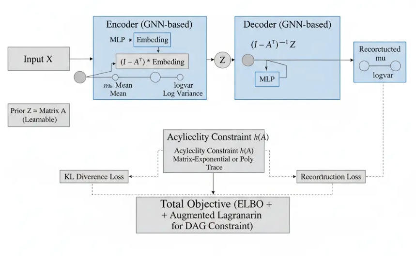

# 5.3.2 DAG-GNN: DAG Structure Learning with Graph Neural Networks {.unnumbered}

**DAG-GNN** (Yu et al., ICML 2019) learns the structure of a Directed Acyclic Graph (DAG) from observational data by embedding the problem inside a deep generative model. Where NOTEARS replaces a combinatorial graph search with a smooth optimization over a weighted adjacency matrix $\mathbf{W}$, DAG-GNN goes a step further: it wraps that adjacency matrix inside a **Variational Autoencoder (VAE)** driven by **Graph Neural Network (GNN)** encoder and decoder modules, so that representation learning and structure learning are trained end-to-end.

The key insight is that under a linear Structural Equation Model (SEM), $\mathbf{X} = \mathbf{A}^\top \mathbf{X} + \mathbf{Z}$, the mapping from noise $\mathbf{Z}$ to observations $\mathbf{X}$ is exactly $(\mathbf{I} - \mathbf{A}^\top)^{-1}\mathbf{Z}$. DAG-GNN makes this causal forward pass the **decoder** of the VAE, and uses a GNN-filtered MLP as the **encoder**. The adjacency matrix $\mathbf{A}$ is a learnable parameter shared between encoder and decoder, so gradient descent simultaneously fits the data and discovers the graph.

Acyclicity is enforced by the same differentiable constraint family as NOTEARS — $h(\mathbf{A}) = 0$ iff the graph is a DAG — embedded as an augmented Lagrangian penalty in the ELBO objective. This notebook demonstrates the full pipeline: data simulation, model training with stable augmented Lagrangian updates, structure recovery, and downstream causal effect estimation.

{width="774"}

## Implementation in R

The `CausalML` R package provides tools for causal inference, structure learning, and treatment effect estimation. In particular, the package includes an R port of DAG-GNN (`R/causalDeepNet.R`), which leverages the `torch` library to enable deep neural network-based learning of Directed Acyclic Graphs (DAGs) from data. `CausalML` offers a unified interface to instantiate, train, and evaluate models for causal structure discovery and effect estimation.


### Setup

```{r}
#| label: setup-packages
#| warning: false
#| message: false

# Packages used in this notebook (SEMgraph/bnlearn omitted — not referenced here,
# and SEMgraph depends on Bioconductor 'graph', which is not yet on CRAN for R 4.6)
packages <- c(
  "torch", "igraph", "tidyverse", "ggraph",
  "corrplot", "patchwork", "RCausalML"
)

# Install missing packages
# new_packages <- packages[!(packages %in% installed.packages()[, "Package"])]
# if (length(new_packages)) install.packages(new_packages)

# Verify installation
cat("Installed packages:\n")
print(sapply(packages, requireNamespace, quietly = TRUE))

# Load packages with suppressed messages
invisible(lapply(packages, function(pkg) {
  suppressPackageStartupMessages(library(pkg, character.only = TRUE))
}))
```

```{r}
#| label: device-setup
#| warning: false
#| message: false

DEVICE_TYPE <- if (torch::cuda_is_available()) "cuda" else "cpu"
cat("Using device:", DEVICE_TYPE, "\n")
set.seed(42)
torch::torch_manual_seed(42L)
```

### Data and Data Processing

We generate a small **6-node nonlinear DAG** (nodes 0–3 = covariates, 4 = treatment T, 5 = outcome Y). Data is continuous and nonlinear.

```{r}
#| label: synthetic-data
#| warning: false
#| message: false

generate_synthetic_dag_data <- function(n_samples = 5000, n_nodes = 6) {
  # Paper Sec 4.1: ER graph with expected degree 3; uniform random edge weights
  p <- if (n_nodes > 1) 3.0 / (n_nodes - 1) else 0.0
  
  # Create random graph using igraph
  G <- erdos.renyi.game(n_nodes, p, type = "gnp", directed = TRUE)
  # Ensure topological order (u < v)
  edges <- get.edgelist(G)
  edges <- edges[edges[,1] < edges[,2], , drop = FALSE]
  G <- graph_from_edgelist(edges, directed = TRUE)
  
  A_true <- as.matrix(get.adjacency(G, type = "both", sparse = FALSE))
  A_true <- A_true * matrix(runif(length(A_true), 0.5, 1.5), nrow = n_nodes)
  
  # Nonlinear SEM (paper Sec 4.1.2): x = A^T h(x) + z with h(x)=cos(x+1)
  X <- matrix(0, nrow = n_samples, ncol = n_nodes)
  for (i in 1:10) {
    Z <- matrix(rnorm(n_samples * n_nodes), nrow = n_samples)
    X <- cos(X %*% t(A_true) + 1) + Z
  }
  
  # Designate node 4 = treatment T, node 5 = outcome Y (for CATE demo)
  T_var <- (qlogis(runif(n_samples)) + 0.5 * X[, 1] + 0.3 * X[, 2] > 0) * 1.0
  Y_var <- 2 * T_var + 0.8 * X[, 1] + sin(X[, 3]) + rnorm(n_samples, 0, 0.5)
  
  X[, 5] <- T_var
  X[, 6] <- Y_var
  
  df <- as.data.frame(X)
  colnames(df) <- paste0("X", 0:(n_nodes - 1))
  df$T <- T_var
  df$Y <- Y_var
  
  return(list(df = df, A_true = A_true, G = G))
}

synth_data <- generate_synthetic_dag_data()
df <- synth_data$df
A_true <- synth_data$A_true
true_G <- synth_data$G

print(head(df))

# Normalize (important for VAE)
df_norm <- as.data.frame(scale(df[, 1:6])) # Only normalize features
df_norm$T <- df$T
df_norm$Y <- df$Y
```

### Data split

Structure learning uses all data (unsupervised). For CATE validation we split later.

```{r}
#| label: data-split
#| warning: false
#| message: false

# Split into train, validate and test
set.seed(42)
train_idx <- sample(1:nrow(df_norm), size = floor(0.7 * nrow(df_norm)))
temp_idx <- setdiff(1:nrow(df_norm), train_idx)
valid_idx <- sample(temp_idx, size = floor(0.5 * length(temp_idx)))
test_idx <- setdiff(temp_idx, valid_idx)

train_df <- df_norm[train_idx, ]
valid_df <- df_norm[valid_idx, ]
test_df <- df_norm[test_idx, ]

# Structure learning uses the m node columns (X0..Xm-1)
node_cols <- paste0("X", 0:5)
X_train <- torch_tensor(as.matrix(train_df[, node_cols]), dtype = torch_float32(), device = DEVICE_TYPE)
X_valid <- torch_tensor(as.matrix(valid_df[, node_cols]), dtype = torch_float32(), device = DEVICE_TYPE)
X_test <- torch_tensor(as.matrix(test_df[, node_cols]), dtype = torch_float32(), device = DEVICE_TYPE)
```

## DAG-GNN Model Architecture

DAG-GNN frames causal structure learning as a **Variational Autoencoder (VAE)** whose latent space is organized by a learnable adjacency matrix $\mathbf{A}$. The architecture has four tightly coupled components, illustrated in the figure above.

### Encoder (GNN-based)

The encoder maps the observed data matrix $\mathbf{X} \in \mathbb{R}^{n \times d}$ to a latent distribution $q_\phi(\mathbf{Z} \mid \mathbf{X})$. It proceeds in two steps:

1. **MLP embedding** — a per-node MLP projects each variable's observations into a shared embedding space: $\mathbf{H} = \mathrm{MLP}_\phi(\mathbf{X})$.
2. **Graph filtering** — the embedding is mixed across nodes using the graph structure encoded in $\mathbf{A}$: $\tilde{\mathbf{H}} = (\mathbf{I} - \mathbf{A}^\top) \cdot \mathbf{H}$. This multiplication propagates information along the *reverse* of the directed edges, so each node aggregates messages from its children — implementing one step of GNN message passing.

The filtered embedding is then projected to the **mean** $\boldsymbol{\mu}$ and **log-variance** $\log \boldsymbol{\sigma}^2$ of the approximate posterior, from which the latent code $\mathbf{Z}$ is sampled via the reparameterization trick.

### Prior and Latent Code

Rather than a fixed standard Gaussian, DAG-GNN uses a **learnable prior** $p(\mathbf{Z}) = \mathcal{N}(0, \mathbf{A})$, where the adjacency matrix $\mathbf{A}$ itself is a free parameter optimized jointly with the encoder and decoder weights. This encodes the assumption that the data-generating structure — the DAG — should shape the prior distribution over latent codes.

### Decoder (GNN-based)

The decoder reconstructs $\mathbf{X}$ from $\mathbf{Z}$ by inverting the structural equation: $\hat{\mathbf{X}} = (\mathbf{I} - \mathbf{A}^\top)^{-1} \mathbf{Z}$. This is the closed-form solution to the linear SEM $\mathbf{X} = \mathbf{A}^\top \mathbf{X} + \mathbf{Z}$, meaning the decoder explicitly models the causal forward pass. A subsequent **MLP** further refines the reconstruction, outputting the reconstructed mean $\hat{\boldsymbol{\mu}}$ and log-variance $\widehat{\log \boldsymbol{\sigma}^2}$.

### Acyclicity Constraint $h(\mathbf{A})$

For $\mathbf{A}$ to encode a valid DAG, the acyclicity constraint $h(\mathbf{A}) = 0$ must hold. The R implementation in `causalDeepNet.R` (v2) uses the **matrix polynomial** formulation:

$$h(\mathbf{A}) = \mathrm{tr}\!\left(\left(\mathbf{I} + \frac{\mathbf{A} \odot \mathbf{A}}{d}\right)^d\right) - d,$$

which equals zero if and only if the graph is acyclic and is differentiable with respect to $\mathbf{A}$. (The matrix-exponential form from the original paper, $h(\mathbf{A}) = \mathrm{tr}(e^{\mathbf{A} \odot \mathbf{A}}) - d$, is mathematically equivalent but less numerically stable at large $d$.)

The effective adjacency used during training is $\mathbf{A}_{\mathrm{eff}} = \tanh(\mathbf{A}) \times 0.5$, which keeps entries in $(-0.5, 0.5)$ and replaces the earlier sinh-based formulation for numerical stability.

### Total Objective (ELBO + Augmented Lagrangian)

The full training objective combines three terms:

$$\mathcal{L} = \underbrace{-\mathbb{E}_{q_\phi}[\log p_\theta(\mathbf{X} \mid \mathbf{Z})] + \mathrm{KL}[q_\phi(\mathbf{Z} \mid \mathbf{X}) \,\|\, p(\mathbf{Z})]}_{\text{negative ELBO}} + \lambda\, h(\mathbf{A}) + \frac{c}{2}\, h(\mathbf{A})^2,$$

where:

- The **reconstruction loss** $-\mathbb{E}[\log p_\theta(\mathbf{X} \mid \mathbf{Z})]$ measures how well the decoder recovers $\mathbf{X}$ from the sampled $\mathbf{Z}$.
- The **KL divergence** $\mathrm{KL}[q_\phi \| p]$ regularizes the encoder toward the learnable prior, which is itself shaped by $\mathbf{A}$.
- The **augmented Lagrangian penalty** $\lambda\, h(\mathbf{A}) + \frac{c}{2}\, h(\mathbf{A})^2$ enforces acyclicity. The multiplier $\lambda$ is updated by dual ascent at every step; the penalty coefficient $c$ is increased (up to a cap of $10^6$) only when $|h(\mathbf{A})|$ fails to decrease sufficiently — a **throttled schedule** (every 25 epochs) that prevents the penalty from exploding early in training.

Additional stability measures in the R implementation include **gradient clipping** (max-norm 1.0), a Huber regularizer on $\mathbf{A}$, and `tryCatch` guards around the forward pass to skip singular steps without poisoning the dual variable $\lambda$.

After training, the binary adjacency is recovered by thresholding the effective adjacency at $|\mathbf{A}_{\mathrm{eff}}| > 0.10$.

```{r}
#| label: model-instantiation
#| warning: false
#| message: false

# Instantiate the DAGGNN model for 6 nodes (default hyperparameters).
model <- make_daggnn(n_nodes = 6, device = DEVICE_TYPE)
```

### Training with Augmented Lagrangian

The training objective is $\mathcal{L}_c = -\mathrm{ELBO} + \lambda\, h(\mathbf{A}) + \frac{c}{2}\, h(\mathbf{A})^2 + \epsilon_{\mathrm{Huber}}(\mathbf{A})$. The dual variable $\lambda$ is updated by gradient ascent at every step; the penalty coefficient $c$ is multiplied by $\eta = 10$ only when $|h(\mathbf{A}_k)| > \gamma\, |h(\mathbf{A}_{k-1})|$ at the throttle interval (every 25 epochs), and capped at $10^6$ to prevent explosion. Gradient clipping (max-norm 1.0) and `tryCatch` guards around the forward pass protect against numerical singularities without corrupting $\lambda$.

```{r}
#| label: training-loop
#| warning: false
#| message: false

torch_manual_seed(42L)

optimizer <- optim_adam(model$parameters, lr = 1e-3)

lambda_h    <- 0.0
c           <- 1.0
eta         <- 10.0
gamma       <- 0.25
n_epochs    <- 600
h_prev      <- NULL
max_c       <- 1e6
c_update_freq <- 25

X_train_fixed <- X_train[, 1:model$n_nodes]

loss_history <- numeric(n_epochs)
h_history    <- numeric(n_epochs)

for (epoch in seq_len(n_epochs)) {
  model$train()
  optimizer$zero_grad()

  out <- tryCatch(model$forward(X_train_fixed), error = function(e) NULL)
  if (is.null(out)) next

  loss  <- model$elbo_loss(X_train_fixed, out$MX, out$MZ)
  h_val <- model$h_func()

  loss_num <- as.numeric(loss)
  h_num    <- as.numeric(h_val)

  if (!is.finite(loss_num)) next

  huber_reg <- torch_mean(torch_sqrt((model$A)^2 + 1e-4) - 1e-2)

  if (is.finite(h_num)) {
    aug_loss <- loss + lambda_h * h_val + 0.5 * c * (h_val^2) + 1e-4 * huber_reg
  } else {
    aug_loss <- loss + 1e-4 * huber_reg
  }

  aug_loss$backward()
  torch::nn_utils_clip_grad_norm_(model$parameters, max_norm = 1.0)
  optimizer$step()

  loss_history[epoch] <- loss_num
  h_history[epoch]   <- if (is.finite(h_num)) h_num else NA_real_

  if (is.finite(h_num)) lambda_h <- lambda_h + c * h_num

  if (epoch %% c_update_freq == 0 && is.finite(h_num)) {
    if (!is.null(h_prev) && is.finite(h_prev) && abs(h_num) > gamma * abs(h_prev))
      c <- min(eta * c, max_c)
    h_prev <- h_num
  }

  if (epoch %% 100 == 0) {
    cat(sprintf("Epoch %4d | Loss %8.4f | h %.6f | c %.2e\n",
                epoch, loss_num, if (is.finite(h_num)) h_num else NaN, c))
  }
}

# --- Extract learned adjacency (tanh*0.5 scale: use threshold 0.10) ---
A_binary <- daggnn_adj(model, threshold = 0.10)
A_binary[is.na(A_binary)] <- 0

with_no_grad({
  A_learned <- as.matrix(model$.effective_adj()$detach()$cpu())
})
rownames(A_binary) <- colnames(A_binary) <- paste0("X", 0:5)
rownames(A_learned) <- colnames(A_learned) <- paste0("X", 0:5)

cat(sprintf("Raw A_eff: min=%.4f, max=%.4f\n", min(abs(A_learned)), max(abs(A_learned))))
cat(sprintf("Edges (threshold 0.10): %d\n", sum(A_binary != 0)))
```

### ATE prediction and validation

After learning the DAG, we estimate the Average Treatment Effect (ATE) and Conditional Average Treatment Effect (CATE) from observational data, using the learned DAG's confounders (X0–X3) for adjustment.

```{r}
#| label: build-graph
#| warning: false
#| message: false

# Build a directed graph using igraph: each edge (i,j) in A_binary is an edge from X_i to X_j
causal_graph <- graph_from_adjacency_matrix(A_binary, mode = "directed")
V(causal_graph)$name <- paste0("X", 0:5)

# Output the learned graph edges
edges_df <- get.data.frame(causal_graph)
print("Learned causal graph edges:")
print(edges_df)
```

### ATE and CATE Estimation

```{r}
#| label: ate-estimation
#| warning: false
#| message: false

# Causal Inference: ATE and CATE estimation with train/test validation
cov_cols <- c("X0", "X1", "X2", "X3")

X_train_cov <- as.matrix(train_df[, cov_cols])
X_test_cov <- as.matrix(test_df[, cov_cols])
treatment_train <- train_df$T
treatment_test <- test_df$T
y_train <- train_df$Y
y_test <- test_df$Y

# Ensure control group is present in treatment vector
unique_treatments <- unique(treatment_train)
cat(sprintf("Unique values in treatment_train: %s\n", paste(unique_treatments, collapse = ", ")))

# If treatment codes are not {0, 1}, recode so that 0 is control, 1 is treated
if (!setequal(unique_treatments, c(0, 1))) {
  min_val <- min(unique_treatments)
  max_val <- max(unique_treatments)
  treatment_train_bin <- as.numeric(treatment_train == max_val)
  treatment_test_bin <- as.numeric(treatment_test == max_val)
  cat(sprintf("Relabeling treatments: control=%s->0, treated=%s->1\n", min_val, max_val))
} else {
  treatment_train_bin <- treatment_train
  treatment_test_bin <- treatment_test
}

# Fit on train using Linear Regression (equivalent to LRSRegressor)
# Model: Y ~ T + X
lm_formula <- as.formula(paste("y_train ~ treatment_train_bin +", paste(cov_cols, collapse = " + ")))
lm_data <- data.frame(y_train, treatment_train_bin, X_train_cov)
colnames(lm_data)[3:6] <- cov_cols
lr_model <- lm(lm_formula, data = lm_data)

# Predict CATE on test set
cate_coef <- coef(lr_model)["treatment_train_bin"]
cate_arr <- rep(cate_coef, nrow(X_test_cov))
ate_val <- mean(cate_arr)

# 95% CI for ATE from test CATEs
se_ate <- summary(lr_model)$coefficients["treatment_train_bin", "Std. Error"]
ci_lb <- ate_val - 1.96 * se_ate
ci_ub <- ate_val + 1.96 * se_ate

cat("=== ATE on test set (model fitted on train) ===\n")
true_ate <- 2.0

cat(sprintf("Estimated ATE (true ATE = %s): %.4f\n", true_ate, ate_val))
cat(sprintf("ATE 95%% CI: [%.4f, %.4f]\n", ci_lb, ci_ub))

# ATE validation: bias and CI coverage
ate_bias <- ate_val - true_ate
cat("\n=== ATE validation ===\n")
cat(sprintf("ATE bias (estimated - true): %.4f\n", ate_bias))
in_ci <- (ci_lb <= true_ate) && (true_ate <= ci_ub)
cat(sprintf("True ATE in 95%% CI: %s\n", in_ci))

# CATE validation: PEHE
true_cate <- true_ate
pehe <- sqrt(mean((cate_arr - true_cate) ^ 2))
cat("\n=== CATE validation (test set) ===\n")
cat(sprintf("CATE mean: %.4f, std: %.4f\n", mean(cate_arr), sd(cate_arr)))
cat(sprintf("PEHE (sqrt mean squared error vs true tau=2): %.4f\n", pehe))
cat(sprintf("CATE sample (first 5): %s\n", paste(head(cate_arr, 5), collapse = ", ")))
```

## Results visualization

The following figures summarize the learned structure, training dynamics, and causal effect estimates.

### True vs learned DAG

```{r}
#| label: fig-dag-comparison
#| fig-cap: "True DAG (data-generating) vs learned DAG by DAG-GNN."
#| fig-width: 12
#| fig-height: 5
#| warning: false
#| message: false

node_labels <- paste0("X", 0:5)

# True DAG (binary for structure comparison)
A_true_bin <- (A_true != 0) * 1
G_true <- graph_from_adjacency_matrix(A_true_bin, mode = "directed")
V(G_true)$name <- node_labels

# Learned DAG (already computed as causal_graph / A_binary)
G_learned <- graph_from_adjacency_matrix(A_binary, mode = "directed")
V(G_learned)$name <- node_labels

p1 <- ggraph(G_learned, layout = "fr") +
  geom_edge_link(arrow = arrow(length = unit(3, "mm"), ends = "last"), color = "steelblue") +
  geom_node_point(color = "steelblue", size = 6) +
  geom_node_text(aes(label = name), vjust = 1.5) +
  theme_void() +
  ggtitle("Learned DAG (DAG-GNN)")

p2 <- ggraph(G_true, layout = "fr") +
  geom_edge_link(arrow = arrow(length = unit(3, "mm"), ends = "last"), color = "darkgreen") +
  geom_node_point(color = "darkseagreen", size = 6) +
  geom_node_text(aes(label = name), vjust = 1.5) +
  theme_void() +
  ggtitle("True DAG (data-generating)")

p1 + p2
```

### Adjacency matrices: true vs learned

```{r}
#| label: fig-adjacency-heatmaps
#| fig-cap: "True (weighted) and learned (effective, thresholded) adjacency matrices."
#| fig-width: 10
#| fig-height: 5
#| warning: false
#| message: false

par(mfrow = c(1, 2), mar = c(2, 2, 3, 2))
rownames(A_true) <- colnames(A_true) <- node_labels
rownames(A_learned) <- colnames(A_learned) <- node_labels
rownames(A_binary) <- colnames(A_binary) <- node_labels

# Ensure no NA and non-constant range for corrplot (avoids internal NA in color scale)
A_true_plot <- replace(A_true, is.na(A_true), 0)
A_binary_plot <- replace(A_binary, is.na(A_binary), 0)
r_true <- range(A_true_plot)
r_bin <- range(A_binary_plot)
if (diff(r_true) == 0) r_true <- c(r_true[1], r_true[1] + 1)
if (diff(r_bin) == 0) r_bin <- c(0, 1)

corrplot(A_true_plot, is.corr = FALSE, method = "color", tl.col = "black",
         title = "True adjacency (weighted)", mar = c(0, 0, 1, 0), col.lim = r_true)
corrplot(A_binary_plot, is.corr = FALSE, method = "color", tl.col = "black",
         title = "Learned adjacency (thresholded)", mar = c(0, 0, 1, 0), col.lim = r_bin)
par(mfrow = c(1, 1))
```

### Training curves

```{r}
#| label: fig-training-curves
#| fig-cap: "ELBO loss and acyclicity constraint h(A) over training epochs."
#| fig-width: 8
#| fig-height: 4
#| warning: false
#| message: false

df_curves <- data.frame(
  epoch = rep(1:n_epochs, 2),
  value = c(loss_history, h_history),
  metric = rep(c("ELBO loss", "h(A) acyclicity"), each = n_epochs)
)

p_loss <- ggplot(df_curves %>% filter(metric == "ELBO loss"), aes(x = epoch, y = value)) +
  geom_line(color = "steelblue", linewidth = 0.5) +
  theme_minimal() +
  labs(x = "Epoch", y = "Loss", title = "Training: ELBO loss")

p_h <- ggplot(df_curves %>% filter(metric == "h(A) acyclicity"), aes(x = epoch, y = value)) +
  geom_line(color = "darkgreen", linewidth = 0.5) +
  theme_minimal() +
  labs(x = "Epoch", y = "h(A)", title = "Acyclicity constraint h(A)")

p_loss / p_h
```

### ATE and CATE summary

```{r}
#| label: fig-ate-cate
#| fig-cap: "Estimated ATE with 95% CI and distribution of CATE on test set."
#| fig-width: 10
#| fig-height: 4
#| warning: false
#| message: false

# ATE with 95% CI
df_ate <- data.frame(
  estimate = "ATE",
  value = ate_val,
  ci_lower = ci_lb,
  ci_upper = ci_ub,
  true_ate = true_ate
)

p_ate <- ggplot(df_ate, aes(x = estimate, y = value)) +
  geom_point(size = 3, color = "steelblue") +
  geom_errorbar(aes(ymin = ci_lower, ymax = ci_upper), width = 0.15, linewidth = 1, color = "steelblue") +
  geom_hline(aes(yintercept = true_ate), linetype = "dashed", color = "gray40") +
  theme_minimal() +
  labs(x = "", y = "Effect", title = "Estimated ATE with 95% CI (dashed = true ATE)") +
  coord_flip()

# CATE distribution
df_cate <- data.frame(cate = cate_arr)
p_cate <- ggplot(df_cate, aes(x = cate)) +
  geom_histogram(bins = 30, fill = "steelblue", alpha = 0.7, color = "white") +
  geom_vline(xintercept = true_ate, linetype = "dashed", color = "gray40") +
  theme_minimal() +
  labs(x = "CATE", y = "Count", title = "CATE on test set (dashed = true effect)")

p_ate + p_cate
```

## Summary and conclusion

DAG-GNN turns the notoriously hard DAG-learning problem into a differentiable VAE + GNN optimization. The R implementation in `R/causalDeepNet.R` (v2) uses **tanh(A)×0.5** effective adjacency and **stable training** (throttled penalty *c*, gradient clipping, NaN/singularity guards), so it scales to real data (see Sachs and Wine case studies). In production:

1.  Run DAG-GNN on your observational dataset.
2.  Threshold the learned effective adjacency (default **0.10** for the tanh×0.5 scale) to obtain a sparse causal DAG.
3.  Feed the DAG into DoWhy / EconML / CausalML (or R equivalents like `grf`, `tmle`) for effect estimation, sensitivity analysis, or counterfactuals.

Especially powerful when you have many covariates and suspect nonlinear confounding.

## Resources

-   **Paper**: Yu, Y., Chen, J., Gao, T., & Yu, M. (2019). DAG-GNN: DAG Structure Learning with Graph Neural Networks. *ICML*. [arXiv:1904.10098](https://arxiv.org/abs/1904.10098)
-   **Official code**: [fishmoon1234/DAG-GNN](https://github.com/fishmoon1234/DAG-GNN)
-   **R Port**: `R/causalDeepNet.R` (v2: tanh×0.5 effective adj, stable training)
-   **NOTEARS baseline**: [xunzheng/notears](https://github.com/xunzheng/notears)
-   **DoWhy**: [pywhy.org/dowhy](https://www.pywhy.org/dowhy)
-   **Follow-up works**: DAG-GCN, GraN-DAG, etc.

------------------------------------------------------------------------

*Note: This R Quarto notebook was converted from the original Python IPython notebook, maintaining the same structure and functionality while leveraging R's `{torch}` and `{tidyverse}` ecosystems.*
