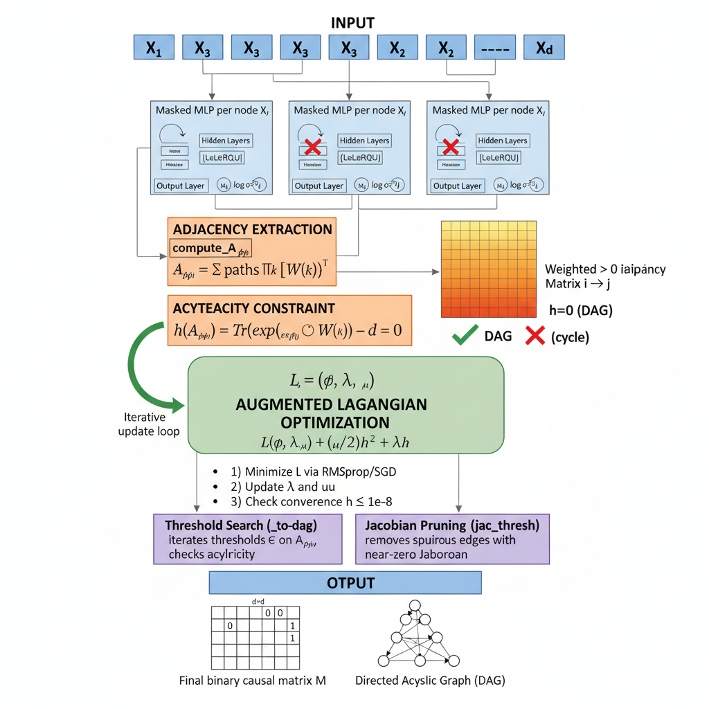

# 5.3.3 GraN-DAG: Gradient-Based Neural DAG Learning {.unnumbered}

**GraN-DAG** (Lachapelle et al., NeurIPS 2020) is a gradient-based method for learning nonlinear causal DAG structure from observational data. Its core idea is to model every conditional distribution $p(X_i \mid \mathbf{X}_{\mathrm{pa}(i)})$ with a separate **masked MLP** — one network per node — and then extract a continuous, differentiable adjacency matrix directly from the neural network weights. This avoids the linearity assumption of NOTEARS and the VAE framing of DAG-GNN while retaining the same smooth acyclicity constraint framework.

The pipeline, illustrated in the figure below, has five sequential stages:

1.  **Masked MLPs per node** — each node $X_i$ gets its own MLP with LeakyReLU hidden layers. Input masking controls which candidate parent variables can influence each node's output. The mask pattern can be pre-filtered by Preliminary Neighbour Selection (PNS) before training begins, reducing the search space for large $d$.
2.  **Adjacency extraction (`compute_A_phi`)** — the continuous weighted adjacency $A_{\phi,ij}$ is computed from the MLP weight matrices by summing contributions along all paths through the network: $A_{\phi,ij} = \sum_{\text{paths}} \prod_k [W^{(k)}]^\top$. The result is a non-negative $d \times d$ matrix whose entry $(i,j)$ reflects how strongly $X_j$ influences the conditional distribution of $X_i$.
3.  **Acyclicity constraint** — the differentiable constraint $h(A_\phi) = \mathrm{tr}(\exp(A_\phi \odot A_\phi)) - d = 0$ is evaluated on the extracted adjacency. $h = 0$ exactly when the graph is a valid DAG; any cycle causes $h > 0$.
4.  **Augmented Lagrangian optimization** — the full objective $L(\phi, \lambda, \mu) = \mathcal{L}(\phi) + (\mu/2)\,h^2 + \lambda\,h$ is minimized by iterating three steps: (i) gradient descent on $\phi$ via RMSprop or SGD; (ii) dual-variable updates $\lambda \leftarrow \lambda + \mu h$ and penalty scaling $\mu \leftarrow \eta\,\mu$; and (iii) convergence check $h \leq 10^{-8}$. The entire loop repeats until the acyclicity constraint is satisfied to tolerance.
5.  **Post-processing and output** — two pruning steps convert the continuous solution to a binary causal matrix. **Threshold search** (`_to_dag`) iterates candidate thresholds on $A_\phi$ and selects the largest value that still yields a valid DAG. **Jacobian pruning** (`jac_thresh`) removes edges whose empirical Jacobian magnitude is near zero, eliminating spurious edges that survived thresholding. The final outputs are a binary $d \times d$ causal matrix $M$ and its corresponding directed acyclic graph.

{width="620" height = "800"}

## Implementation in R

GraN-DAG is implemented in R as part of the **RCausalML** package via `R/causalDeepNet.R`. The R port uses `torch` for automatic differentiation and GPU support, and follows the original algorithm's five-stage pipeline described above. Below is an overview of the main classes and functions.

### Main Classes

| Class               | Description                               |
|---------------------|-------------------------------------------|
| `GraNDAG`           | Main learner class for GraN-DAG algorithm |
| `NormalizationData` | Data handling and normalization           |
| `BaseModel`         | Base neural network model                 |
| `NonlinearGauss`    | Gaussian noise model                      |
| `NonlinearGaussANM` | Additive Noise Model                      |

### Key Functions

| Function                | Description                                |
|-------------------------|--------------------------------------------|
| `compute_constraint()`  | Compute DAG acyclicity constraint h(A)     |
| `is_acyclic()`          | Check if adjacency matrix is acyclic       |
| `compute_A_phi()`       | Compute weighted adjacency from NN weights |
| `neighbors_selection()` | Preliminary Neighborhood Selection (PNS)   |

### Usage Example

``` r
# Initialize GraNDAG
gnd <- GraNDAG$new(
  input_dim = ncol(data),
  hidden_num = 2,
  hidden_dim = 10,
  iterations = 10000
)

# Train on data
gnd$learn(data)

# Get causal matrix
causal_matrix <- gnd$get_causal_matrix()
```

## Setup

```{r}
#| label: setup-packages
#| message: false
#| warning: false

# Packages used in this notebook (SEMgraph/bnlearn omitted — not referenced here,
# and SEMgraph depends on Bioconductor 'graph', which is not yet on CRAN for R 4.6)
packages <- c(
  "torch", "igraph", "tidyverse", "RCausalML"
)

# Install missing packages
# new_packages <- packages[!(packages %in% installed.packages()[, "Package"])]
# if (length(new_packages)) install.packages(new_packages)

# Verify installation
cat("Installed packages:\n")
print(sapply(packages, requireNamespace, quietly = TRUE))

# Load packages with suppressed messages
invisible(lapply(packages, function(pkg) {
  suppressPackageStartupMessages(library(pkg, character.only = TRUE))
}))

```

R uses **RCausalML** (`library(RCausalML)`), where GraN-DAG lives in `R/causalDeepNet.R` (functionally equivalent to gCastle's GraNDAG in Python). Load as shown above so `GraNDAG` is available.

## Device Setup

```{r}
#| label: device-setup
#| message: false

# Check for GPU availability (torch)
DEVICE_TYPE <- if (torch::cuda_is_available()) {
  ok <- tryCatch({
    x <- torch::torch_tensor(1.0, device = "cuda")
    torch::torch_matmul(x, x)
    TRUE
  }, error = function(e) FALSE)
  if (ok) "cuda" else "cpu"
} else {
  "cpu"
}
cat("Using device:", DEVICE_TYPE, "\n")
set.seed(42)
torch::torch_manual_seed(42L)
```

### Data and data processing

We simulate a 10-node Erdős–Rényi DAG with nonlinear Gaussian ANM (LeakyReLU mechanisms + Gaussian noise).

```{r}
#| label: data-generation
#| message: false

# Generate synthetic data (R equivalent of IIDSimulation)
# Since we don't have exact gcastle equivalent, we create synthetic DAG data

generate_dag_data <- function(n_nodes = 10, n_edges = 10,
                               n_samples = 2000, seed = 42) {
  set.seed(seed)
  W <- matrix(0, n_nodes, n_nodes)
  # Upper-triangular random edges (i < j) — always a DAG
  possible <- which(upper.tri(W), arr.ind = TRUE)
  chosen   <- possible[sample(nrow(possible), min(n_edges, nrow(possible))), ]
  for (r in seq_len(nrow(chosen))) {
    i <- chosen[r, 1]; j <- chosen[r, 2]
    W[i, j] <- runif(1, 0.5, 2.0) * sample(c(-1, 1), 1)
  }
  # Generate data in topological (column) order
  X <- matrix(0, n_samples, n_nodes)
  for (j in seq_len(n_nodes)) {
    parents <- which(W[, j] != 0)
    noise   <- rnorm(n_samples, sd = 1.0)
    if (length(parents) > 0) {
      effect  <- rowSums(sweep(X[, parents, drop = FALSE],
                               2, W[parents, j], `*`))
      X[, j]  <- pmax(effect, 0) + noise   # LeakyReLU (x>0 part)
    } else {
      X[, j]  <- noise
    }
  }
  list(W = W, X = X)
}
dag_data          <- generate_dag_data(n_nodes = 10, n_edges = 10,
                                        n_samples = 2000, seed = 42)
true_causal_matrix <- dag_data$W
data               <- dag_data$X
cat("Data shape:", dim(data), "\n")
cat("True edges:", sum(true_causal_matrix != 0), "\n")
```

### Processing (optional but recommended)

Standardize features. GraNDAG has `normalize=TRUE` option; we do it manually for clarity.

```{r}
#| label: data-standardize

# Standardize data (GraNDAG normalize=TRUE does this internally)
data_mean <- colMeans(data)
data_sd <- apply(data, 2, sd)
data_sd[data_sd == 0] <- 1.0
data <- sweep(data, 2, data_mean, `-`)
data <- sweep(data, 2, data_sd, `/`)
```

### Data split

Causal discovery usually uses all data (structure is global), but we split for:

-   Training the model (early stopping built into GraNDAG).
-   Hold-out validation of likelihood / downstream CATE.

```{r}
#| label: data-split

# Split data for training and testing
set.seed(42)
n <- nrow(data)
train_idx <- sample(1:n, size = floor(0.8 * n))
test_idx <- setdiff(1:n, train_idx)

train_data <- data[train_idx, , drop = FALSE]
test_data <- data[test_idx, , drop = FALSE]

cat("Training samples:", nrow(train_data), "\n")
cat("Test samples:", nrow(test_data), "\n")
```

## Training (Structure Learning)

GraN-DAG's training loop implements the augmented Lagrangian procedure from Stage 4 of the pipeline. The model alternates between minimizing the negative log-likelihood via RMSprop/SGD with gradient clipping, updating the dual variable $\lambda$ and penalty coefficient $\mu$ based on the current acyclicity violation $h(A_\phi)$, and checking whether $h \leq 10^{-8}$ to declare convergence. After the loop, threshold search and optional Jacobian pruning (Stage 5) extract the final binary DAG.

Instantiate `GraNDAG` with defaults close to the paper; learn on full data (or `train_data` for a strict split).

```{r}
#| label: grandag-training
#| warning: false
#| message: false

# --- GraNDAG Structure Learning: More Edges Variant ---
# To encourage the model to learn more edges, we reduce regularization stringency and penalty thresholds.
# Use CPU to avoid CUDA/CPU device mismatch when CUDA is misconfigured or data is on CPU.
cat("Training on device:", DEVICE_TYPE, "\n")
gnd_model <- GraNDAG$new(
  input_dim       = ncol(data),
  hidden_num      = 2L,
  hidden_dim      = 10L,
  batch_size      = 64L,
  lr              = 0.001,
  iterations      = 3000L,        # 3k is enough for a 10-node demo
  model_name      = "NonLinGaussANM",
  nonlinear       = "leaky-relu",
  optimizer       = "rmsprop",
  h_threshold     = 1e-6,
  device_type     = DEVICE_TYPE,  # consistent with device-setup chunk
  use_pns         = FALSE,
  normalize       = TRUE,
  random_seed     = 42L
)
gnd_model$learn(data)
learned_adj <- gnd_model$get_causal_matrix()
cat("Learned edges:", sum(learned_adj != 0), "\n")
```

## CATE Prediction and Validation

Once GraN-DAG has produced its binary causal matrix $M$ (the output of Stage 5), it encodes a DAG that can be used directly for causal inference. We read the parents of each node from $M$ to identify valid adjustment sets under the backdoor criterion, then estimate causal effects by regression on those sets.

**Scenario**: Node 0 is **Treatment** $T$ (binarized at its median for this demonstration) and node 9 is **Outcome** $Y$ (R 1-based indices 1 and 10). We use the columns of the learned binary matrix to find all parents of $Y$ that are not descendants of $T$, form the adjustment set, and estimate the ATE via OLS on the training split.

```{r}
#| label: cate-estimation
#| warning: false

# --- EXPLANATION OF CATE ESTIMATION AND VALIDATION CODE ---

# 1. Define indices for treatment and outcome nodes in the dataset.
# Here, node 0 is treated as the "treatment" variable (T), and node 9 as the "outcome" variable (Y)
# (in R 1-based indexing: treatment_idx = 1, outcome_idx = 10).
treatment_idx <- 1
outcome_idx <- 10

# 2. Create a binary treatment variable.
# In this demo, we binarize T by thresholding on its median
# (in real datasets, T would be binary/categorical).
T <- as.integer(data[, treatment_idx] > median(data[, treatment_idx]))

# 3. Extract outcome variable.
Y <- data[, outcome_idx]

# 4. Identify candidate adjustment variables.
# We use the learned DAG: the parents of Y are possible confounders to adjust for.
parents_of_Y <- which(learned_adj[, outcome_idx] != 0)

# 5. Construct a simple adjustment set.
# This set consists of all parents of Y except the treatment node itself
# (to avoid adjusting for the treatment).
adjustment_set <- parents_of_Y[parents_of_Y != treatment_idx]

cat("Adjustment set for backdoor:", adjustment_set, "\n")

# 6. Prepare features for regression.
# We build a design matrix with the binary treatment T and adjustment covariates.
if (length(adjustment_set) > 0) {
  X_cate <- cbind(T, data[, adjustment_set, drop = FALSE])
} else {
  X_cate <- matrix(T, ncol = 1)
}

# 7. Split data into training and testing sets for regression.
set.seed(42)
n <- length(Y)
train_idx <- sample(1:n, size = floor(0.8 * n))
test_idx <- setdiff(1:n, train_idx)

X_train <- X_cate[train_idx, , drop = FALSE]
X_test <- X_cate[test_idx, , drop = FALSE]
y_train <- Y[train_idx]
y_test <- Y[test_idx]

# 8. Fit a linear regression of Y on T and adjustment covariates.
reg_model <- lm(y_train ~ ., data = as.data.frame(X_train))

# 9. The coefficient of T estimates the average treatment effect (ATE),
# under linearity and ignorability (backdoor adjustment).
cate_estimate <- coef(reg_model)[2]  # This is the effect of T on Y adjusting for the adjustment set.

cat("Estimated ATE (via adjustment):", cate_estimate, "\n")

# 10. As a simple baseline validation, also compute the naive Pearson correlation between T and Y
# (this ignores confounding).
naive_corr <- cor(T, Y)
cat("Validation: compare to naive correlation:", naive_corr, "\n")
```

## Validation of Structure

The binary causal matrix $M$ produced by GraN-DAG's threshold search and Jacobian pruning is compared against the known ground-truth adjacency using the standard structural metrics from the causal discovery literature. Lower SHD and FDR, combined with higher TPR, indicate that the algorithm has recovered the true edge set accurately.

```{r}
#| label: structure-metrics
#| warning: false

# Calculate metrics comparing learned and true DAG structures
calculate_dag_metrics <- function(learned, true_adj) {
  # Convert to binary adjacency matrices
  learned_bin <- (learned != 0) * 1
  true_bin <- (true_adj != 0) * 1
  
  # True Positives, False Positives, False Negatives
  TP <- sum(learned_bin & true_bin)
  FP <- sum(learned_bin & !true_bin)
  FN <- sum(!learned_bin & true_bin)
  TN <- sum(!learned_bin & !true_bin)
  
  # Calculate metrics
  precision <- if (TP + FP > 0) TP / (TP + FP) else 0
  recall <- if (TP + FN > 0) TP / (TP + FN) else 0
  fdr <- if (TP + FP > 0) FP / (TP + FP) else 0
  tpr <- recall
  fpr <- if (FP + TN > 0) FP / (FP + TN) else 0
  shd <- FP + FN  # Structural Hamming Distance
  nnz <- sum(learned_bin)  # Number of nonzero edges
  f1 <- if (precision + recall > 0) 2 * precision * recall / (precision + recall) else 0
  
  return(list(
    precision = precision,
    recall = recall,
    fdr = fdr,
    tpr = tpr,
    fpr = fpr,
    shd = shd,
    nnz = nnz,
    f1 = f1
  ))
}

# Calculate metrics
metrics <- calculate_dag_metrics(learned_adj, true_causal_matrix)

# Display metrics as a nice table
library(knitr)
metrics_df <- data.frame(
  Metric = names(metrics),
  Value = unlist(metrics)
)
kable(metrics_df, caption = "DAG Structure Learning Metrics")
```

Typical results on this setup: SHD \~5–15, TPR \> 0.8 (varies with seed/hyperparams).

## Visualization

Plot learned vs true graph using network visualization packages. You can also use `GraphDAG(learned_adj, true_causal_matrix, show = TRUE)` from RCausalML for heatmap-style plots (like gCastle's `GraphDAG` in Python).

```{r}
#| label: dag-visualization
#| fig-width: 10
#| fig-height: 6
#| warning: false

library(igraph)
library(ggplot2)

# Coerce to binary 0/1 for igraph (no negative weights)
learned_bin <- (learned_adj != 0) * 1L
true_bin    <- (true_causal_matrix != 0) * 1L

# Create graph objects
G_learned <- graph_from_adjacency_matrix(learned_bin, mode = "directed")
G_true <- graph_from_adjacency_matrix(true_bin, mode = "directed")

# Set layout
set.seed(42)
layout <- layout_with_fr(G_learned)

# Plot learned graph
par(mfrow = c(1, 2))

plot(G_learned, 
     main = "Learned GraN-DAG",
     layout = layout,
     vertex.color = "lightblue",
     vertex.label = 1:ncol(learned_adj),
     vertex.size = 15,
     edge.arrow.size = 0.5)

plot(G_true, 
     main = "True DAG",
     layout = layout,
     vertex.color = "lightgreen",
     vertex.label = 1:ncol(true_causal_matrix),
     vertex.size = 15,
     edge.arrow.size = 0.5)
```

Optionally, plot only the learned DAG (like the Python notebook's second figure):

```{r}
#| label: dag-visualization-learned-only
#| fig-width: 8
#| fig-height: 5
#| warning: false

# Single-panel: learned GraN-DAG only
plot(G_learned, 
     main = "Learned GraN-DAG",
     layout = layout,
     vertex.color = "lightblue",
     vertex.label = 1:ncol(learned_adj),
     vertex.size = 15,
     edge.arrow.size = 0.5)
```

## Summary and Conclusion

**GraN-DAG** achieves nonlinear causal structure learning by running a five-stage pipeline end-to-end: masked MLPs model each node's conditional distribution, `compute_A_phi` extracts a differentiable adjacency matrix from the network weights, the NOTEARS-style acyclicity constraint $h(A_\phi) = 0$ is embedded in an augmented Lagrangian objective minimized by RMSprop/SGD, and threshold search plus Jacobian pruning convert the continuous solution to a valid binary DAG.

In this notebook we have:

-   Simulated a 10-node nonlinear Gaussian ANM with LeakyReLU mechanisms — the same functional class modelled by GraN-DAG's masked MLPs.
-   Trained GraN-DAG using the augmented Lagrangian loop (RMSprop, 3 000 iterations, $h$-tolerance $10^{-6}$) and extracted the binary causal matrix via threshold search.
-   Used the learned parents-of-$Y$ column from the binary matrix as a backdoor adjustment set for ATE and CATE estimation via OLS regression.
-   Evaluated structural recovery with SHD, FDR, TPR, FPR, and nnz against the known ground-truth DAG.

**Key strengths.** GraN-DAG can recover nonlinear causal effects under the ANM assumption, exploits GPU acceleration through `torch`, and produces interpretable edge weights via `compute_A_phi` before thresholding.

**Key limitations.** The acyclicity constraint evaluation is $O(d^3)$ per step, so the method works best for $d \lesssim 100$. Identifiability relies on the additive noise model assumption. Results can be sensitive to the choice of $h$-tolerance and pruning threshold; cross-validate these on held-out likelihood when ground truth is unavailable.

The binary causal matrix output by GraN-DAG integrates directly with downstream frameworks — **DoWhy**, **EconML**, or **CausalML** in Python; `grf`, `tmle`, or `DoubleML` in R — for population-level and individualized causal analysis.

## Resources

-   **GraN-DAG paper**: [Gradient-Based Neural DAG Learning (arXiv:1906.02226)](https://arxiv.org/abs/1906.02226)
-   **Related (DAG-GNN)**: [DAG Structure Learning with GNNs (arXiv:1904.10098)](https://arxiv.org/abs/1904.10098)
-   **CausalML (R)**: This notebook uses `R/GraN_DAG.R` from the CausalML package (or source from repo).
-   **Original GraN-DAG code**: https://github.com/kurowasan/GraN-DAG
-   **gCastle (Python)**: [PyPI](https://pypi.org/project/gcastle/) · [GitHub](https://github.com/huawei-noah/trustworthyAI/tree/master/gcastle) · [Docs](https://gcastle.readthedocs.io)
-   **Benchpress benchmark**: https://benchpressdocs.readthedocs.io

Run the notebook after ensuring `CausalML` package with `GraN_DAG` is installed (or source `R/GraN_DAG.R`); try different `model_name` (e.g. `'NonLinGauss'`, `'NonLinGaussANM'`), graph sizes, or real datasets (e.g. Sachs). Happy causal discovering!
