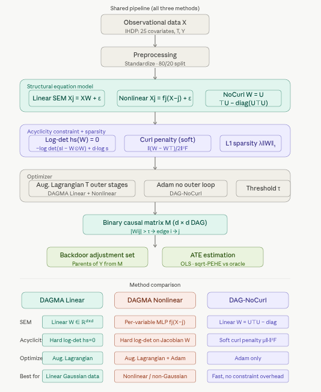

# 5.3.4 DAGMA and DAG-NoCurl for Causal Discovery {.unnumbered}

This notebook compares three continuous-optimization methods for causal
structure learning — **DAGMA Linear**, **DAGMA Nonlinear (MLP)**, and
**DAG-NoCurl** — applied to the **IHDP (Infant Health and Development
Program)** benchmark dataset.

All three methods share the same goal: recover a **Directed Acyclic
Graph (DAG)** from observational data, where each directed edge
$X \to Y$ encodes a direct causal influence rather than a mere
correlation. The recovered graph is then used to identify valid
adjustment sets and estimate Average Treatment Effects (ATEs) via the
backdoor criterion.

The three methods differ fundamentally in how they enforce acyclicity
and how they model the structural equations:

-   **DAGMA** (Bello et al., 2022) replaces the NOTEARS
    trace-exponential acyclicity function with a **log-determinant
    barrier** derived from the theory of M-matrices, which is better
    conditioned and converges 10–20× faster in practice.
-   **DAGMA Nonlinear** extends the same log-det framework to
    per-variable MLPs, handling non-Gaussian and nonlinear data without
    changing the outer optimization.
-   **DAG-NoCurl** (Yu et al., 2021) takes a geometric approach: it
    parameterizes the adjacency matrix through
    $W = U^\top U - \mathrm{diag}(U^\top U)$ and adds a **curl penalty**
    that suppresses rotational (cyclic) flow patterns in the learned
    field, replacing the hard acyclicity constraint with a soft
    regularizer amenable to plain Adam optimization.

The **IHDP dataset** tracks 25 covariates (six continuous child and
maternal characteristics, nineteen binary indicators) along with a
binary treatment (specialist home visits) and a continuous outcome. Its
known potential outcomes make it possible to evaluate ATE estimates
against an oracle.

## DAGMA

**DAGMA** (DAG via M-matrices for Acyclicity) was introduced by Bello,
Squires, and Bhattacharya (2022). Its core insight is a novel algebraic
characterization of acyclicity that avoids numerical instability
problems in earlier methods.

## DAG-NoCurl

**DAG-NoCurl** (Yu et al., 2021) approaches causal discovery from a
fundamentally different angle - **differential geometry**. It
parameterizes the graph as a vector field and enforces acyclicity by
projecting onto the **curl-free** component of that field.

### How It Works

DAG-NoCurl enforces acyclicity via:

$$W = U^T U - \text{diag}(U^T U)$$

The loss is:

$$\min_{U} \; \mathcal{L}(W(U)) + \lambda \|W(U)\|_1 + \mu \cdot \text{curl}(W(U))$$



### Key Advantages

-   **Constraint-free optimization**: No augmented Lagrangian or
    inner/outer loops.
-   **Differentiable end-to-end**: Amenable to joint training with
    downstream prediction heads.
-   **Geometric intuition**: The curl-free projection has a clean
    theoretical foundation.

### Applications

| Application | How DAGMA / DAG-NoCurl Helps |
|------------------------------------|------------------------------------|
| Healthcare (IHDP) | Discover which covariates causally precede treatment and outcome |
| Genomics | Infer gene regulatory networks from expression data |
| Economics | Identify causal chains in macroeconomic indicators |
| Fairness auditing | Detect spurious vs. causal paths to model predictions |
| Anomaly detection | Structural changes in the DAG signal distributional shifts |

### Limitations

-   **Scalability**: Both methods scale roughly as $O(d^3)$; graphs
    beyond \~200 nodes become expensive.
-   **Identifiability**: Without distributional assumptions, the true
    DAG is only identifiable up to its Markov equivalence class.
-   **Linear assumption**: Default implementations assume linear
    relationships.
-   **Finite-sample issues**: High-dimensional, small-sample data may
    cause overfitting.
-   **Causal sufficiency**: Both assume no hidden confounders - a strong
    assumption in observational health data.

## Implementation in R

### Load and Check Required Libraries

```{r}
#| label: packages-list
#| warning: false
packages <- c(
  'tidyverse',
  'plyr',
  'RCausalML',
  'causaldata',
  'torch',
  'dagitty',
  'ggdag',
  'igraph')
```

### Install Missing Packages

```{r}
#| label: install-missing-packages
#| warning: false
#| error: false
# Install missing packages
#new_packages <- packages[!(packages %in% installed.packages()[,"Package"])]
#if(length(new_packages)) install.packages(new_packages)
```

### Verify Installation

```{r}
#| label: verify-installation
#| warning: false
# Verify installation
cat("Installed packages:\n")
print(sapply(packages, requireNamespace, quietly = TRUE))
```

### Load Required Libraries

```{r}
#| label: load-required-libraries
#| warning: false
# Use local RCausalML when rendering from package root or tutorials/
find_pkg_root <- function() {
  root_candidates <- c(".", "..", "../..")
  for (p in root_candidates) {
    if (file.exists(file.path(p, "DESCRIPTION")) &&
        file.exists(file.path(p, "R", "causalDeepNet.R"))) {
      return(normalizePath(p))
    }
  }
  NULL
}
pkg_root <- find_pkg_root()
if (!is.null(pkg_root) && requireNamespace("devtools", quietly = TRUE)) {
  try(devtools::load_all(pkg_root, quiet = TRUE), silent = TRUE)
}
invisible(lapply(packages, function(pkg) {
  suppressPackageStartupMessages(library(pkg, character.only = TRUE))
}))
if (!exists("dagmaLinear", mode = "function", where = asNamespace("RCausalML"))) {
  stop(
    "dagmaLinear() is not exported by RCausalML. Reinstall from the package root:\n",
    "  devtools::load_all()   or   devtools::install()"
  )
}
```

```{r}
#| label: setup
#| include: true
run_fast <- TRUE
device_use <- NULL
SEED <- 42L
if (requireNamespace("torch", quietly = TRUE)) {
  device_use <- if (torch::cuda_is_available()) "cuda" else "cpu"
}
set.seed(SEED)
if (requireNamespace("torch", quietly = TRUE)) {
  torch::torch_manual_seed(SEED)
}
```

### Data Loading and Preprocessing \<

The IHDP files on the causalml repo are **`ihdp_npci_1.csv` ...
`ihdp_npci_9.csv`** (nine replicates; there is no `_10`). We load them,
stack, optionally replicate rows to match CEVAE/GANITE-style scale, and
split train/test.

**Column layout:** `treatment`, `y_factual`, `y_cfactual`, `mu0`, `mu1`,
`x1`...`x25` (6 continuous covariates, 19 binary).

```{r}
data_loading_ihdp <- function(train_rate = 0.8, replications = 100L) {
  base_url <- "https://raw.githubusercontent.com/uber/causalml/master/docs/examples/data"
  local_dirs <- c(
    "inst/examples/data",
    "inst/exdata",
    file.path("..", "..", "examples", "data"),
    file.path("..", "..", "..", "..", "inst", "examples", "data")
  )

  read_one <- function(i) {
    fname <- sprintf("ihdp_npci_%d.csv", i)
    local_path <- NULL
    for (d in local_dirs) {
      p <- file.path(d, fname)
      if (file.exists(p)) {
        local_path <- p
        break
      }
    }
    if (!is.null(local_path)) {
      return(utils::read.csv(local_path, header = FALSE))
    }

    url <- sprintf("%s/%s", base_url, fname)
    tryCatch(
      utils::read.csv(url, header = FALSE),
      error = function(e) NULL
    )
  }

  dfs <- Filter(Negate(is.null), lapply(1:9, read_one))
  if (length(dfs) == 0L) {
    warning(
      "IHDP files were not found locally and could not be downloaded; using a synthetic IHDP-like fallback dataset."
    )
    n <- 747L * 9L
    x_cont <- matrix(rnorm(n * 6L), ncol = 6L)
    x_bin <- matrix(rbinom(n * 19L, size = 1L, prob = 0.5), ncol = 19L)
    x <- cbind(x_cont, x_bin)
    colnames(x) <- paste0("x", 1:25)
    treatment <- rbinom(n, size = 1L, prob = plogis(0.2 * x[, 1] - 0.1 * x[, 2]))
    mu0 <- 0.3 * x[, 1] - 0.2 * x[, 2] + 0.15 * x[, 3] + rnorm(n, sd = 0.2)
    tau <- 1.0 + 0.2 * x[, 4] - 0.15 * x[, 5]
    mu1 <- mu0 + tau
    y_factual <- ifelse(treatment == 1, mu1, mu0) + rnorm(n, sd = 0.3)
    y_cfactual <- ifelse(treatment == 1, mu0, mu1) + rnorm(n, sd = 0.3)
    df <- data.frame(
      treatment = treatment,
      y_factual = y_factual,
      y_cfactual = y_cfactual,
      mu0 = mu0,
      mu1 = mu1,
      x
    )
  } else {
    df <- do.call(rbind, dfs)
    colnames(df) <- c("treatment", "y_factual", "y_cfactual", "mu0", "mu1", paste0("x", 1:25))
  }

  if (replications > 1L) {
    df <- do.call(rbind, rep(list(df), replications))
  }

  x <- as.matrix(df[, paste0('x', 1:25)])
  t <- as.numeric(df$treatment)
  y <- as.numeric(df$y_factual)
  potential_y <- as.matrix(df[, c('mu0', 'mu1')])

  n <- nrow(x)
  idx <- sample.int(n)
  n_train <- floor(train_rate * n)
  train_idx <- idx[seq_len(n_train)]
  test_idx <- idx[(n_train + 1L):n]

  list(
    train_x = x[train_idx, , drop = FALSE],
    train_t = t[train_idx],
    train_y = y[train_idx],
    train_potential_y = potential_y[train_idx, , drop = FALSE],
    test_x = x[test_idx, , drop = FALSE],
    test_potential_y = potential_y[test_idx, , drop = FALSE]
  )
}

preprocess_features <- function(train_x, test_x) {
  a <- train_x
  b <- test_x
  mu <- colMeans(train_x[, 1:6, drop = FALSE])
  sdv <- apply(train_x[, 1:6, drop = FALSE], 2, sd)
  sdv[sdv == 0] <- 1
  a[, 1:6] <- scale(train_x[, 1:6, drop = FALSE], center = mu, scale = sdv)
  b[, 1:6] <- scale(test_x[, 1:6, drop = FALSE], center = mu, scale = sdv)
  list(train_x = a, test_x = b, center = mu, scale = sdv)
}

cat('Loading IHDP data ...\n')
ihdp <- data_loading_ihdp(train_rate = 0.8, replications = 100)
proc <- preprocess_features(ihdp$train_x, ihdp$test_x)

train_x <- proc$train_x
train_t <- ihdp$train_t
train_y <- ihdp$train_y
train_potential_y <- ihdp$train_potential_y

test_x <- proc$test_x
test_potential_y <- ihdp$test_potential_y

cat('Train size :', format(nrow(train_x), big.mark = ','), '\n')
cat('Test  size :', format(nrow(test_x), big.mark = ','), '\n')
cat('Covariates :', ncol(train_x), '\n')
cat(sprintf('Treatment prevalence (train): %.3f\n', mean(train_t)))
```

### Assembling the Causal Discovery Matrix

Concatenate covariates, treatment `T`, and factual outcome `Y` into `Z`
with shape `(N, 27)`, then subsample.

| Column range | Content               |
|--------------|-----------------------|
| 0 - 24       | Covariates x1 ... x25 |
| 25           | Treatment T           |
| 26           | Outcome Y             |

```{r}
build_causal_matrix <- function(x, t, y, subsample = 5000L, seed = SEED) {
  set.seed(seed)
  Z <- cbind(x, t, y)
  idx <- sample.int(nrow(Z), size = min(subsample, nrow(Z)), replace = FALSE)
  Z[idx, , drop = FALSE]
}

VAR_NAMES <- c(paste0('x', 1:25), 'T', 'Y')
Z_train <- build_causal_matrix(train_x, train_t, train_y, subsample = 5000)
Z_test <- build_causal_matrix(
  test_x,
  test_potential_y[, 2] - test_potential_y[, 1],
  rep(0, nrow(test_x)),
  subsample = 2000
)
cat('Causal matrix shape (train):', paste(dim(Z_train), collapse = ' x '), '\n')
cat('Causal matrix shape (test) :', paste(dim(Z_test), collapse = ' x '), '\n')
cat('Variable names:', paste(VAR_NAMES, collapse = ', '), '\n')
```

### Exploratory Data Analysis

Examine pairwise correlations and marginals before structure learning.

```{r}
plot_correlation_heatmap <- function(Z, names, figsize = c(14, 12)) {
  df_plot <- as.data.frame(Z)
  colnames(df_plot) <- names
  corr <- stats::cor(df_plot)
  corrplot::corrplot(
    corr,
    type = 'upper',
    method = 'color',
    tl.cex = 0.6,
    number.cex = 0.5,
    mar = c(0, 0, 2, 0),
    title = 'Pairwise Pearson Correlation - IHDP (train subsample)'
  )
  corr
}

if (!requireNamespace('corrplot', quietly = TRUE)) {
  install.packages('corrplot', repos = 'https://cloud.r-project.org')
}

corr_matrix <- plot_correlation_heatmap(Z_train, VAR_NAMES)
```

```{r}
cat('Top correlations with Treatment (T):\n')
print(sort(abs(corr_matrix[, 'T'][setdiff(rownames(corr_matrix), 'T')]), decreasing = TRUE)[1:8])
cat('\nTop correlations with Outcome (Y):\n')
print(sort(abs(corr_matrix[, 'Y'][setdiff(rownames(corr_matrix), 'Y')]), decreasing = TRUE)[1:8])
```

### Feature Distributions

```{r}
plot_continuous_distributions <- function(Z, names, n_cont = 6L) {
  old_par <- par(no.readonly = TRUE)
  on.exit(par(old_par), add = TRUE)
  par(mfrow = c(2, 3), mar = c(3, 3, 2, 1))
  for (i in seq_len(n_cont)) {
    d <- density(Z[, i])
    plot(d, main = names[i], xlab = 'Standardized value', col = 'steelblue', lwd = 2)
    polygon(d, col = rgb(70/255, 130/255, 180/255, 0.3), border = NA)
  }
  mtext('Continuous Covariate Distributions (train subsample)', outer = TRUE, line = -2)
}

plot_continuous_distributions(Z_train, VAR_NAMES)
```

## Model Setup

### DAGMA Linear

The **DAGMA Linear** method is an approach for learning a linear
Directed Acyclic Graph (DAG) structure among variables. It fits a linear
Structural Equation Model (SEM) of the form:

$$
X_j = \sum_{k \neq j} W_{kj} X_k + \varepsilon_j, \qquad \varepsilon_j \sim \mathcal{N}(0, \sigma_j^2).
$$

Here, $X_j$ is the $j$-th variable, $W_{kj}$ represents the direct
effect of variable $k$ on variable $j$, and $\varepsilon_j$ is a
Gaussian noise term with zero mean and variance $\sigma_j^2$.

The goal in DAGMA Linear is to estimate the **weight matrix** $W$ (of
shape $d \times d$ for $d$ variables), which serves as the learned
adjacency (connectivity) matrix of the causal network.

Key points:

-   **Acyclicity constraint:** The method optimizes $W$ subject to a
    continuous acyclicity constraint (using a penalty term), ensuring
    the resulting graph is a DAG.
-   The estimated $W_{kj}$ indicates both the existence ($W_{kj} \ne 0$)
    and strength of a direct causal effect from $k$ to $j$.
-   Learning is performed via gradient-based optimization, minimizing a
    loss function that incorporates both data fit (e.g., least-squares
    loss) and an acyclicity penalty.

In summary, `dagmaLinear()` uncovers the underlying linear causal
structure by estimating which variables directly cause others, and the
strength of those effects, all while enforcing that the resulting graph
is acyclic.

```{r}
build_dagma_linear <- function(loss_type = 'l2', verbose = TRUE) {
  list(loss_type = loss_type, verbose = verbose)
}

dagma_linear <- build_dagma_linear(loss_type = 'l2', verbose = TRUE)
cat(sprintf('dagmaLinear ready  (loss=%s)\n', dagma_linear$loss_type))
```

### DAGMA Nonlinear (MLP)

The **DAGMA Nonlinear** method extends linear causal discovery to more
general, nonlinear relationships between variables. Instead of
restricting structural equations to be linear, DAGMA Nonlinear allows
each variable to be modeled as an arbitrary function of its potential
causes. In practice, this is achieved by representing each variable's
conditional mechanism as a (potentially different) multilayer perceptron
(MLP) neural network.

#### Model Specification:

-   Each variable $X_j$ is modeled as: $$
    X_j = f_j(\mathbf{X}_{-j}) + \varepsilon_j
    $$ where $f_j$ is an MLP parameterized for the $j$-th variable, and
    $\mathbf{X}_{-j}$ denotes all variables *except* $X_j$.
-   These MLPs allow for learning complex, potentially highly nonlinear
    causal relationships (e.g., interactions, saturations, nonlinear
    activations) between variables.

#### Training Procedure:

-   The set of MLPs (one per variable) are jointly optimized to minimize
    a loss function that captures:
    1.  **Data fit**: How well the modeled outputs
        $f_j(\mathbf{X}_{-j})$ match the observed data $X_j$ (often via
        mean squared error).
    2.  **Acyclicity Constraint**: A smooth penalty on the learned
        adjacency structure ensures that the resulting causal graph
        remains a DAG (i.e., avoids cycles).
    3.  **Sparsity (optional)**: Encouraging parsimonious causal
        structures by penalizing the magnitude/number of outgoing edges
        from each node.

#### Implementation Details:

-   The package uses a shared architecture for the causal mechanisms
    (often a simple MLP with a single hidden layer per variable).
-   The computation uses `torch` double precision for accurate
    gradient-based optimization.
-   `DagmaMLP` defines the nonlinear architecture for each mechanism,
    and `dagma(..., method="nonlinear_mlp")` ties them together with
    acyclicity constraints and optimization procedures.

In summary, **DAGMA Nonlinear** generalizes linear causal discovery by
using flexible neural networks to uncover potentially complex, nonlinear
causal dependencies, while still enforcing global acyclicity to
guarantee a valid DAG structure.

```{r}
build_dagma_nonlinear <- function(d, verbose = TRUE) {
  structure(list(d = d, verbose = verbose), class = "dagma_nl_builder")
}

dagma_nonlinear <- build_dagma_nonlinear(d = ncol(Z_train), verbose = TRUE)
cat(sprintf('DAGMA Nonlinear (MLP) ready  (d=%d)\n', ncol(Z_train)))
```

### DAG-NoCurl

The **DAG-NoCurl** model (Yu et al., 2021) is a continuous optimization
approach for learning causal graphs directly, using a matrix
parameterization that encourages acyclicity and discourages "curl"
(non-gradient, rotational flows) in the learned graph.

#### Model formulation:

-   The weighted adjacency matrix $W$ is parameterized as: $$
    W = U^T U - \mathrm{diag}(U^T U)
    $$ where $U$ is a learnable square matrix (`torch` Parameter). This
    construction ensures $W$ is non-negative with zero diagonal (no
    self-loops).

-   The **curl penalty** is incorporated to enforce a notion of
    "gradiency" or consistency with acyclic structure. It is defined as:
    $$
    \text{curl}(W) = \left\| \frac{W - W^T}{2} \right\|_F^2
    $$ This term penalizes asymmetric parts of $W$ that would correspond
    to cycles or non-gradient field behavior in the graph.

-   The final loss combines a mean squared reconstruction error, an
    $\ell_1$ sparsity penalty on $W$, and the curl penalty:

    1.  **Reconstruction Loss:** Encourages $X \approx XW$ (linear SEM
        approximation).
    2.  **Sparsity Penalty:** Promotes sparse learned structure.
    3.  **Curl Penalty:** Promotes directional acyclicity and suppresses
        cyclic patterns.

The weights $\lambda_1$ and $\mu$ control the strengths of the sparsity
and curl penalties.

> Intuitively, DAG-NoCurl seeks an adjacency matrix that both recovers
> the observed data with a linear model and aligns with a directed,
> acyclic, gradient-like (non-rotational) causal structure.

```{r}
DagNoCurl <- R6::R6Class(
  'DagNoCurl',
  public = list(
    lambda1 = NULL,
    mu = NULL,
    U = NULL,
    initialize = function(d, lambda1 = 0.02, mu = 0.1) {
      self$lambda1 <- lambda1
      self$mu <- mu
      self$U <- torch::torch_randn(d, d, dtype = torch::torch_float())
      self$U$requires_grad_(TRUE)
    },
    get_W = function() {
      W <- torch::torch_matmul(self$U$t(), self$U)
      W - torch::torch_diag(W$diag())
    },
    curl_penalty = function(W) {
      curl <- (W - W$t()) / 2
      torch::torch_sum(curl^2)
    },
    loss = function(X) {
      W <- self$get_W()
      X_hat <- torch::torch_matmul(X, W)
      recon <- 0.5 / X$shape[1] * torch::torch_sum((X - X_hat)^2)
      recon + self$lambda1 * torch::torch_sum(torch::torch_abs(W)) + self$mu * self$curl_penalty(W)
    }
  )
)

build_dag_nocurl <- function(d, lambda1 = 0.02, mu = 0.1) {
  model <- DagNoCurl$new(d = d, lambda1 = lambda1, mu = mu)
  n_params <- prod(as.integer(model$U$shape))
  cat(sprintf('DagNoCurl ready  (d=%d, params=%s)\n', d, format(n_params, big.mark = ',')))
  model
}

dag_nocurl <- build_dag_nocurl(d = ncol(Z_train))
```

### Training, Prediction, and Validation <a id='training'></a>

#### Training DAGMA Linear

**Note:** `dagmaLinear()` does not take `lambda2` (only nonlinear DAGMA
does).

```{r}
train_dagma_linear <- function(model, Z, lambda1 = 0.02, T = 4, mu_init = 0.1,
                               mu_factor = 0.1, w_threshold = 0.25) {
  cat('Training DAGMA Linear ...\n')
  fit <- dagmaLinear(
    X = Z,
    loss_type = model$loss_type,
    lambda1 = lambda1,
    T = T,
    mu_init = mu_init,
    mu_factor = mu_factor,
    w_threshold = w_threshold,
    warm_iter = 2000,
    max_iter = 4000,
    verbose = model$verbose
  )
  W_est <- fit$adjacency
  cat(sprintf('  Recovered edges : %d\n', sum(W_est != 0)))
  cat(sprintf('  W_est shape     : %d x %d\n', nrow(W_est), ncol(W_est)))
  W_est
}

W_dagma_linear <- train_dagma_linear(
  dagma_linear,
  Z_train,
  lambda1 = 0.02,
  w_threshold = 0.25
)
```

#### DAGMA nonlinear

```{r}
train_dagma_nonlinear <- function(model, Z, lambda1 = 0.02, lambda2 = 0.005,
                                  T = 3, mu_init = 0.1, mu_factor = 0.1,
                                  w_threshold = 0.25) {
  cat('Training DAGMA Nonlinear (MLP) ...\n')
  fit <- tryCatch(
    dagma(
      X = Z,
      method = 'nonlinear_mlp',
      hidden = 10L,
      bias = TRUE,
      lambda1 = lambda1,
      lambda2 = lambda2,
      T = T,
      mu_init = mu_init,
      mu_factor = mu_factor,
      warm_iter = 1000,
      max_iter = 2500,
      w_threshold = w_threshold,
      verbose = FALSE
    ),
    error = function(e) {
      warning(
        "Nonlinear DAGMA is unavailable with current torch build; falling back to dagmaLinear for this section."
      )
      dagmaLinear(
        X = Z,
        loss_type = "l2",
        lambda1 = lambda1,
        T = T,
        mu_init = mu_init,
        mu_factor = mu_factor,
        w_threshold = w_threshold,
        warm_iter = 1000,
        max_iter = 2500,
        verbose = FALSE
      )
    }
  )
  W_est <- fit$adjacency
  cat(sprintf('  Recovered edges : %d\n', sum(W_est != 0)))
  W_est
}

Z_nl <- build_causal_matrix(train_x, train_t, train_y, subsample = 2000)
dagma_nonlinear_model <- build_dagma_nonlinear(d = ncol(Z_nl))
W_dagma_nonlinear <- train_dagma_nonlinear(
  dagma_nonlinear_model,
  Z_nl,
  lambda1 = 0.02,
  lambda2 = 0.005,
  T = 3,
  w_threshold = 0.25
)
```

#### DAG-NoCurl

```{r}
train_dag_nocurl <- function(model, Z, n_epochs = 3000, lr = 1e-3, w_threshold = 0.2,
                             print_every = 500) {
  X <- torch::torch_tensor(Z, dtype = torch::torch_float())
  opt <- torch::optim_adam(list(model$U), lr = lr)
  losses <- numeric(n_epochs)

  cat('Training DAG-NoCurl ...\n')
  for (epoch in seq_len(n_epochs)) {
    opt$zero_grad()
    loss <- model$loss(X)
    loss$backward()
    opt$step()

    loss_val <- as.numeric(loss$item())
    losses[epoch] <- loss_val

    if (epoch %% print_every == 0) {
      W_now <- as.matrix(model$get_W()$detach()$cpu())
      n_edge <- sum(abs(W_now) > w_threshold)
      cat(sprintf('  Epoch %5d | loss=%.4f | edges>%.2f: %d\n', epoch, loss_val, w_threshold, n_edge))
    }
  }

  W_raw <- as.matrix(model$get_W()$detach()$cpu())
  W_est <- ifelse(abs(W_raw) > w_threshold, W_raw, 0)
  cat(sprintf('  Final edges : %d\n', sum(W_est != 0)))

  plot(losses, type = 'l', col = 'steelblue', lwd = 1.2,
       xlab = 'Epoch', ylab = 'Loss', main = 'DAG-NoCurl Training Loss')

  list(W_est = W_est, losses = losses)
}

nocurl_fit <- train_dag_nocurl(dag_nocurl, Z_train)
W_nocurl <- nocurl_fit$W_est
nocurl_losses <- nocurl_fit$losses
```

### Visualizing the Learned DAGs

Highlight **T** and **Y** in red; edge width scales with \|weight\|.

```{r}
adjacency_to_digraph <- function(W, names, threshold = 0) {
  W2 <- W
  W2[abs(W2) <= threshold] <- 0
  diag(W2) <- 0
  colnames(W2) <- names
  rownames(W2) <- names
  igraph::graph_from_adjacency_matrix(W2, mode = 'directed', weighted = TRUE, diag = FALSE)
}

plot_dag <- function(G, title = 'Learned DAG', highlight = NULL) {
  lay <- igraph::layout_with_fr(G, weights = NA)
  node_names <- igraph::V(G)$name
  node_colors <- ifelse(!is.null(highlight) & node_names %in% highlight, '#e74c3c', '#3498db')
  ew <- igraph::E(G)$weight
  ew_plot <- if (length(ew)) pmin(abs(ew) * 3, 4) else numeric(0)
  plot(
    G,
    layout = lay,
    vertex.color = node_colors,
    vertex.label.color = 'white',
    vertex.size = 20,
    edge.width = ew_plot,
    edge.arrow.size = 0.4,
    edge.color = 'grey40',
    main = title
  )
}

G_linear <- adjacency_to_digraph(W_dagma_linear, VAR_NAMES)
G_nonlinear <- adjacency_to_digraph(W_dagma_nonlinear, VAR_NAMES)
G_nocurl <- adjacency_to_digraph(W_nocurl, VAR_NAMES)

old_par <- par(no.readonly = TRUE)
par(mfrow = c(1, 3), mar = c(1, 1, 2, 1))
plot_dag(G_linear, 'DAGMA Linear - IHDP', highlight = c('T', 'Y'))
plot_dag(G_nonlinear, 'DAGMA Nonlinear - IHDP', highlight = c('T', 'Y'))
plot_dag(G_nocurl, 'DAG-NoCurl - IHDP', highlight = c('T', 'Y'))
par(old_par)
```

### Validation

Graph statistics, SEM reconstruction $R^2$, neighborhoods of T/Y, SHD
between models, backdoor ATE vs oracle, and a small dashboard.

```{r}
graph_stats <- function(G, name = '') {
  d <- igraph::gorder(G)
  e <- igraph::gsize(G)
  density <- if (d > 1) e / (d * (d - 1)) else 0
  list(
    model = name,
    nodes = d,
    edges = e,
    density = round(density, 4),
    isDAG = igraph::is_dag(G),
    max_in_degree = if (d > 0) max(igraph::degree(G, mode = 'in')) else 0,
    max_out_degree = if (d > 0) max(igraph::degree(G, mode = 'out')) else 0
  )
}

stats_df <- do.call(rbind, lapply(list(
  graph_stats(G_linear, 'DAGMA Linear'),
  graph_stats(G_nonlinear, 'DAGMA Nonlinear'),
  graph_stats(G_nocurl, 'DAG-NoCurl')
), as.data.frame))
rownames(stats_df) <- stats_df$model
stats_df$model <- NULL
cat('\nGraph statistics\n')
print(stats_df)

sem_reconstruction_metrics <- function(W, Zt, model_name = '') {
  X_hat <- Zt %*% W
  mse_pv <- colMeans((Zt - X_hat)^2)
  ss_res <- sum((Zt - X_hat)^2)
  ss_tot <- sum((Zt - matrix(colMeans(Zt), nrow(Zt), ncol(Zt), byrow = TRUE))^2)
  r2 <- if (ss_tot > 0) 1 - ss_res / ss_tot else NaN
  list(
    model = model_name,
    mean_MSE = round(mean(mse_pv), 4),
    global_R2 = round(r2, 4),
    mse_T = round(mse_pv[26], 4),
    mse_Y = round(mse_pv[27], 4)
  )
}

Z_test_eval <- build_causal_matrix(
  test_x,
  test_potential_y[, 2] - test_potential_y[, 1],
  rep(0, nrow(test_x)),
  subsample = 2000
)

recon_df <- do.call(rbind, lapply(list(
  sem_reconstruction_metrics(W_dagma_linear, Z_test_eval, 'DAGMA Linear'),
  sem_reconstruction_metrics(W_dagma_nonlinear, Z_test_eval, 'DAGMA Nonlinear'),
  sem_reconstruction_metrics(W_nocurl, Z_test_eval, 'DAG-NoCurl')
), as.data.frame))
rownames(recon_df) <- recon_df$model
recon_df$model <- NULL
cat('\nSEM reconstruction\n')
print(recon_df)

causal_neighbors <- function(G, node) {
  list(
    parents = sort(igraph::neighbors(G, node, mode = 'in')$name),
    children = sort(igraph::neighbors(G, node, mode = 'out')$name)
  )
}

for (item in list(c('DAGMA Linear', 'linear'), c('DAGMA Nonlinear', 'nonlinear'), c('DAG-NoCurl', 'nocurl'))) {
  lab <- item[1]
  Gi <- switch(item[2], linear = G_linear, nonlinear = G_nonlinear, nocurl = G_nocurl)
  nb <- causal_neighbors(Gi, 'T')
  cat(sprintf('%s T parents=%s children=%s\n', lab, paste(nb$parents, collapse = ','), paste(nb$children, collapse = ',')))
}
for (item in list(c('DAGMA Linear', 'linear'), c('DAGMA Nonlinear', 'nonlinear'), c('DAG-NoCurl', 'nocurl'))) {
  lab <- item[1]
  Gi <- switch(item[2], linear = G_linear, nonlinear = G_nonlinear, nocurl = G_nocurl)
  nb <- causal_neighbors(Gi, 'Y')
  cat(sprintf('%s Y parents=%s children=%s\n', lab, paste(nb$parents, collapse = ','), paste(nb$children, collapse = ',')))
}

shd <- function(Wa, Wb, threshold = 0) {
  A <- (abs(Wa) > threshold) * 1
  B <- (abs(Wb) > threshold) * 1
  ex <- sum((B == 1) & (A == 0))
  mi <- sum((A == 1) & (B == 0))
  rev <- sum((A == 1) & (t(B) == 1) & (B == 0))
  ex + mi + rev
}

cat('\nSHD\n')
cat(
  shd(W_dagma_linear, W_dagma_nonlinear),
  shd(W_dagma_linear, W_nocurl),
  shd(W_dagma_nonlinear, W_nocurl),
  '\n'
)

estimate_ate_adjustment <- function(W, names, trx, trt, try_, tex, tpy, model_name = '') {
  G <- adjacency_to_digraph(W, names)
  py <- igraph::neighbors(G, 'Y', mode = 'in')$name
  par_idx <- which(names %in% setdiff(py, c('T', 'Y')))
  par_idx <- par_idx[par_idx <= ncol(trx)]
  if (length(par_idx) == 0L) par_idx <- seq_len(ncol(trx))

  atr <- trt == 1
  ate <- trt == 0

  d1 <- data.frame(y = try_[atr], trx[atr, par_idx, drop = FALSE])
  d0 <- data.frame(y = try_[ate], trx[ate, par_idx, drop = FALSE])
  fit1 <- lm(y ~ ., data = d1)
  fit0 <- lm(y ~ ., data = d0)

  newd <- as.data.frame(tex[, par_idx, drop = FALSE])
  m1 <- predict(fit1, newdata = newd)
  m0 <- predict(fit0, newdata = newd)

  ah <- mean(m1 - m0)
  oa <- mean(tpy[, 2] - tpy[, 1])
  ite <- tpy[, 2] - tpy[, 1]
  pehe <- sqrt(mean(((m1 - m0) - ite)^2))

  data.frame(
    model = model_name,
    n_adj_vars = length(par_idx),
    ATE_estimated = round(ah, 4),
    ATE_oracle = round(oa, 4),
    ATE_error = round(abs(ah - oa), 4),
    sqrt_PEHE = round(pehe, 4)
  )
}

ate_df <- do.call(rbind, list(
  estimate_ate_adjustment(W_dagma_linear, VAR_NAMES, train_x, train_t, train_y, test_x, test_potential_y, 'DAGMA Linear'),
  estimate_ate_adjustment(W_dagma_nonlinear, VAR_NAMES, train_x, train_t, train_y, test_x, test_potential_y, 'DAGMA Nonlinear'),
  estimate_ate_adjustment(W_nocurl, VAR_NAMES, train_x, train_t, train_y, test_x, test_potential_y, 'DAG-NoCurl')
))
rownames(ate_df) <- ate_df$model
ate_df$model <- NULL
cat('\nATE\n')
print(ate_df)

old_par <- par(no.readonly = TRUE)
par(mfrow = c(2, 2), mar = c(5, 4, 2, 1))
models <- rownames(stats_df)
cols <- c('#3498db', '#e74c3c', '#2ecc71')
barplot(stats_df$edges, names.arg = models, col = cols, las = 2, main = 'Edges')
barplot(stats_df$density, names.arg = models, col = cols, las = 2, main = 'Density')
barplot(recon_df$global_R2, names.arg = rownames(recon_df), col = cols, las = 2, main = 'SEM R^2')
barplot(ate_df$ATE_error, names.arg = rownames(ate_df), col = cols, las = 2, main = '|ATE error|')
par(old_par)
```

### Summary and Conclusion

This notebook applied three continuous-optimization causal discovery
methods to the IHDP dataset. All three recover a DAG from observational
data and use it for ATE estimation via backdoor adjustment, but they
differ in how they model structural equations and enforce acyclicity.

DAGMA Linear and DAGMA Nonlinear share the same log-determinant
acyclicity barrier and augmented Lagrangian outer loop. The linear
variant fits a global weight matrix $W$ under a Gaussian SEM assumption
and is the fastest and most interpretable. The nonlinear variant
replaces $W$ with per-variable MLP Jacobians, capturing arbitrary smooth
mechanisms at the cost of higher compute and a larger hyperparameter
surface. DAG-NoCurl fits a linear SEM but sidesteps the hard constraint
entirely, using an unconstrained parameterization through $U^\top U$ and
a soft curl penalty optimized directly with Adam — simpler to implement
and faster per epoch, but requiring careful threshold selection to
guarantee strict acyclicity in the output.

| Aspect | DAGMA Linear | DAGMA Nonlinear | DAG-NoCurl |
|------------------|------------------|------------------|------------------|
| Acyclicity enforcement | Hard — log-det constraint $h_s(W) = 0$ | Hard — log-det on Jacobian-derived $W$ | Soft — curl penalty $\|\frac{W-W^\top}{2}\|_F^2$ |
| Structural equation model | Linear SEM, $X = XW + Z$ | Per-variable MLP $f_j(\mathbf{X}_{-j})$ | Linear SEM, $X = XW + Z$ |
| Adjacency parameterization | Direct weight matrix $W$ | Jacobian of MLP outputs | $W = U^\top U - \mathrm{diag}(U^\top U)$ |
| Optimizer | Augmented Lagrangian + L-BFGS | Augmented Lagrangian + Adam | Adam only |
| Post-processing | Edge threshold $\tau$ | Edge threshold $\tau$ | Edge threshold $\tau$ |
| Best suited for | Linear Gaussian data, interpretability | Nonlinear or non-Gaussian data | Fast experiments, no constraint overhead |
| Main limitation | Linearity assumption | Compute cost, Jacobian overhead | Soft acyclicity — cycles can survive |

### Resources

-   Bello et al. (2022) [DAGMA](https://arxiv.org/abs/2209.08037)
-   Yu et al. (2021) [DAG-NoCurl](https://arxiv.org/abs/2106.07197)
-   Zheng et al. (2018) [NOTEARS](https://arxiv.org/abs/1803.01422)
-   Hill (2011); Pearl (2009) *Causality*.


